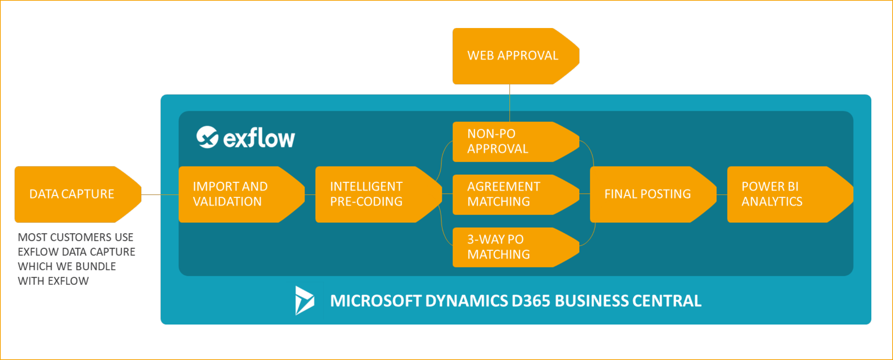

## ExFlow Business Central Online

Die folgenden Informationen beschreiben die technischen Anforderungen für den Betrieb von ExFlow AP Business Central Online auf Dynamics 365 Business Central Online unter Verwendung von ExFlow Data Capture als OCR-Lösung.

ExFlow Business Central Online läuft auf der Dynamics 365 Business Central Online-Plattform und folgt den technischen Anforderungen von Microsoft für Dynamics 365 Business Central Online.

Lesen Sie hier über die Mindestanforderungen für die Nutzung von Business Central [***hier***](https://docs.microsoft.com/en-us/dynamics365/business-central/product-requirements). 

### Technische Spezifikationen

*Integration ExFlow Data Capture (falls zutreffend):* 
* Webdienst zum Exportieren von Lieferantendaten 
* Webdienst zum Importieren gescannter Rechnungsbilder und -daten. 

*Integration ExFlow Cloud (Genehmigungsweb):* 
* ExFlow BC Online veröffentlicht einen Webdienst, damit ExFlow Cloud Rechnungs- und Lieferantendaten abrufen kann. 
* ExFlow BC Online verfügt über einen Webdienst zum Importieren aller Daten, die während des Web-Genehmigungsprozesses geändert wurden. 

### Lizenzierung
Bitte beachten Sie, dass der Kunde dafür verantwortlich ist, die korrekten Lizenz- und Supportvereinbarungen mit Microsoft zu haben. Wenn Sie sich nicht sicher sind, wenden Sie sich bitte an Ihren Dynamics 365 Business Central-Implementierungspartner. 

### ExFlow Cloud
In ExFlow Cloud können Endbenutzer Rechnungen auf jedem Gerät genehmigen, sei es Mobiltelefon, Tablet oder Computer. ExFlow Cloud ist ein Cloud-Dienst, der auf Microsoft Azure läuft.

ExFlow Cloud benötigt Zugriff auf die Webdienste von ExFlow Business Central Online, um zu kommunizieren. Diese Kommunikation muss verschlüsselt sein.

*Die verfügbare Kommunikationsoption zwischen ExFlow Cloud und ExFlow Business Central Online ist:*
* HTTPS zu einem öffentlichen Endpunkt   

#### ExFlow Cloud Client-Software
Clients können Windows 7 oder höher, Apple Mac, iPad, iPhone mit iOS, Android-Tablets und -Telefone mit der neuesten Version der Betriebssysteme sein. 

*Unterstützte Webbrowser (die neuesten Versionen):* 
* Google Chrome (empfohlen) 
* Microsoft Edge 
* Safari  

#### Dateigrößenbeschränkungen

* ExFlow Data Capture: [***Besuchen Sie die Website von Tungsten***](https://docs.readsoftonline.com/help/eng/partner/reference/c_system_limitations.html) 
* ExFlow Business Central und ExFlow Web-Kommunikation: Die aktuelle Anhangsgrößenbeschränkung beträgt 10 MB.

