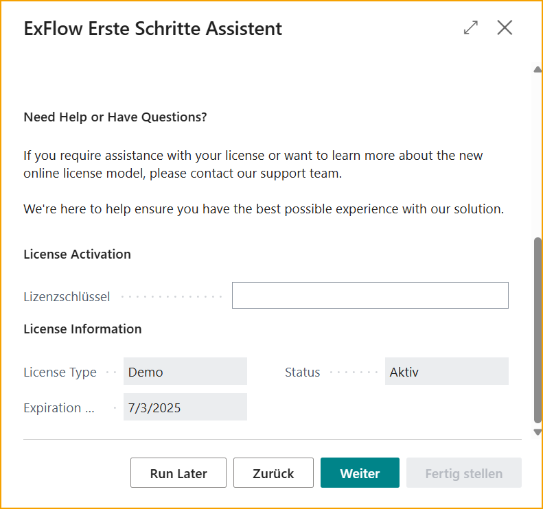

## Erste Schritte

### Einführung

Der ExFlow Erste-Schritte-Assistent wurde entwickelt, um den anfänglichen Einrichtungsprozess zu optimieren und Benutzern einen schnellen und effizienten Einstieg in ExFlow zu ermöglichen. Dieses Benutzerhandbuch führt Sie Schritt für Schritt durch den Prozess der Verwendung des Assistenten, um ExFlow entsprechend den spezifischen Anforderungen Ihrer Organisation zu konfigurieren.

Nach Abschluss des ExFlow Erste-Schritte-Assistenten erhalten Sie eine voll funktionsfähige Einrichtung von ExFlow, die auf die spezifischen Anforderungen Ihres Unternehmens zugeschnitten ist. Benutzer können Rechnungen importieren, Genehmigungsvorschläge basierend auf Attributen oder Rollen automatisieren und von den zeitsparenden Vorteilen der intelligenten Codierung und Genehmigungszuweisung von ExFlow profitieren.

Dieses Benutzerhandbuch bietet detaillierte Anweisungen, hilfreiche Tipps und Einblicke, um einen reibungslosen und erfolgreichen Konfigurationsprozess zu gewährleisten. Es wird empfohlen, jeden Abschnitt sorgfältig zu lesen, die Schritte der Reihe nach zu befolgen und bei Bedarf jederzeit auf dieses Handbuch zurückzugreifen.

### Voraussetzungen

Bevor Sie den ExFlow Erste-Schritte-Assistenten ausführen, müssen einige Voraussetzungen erfüllt werden. Befolgen Sie diese ersten Schritte, um einen reibungslosen Einrichtungsprozess zu gewährleisten:

[Besuchen Sie den Microsoft AppSource Marketplace und suchen Sie die ExFlow-Erweiterung als kostenlose Testversion](https://appsource.microsoft.com/de-de/product/dynamics-365-business-central/PUBID.signup-software-ab%7CAID.31407efc-8e13-4752-b577-5e992428aa29%7CPAPPID.a53707ce-b9e1-4f4e-93be-ea3aae783cae?tab=Overview)  

Geben Sie die Unternehmensdetails ein und wählen Sie aus, in welchem Mandanten und mit welcher Sprache ExFlow installiert werden soll. Nach Abschluss der Installation erhalten Sie den ExFlow-Lizenzschlüssel von Ihrem autorisierten ExFlow-Partner.

### Lizenz 

Es ist wichtig, dass die ExFlow-Erweiterung installiert und der Lizenzschlüssel verfügbar ist, um mit dem ExFlow Erste-Schritte-Assistenten fortzufahren. 

Sobald diese ersten Schritte abgeschlossen sind, können Sie mit dem ExFlow Erste-Schritte-Assistenten fortfahren.

#### Lizenz für neue Installationen
Die Lizenzverwaltung für vollständig neue BC Online-Installationen kann über den [Lizenzanbieter](https://docs.signupsoftware.com/business-central/docs/user-manual/welcome-to-exflow/get-started#license-provider) für Pilotprogramm-Kunden erfolgen. 

### Einrichtung von einem anderen Unternehmen kopieren
Wenn ExFlow bereits in anderen Unternehmen innerhalb desselben Mandanten installiert und konfiguriert wurde, besteht die Möglichkeit, die Option zum Kopieren der ExFlow-Einrichtung zu nutzen. 

Dieses Feature ist besonders wertvoll, wenn die gleiche oder eine ähnliche Konfigurationseinstellung auf das neue Unternehmen angewendet werden soll.

## Erste Schritte-Assistent

Suchen Sie nach **ExFlow Erste Schritte-Assistent**:

Zunächst nutzen Sie das umfassende Video-Tutorial, das Sie durch jeden Schritt des Assistenten führt und den Prozess auf visuelle und ansprechende Weise erklärt. Klicken Sie einfach auf den [***Video ansehen***](https://www.signupsoftware.com/get-started-video/) Link, um darauf zuzugreifen und den Anweisungen zu folgen. 

Zweitens haben wir einen detaillierten Schritt-für-Schritt-Leitfaden vorbereitet, der schriftliche Anweisungen zur Ausführung des Assistenten bietet. Dieser Leitfaden bietet klare Erklärungen und hilfreiche Tipps, um eine reibungslose und erfolgreiche Einrichtungserfahrung zu gewährleisten.

### Aktivierung der ExFlow-Lizenz

In diesem Schritt erhalten Sie Informationen zum Lizenzmodell und dessen Aktivierung.

Geben Sie den bereitgestellten Lizenzschlüssel ein und klicken Sie auf ''Weiter'', um fortzufahren.

 

### Genehmigungszuweisung

Definieren Sie die Genehmigungszuweisung und die Genehmigungsreihenfolge für eingehende Dokumente. Die Genehmigungszuweisung bestimmt, wie ExFlow die Genehmiger dynamisch den Dokumenten basierend auf bestimmten Attributen oder Werten zuweist, die im Dokument gefunden werden.

Als Illustration betrachten Sie das folgende Beispiel, das die gewünschte Reihenfolge der Genehmiger für ein Dokument umreißt: 
1.	Einkäufer 
2.	Dimensonsverantwortlicher der Abteilungsdimension 
3.	Dimensonsverantwortlicher der Regionsdimension 
In diesem Szenario folgt die Genehmigerzuweisung für ein Dokument der angegebenen Reihenfolge. Zuerst wird der Einkäufer als erster Genehmiger zugewiesen. Als nächstes überprüft der Dimensionsverantwortliche der Abteilungsdimension das Dokument. Schließlich erteilt der Dimensionsverantwortliche der Regionsdimension seine Genehmigung.

### Benutzer erstellen

Erstellen Sie ExFlow-Benutzer basierend auf einer Auswahl von Benutzern aus Ihrer Business Central-Umgebung. Der ExFlow Erste-Schritte-Assistent vereinfacht den Prozess der Hinzufügung von Benutzern zu ExFlow und stellt sicher, dass die entsprechenden Informationen wie Benutzername, vollständiger Name und E-Mail-Adresse zugewiesen werden.

Aktualisierungen oder Änderungen an bestehenden ExFlow-Benutzern sollten über „ExFlow-Benutzer“ durchgeführt werden. Dies gewährleistet eine zentrale Kontrolle und Konsistenz im Benutzermanagement.

Es ist wichtig zu beachten, dass der Benutzer, der den Erste-Schritte-Assistenten ausführt, als ExFlow-Admin-Benutzer erstellt wird. Dies gewährt ihm administrative ExFlow-Rechte innerhalb des aktuellen Unternehmens.

### ExFlow-Benutzer

Schließen Sie die Einrichtung der ExFlow-Benutzer ab, indem Sie deren Attribute, E-Mail-Adressen und Berechtigungsrollen vervollständigen. 

Es ist wichtig, die Dimensionswerte, Einkäufercodes und andere relevante Attribute genau jedem Benutzer zuzuweisen, basierend auf den zuvor in der Genehmigungszuweisung definierten Spezifikationen.

#### Berechtigungsrollen
•	**Genehmiger:** Nimmt am Genehmigungsprozess teil, ohne die Möglichkeit von Codierungsänderungen. 
•	**Genehmiger (Power):** Hat die Möglichkeit, während des Genehmigungsprozesses Codierungsänderungen vorzunehmen, basierend auf den definierten Codierungsregeln. 
•	**Genehmiger (Super):** Kann Codierungsänderungen vornehmen, alle Rechnungen innerhalb des Unternehmens suchen und anzeigen. 
•	**Admin:** Für Administratoren in ExFlow Web vorgesehen, die Zugriff auf die Einrichtung bieten.

### Automatisierte Aufgaben

Geben Sie einen bestimmten Job-Queue-Entry-Benutzer an, der zum Ausführen der geplanten Aufgaben verwendet wird, falls erforderlich. Der Benutzer muss über die erforderlichen Berechtigungen verfügen, um die Aufgaben auszuführen, die die Jobs ausführen.

Wählen Sie die erforderlichen Prozesse und E-Mail-Erinnerungen aus und planen Sie diese, um Ihren Rechnungsworkflow zu automatisieren. Durch die Einrichtung wiederkehrender Jobs können Sie sicherstellen, dass wichtige Aufgaben wie der Import von Rechnungen, deren Erstellung oder Buchung und andere relevante Prozesse automatisch in festgelegten Intervallen ausgeführt werden.

Konfigurieren Sie zusätzlich E-Mail-Erinnerungen, um Benutzer zu informieren und ihre Aufmerksamkeit auf ausstehende Genehmigungen, bevorstehende Fristen oder andere wichtige Ereignisse im Workflow zu lenken. Verbessern Sie die Kommunikation und gewährleisten Sie einen reibungslosen Ablauf der Rechnungsbearbeitung, indem Sie E-Mail-Benachrichtigungen nutzen:

### ExFlow-Datenerfassung

Dieser Schritt ist relevant für Kunden, die ExFlow Data Capture als ihre OCR-Lösung nutzen. Wenn ExFlow Data Capture nicht verwendet wird, kann dieser Schritt übersprungen werden.

Die Herstellung einer Verbindung zu ExFlow Data Capture ist entscheidend, um eine Integration zwischen ExFlow und der OCR-Lösung zu ermöglichen. Diese Verbindung ermöglicht es ExFlow, Rechnungen aus dem vorgesehenen Unternehmen zu importieren und Stammdaten wie Lieferanteninformationen in die ExFlow Data Capture-Umgebung hochzuladen.

Klicken Sie auf Aktivieren, um die OCR-Diensteinstellungen einzugeben, in denen die erforderlichen Informationen eingegeben werden müssen.

Um die Verbindung herzustellen, benötigen Sie die folgenden Informationen, die von SignUp Software bereitgestellt werden:
1.	**Benutzername:** Der Benutzername, der mit Ihrem ExFlow Data Capture-Konto verknüpft ist.
2.	**Passwort:** Das Passwort, das mit Ihrem ExFlow Data Capture-Konto verknüpft ist.
3.	**Autorisierungsschlüssel:** Ein eindeutiger Schlüssel, der von SignUp Software bereitgestellt wird und den Zugriff auf Ihre spezifische ExFlow Data Capture-Umgebung gewährt.
4.	**OCR-Dok.-Vorlage:** Die OCR-Dokumentvorlage, die das Layout und die Struktur von Rechnungen für die Extraktion und Verarbeitung definiert.

Klicken Sie auf Schließen, um zum Erste Schritte-Assistenten zurückzukehren.

Planen Sie die Synchronisierung der Stammdaten und aktivieren Sie das Kontrollkästchen ''Aktiviert'', um die Synchronisierung zwischen ExFlow und ExFlow Data Capture zu ermöglichen.

Die Synchronisierung der Lieferanten von Business Central zu ExFlow Data Capture wird so geplant, dass sie alle 10 Minuten ausgeführt wird. 

#### Zusätzliche Optionen

Konfigurieren Sie zusätzliche Optionen gemäß Ihren spezifischen Anforderungen, um ExFlow weiter zu optimieren und an die Bedürfnisse Ihrer Organisation anzupassen.

•	**Vier-Augen-Prinzip:** Aktivieren Sie diese Funktion, um die Genehmigung von mindestens zwei Personen zu verlangen, bevor ein Dokument gebucht werden kann. Diese zusätzliche Kontrollinstanz gewährleistet Genauigkeit und minimiert Fehler in Ihren Finanzprozessen. 

•	**Vordefiniertes Konto:** Vereinfachen Sie die Rechnungscodierung für neue Lieferanten, indem Sie ein vordefiniertes Konto einrichten. ExFlow schlägt dieses Konto automatisch vor, wenn kein spezifisches Konto auf Lieferantenseite definiert wurde.
Zusätzlich nutzt ExFlow Ihre Historie der gebuchten Einkaufsrechnungen in Business Central, um die wahrscheinlichste Codierung für eine effiziente Rechnungsbearbeitung vorzuschlagen. 

•	**URL zu ExFlow Web:** Geben Sie die URL zu Ihrem ExFlow Web an, um Genehmigern den einfachen Zugriff zu ermöglichen, um Rechnungen zu überprüfen und zu genehmigen. Die benutzerfreundliche Weboberfläche bietet eine bequeme und effiziente Möglichkeit, den Genehmigungsprozess zu verwalten. 

•	**Aktivieren zusätzlicher Spalten für ExFlow Web:** Verbessern Sie die ExFlow Web-Oberfläche, indem Sie zusätzliche Spalten wie VAT Prod Posting Group und Deferral Code aktivieren.  

Sobald Sie Ihre Auswahl getroffen und die zusätzlichen Optionen finalisiert haben, sind Sie bereit, den ExFlow Erste-Schritte-Assistenten abzuschließen und die vollen Vorteile von ExFlow in Ihren Geschäftsprozessen zu genießen.

#### Fertigstellen

Herzlichen Glückwunsch! Sie haben erfolgreich alle erforderlichen Informationen bereitgestellt, um die Einrichtung gemäß Ihren Präferenzen zu initiieren. 

Klicken Sie auf die Schaltfläche "Fertigstellen", um die Konfiguration abzuschließen und die ExFlow-Einrichtung basierend auf Ihren Auswahlmöglichkeiten zu initiieren.

##### Andere

Wenn Sie den Assistenten zu irgendeinem Zeitpunkt verlassen, keine Sorge! Das System fordert Sie mit der Option: Später ausführen, auf, um Ihre eingegebenen Daten zu speichern, sodass Sie später dort weitermachen können, wo Sie aufgehört haben. 

Auf diese Weise können Sie den Einrichtungsprozess bequem genau dort fortsetzen, wo Sie aufgehört haben, ohne Fortschritte zu verlieren oder von vorne beginnen zu müssen.

## ExFlow-Datenerfassungskonten

ExFlow-Datenerfassungskonten werden verwendet, um eine Verbindung zu ExFlow Data Capture (EDC) für den Import von interpretierten Rechnungen und das Hochladen von Lieferantenstammdaten aus Business Central (wenn die OCR-Diensteinstellungen nicht verwendet werden) herzustellen. 

Dieser Konfigurationsprozess kann entweder während der Ersteinrichtung über den Erste Schritte-Assistenten oder manuell abgeschlossen werden.

### Konfigurationsschritte
Navigieren Sie zu ExFlow-Datenerfassungskonten, um auf die Konfiguration zuzugreifen.

Klicken Sie auf Neu, um eine neue Verbindung zu initiieren.

Geben Sie der Verbindung einen geeigneten Code und wählen Sie den Verbindungstyp aus:

- *Einkauf* steht für Eingangsrechnungen
- *Verkauf* steht für Verkaufsbestellungen

### Verbindungsdetails
Um die Verbindung abzuschließen, stellen Sie sicher, dass Sie über die folgenden Verbindungsdetails verfügen, um eine Verbindung zu EDC herzustellen. Diese werden von SignUp Software oder Ihrem vertrauenswürdigen Business Central-Partner bereitgestellt.

- *Benutzername* 
- *Passwort* 
- *Autorisierungsschlüssel* 

**Standard-EDC-Dok.-Vorlagen**
Wählen Sie die Dokumentvorlage aus, die von EDC für die Interpretation verwendet wird.

**Datenaustauschtyp**
Wählen Sie den “EDC2EXF”, der der standardmäßige Austauschtyp für EDC ist.
 
**Unternehmensauswahl:**
Im Gegensatz zu den "OCR-Diensteinstellungen" ermöglicht die Konfiguration der ExFlow-Datenerfassungskonten die Verwendung derselben Anmeldeinformationen in allen Unternehmen innerhalb von Business Central.

Dies liegt daran, dass das Benutzerkonto Zugriff auf alle Unternehmen in EDC hat.

**Wichtig:** Wählen Sie das richtige Unternehmen als Käufer und Stammdatenfilter während der Konfiguration aus, um sicherzustellen, dass die Verbindung mit dem beabsichtigten Unternehmen hergestellt wird.

 

### Abschluss der Konfiguration:
Überprüfen Sie die eingegebenen Daten, bevor Sie den Konfigurationsprozess abschließen.

Aktivieren Sie die Synchronisierung der Stammdaten, um den Upload der Lieferantenstammdaten zu ermöglichen.

Aktivieren Sie schließlich "Aktivieren" und akzeptieren Sie alle Aufforderungsnachrichten.

Testen Sie die Verbindung, um die erfolgreiche Integration zwischen Business Central und ExFlow Data Capture sicherzustellen.

## Lizenzanbieter
Gehen Sie zu: **ExFlow Lizenzanbieter**

Neue Kunden und Installationen können den ExFlow Lizenzanbieter verwenden.

Das neue Tool zur Lizenzverwaltung wurde aktualisiert, um eine granularere Kontrolle über SignUp Software-Anwendungen und deren einzelne Funktionen zu bieten. 

Der Lizenzanbieter verbessert auch die Sichtbarkeit der lizenzierten Produkte und vereinfacht die Verfolgung von Dokumentenvolumina in Anwendungen wie ExFlow AP. 

Wenn eine Lizenz aktiviert wird, werden die lizenzierten Produkte angezeigt:

 

| Menü des Lizenzanbieters    |   | 
|:-|:-|
|SignUp| Erstellen Sie eine neue Kundenregistrierung (Option wird ausgeblendet, wenn die Lizenz aktiviert ist)
|Lizenz aktivieren| Erstellen Sie eine neue Instanzaktivierung (Option wird ausgeblendet, wenn die Lizenz aktiviert ist)
|Lizenz erneuern| Erneuern Sie die Lizenz manuell, wann immer dies erforderlich ist. Bei REn erfolgt dies automatisch.
|Marktplatz| Link zum [**Marktplatz**](https://signupmarketplace.exflow.io/)
|Lizenz löschen| Lizenz entfernen

## ExFlow-Funktionsverwaltung
Gehen Sie zu: **ExFlow Funktionsverwaltung**

Die ExFlow Funktionsverwaltung ermöglicht es Benutzern und Entwicklern zu steuern, wann neue und größere Funktionen aktiviert werden. 

Die ExFlow Funktionsverwaltung funktioniert mit dem Lizenzanbieter und erlaubt es nur, eine Funktion zu aktivieren, wenn eine entsprechende Lizenz für die App und/oder Funktion verfügbar ist.

 

## Bestellabgleich-Assistenten
Möchten Sie auch mit Ihren bestellten Dokumenten beginnen? Großartig! 

Finden und nutzen Sie unsere Bestellabgleich-Assistenten für eine einfache und nahtlose Einrichtung zur Verarbeitung Ihrer bestellten Dokumente. 

Die Assistenten sind sichtbar, abhängig davon, ob Kunden die Lizenz über die ExFlow [Lizenzaktivierung](https://docs.exflow.cloud/business-central/docs/user-manual/welcome-to-exflow/get-started#license) oder den [Lizenzanbieter](https://docs.exflow.cloud/business-central/docs/user-manual/welcome-to-exflow/get-started#license-provider) aktiviert haben. 

### Assistent für den Abgleich von Einkaufsbestellungen
Dieser Assistent ist sichtbar für aktuelle Kunden, die die ursprüngliche Funktionalität zum Abgleich von Bestellungen nutzen. Dieser Assistent ist sichtbar, wenn der Lizenzschlüssel über die ExFlow-Lizenzaktivierung aktiviert ist.

Lesen Sie mehr darüber im Abschnitt [Prozess zum Abgleichen von Einkaufsbestellungen](https://docs.signupsoftware.com/business-central/docs/user-manual/approval-workflow/purchase-order-matching-process)

### Neuer Assistent für den Abgleich von Bestellungen
Der neue Assistent für den Abgleich von Bestellungen ist sichtbar, wenn der Lizenzanbieter verwendet wird und die neue Funktionalität zum Abgleichen von Bestellungen über die ExFlow-Funktionsverwaltung aktiviert ist. 

Bitte beachten Sie: Diese Funktion wird für alle Unternehmen aktiviert. Wenn sie deaktiviert ist, wird sie auch für alle Unternehmen deaktiviert.

Lesen Sie mehr darüber im Abschnitt [Neue Bestellabgleichserfahrung](https://docs.signupsoftware.com/business-central/docs/user-manual/approval-workflow/new-order-matching)
