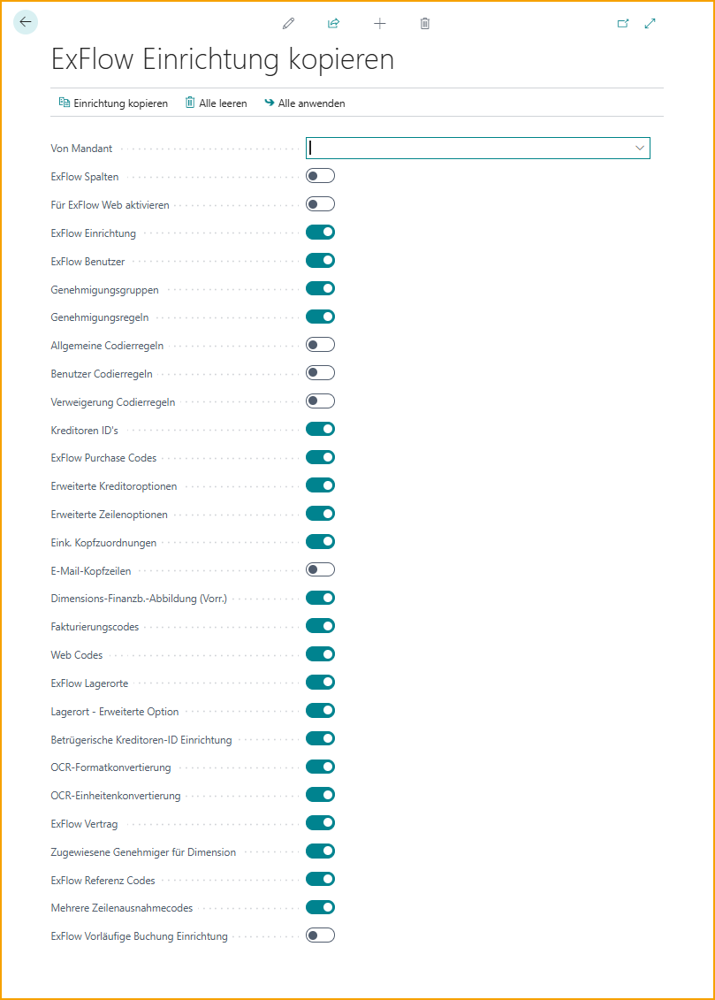
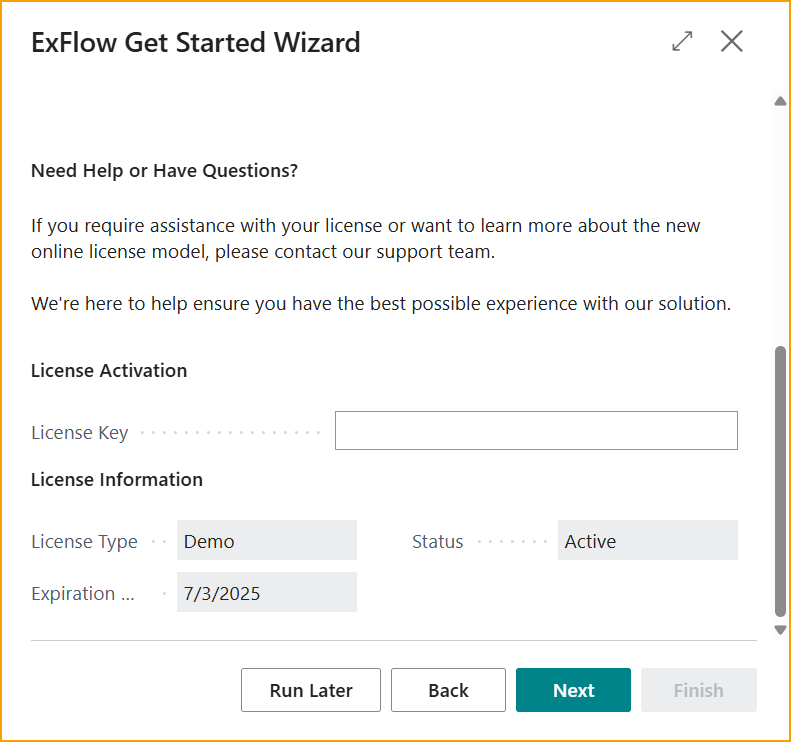
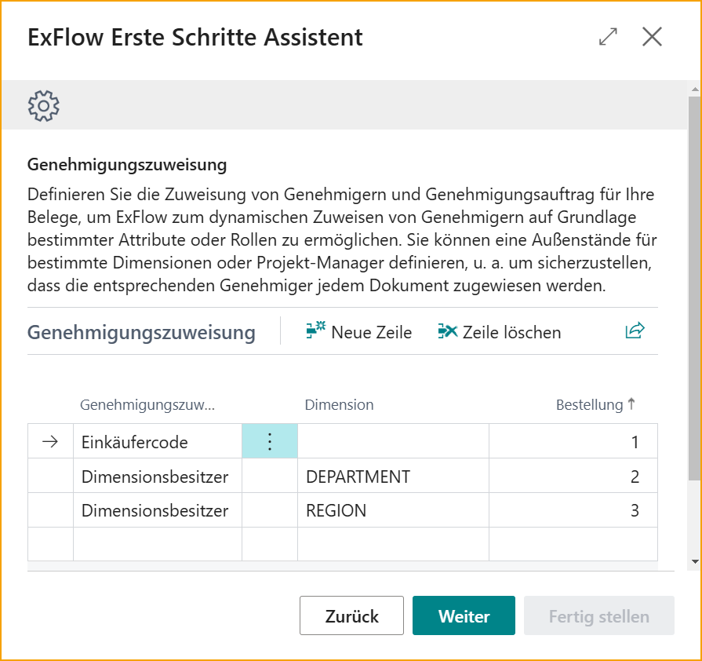

## Erste Schritte

### Einführung

Der ExFlow Erste-Schritte-Assistent wurde entwickelt, um den anfänglichen Einrichtungsprozess zu optimieren und Benutzern einen schnellen und effizienten Start mit ExFlow zu ermöglichen. Dieses Benutzerhandbuch führt Sie durch den schrittweisen Prozess der Verwendung des Assistenten, um ExFlow gemäß den spezifischen Anforderungen Ihrer Organisation zu konfigurieren.

Nach Abschluss des ExFlow Erste-Schritte-Assistenten wird eine voll funktionsfähige Einrichtung von ExFlow bereitgestellt, die auf die spezifischen Anforderungen des Unternehmens zugeschnitten ist. Benutzer können Rechnungen importieren, Genehmigungsvorschläge basierend auf Attributen oder Rollen automatisieren und von den zeitsparenden Vorteilen der intelligenten Codierung und Genehmigungszuweisung von ExFlow profitieren.

Dieses Benutzerhandbuch bietet detaillierte Anweisungen, hilfreiche Tipps und Einblicke, um einen reibungslosen und erfolgreichen Konfigurationsprozess zu gewährleisten. Es wird empfohlen, jeden Abschnitt sorgfältig zu lesen, die Schritte der Reihe nach zu befolgen und bei Bedarf jederzeit dieses Handbuch zu Rate zu ziehen.

### Voraussetzungen

Bevor Sie den ExFlow Erste-Schritte-Assistenten ausführen, müssen einige Voraussetzungen erfüllt sein. Befolgen Sie diese ersten Schritte, um einen reibungslosen Einrichtungsprozess zu gewährleisten:

Herunterladen und Installieren von ExFlow: Besuchen Sie den Microsoft AppSource Marketplace und suchen Sie die ExFlow-Erweiterung als kostenlose Testversion. 

Geben Sie die Unternehmensdaten ein und wählen Sie, in welchem Mandanten und in welcher Sprache ExFlow installiert werden soll. Nach Abschluss der Installation erhalten Sie den ExFlow-Lizenzschlüssel von Ihrem autorisierten ExFlow-Partner.

### Lizenz 

Suchen Sie nach ExFlow-Lizenzaktivierung und geben Sie den Lizenzschlüssel ein:

Sobald diese ersten Schritte abgeschlossen sind, können Sie mit der Ausführung des Erste-Schritte-Assistenten fortfahren.

Es ist wichtig, dass die ExFlow-Erweiterung installiert und der Lizenzschlüssel aktiviert ist, um mit dem ExFlow Erste-Schritte-Assistenten fortzufahren. Wenn bei der Installation oder Aktivierung Probleme auftreten, lesen Sie die ExFlow-Dokumentation oder wenden Sie sich an das ExFlow-Support-Team, um Unterstützung zu erhalten.

#### **Lizenz für Neuinstallationen**
Die Lizenzverwaltung für komplett neue BC Online-Installationen wird über den Lizenzanbieter im Erste-Schritte-Assistenten abgewickelt. 
Lesen Sie mehr darüber unter "Erste-Schritte-Assistent" und "Lizenzanbieter" weiter unten. 

### Einrichtung von einem anderen Unternehmen kopieren
Wenn ExFlow bereits in anderen Unternehmen innerhalb desselben Mandanten installiert und konfiguriert wurde, besteht die Möglichkeit, die ExFlow-Einrichtung zu kopieren. Diese Funktion ist besonders wertvoll, wenn die gleichen oder ähnliche Konfigurationseinstellungen auf das neue Unternehmen angewendet werden müssen.

## Erste-Schritte-Assistent

Suchen Sie nach *ExFlow Erste-Schritte-Assistent*:

Nutzen Sie zunächst das umfassende Videotutorial, das jeden Schritt des Assistenten durchgeht und den Prozess visuell und ansprechend erklärt. Klicken Sie einfach auf den Link [***Video ansehen***](https://www.signupsoftware.com/get-started-video/), um darauf zuzugreifen und den Anweisungen zu folgen. 

Zweitens haben wir eine detaillierte Schritt-für-Schritt-Anleitung vorbereitet, die schriftliche Anweisungen zur Ausführung des Assistenten enthält. Diese Anleitung bietet klare Erklärungen und hilfreiche Tipps, um ein reibungsloses und erfolgreiches Einrichtungserlebnis zu gewährleisten.

### Abonnement-Aktivierung 

Wenn keine Lizenz in "ExFlow-Lizenzaktivierung" aktiviert ist, wird diese Seite angezeigt. 

Aktivieren Sie "Ich habe ein Abonnement", wenn das Abonnement über den Lizenzanbieter in einer anderen Business Central-Umgebung verwendet wird und dieselbe Lizenz in dieser neuen Umgebung innerhalb desselben Mandanten angewendet werden soll.

Wenn aktiviert, müssen Informationen über Ihre Kunden-ID und Ihren Partner-Code eingegeben werden, um die Lizenz zu aktivieren. 

Die Kunden-ID ist die eindeutige ID des Kunden, die vom SignUp Marketplace zugewiesen wurde. Klicken Sie auf Weiter, um mit der Hinzufügung der "Genehmigungszuweisung" fortzufahren.  

Wenn Sie kein Abonnement in anderen Umgebungen haben, lassen Sie das Kontrollkästchen deaktiviert und klicken Sie auf Weiter, um mit der neuen Kundenregistrierung fortzufahren. 

Fügen Sie die Partnerinformationen und Unternehmensinformationen hinzu, um fortzufahren. Der nächste Schritt führt Sie zur "Genehmigungszuweisung".  

### Genehmigungszuweisung

Definieren Sie die Genehmigungszuweisung und Genehmigungsreihenfolge für eingehende Dokumente. Die Genehmigungszuweisung bestimmt, wie ExFlow Genehmigern dynamisch Dokumente zuweist, basierend auf spezifischen Attributen oder Werten, die im Dokument gefunden werden.

Zur Veranschaulichung betrachten Sie das folgende Beispiel, das die gewünschte Reihenfolge der Genehmiger für ein Dokument beschreibt:
1.	Einkäufer
2.	Dimensionseigentümer der Abteilungsdimension
3.	Dimensionseigentümer der Regionsdimension
In diesem Szenario folgt die Genehmigerzuweisung für ein Dokument der angegebenen Sequenz. Zuerst wird der Einkäufer als erster Genehmiger zugewiesen. Als Nächstes wird der Dimensionseigentümer der Abteilungsdimension das Dokument prüfen. Schließlich wird der Dimensionseigentümer der Regionsdimension seine Genehmigung erteilen.

### Benutzer erstellen

Erstellen Sie ExFlow-Benutzer basierend auf einer Auswahl von Benutzern aus Ihrer Business Central-Umgebung. Der ExFlow Erste-Schritte-Assistent vereinfacht den Prozess des Hinzufügens von Benutzern zu ExFlow und stellt sicher, dass die entsprechenden Informationen wie Benutzername, vollständiger Name und E-Mail-Adresse zugewiesen werden.

Aktualisierungen oder Änderungen an bestehenden ExFlow-Benutzern sollten über "ExFlow-Benutzer" ausgeführt werden. Dies gewährleistet eine zentralisierte Kontrolle und Konsistenz in der Benutzerverwaltung.
Es ist wichtig zu beachten, dass der Benutzer, der den Erste-Schritte-Assistenten ausführt, als ExFlow-Administrator-Benutzer erstellt wird. Dies gewährt ihm administrative ExFlow-Rechte innerhalb des aktuellen Unternehmens.

### ExFlow-Benutzer

Vervollständigen Sie die Einrichtung von ExFlow-Benutzern, indem Sie ihre Attribute, E-Mail-Adressen und Berechtigungsrollen finalisieren. Es ist wichtig, Dimensionswerte, Einkäufercodes und andere relevante Attribute jedem Benutzer genau zuzuweisen, basierend auf den zuvor in der Genehmigungszuweisung definierten Spezifikationen.

*Genehmigungsrollen:* 
•	Genehmiger: Nimmt am Genehmigungsprozess teil, ohne Möglichkeiten zur Änderung der Codierung. 
•	Genehmiger (Power): Hat die Möglichkeit, während des Genehmigungsprozesses Codierungsänderungen vorzunehmen, basierend auf definierten Codierungsregeln. 
•	Genehmiger (Super): Kann Codierungsänderungen vornehmen, alle Rechnungen innerhalb des Unternehmens suchen und anzeigen. 
•	Admin: Für Buchhalter und Administratoren von ExFlow in Business Central gedacht, bietet Zugang zur Einrichtung.

### Automatisierte Aufgaben

Geben Sie einen bestimmten Auftragsschlangeneintrag-Benutzer ein, der verwendet wird, um die geplanten Aufgaben auszuführen, falls erforderlich. Der Benutzer muss über die erforderlichen Berechtigungen verfügen, um die Aufgaben auszuführen, die die Jobs ausführen werden.

Wählen und planen Sie die notwendigen Prozesse und E-Mail-Erinnerungen, um Ihren Rechnungsablaufprozess zu automatisieren. Durch die Einrichtung wiederkehrender Jobs können Sie sicherstellen, dass wesentliche Aufgaben wie das Importieren von Rechnungen, das Erstellen oder Buchen dieser und andere relevante Prozesse automatisch in festgelegten Intervallen durchgeführt werden.

Konfigurieren Sie zusätzlich E-Mail-Erinnerungen, um Benutzer informiert zu halten und ihre Aufmerksamkeit für ausstehende Genehmigungen, nahende Fristen oder andere wichtige Ereignisse innerhalb des Workflows zu wecken. Verbessern Sie die Kommunikation und stellen Sie einen reibungslosen Ablauf der Rechnungsverarbeitung sicher, indem Sie E-Mail-Benachrichtigungen nutzen:

### ExFlow Data Capture

Dieser Schritt ist relevant für Kunden, die ExFlow Data Capture als ihre OCR-Lösung nutzen. Wenn ExFlow Data Capture nicht verwendet wird, kann dieser Schritt übersprungen werden.

Die Einrichtung einer Verbindung zu ExFlow Data Capture ist wesentlich, um eine Integration zwischen ExFlow und der OCR-Lösung zu ermöglichen. Diese Verbindung erlaubt ExFlow, Rechnungen aus dem designierten Unternehmen zu importieren und Stammdaten, wie Lieferanteninformationen, in die ExFlow Data Capture-Umgebung hochzuladen.

Klicken Sie auf Aktivieren, um zur OCR-Service-Einrichtung zu gelangen, wo notwendige Informationen eingegeben werden müssen.

Um die Verbindung zu initiieren, benötigen Sie die folgenden Informationen, die von SignUp Software bereitgestellt werden:
1.	Benutzername: Der mit Ihrem ExFlow Data Capture-Konto verknüpfte Benutzername.
2.	Passwort: Das mit Ihrem ExFlow Data Capture-Konto verknüpfte Passwort.
3.	Autorisierungsschlüssel: Ein von SignUp Software bereitgestellter einzigartiger Schlüssel, der Zugang zu Ihrer spezifischen ExFlow Data Capture-Umgebung gewährt.
4.	OCR-Dok. Vorlage: Die OCR-Dokumentvorlage, die das Layout und die Struktur von Rechnungen für die Extraktion und Verarbeitung definiert.

Klicken Sie auf Schließen, um zum Erste-Schritte-Assistenten zurückzukehren.

Planen Sie die Synchronisierung von Stammdaten und aktivieren Sie das Kontrollkästchen "Aktiviert", um die Synchronisierung zwischen ExFlow und ExFlow Data Capture zu ermöglichen.
Die Synchronisierung von Lieferanten von Business Central zu ExFlow Data Capture wird so eingerichtet, dass sie alle 10 Minuten ausgeführt wird. 

#### Zusätzliche Optionen

Konfigurieren Sie zusätzliche Optionen entsprechend Ihren spezifischen Anforderungen, um ExFlow weiter zu optimieren und an die Bedürfnisse Ihrer Organisation anzupassen.

•	*Vier-Augen-Prinzip*: Aktivieren Sie diese Funktion, um die Genehmigung von mindestens zwei Personen zu verlangen, bevor ein Dokument gebucht werden kann. Diese zusätzliche Kontrollebene gewährleistet Genauigkeit und minimiert Fehler in Ihren Finanzprozessen. 

•	*Vordefiniertes Konto*: Vereinfachen Sie die Rechnungscodierung für neue Lieferanten, indem Sie ein vordefiniertes Konto einrichten. ExFlow wird dieses Konto automatisch vorschlagen, wenn kein spezifisches Konto auf Lieferantenebene definiert wurde.
Zusätzlich nutzt ExFlow Ihren gebuchten Einkaufsrechnungsverlauf in Business Central, um die wahrscheinlichste Codierung für eine effiziente Rechnungsverarbeitung vorzuschlagen. 

•	*URL zu ExFlow Web*: Geben Sie die URL zu Ihrem ExFlow Web an, um Genehmigern einfachen Zugang zur Überprüfung und Genehmigung von Rechnungen zu gewähren. Die benutzerfreundliche Weboberfläche bietet eine bequeme und effiziente Möglichkeit, den Genehmigungsprozess zu verwalten. 

•	*Zusätzliche Spalten für ExFlow Web aktivieren*: Verbessern Sie die ExFlow Web-Oberfläche, indem Sie zusätzliche Spalten aktivieren, wie z.B. MwSt.-Prod.-Buchungsgruppe und Abgrenzungscode.  

Sobald Sie Ihre Auswahl getroffen und die zusätzlichen Optionen abgeschlossen haben, sind Sie bereit, den ExFlow Erste-Schritte-Assistenten abzuschließen und die vollen Vorteile von ExFlow in Ihren Geschäftsabläufen zu genießen.

#### Abschluss

Herzlichen Glückwunsch! Sie haben erfolgreich alle notwendigen Informationen bereitgestellt, um die Einrichtung gemäß Ihren Präferenzen zu initiieren. Klicken Sie auf die Schaltfläche "Fertigstellen", um die Konfiguration zu beenden und die ExFlow-Einrichtung basierend auf Ihren Auswahlen zu starten.

##### **Weiteres**

Wenn Sie den Assistenten zu irgendeinem Zeitpunkt beenden, keine Sorge! Das System wird Ihnen die Option anbieten: Später ausführen, um Ihre eingegebenen Daten zu speichern, damit Sie zu einem späteren Zeitpunkt dort weitermachen können, wo Sie aufgehört haben. Auf diese Weise können Sie den Einrichtungsprozess bequem genau dort fortsetzen, wo Sie ihn verlassen haben, ohne Fortschritte zu verlieren oder von vorne beginnen zu müssen.

## ExFlow Data Capture-Konten

ExFlow Data Capture-Konten werden verwendet, um eine Verbindung zu ExFlow Data Capture (EDC) für den Import von interpretierten Rechnungen und das Hochladen von Lieferanten-Stammdaten aus Business Central herzustellen (wenn OCR-Service-Einrichtung nicht in Gebrauch ist). Dieser Konfigurationsprozess kann entweder während der Ersteinrichtung mit dem Erste-Schritte-Assistenten oder manuell abgeschlossen werden.

### Konfigurationsschritte
Navigieren Sie zu ExFlow Data Capture-Konten, um auf die Konfiguration zuzugreifen.
Klicken Sie auf Neu, um eine neue Verbindung zu initiieren.

Geben Sie der Verbindung einen passenden Code und wählen Sie den Verbindungstyp:
- *Einkauf* ist für Einkaufsrechnungen
- *Verkauf* ist für Verkaufsaufträge

### Verbindungsdetails
Um die Verbindung abzuschließen, stellen Sie sicher, dass Sie die folgenden Verbindungsdetails haben, um eine Verbindung zu EDC herzustellen. Diese werden von SignUp Software oder Ihrem vertrauenswürdigen Business Central-Partner bereitgestellt.

- *Benutzername*
- *Passwort*
- *Autorisierungsschlüssel*

**Standard-EDC-Dok. Vorlagen**
Wählen Sie die Dokumentvorlage, die für die Interpretation durch EDC verwendet wird.

**Datenaustauschtyp**
Wählen Sie "EDC2EXF", den Standardaustauschtyp für EDC.
 
**Unternehmensauswahl:**
Im Gegensatz zur "OCR-Service-Einrichtung" ermöglicht die Konfiguration von ExFlow Data Capture-Konten die Verwendung derselben Anmeldedaten über alle Unternehmen in Business Central hinweg.
Dies liegt daran, dass das Benutzerkonto Zugriff auf alle Unternehmen in EDC hat.
Wichtig: Wählen Sie während der Konfiguration das richtige Unternehmen als Käufer und Stammdaten-Filter, um sicherzustellen, dass die Verbindung mit dem beabsichtigten Unternehmen hergestellt wird.

 

### Abschluss der Konfiguration:
Überprüfen Sie die eingegebenen Details, bevor Sie den Konfigurationsprozess abschließen.

Aktivieren Sie die Stammdatensynchronisierung, um den Upload von Lieferanten-Stammdaten zu ermöglichen.

Aktivieren Sie schließlich "aktivieren" und akzeptieren Sie alle Aufforderungsmeldungen.

Testen Sie die Verbindung, um eine erfolgreiche Integration zwischen Business Central und ExFlow Data Capture sicherzustellen.

## Lizenzanbieter
Gehen Sie zu: **SignUp Software Lizenzanbieter**

Neue Kunden und Installationen werden den SignUp Software Lizenzanbieter verwenden.

Das neue Lizenzanbieter-Tool wurde aktualisiert, um eine feinere Kontrolle über SignUp Software-Anwendungen und ihre individuellen Funktionen zu bieten. 

Der Lizenzanbieter verbessert auch die Sichtbarkeit von lizenzierten Produkten und vereinfacht die Verfolgung von Dokumentvolumen in Anwendungen wie ExFlow AP. 

Wenn eine Lizenz aktiviert ist, werden die lizenzierten Produkte angezeigt:

 

| Lizenzanbieter-Menü    |   | 
|:-|:-|
|SignUp| Erstellen einer neuen Kundenregistrierung (Option wird ausgeblendet, wenn die Lizenz aktiviert ist)
|Lizenz aktivieren| Erstellen einer neuen Instanzaktivierung (Option wird ausgeblendet, wenn die Lizenz aktiviert ist)
|Lizenz erneuern| Manuelle Erneuerung der Lizenz, wenn benötigt. Die Erneuerung wird automatisch durchgeführt.
|Marketplace| Link zum [**Marketplace**](https://signupmarketplace.exflow.io/)
|Lizenz löschen| Lizenz entfernen

## SignUp Funktionsverwaltung
Gehen Sie zu: **SignUp Funktionsverwaltung**

Die SignUp Funktionsverwaltung ermöglicht Benutzern und Entwicklern zu kontrollieren, wann neue und größere Funktionen aktiviert werden. 

Die SignUp Funktionsverwaltung arbeitet mit dem Lizenzanbieter zusammen und erlaubt die Aktivierung einer Funktion nur, wenn eine entsprechende Lizenz für die App und/oder Funktion verfügbar ist.

 

## Auftragsabgleich-Assistenten
Möchten Sie auch mit Ihren auftragsabgeglichenen Dokumenten beginnen? Großartig! 

Finden und nutzen Sie unsere Auftragsabgleich-Assistenten für eine einfache und nahtlose Einrichtung zur Handhabung Ihrer auftragsabgeglichenen Dokumente. 

Die Assistenten sind sichtbar, abhängig davon, ob Kunden die Lizenz über die ExFlow-Lizenzaktivierung oder den [SignUp Lizenzanbieter](https://docs.exflow.cloud/business-central/docs/user-manual/welcome-to-exflow/get-started#license-provider) aktiviert haben. 

### Einkaufsauftragsabgleich-Assistent
Dieser Assistent ist für aktuelle Kunden sichtbar, die die ursprüngliche Auftragsabgleichfunktionalität verwenden. Dieser Assistent wird sichtbar sein, wenn der Lizenzschlüssel über die ExFlow-Lizenzaktivierung aktiviert ist.

Lesen Sie mehr darüber im Abschnitt [Einkaufsauftragsabgleichprozess](https://docs.signupsoftware.com/business-central/docs/user-manual/approval-workflow/purchase-order-matching-process)

### Neuer Auftragsabgleich-Assistent
Der Neue Auftragsabgleich-Assistent wird sichtbar sein, wenn der SignUp Lizenzanbieter verwendet wird und die Neue Auftragsabgleichfunktionalität über die SignUp Funktionsverwaltung aktiviert ist. 

Lesen Sie mehr darüber im Abschnitt [Neue Auftragsabgleich-Erfahrung](https://docs.signupsoftware.com/business-central/docs/user-manual/approval-workflow/new-order-matching)
