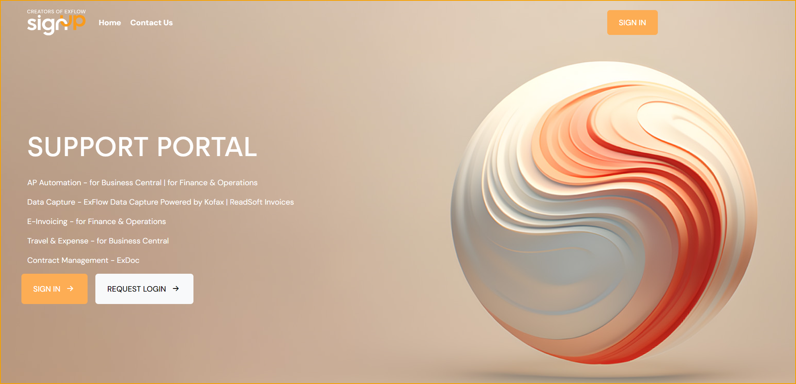
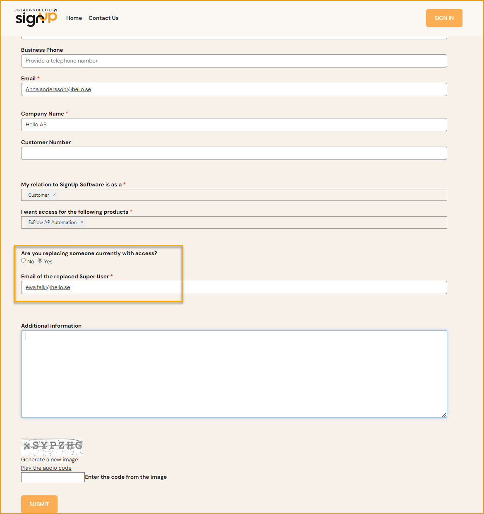
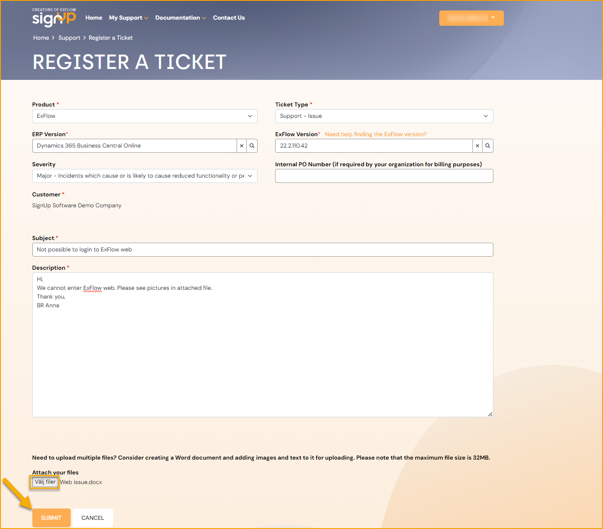
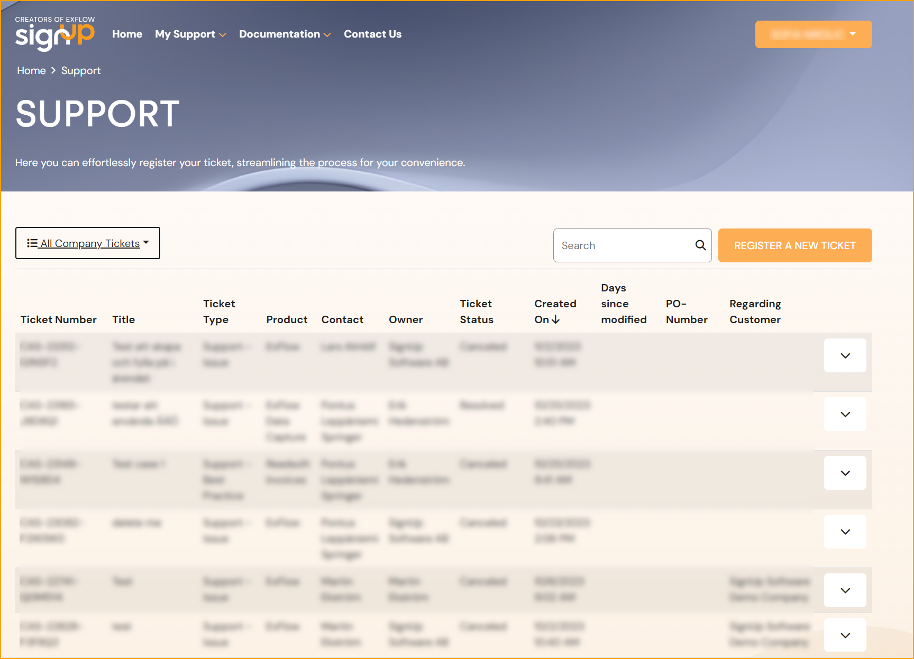
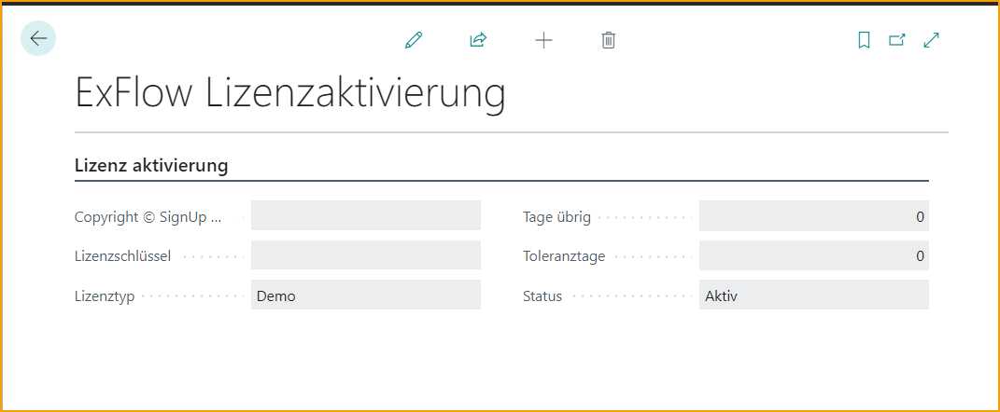

## Support-Portal

Um Unterstützung zu erhalten, wenden Sie sich bitte an Ihren ExFlow- oder Business Central-Partner. Wenn die SignUp-Software First-Line-Support bietet, wie im Abonnementvertrag festgelegt, bitten wir Sie, unser [Support-Portal](https://support.signupsoftware.com/) zu nutzen.

Jeder Kunde hat standardmäßig zwei dedizierte Superuser, die auf das Support-Portal zugreifen können. Es ist jedoch möglich, bei Bedarf mehr als zwei Superuser hinzuzufügen. Bitte kontaktieren Sie SignUp Software, um eine Vertragsänderung vorzunehmen.

### Einloggen

Sehen Sie sich unsere [Einführung in das Support-Portal](https://www.youtube.com/playlist?list=PLJAWzooWyJH8qpTlXwSyNoBOJbM697r8C) an, um mehr darüber zu erfahren, wie Sie ein Ticket erstellen und wie das Support-Portal funktioniert.

Klicken Sie auf **ANMELDEN** und wählen Sie die Authentifizierungsmethode, um sich anzumelden.

Sind Sie der neue Superuser? Verwenden Sie *LOGIN ANFORDERN*, um auf das Support-Portal zuzugreifen. Füllen Sie das Antragsformular mit allen erforderlichen Informationen aus. Innerhalb von 24 Stunden wird dem Antragsteller ein Einladungslink zum Support-Portal zugesandt.

### Einen aktuellen Superuser ersetzen

Falls erforderlich, kann das Formular "Login anfordern" ausgefüllt werden, um einen aktuellen Superuser zu ersetzen. Dies kann nützlich sein, wenn ein anderer Benutzer während eines bestimmten Zeitraums Zugriff auf das Support-Portal haben soll. Wenn der reguläre Superuser zurückkehrt, kann er/sie das Formular erneut ausfüllen, um den Superuser-Zugang wiederzuerlangen.

### Ein Support-Ticket registrieren

Füllen Sie die erforderlichen Informationen über das Produkt, die ERP-Version und die ExFlow-Version zusammen mit einer Beschreibung und einem Anhang mit Bildern des Problems aus.

Brauchen Sie Hilfe, um die installierte ExFlow-Version zu finden? Lesen Sie mehr im Abschnitt [Über ExFlow](https://support.signupsoftware.com/help-and-support/about-exflow/) oder melden Sie sich in unserem [Support-Portal](https://support.signupsoftware.com/knowledgebase/find-exflow-version/) an und finden Sie es heraus.

Verwalten Sie die Support-Tickets unter Mein Support. Eine gefilterte Seite für "Meine offenen Tickets" wird standardmäßig für den Superuser angezeigt. Um einen besseren Überblick über alle Unternehmensfälle und deren Status (unabhängig vom Superuser) zu erhalten, kann der Filter auf "Alle Unternehmens-Tickets" gesetzt werden. Alle Tickets werden dann in der Liste angezeigt.

### Einen ExFlow-Lizenzschlüssel hinzufügen oder aktualisieren

Für Kunden- und Partnerinstallationen von ExFlow ist eine spezielle Lizenz erforderlich.

Bevor Sie eine Lizenz erhalten, stellen Sie bitte sicher, dass ein Vertrag oder eine Vereinbarung mit dem Vertriebsleiter von SignUp Software abgeschlossen wurde. Reichen Sie dann ein Support-Ticket mit dem Namen des Kunden ein, um die Lizenz zu erhalten. Fügen Sie anschließend den Lizenzschlüssel in die Umgebung ein.

Die Aktivierung von Lizenzen hängt davon ab, welche Versionen von NAV/BC und ExFlow verwendet werden. Details siehe unten.

#### ExFlow für BC Online

Suchen Sie in Business Central nach ''ExFlow-Lizenzaktivierung'' und fügen Sie den bereitgestellten Lizenzschlüssel hinzu.

 

##### Hinweis:
Bestehende Kunden können ihre aktuelle Lizenz weiterhin über die Lizenzaktivierung nutzen.
Für Neukunden und Business Central Online AP-Installationen wird der [Lizenzanbieter](https://docs.exflow.cloud/business-central/docs/user-manual/welcome-to-exflow/get-started#license-provider) verwendet.

#### ExFlow für NAV und BC 13/14

Fügen Sie das ExFlow-Granulat in die FLF-Datei ein. 

#### ExFlow für NAV/BC OnPrem

Fügen Sie sowohl den Lizenzschlüssel in die ExFlow-Lizenzaktivierung ein als auch das ExFlow-Granulat in die FLF-Datei. 
