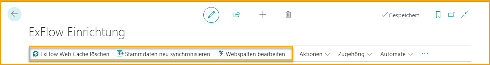
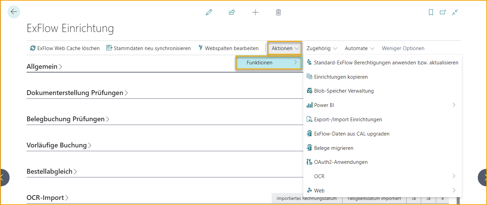
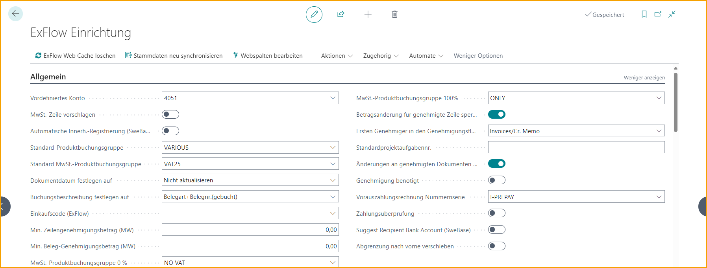
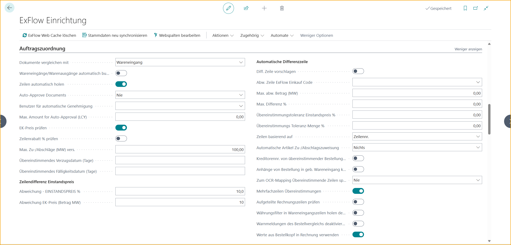
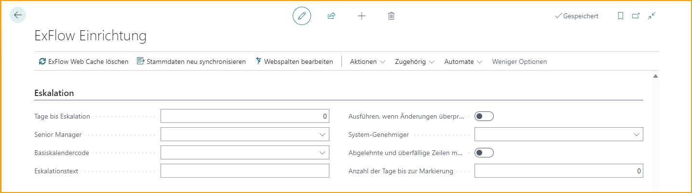
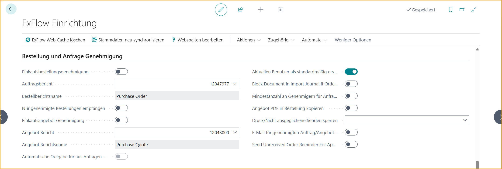
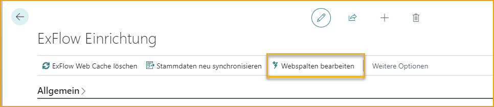
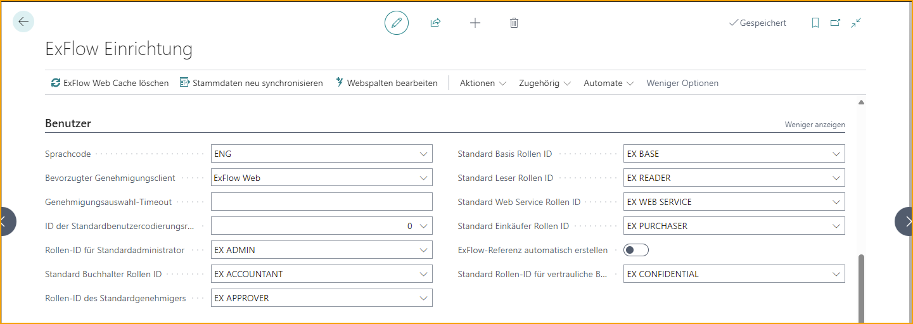
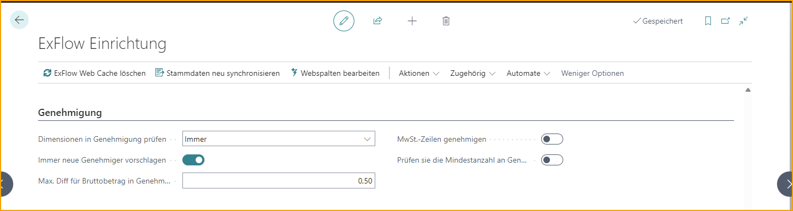

## ExFlow Einrichtung

Die ExFlow Einrichtung ist in verschiedene Abschnitte unterteilt, um den Prozess der Erstellung des optimalen Workflows für die Anforderungen Ihres Unternehmens zu vereinfachen. 

Gehe zu: **ExFlow Einrichtung**

 

| ExFlow Einrichtung| |
|:-|:-|
|**ExFlow Web Cache leeren:**	|Verwenden Sie diese Funktion, um den ExFlow Web Cache zu leeren.
|**Masterdaten neu synchronisieren**	|Synchronisieren Sie die Masterdaten und Lieferantenbankkonten mit dem ExFlow Data Capture/OCR Service.
|**Web-Spalten bearbeiten**	|Ändern Sie die aktuellen ExFlow Web-Spalten.    Lesen Sie mehr dazu im Abschnitt [ExFlow Web](https://docs.exflow.cloud/business-central/docs/user-manual/technical/exflow-web#exflow-web)  

 

Gehe zu: **ExFlow Einrichtung --> Aktionen --> Funktionen**  

 

| Aktionen --> Funktionen | |
|:-|:-|
|**Anwenden/Aktualisieren der Standard-ExFlow-Sicherheitsrollen** 	|Erstellt standardmäßige Berechtigungen auf Benutzerebene für das Web, falls keine vorhanden sind oder geändert wurden.    Weitere Informationen finden Sie im Abschnitt [***Web-Benutzerebene-Berechtigungen***](https://docs.exflow.cloud/business-central/docs/user-manual/business-functionality/web-user-level-permissions)
|**Setup kopieren**	|Kopiert das Setup von einem anderen Unternehmen innerhalb des gleichen Mandanten, indem Tabellen (z. B. Genehmigungsregeln) aus einem bereits konfigurierten ExFlow-Unternehmen ausgewählt werden.    Weitere Informationen finden Sie im Abschnitt [***Setup von einem anderen Unternehmen kopieren***](https://docs.exflow.cloud/business-central/docs/user-manual/welcome-to-exflow/get-started#copy-setup-from-another-company)
|**Blob-Speicherverwaltung**	|Öffnet das ExFlow Storage Management Setup.    Weitere Informationen finden Sie in den Abschnitten [***Generischer Blob-Speicher***](https://docs.exflow.cloud/business-central/docs/user-manual/technical/generic-blob-storage#generic-blob-storage) und [***OAuth 2.0-Anwendungen und Speicher-Setup***](https://docs.exflow.cloud/business-central/docs/user-manual/technical/oauth-storage-setup#oauth-20-applications-and-storage-setup)
|**Power BI**	|**Power BI-Webdienste erstellen:** Erstellt Webdienste für Power BI  **Power BI-Webdienste löschen:** Löscht alle Webdienste für Power BI  **BC-Datenquelle abrufen:** Diese Funktion erstellt eine URL-Zeichenfolge (Datenquelle) für den BC-Client. Verwenden Sie diesen Link und fügen Sie ihn in Power BI ein, wenn Sie die Vorlage ausführen  **Power BI-Vorlage abrufen:** Öffnet eine Website zum Herunterladen der Vorlage  Weitere Informationen finden Sie im Abschnitt [***Power BI***](https://docs.exflow.cloud/business-central/docs/user-manual/business-intelligence-and-reporting/power-bi#power-bi)
|**Setups exportieren/importieren**	|Exportiert und importiert ExFlow-Setup (.json-Datei) zwischen Umgebungen.    Weitere Informationen finden Sie im Abschnitt [***ExFlow-Daten exportieren/importieren***](https://docs.exflow.cloud/business-central/docs/user-manual/business-functionality/export-import-setup#exportimport-exflow-data) 
|**ExFlow-Daten von CAL aktualisieren**	|Führt eine ExFlow-Migration für ein aktuelles Unternehmen oder alle Unternehmen durch.    Weitere Informationen finden Sie im Abschnitt [***ExFlow-Daten aktualisieren und migrieren***](https://docs.exflow.cloud/business-central/docs/user-manual/technical/upgrade-exflow-data-from-cal#upgrade-and-migrate-exflow-data)
|**Dokumente migrieren**	|Öffnet das Dokument-Migrationswerkzeug.    Weitere Informationen finden Sie im Abschnitt [***ExFlow-Daten aktualisieren und migrieren***](https://docs.exflow.cloud/business-central/docs/user-manual/technical/upgrade-exflow-data-from-cal#upgrade-and-migrate-exflow-data)
|**OAuth2-Anwendungen**	|Öffnet die Seite "OAuth 2.0-Anwendungen".    Weitere Informationen finden Sie im Abschnitt [***OAuth 2.0-Anwendungen und Speicher-Setup***](https://docs.exflow.cloud/business-central/docs/user-manual/technical/oauth-storage-setup#oauth-20-applications-and-storage-setup)
|**OCR**	|**Vendor-ID für alle Lieferanten aktualisieren:**  Synchronisiert alle Lieferanten-IDs.  **Erweiterte Zuordnung**:  Öffnet ExFlow Advanced Mappings.   **Importieren von Datenaustauschdefinitionen:** Zeigt alle Importdatenaustauschdefinitions-Codes und deren Blob-Namen usw. an.  **Sonstiges --> Masterdaten neu synchronisieren:** Synchronisiert Stammdaten und Lieferantenbankkonten mit ExFlow Data Capture/OCR Service
|**Web**	|**Verwendete Lieferantennamen aktualisieren**:  Aktualisiert Lieferantennamen im Web  **Unternehmen für ExFlow Web aktivieren**:   Aktiviert das aktuelle Unternehmen für ExFlow Web  **Unternehmen für ExFlow Web deaktivieren.**:  Deaktiviert das aktuelle Unternehmen für ExFlow Web  **Als Standard-ExFlow-Web-Unternehmen festlegen**:  Legt das aktuelle Unternehmen als Standard für ExFlow Web fest  **Azure Active Directory-Anwendung erstellen**: Erstellt eine Microsoft Entra-Anwendung   **Standard-Webdienste erstellen/aktualisieren**: Erstellt oder aktualisiert den aktuellen Webdienst EXFID und EXFWeb   **Sonstiges --> Webspalten bearbeiten**: Änderungen an aktuellen ExFlow-Webspalten vornehmen  **Sonstiges --> ExFlow Web Cache löschen**: Löscht den ExFlow Web Cache    Weitere Informationen finden Sie im Abschnitt [ExFlow Web](https://docs.exflow.cloud/business-central/docs/user-manual/technical/exflow-web#exflow-web)  

 

Gehe zu: **ExFlow Setup --> Verwandt --> Erweitert**

 

| Verwandt --> Erweitert | |
|:-|:-|	
|**Spalten**	|Öffnet ExFlow Spalten, um alle sichtbaren Spalten in ExFlow Web anzuzeigen    Erfahren Sie mehr dazu im Abschnitt [***Web-Spalten in Business Central bearbeiten***](https://docs.exflow.cloud/business-central/docs/user-manual/technical/exflow-web#edit-web-columns-in-business-central)
|**ExFlow Lieferanteneinrichtung**	|Öffnet die Lieferanteneinrichtung, um lieferantenspezifische Einstellungen festzulegen    Erfahren Sie mehr dazu im Abschnitt [***Lieferanteneinrichtung***](https://docs.exflow.cloud/business-central/docs/user-manual/business-functionality/vendor-setup#vendor-setup)
|**Lieferanten-ID-Einrichtung**	|Zeigt Lieferanten-ID-Felder und die Reihenfolge des ExFlow Data Capture Exports an
|**FactBox Standardgrößen**	|Bearbeiten/Wiederherstellen von FactBox-Größen für verschiedene ExFlow-Seiten    Erfahren Sie mehr dazu im Abschnitt [***FactBox-Standardgröße festlegen***](https://docs.exflow.cloud/business-central/docs/user-manual/business-functionality/set-factbox-default-size#set-factbox-default-size)
|**Zahlungsvalidierungseinrichtung**	|Eingabe von Feldern zur Überprüfung bei der Zahlungsvalidierung während des Import- und Dateninterpretationsprozesses.    Erfahren Sie mehr dazu im Abschnitt [***Zahlungsvalidierungseinrichtung***](https://docs.exflow.cloud/business-central/docs/user-manual/business-functionality/payment-validation-and-payment-suggestion#payment-validation-setup)
|**Servercomputer-/Instanznamen festlegen**	| Server- oder Instanznamen aus der aktuellen Umgebung festlegen
|**Firmennamen festlegen**	| Firmennamen aus der aktuellen Umgebung festlegen
|**Vorläufige Buchungseinrichtung**	|Öffnet die Vorläufige Buchungseinrichtung.   Hinweis: Diese Einstellung muss im Abschnitt "Vorläufige Buchung" aktiviert sein, um angezeigt zu werden.   Erfahren Sie mehr dazu im Abschnitt [***Vorläufige Buchung***](https://docs.exflow.cloud/business-central/docs/user-manual/business-functionality/preliminary-posting#preliminary-posting)
|**PO-Kopfwerte in Rechnungseinrichtung**	|Öffnet die Seite "PO-Kopfwerte in Rechnungseinrichtung". Hinweis: Diese Einstellung muss im Abschnitt "PO-Abgleich" aktiviert sein, um angezeigt zu werden.    Erfahren Sie mehr dazu im Abschnitt [***Kopieren von PO-Kopfwerten***](https://docs.exflow.cloud/business-central/docs/user-manual/business-functionality/copy-po-header#copy-purchase-order-header-values)
|**Automatische Empfangszeilentyp-Einrichtung**	|Zeigt oder bearbeitet Zeilentypen, die automatisch empfangen werden sollen.   Erfahren Sie mehr dazu im Abschnitt [***Rechnung mit Empfangs-, Bestell- oder sowohl Empfangs- als auch Bestellzeilen abgleichen***](https://docs.exflow.cloud/business-central/docs/user-manual/approval-workflow/purchase-order-matching-process#match-invoice-with-receipt--order--or-both-receipt-and-order-lines)

 

### ExFlow Setup-Abschnitte

Finden Sie alle ExFlow Setup-Abschnitte gemäß untenstehender Beschreibung.  

  

### Allgemein

  

|Allgemein||
|:-|:-|	
|**Vordefiniertes Konto**	|Gibt das Standard-G/L-Konto an, das von ExFlow verwendet wird, um eine Standard-Rechnungsposition für neu importierte (Ausgaben-)Rechnungen zu erstellen. Kann auf Basis des Lieferanten überschrieben werden.
|**MwSt.-Position vorschlagen**	|Gibt an, ob automatisch eine separate MwSt.-Position erstellt werden soll (beim Import von Rechnungen) oder ob die Standard-MwSt.-Behandlung von Business Central verwendet werden soll. Stellen Sie sicher, dass die Felder "MwSt.-Produktbuchungsgruppe 0%" und "MwSt.-Produktbuchungsgruppe 100%" ausgefüllt sind.
|**Automatische Eingangsregistrierung (SweBase)**	|Gibt an, ob die Eingangsregistrierung aus den Einkaufspositionen generiert und gebucht werden soll (Funktion "Aus Positionen vorschlagen" in SweBase)
|**Standard-Produktbuchungsgruppe**	|Gibt die Standard-Produktbuchungsgruppe an, die von ExFlow verwendet werden soll, wenn die Produktbuchungsgruppe in der Dokumentenposition fehlt und die Position im Importjournal erstellt wird
|**Standard-MwSt.-Produktbuchungsgruppe**	|Gibt die Standard-MwSt.-Produktbuchungsgruppe an, die von ExFlow verwendet werden soll, wenn die Produktbuchungsgruppe in der Dokumentenposition fehlt und die Position im Importjournal erstellt wird
|**Dokumentdatum auf**	|Gibt an, ob das Dokumentdatum auf das Buchungsdatum gesetzt werden soll, wenn das Buchungsdatum geändert wird
|**Buchungsbeschreibung auf**	|Gibt an, welche Buchungsbeschreibung von BC verwendet werden soll, wenn die Rechnung gebucht wird. Gilt nur für Buchungen mit den Verbindlichkeiten-G/L-Konten
|**ExFlow-Einkaufscode**	|Gibt den Standard-ExFlow-Einkaufscode an, der verwendet werden soll, um eine Standard-Rechnungsposition für neu importierte (Ausgaben-)Rechnungen zu erstellen. Kann auf Basis des Lieferanten überschrieben werden.    Weitere Informationen finden Sie im Abschnitt [***Einkaufscodes***](https://docs.exflow.cloud/business-central/docs/user-manual/business-functionality/purchase-codes#purchase-codes)
|**Min. Betrag für Positions-Freigabe (LCY)**	|Gibt den Mindestbetrag für die Freigabe einer Rechnungsposition an. Positionen mit einem niedrigeren Betrag werden nicht zur Freigabe an ExFlow gesendet. Null bedeutet, dass alle Rechnungspositionen zur Freigabe gesendet werden
|**Min. Betrag für Dokument-Freigabe (LCY)**	|Gibt den Mindestbetrag für die Freigabe einer Rechnung an. Rechnungen mit einem Gesamtbetrag, der niedriger als dieser Betrag ist, werden nicht zur Freigabe an ExFlow gesendet. Null bedeutet, dass alle Rechnungen zur Freigabe gesendet werden
|**MwSt.-Produktbuchungsgruppe 0%**	|Gibt die MwSt.-Produktbuchungsgruppe für "Keine MwSt." an, wenn die Einstellung "MwSt.-Position vorschlagen" ausgewählt ist
|**MwSt.-Produktbuchungsgruppe 100%**	|Gibt die MwSt.-Produktbuchungsgruppe für "Nur MwSt." an, wenn die Einstellung "MwSt.-Position vorschlagen" ausgewählt ist
|**Blockierung von Betragsänderungen in genehmigten Positionen**	|Gibt an, ob Betragsänderungen in genehmigten Rechnungspositionen blockiert werden sollen
|**Erster Genehmiger in den Genehmigungsfluss kopieren**	|Gibt an, ob der "Erster Genehmiger-Filter" aus der Genehmigungsregel für eine bestimmte Rechnungsposition auch (als erster Genehmiger) dem Genehmigungsvorschlag hinzugefügt werden soll
|**Standard-Jobaufgabennummer**	|Die Standard-Jobaufgabennummer wird zu Positionen mit einer Jobnummer hinzugefügt, wenn keine Jobaufgabennummer ausgewählt ist.
|**Änderungen an genehmigten Dokumenten zulassen**	|Gibt an, ob ein ExFlow-Administrator einen Einkaufsdokumentkopf und/oder Positionen mit dem Status "Genehmigt" ändern darf
|**Vorauszahlungsrechnungsnummern**	|Fügen Sie eine Vorauszahlungsrechnungsnummernserie hinzu. Diese sollte nicht mit den gebuchten Rechnungsnummern in der Einrichtung für Einkauf & Verbindlichkeiten identisch sein, da dies zu einer Lücke führen und eine leere gebuchte Rechnung erstellen würde, um diese Lücke in der Nummernserie zu füllen.    Weitere Informationen finden Sie im Abschnitt [***Vorauszahlungsrechnungen***](https://docs.exflow.cloud/business-central/docs/user-manual/business-functionality/prepayment-invoices#prepayment-invoices)
|**Zahlungsvalidierung**	|Gibt an, ob der Zahlungsvalidierungsprozess während des Import- und Dateninterpretationsprozesses angewendet wird.    Weitere Informationen finden Sie im Abschnitt [***Zahlungsvalidierungseinrichtung***](https://docs.exflow.cloud/business-central/docs/user-manual/business-functionality/payment-validation-and-payment-suggestion#payment-validation-setup)
|**Vorschlag für Empfängerkonto**	|Gibt an, ob die Vorschlagsfunktion für das Empfängerkonto aktiviert ist.    Weitere Informationen finden Sie im Abschnitt [***Vorschlag für Empfängerkonto***](https://docs.exflow.cloud/business-central/docs/user-manual/business-functionality/payment-validation-and-payment-suggestion#suggest-recipient-bank-account)
|**Verschiebung von Abgrenzungen nach vorne**	|Wenn das Buchungsdatum im Abgrenzungsplan vor dem erlaubten Buchungsdatum für den Benutzer liegt, wird dieser Zeitraum am ersten erlaubten Buchungsdatum in der Allgemeinen Ledger-Einrichtung oder Benutzereinrichtung gebucht. ExFlow verschiebt Abgrenzungen nur nach vorne für geschlossene Perioden.    Weitere Informationen finden Sie im Abschnitt [***Verschiebung von Abgrenzungen nach vorne***](https://docs.exflow.cloud/business-central/docs/user-manual/approval-workflow/exflow-import-journals#move-deferral-forward)

 

### Überprüfung der Dokumenterstellung

|Dokumentenerstellung Überprüfungen||
|:-|:-|	
|**Abmessungen überprüfen**|Gibt an, ob die Standardabmessungseinstellungen in Business Central überprüft werden sollen, wenn die Rechnung erstellt wird.
|**Mindestanzahl der Genehmiger überprüfen**|Gibt an, ob bei der Erstellung eines Einkaufsdokuments eine Überprüfung der Mindestanzahl der Genehmiger erfolgen soll.  Lesen Sie mehr dazu im Abschnitt [***Mindestanzahl der Genehmiger überprüfen***](https://docs.exflow.cloud/business-central/docs/user-manual/business-functionality/minimum_no_of_approvers#setup-minimum-no-of-approvers)
|**Betrag überprüfen**|Gibt an, ob die Brutto-/Netto-/MwSt.-Beträge auf dem Dokument vor der Erstellung auf Abweichungen überprüft werden sollen (Unterschied zwischen der Summe der Dokumentzeilen und dem entsprechenden Betrag im Dokumentkopf).
|**Max. zulässige Bruttodifferenz (LCY)**|Gibt die maximale Differenz des Dokumentbruttobetrags (in LCY) an, die zulässig ist, wenn "Betrag überprüfen" aktiviert ist.
|**Max. zulässige Nettodifferenz (LCY)**|Gibt die maximale Differenz des Dokumentnettobetrags (in LCY) an, die zulässig ist, wenn "Betrag überprüfen" aktiviert ist.
|**Max. zulässige MwSt.-Differenz (LCY)**|Gibt die maximale Differenz des Dokument-MwSt.-Betrags (in LCY) an, die zulässig ist, wenn "Betrag überprüfen" aktiviert ist.
|**Währungscode des Lieferanten abgleichen**|Gibt an, ob der Währungscode auf dem importierten Dokument mit dem Währungscode auf der Lieferantenkarte übereinstimmen muss.  Lesen Sie mehr dazu im Abschnitt [***Währungscode des Lieferanten abgleichen***](https://docs.exflow.cloud/business-central/docs/user-manual/approval-workflow/exflow-import-journals#match-vendors-currency)
|**Warnung bei Fälligkeit älter als X Tage**|Gibt die maximale Anzahl von Tagen an, um die sich das Dokumentfälligkeitsdatum vom heutigen Datum abweichen darf. 0 = deaktiviert diese Überprüfung.
|**Warnung bei abweichender MwSt. von der Konfiguration**|Gibt an, ob der berechnete MwSt.-Prozentsatz auf dem Dokument als Einstellung in der MwSt.-Buchungsgruppeneinrichtung vorhanden sein muss.
|**Rabattbetrag der Rechnung bei Überprüfung des Dokuments neu berechnen**|Gibt an, ob der Rabattbetrag der Rechnung während des Überprüfungsvorgangs des Dokuments neu berechnet werden soll.
|**Referenzen überprüfen**|Wenn aktiviert, ist es erforderlich, dass das Dokument eine ExFlow-Referenz enthält.
|**Automatische Zuordnung der MwSt.-Differenz bei Erstellung**|Gibt an, ob bei einer Differenz der MwSt. auf den Zeilen und im Kopf automatisch eine Zuordnung der MwSt.-Differenz erfolgen soll, wenn die Differenz innerhalb der maximal zulässigen MwSt.-Differenz liegt.

 

### Überprüfungen bei der Dokumentbuchung

|Überprüfungen bei der Dokumentbuchung||
|:-|:-|	
|**Vordefiniertes Konto nicht buchen**|Gibt an, ob die endgültige Buchung auf das angegebene vordefinierte G/L-Konto (falls vorhanden) erlaubt sein soll.
|**Bruttobetrag überprüfen**|Gibt an, ob die Einstellung "Max. Diff. Bruttobetrag" verwendet werden soll.
|**Max. Differenz für Bruttobetrag (LCY)**|Gibt die maximale Differenz des Bruttobetrags an, die beim Buchen einer Rechnung zulässig ist.
|**Mindestanzahl der Genehmiger**|Gibt die Mindestanzahl der Genehmiger auf einer Rechnungszeile an. Wenn die tatsächliche Anzahl der Genehmiger geringer ist, ist die Buchung der Rechnung nicht zulässig. 0 = deaktiviert.  Lesen Sie mehr dazu im Abschnitt [***Mindestanzahl der Genehmiger***](https://docs.exflow.cloud/business-central/docs/user-manual/business-functionality/minimum_no_of_approvers#minimum-no-of-approvers)
|**G/L-Konten mit Betrag = 0 löschen**|Gibt an, ob die G/L-Konten mit Betrag = 0 während der Aktualisierung des Dokuments im Überprüfen von Änderungen des Genehmigungsstatus gelöscht werden sollen.  Lesen Sie mehr dazu im Abschnitt [***G/L-Konten mit Betrag = 0 löschen***](https://docs.exflow.cloud/business-central/docs/user-manual/approval-workflow/exflow-import-journals#delete-gl-account-lines-with-line-amount--zero)
|**Automatische Zuordnung der MwSt.-Differenz bei Buchung**|Gibt an, ob bei einer Differenz der MwSt. auf den Zeilen und im Kopf automatisch eine Zuordnung der MwSt.-Differenz erfolgen soll, wenn die Differenz innerhalb der maximal zulässigen MwSt.-Differenz liegt.

 

### Vorläufige Buchung

|Vorläufige Buchung||
|:-|:-|	
|**Vorläufige Buchung**|Aktivieren Sie die vorläufige Buchung, wenn Sie ein Dokument aus dem Importjournal erstellen. Nach der Genehmigung und Buchung wird diese Buchung am selben Buchungsdatum wie die endgültige Buchung storniert.
|**Quellencode**|Gibt den Quellencode an, der für die vorläufigen Buchungszeilen verwendet wird.
|**Allgemeine Journalvorlage**|Die ausgewählte allgemeine Journalvorlage wird verwendet, wenn das vorläufige Dokument gebucht wird.
|**Allgemeine Journalcharge**|Die ausgewählte allgemeine Journalcharge wird zusammen mit der allgemeinen Journalvorlage verwendet, wenn das vorläufige Dokument gebucht wird.
|**In Bearbeitung**|Wird in den Lieferantenbuchungssatz aufgenommen, wenn vorläufige Buchungen erfolgen. Gibt an, dass der zugehörige Eintrag eine unbezahlte Rechnung darstellt, für die entweder ein Zahlungsvorschlag, eine Mahnung oder eine Finanzgebührennotiz vorhanden ist.
|**Rundung der Rechnung**|Überprüfen Sie, ob der Bruttobetrag abhängig von der maximalen Differenz des Bruttobetrags mit dem Zeilenbetrag eine gerundete Zeile hinzufügt, wenn eine Rechnung gebucht wird.
|**Buchungsbeschreibung**|Gibt die Buchungsbeschreibung für alle vorläufigen Buchungszeilen in G/L-Eintrag an.
|**Stornierte Buchungsbeschreibung**|Gibt die Buchungsbeschreibung für alle stornierten vorläufigen Buchungszeilen in G/L-Eintrag an.  Lesen Sie mehr dazu im Abschnitt [***Vorläufige Buchung***](https://docs.exflow.cloud/business-central/docs/user-manual/business-functionality/preliminary-posting#preliminary-posting)

 

### PO-Abgleich

|PO-Abgleich||
|:-|:-|	
|**Dokumente abgleichen mit**|  	Gibt an, ob ExFlow Zeilen aus Bestellungen oder gebuchten Wareneingängen oder aus beiden abgleichen und abrufen soll.    Lesen Sie mehr dazu im Abschnitt [***Rechnung mit Wareneingangs-, Bestell- oder sowohl Wareneingangs- als auch Bestellzeilen abgleichen***](https://docs.exflow.cloud/business-central/docs/user-manual/approval-workflow/purchase-order-matching-process#match-invoice-with-receipt--order--or-both-receipt-and-order-lines)
|**Bestellzeilen automatisch empfangen**|  	Gibt an, ob die Bestellzeilen jedes Zeilentyps automatisch empfangen werden sollen, wenn die abgeglichene Rechnung auf "Bereit zur Buchung" gesetzt wird. Diese Option ist nur anwendbar, wenn die Einstellung "Dokumente abgleichen mit" auf "Bestellung" oder "Bestellung und Wareneingang" konfiguriert ist.
|**Zeilen automatisch abrufen**|  	Ruft automatisch alle verfügbaren Zeilen aus der Bestellung oder dem gebuchten Wareneingang ab, wenn auf Kopfebene abgeglichen wird.
|**Rechnungen automatisch genehmigen**|  	Gibt an, ob die Rechnung automatisch genehmigt werden soll, wenn die zugehörige Bestellung genehmigt wird.    Lesen Sie mehr dazu im Abschnitt [***Rechnungen automatisch genehmigen***](https://docs.exflow.cloud/business-central/docs/user-manual/approval-workflow/purchase-order-matching-process#auto-approve-purchase-order-matching-invoices)
|**Benutzer für automatische Genehmigung**|  	Gibt den ExFlow-Benutzer an, der für automatisch genehmigte Rechnungen verwendet werden soll. Wenn diese Einstellung leer ist, wird die ID des angemeldeten BC-Benutzers verwendet.
|**Max. Rechnungsbetrag für Systemgenehmigung (LCY)**|  	Gibt den maximal zulässigen Rechnungsbetrag für automatische Genehmigungen an. 0 = deaktiviert
|**Direkten Einheitspreis überprüfen**|	Gibt an, dass ExFlow den Einheitspreis in der Rechnungszeile überprüfen soll, wenn Rechnungen mit Bestellungen abgeglichen werden. Die importierte Rechnung muss für diese Funktion zeilenweise interpretiert werden.
|**Rabatt % in der Zeile überprüfen**|  	Gibt an, dass ExFlow den Rabatt % in der Rechnungszeile überprüfen soll, wenn Rechnungen mit Bestellungen abgeglichen werden. Die importierte Rechnung muss für diese Funktion zeilenweise interpretiert werden.
|**Max. Sonstige Kosten (LCY)**|  	Toleranz für das Feld "Rechnungen automatisch genehmigen". Die Gesamtmenge der Rechnungszeilen, die nicht mit Bestellzeilen abgeglichen wurden (z. B. Fracht). Bei der Generierung einer Rechnung werden die Zeilen nicht automatisch genehmigt, wenn der maximale Sonstigen-Betrag überschritten wurde.
|**Verzögerung des Abgleichs nach Dokumentdatum (Tage)**|  	Gibt an, dass ExFlow den Abgleich mit Bestellungen um xx Tage nach dem Importdatum der Rechnung verzögern soll.
|**Verzögerung des Abgleichs vor Fälligkeitsdatum (Tage)**|  	Gibt an, dass ExFlow den Abgleich mit Bestellungen um xx Tage vor dem Fälligkeitsdatum der Rechnung verzögern soll.    Lesen Sie mehr dazu im Abschnitt [***Verzögerung des Abgleichs nach Dokumentdatum und Fälligkeitsdatum***](https://docs.exflow.cloud/business-central/docs/user-manual/approval-workflow/purchase-order-matching-process#po-matching-delay-doc-date-and-due-date)
|*Unterschied im Einheitspreis*| 	
|**Abweichung des direkten Einheitspreises (%)**|  	Gibt die maximal zulässige Preisabweichung zwischen dem Einheitspreis in der Rechnung und dem Einheitspreis in der Bestellung an (in %).
|**Abweichung des direkten Einheitspreises (Betrag LCY)**|  	Gibt die maximal zulässige Preisabweichung zwischen dem Einheitspreis in der Rechnung und dem Einheitspreis in der Bestellung an (in LCY).    Lesen Sie mehr dazu im Abschnitt [***Abweichung des direkten Einheitspreises (%) und Abweichung des direkten Einheitspreises (Betrag LCY)***](https://docs.exflow.cloud/business-central/docs/user-manual/business-functionality/order-matching-wizard#deviation-direct-unit-cost--and-deviation-direct-unit-cost-amount-lcy)
|*Automatische Differenzzeile*|	
|**Differenzzeile vorschlagen**|  	Gibt an, dass ExFlow eine neue Zeile mit dem Differenzbetrag erstellen soll, wenn es einen Preisunterschied zwischen dem Bestellgesamtbetrag und dem Rechnungsgesamtbetrag gibt.    Lesen Sie mehr dazu im Abschnitt [***Automatische Differenzzeile***](https://docs.exflow.cloud/business-central/docs/user-manual/approval-workflow/purchase-order-matching-process#automatic-difference-line)
|**ExFlow-Einkaufscode für Differenzzeile**|  	Gibt an, welcher Einkaufscode von ExFlow verwendet werden soll, wenn die Differenzzeile erstellt wird.
|**Max. Differenzbetrag (LCY)**|  	Gibt den maximalen Betrag an, wenn die Differenzzeile erstellt wird. Wenn der Differenzbetrag diese Einstellung überschreitet, wird keine Differenzzeile erstellt. 0 = deaktiviert
|**Max. Differenz %**|  	Gibt den maximalen Differenzprozentsatz an, wenn die Differenzzeile erstellt wird. Wenn der Differenzprozentsatz diese Einstellung überschreitet, wird keine Differenzzeile erstellt. 0 = deaktiviert
|**Abgleichtoleranz des Einheitspreises (%)**|  	Gibt die Abgleichtoleranz (in %) an, wenn eine Rechnung anhand des Einheitspreises mit einer Bestellung abgeglichen wird. 0 = deaktiviert, d. h. eine exakte Übereinstimmung ist erforderlich
|**Abgleichtoleranz der Menge (%)**|  	Gibt die Abgleichtoleranz (in %) an, wenn eine Rechnung anhand der Menge mit einer Bestellung abgeglichen wird. 0 = deaktiviert, d. h. eine exakte Übereinstimmung ist erforderlich
|**Zeilen basierend auf abrufen**|	Gibt an, wie (in welcher Reihenfolge) Wareneingangszeilen abgerufen werden sollen, wenn eine Rechnung mit einer Bestellung abgeglichen wird. Zeilen basierend auf Zeilennummer, Artikelnummer oder Artikelnummer mit Varianten abrufen.
|**Automatische Zuordnung von Artikelkosten**|  	Gibt an, welche Art der automatischen Zuordnung von Artikelkosten verwendet werden soll, wenn Rechnungen gebucht werden. Es kann gleichmäßig, nach Betrag, nach Gewicht oder nach Volumen automatisch zugeordnet werden. None = keine automatische Zuordnung wird durchgeführt.    Lesen Sie mehr dazu im Abschnitt [***Zuordnung von Artikelkosten***](https://docs.exflow.cloud/business-central/docs/user-manual/approval-workflow/exflow-import-journals#item-charge-assignment)
|**Lieferantennummer aus abgeglichener Bestellung verwenden**|  	Gibt an, dass die Lieferantennummer auf der abgeglichenen Bestellung anstelle der importierten Lieferanteninformationen verwendet werden soll
|**Anhänge von Bestellung zu gebuchtem Wareneingang kopieren**|  	Kopiert alle Anhänge von der Bestellung zum gebuchten Wareneingang und zeigt sie in den zugehörigen Dokumenten an.
|**Abgeglichene Zeilen in OCR-Mapping speichern**|  	Mit dieser Option können manuell abgeglichene Rechnungszeilen aus der "Abgleichansicht" basierend auf Lieferant und interpretierter Artikelnummer automatisch in der ExFlow OCR-Importzuordnungstabelle gespeichert und für zukünftige PO-Rechnungen mit den gleichen Kriterien zur Vorschlagsgenerierung wiederverwendet werden
|**Mehrere Zeilen abgleichen**|  	Diese Einstellung ermöglicht es ExFlow, eine Rechnungszeile mit mehreren Bestellzeilen oder Wareneingangszeilen abzugleichen. Wenn die Menge der Rechnungszeile größer ist als die Menge der Bestellzeile, teilt ExFlow die Rechnungszeile auf und gleicht sie teilweise mit anderen verfügbaren Bestellzeilen oder Wareneingangszeilen ab.
|**Aufgeteilte Rechnungszeilen überprüfen**|  	Wenn "Mehrere Zeilen abgleichen" aktiviert ist, gibt ExFlow für jede aufgeteilte Zeile Aktionsempfehlungen aus, die dem Benutzer die Möglichkeit geben, den vorgeschlagenen Abgleich manuell zu bestätigen, bevor das Dokument erstellt wird. Wenn diese Einstellung auf "false" gesetzt ist, wird keine Aktionsempfehlung für abgeglichene aufgeteilte Zeilen angezeigt.
|**Währungsfilter in "Wareneingangszeilen abrufen" deaktivieren**|  	Dies kann eingestellt werden, um die Leistung zu verbessern, wenn "Wareneingangszeilen abrufen" im Importjournal verwendet wird. Es wird dann kein Filter für die Währungscode auf der Auswahlseite festgelegt (Es wird stattdessen eine Überprüfung durchgeführt, ob der richtige Währungscode ausgewählt wurde, wenn die Rechnungszeile eingefügt wird)
|**Warnmeldungen für Bestellabgleich deaktivieren**|	Wenn deaktiviert, werden im Importjournal keine Warnmeldungen zum Bestellabgleich angezeigt.
|**PO-Kopfwerte in Rechnung verwenden**|  	Aktiviert Felder, die von der Bestellung auf die Rechnung (oder von der Rückbestellung auf die Gutschrift) im Importjournal übertragen werden sollen, wenn auf Kopfebene abgeglichen wird. Die ausgewählten Werte können unter Verwandt --> Erweitert --> PO-Kopfwerte in Rechnungseinrichtung gefunden und aktualisiert werden.    Lesen Sie mehr dazu im Abschnitt [***Kopieren von Bestellkopfwerten***](https://docs.exflow.cloud/business-central/docs/user-manual/business-functionality/copy-po-header#copy-purchase-order-header-values)
|**Erinnerung für nicht empfangene Bestellung bei Genehmigung senden**|  	Eine Erinnerung für nicht empfangene Bestellung wird gesendet, wenn das Dokument genehmigt wird und nicht alle Bestellzeilen vollständig empfangen wurden. Damit dies funktioniert, sollte "Dokumente abgleichen mit" auf "Wareneingang" eingestellt sein.    Lesen Sie mehr dazu im Abschnitt [***Nicht empfangene Bestellung - Genehmigt***](https://docs.exflow.cloud/business-central/docs/user-manual/approval-workflow/email-reminders#unreceived-order---approved)
|**Automatische Senden von Bestell-/Angebotsbenachrichtigungen bei Genehmigung**|  	Wenn aktiviert, wird bei Genehmigung des Dokuments eine genehmigte Bestell- oder Angebotsbenachrichtigung gesendet.

 

### OCR-Import

|OCR-Import||
|:-|:-|	
|**Unternehmens-ID-Filter**|	Gibt die Unternehmens-ID an, die beim Import von Rechnungen verwendet wird. Diese ID muss genau mit der ID im XML-Tag "Company ID" übereinstimmen.
|**Datumsformat (OCR-Import)**| 	Gibt das Datumsformat an, das ExFlow beim Decodieren importierter Rechnungsdaten verwendet.
|**Buchungsdatum festlegen (OCR)**| 	Gibt an, wie das Standard-Buchungsdatum festgelegt werden soll, wenn eine Rechnung importiert wird.
|**Fälligkeitsdatum festlegen (OCR)**| 	Gibt an, wie das Standard-Fälligkeitsdatum festgelegt werden soll, wenn eine Rechnung importiert wird.
|**MwSt. bei OCR-Import auf Null setzen**| 	Gibt an, dass der MwSt.-Betrag bei allen importierten Rechnungen auf 0 gesetzt werden soll.
|**Währung löschen, wenn gleich LCY**| 	Gibt an, dass der Währungscode gelöscht werden soll (d.h. kein Code verwendet wird), wenn der importierte Währungscode mit der lokalen Währung in den Unternehmenseinstellungen übereinstimmt.
|**Importierten Währungscode ignorieren**| 	Gibt an, dass ExFlow immer den importierten Währungscode löschen soll, d.h. keine Währung verwendet wird, wenn Rechnungen importiert werden.
|**Synchronisation der Lieferanten-ID aktivieren**| 	Gibt an, ob die Synchronisation der Lieferanten-ID verwendet werden soll.
|**Felder für Lieferanten-ID**| 	Gibt an, welche Lieferantenfelder verwendet werden, wenn ein Lieferant während des Rechnungsimports zum ersten Mal abgeglichen wird.
|**Automatische Erstellung der Lieferanten-ID**| 	Gibt an, ob die Lieferanten-ID-Verknüpfungen automatisch von ExFlow erstellt werden sollen.
|**Automatische Erstellung der OCR-Zuordnung**| 	Gibt an, ob die OCR-Zuordnungsverknüpfungen automatisch von ExFlow erstellt werden sollen.
|**OCR-Zeilen ignorieren**| 	Gibt an, dass ExFlow immer die importierten Rechnungszeilen ignorieren soll, d.h. nur die Informationen im Rechnungskopf verwendet werden.
|**Dummy-Artikel für OCR-Zeilenabgleich**| 	Gibt eine "Dummy"-Artikelnummer an, die verwendet wird, wenn ExFlow die importierte Artikelnummer nicht finden kann. Gilt nur für Rechnungen mit Zeileninterpretation.
|**Misc. 1 Kaufcode**| 	Gibt den Standard-Kaufcode an, wenn die Misc 1-Codezuordnung in der ExFlow-Importspezifikation verwendet wird.
|**Misc. 2 Kaufcode**| 	Gibt den Standard-Kaufcode an, wenn die Misc 2-Codezuordnung in der ExFlow-Importspezifikation verwendet wird.
|**OCR-Dimension-Code 1**| 	Gibt den Standard-Dimension-Code an, wenn die Dim 1-Codezuordnung in der ExFlow-Importspezifikation verwendet wird.
|**OCR-Dimension-Code 2**| 	Gibt den Standard-Dimension-Code an, wenn die Dim 2-Codezuordnung in der ExFlow-Importspezifikation verwendet wird.
|**EDC Def. Datenaustauschtyp**| 	Gibt den Standard-Datenaustauschtyp für die ExFlow Data Capture an.
|**Web Def. Datenaustauschtyp**| 	Gibt den Standard-Datenaustauschtyp für ExFlow Web an.    Weitere Informationen finden Sie im Abschnitt [***Webdienste - EXFID***](https://docs.exflow.cloud/business-central/docs/user-manual/technical/web-services-document#web-services---exfid)
|**Web Optional Doc. XPath**| 	Gibt den XPath zu optionalen Webdienst-Anhängen an. Diese müssen zuerst mit "AddAttachment" hochgeladen werden.
|**Web Optional Doc. Folder**| 	Gibt den optionalen Ordner an, in dem Azure Share-Anhänge gespeichert werden. Wird nur bei Azure File Import verwendet.
|**OCR-Kunden-ID**| 	Gibt die Organisations-ID in ExFlow Data Capture an, von der ExFlow interpretierte Rechnungen abrufen soll.
|**OCR-Käufer-ID**| 	Gibt die Unternehmens-ID in ExFlow Data Capture an, von der ExFlow interpretierte Rechnungen abrufen soll.
|**Standard-Synchronisierung-Job für Stammdaten deaktivieren**| 	Dies betrifft die Einstellung: Wenn aktiviert, wird der Standard-Job 882 OCR - Sync Master Data nicht automatisch erstellt.
|**Automatische Mengenzuordnung**| 	Gibt an, ob die Menge auf 1 umgerechnet werden soll, wenn die importierte Menge 0 ist.
|**Standardgenerierte PDF-Seitengröße**| 	Wählen Sie die Größe aus, die ein generiertes PDF haben soll, wenn für Peppol, UBL und andere Formate, bei denen anstelle eines importierten PDF eine XSL-Stylesheet verwendet wird, importiert wird.
|**Standardgenerierte Ausrichtung**| 	Wählen Sie die Ausrichtung aus, die ein generiertes PDF haben soll, wenn für Peppol, UBL und andere Formate, bei denen anstelle eines importierten PDF eine XSL-Stylesheet verwendet wird, importiert wird.
|**Automatische Deaktivierung der PO-Abstimmung für Sonstige Kosten**| 	Gibt an, ob bei der Zuordnung zu einem G/L-Konto oder einer Gebühr (Artikel) das Feld "Keine Bestellabstimmung" automatisch aktiviert wird oder nicht.    Weitere Informationen finden Sie im Abschnitt [***Automatische Deaktivierung der PO-Abstimmung für Sonstige Kosten***](https://docs.exflow.cloud/business-central/docs/user-manual/approval-workflow/purchase-order-matching-process#automatically-disable-po-matching-for-misc-charges)

 

### Eskalation

|Eskalation||
|:-|:-|	
|**Tage vor Eskalation**| 	Gibt die Anzahl der Tage an, die ein Genehmiger eine Rechnung haben kann (ohne sie zu genehmigen), bevor die Rechnung eskaliert wird. Diese Einstellung kann pro Genehmiger überschrieben werden.    Lesen Sie mehr dazu im Abschnitt [***Eskalation***](https://docs.exflow.cloud/business-central/docs/user-manual/business-functionality/approval-groups#escalation)
|**Senior Manager**| 	Gibt den Senior Manager an, der die Rechnung erhalten soll, wenn sie automatisch genehmigt und dann eskaliert wird. Diese Einstellung kann pro Genehmiger überschrieben werden.    Lesen Sie mehr dazu im Abschnitt [***Eskalationsaufgabe***](https://docs.exflow.cloud/business-central/docs/user-manual/approval-workflow/periodic-activities#escalation-job)
|**Basis-Kalendercode**| 	Gibt den Basis-Kalendercode an, der für die Berechnung von Arbeitstagen bei Eskalation verwendet werden soll. Wenn leer, werden alle Wochentage (Mo-Fr) als Arbeitstage behandelt.
|**Eskalationstext**| 	Gibt den Text an, der für eskalierte Genehmigerzeilen verwendet werden soll.
|**Ausführen bei Überprüfung von Änderungen**| 	Gibt an, ob offene Rechnungen bei jeder Ausführung des Änderungsjournals auf Eskalation überprüft werden sollen.
|**Systemgenehmiger**| 	Gibt die Genehmiger-ID für den Systemgenehmiger an, der verwendet wird, wenn eskalierte Rechnungen automatisch genehmigt werden. Wenn leer, wird der aktuelle BC-Benutzer verwendet.
|**Abgelehnte und überfällige Dokumente hervorheben**| 	Aktivieren Sie diese Einstellung, um den Text abgelehnter und/oder überfälliger Dokumente im Genehmigungsstatus rot zu markieren. Dadurch werden sie leichter erkennbar.
|**Anzahl der überfälligen Tage vor Hervorhebung**| 	Geben Sie eine Anzahl von Tagen an, an denen das Dokument mit rotem Text im Genehmigungsstatus angezeigt werden soll. Die Anzahl der Tage bezieht sich auf das Fälligkeitsdatum des Dokuments. "0" hebt das Dokument am Fälligkeitsdatum hervor.

 

### Bestell- und Angebotsfreigabe

|Bestell- und Angebotsfreigabe||
|:-|:-|	
|**Bestellgenehmigung**| 	Gibt an, ob Bestellungen verwendet werden sollen.
|**Bestellbericht**| 	Gibt die Berichts-ID für den Bericht an, der beim Erstellen von Bestelldokumenten verwendet wird.
|**Name des Bestellberichts**| 	Gibt den Namen des Berichts an, der beim Erstellen von Bestelldokumenten verwendet wird.
|**Nur genehmigte Bestellungen empfangen**| 	Mit dieser Einstellung können nur auf genehmigten Bestellungen Wareneingänge gebucht werden.
|**Angebotsfreigabe**| 	Gibt an, ob Angebote verwendet werden sollen.
|**Angebotsbericht**| 	Gibt die Berichts-ID für den Bericht an, der beim Erstellen von Angebotsdokumenten verwendet wird.
|**Name des Angebotsberichts**| 	Gibt den Namen des Berichts an, der beim Erstellen von Angebotsdokumenten verwendet wird.
|**Automatische Genehmigung der aus dem Angebot erstellten Bestellung**| 	Wählen Sie aus, ob die aus dem genehmigten Angebot erstellte Bestellung automatisch auf "Genehmigt" gesetzt werden soll. Alle Genehmiger des Angebots werden auf die Bestellung kopiert.
|**Aktuellen Benutzer als Standard-Erstgenehmiger für Bestellung/Angebot festlegen**| 	Gibt an, ob beim Erstellen einer Rechnung aus einem Angebot oder einer Bestellung standardmäßig ein Erstgenehmiger hinzugefügt werden soll.
|**Rechnung im Importjournal blockieren, wenn Bestellung nicht genehmigt ist**| 	Gibt an, ob die Rechnung blockiert werden soll, wenn die zugehörige Bestellung nicht genehmigt ist.
|**Mindestanzahl von Genehmigern für Angebote und Bestellungen überprüfen**| 	Gibt an, ob eine Überprüfung der Mindestanzahl von Genehmigern erfolgen soll, wenn ein Kaufangebot oder eine Bestellung überprüft wird.
|**Angebots-PDF in Bestellung kopieren**| 	Fügt der Bestellung ein PDF des Angebots hinzu, wenn es erstellt wird.
|**Drucken/Senden bei nicht genehmigten Dokumenten blockieren**| 	Gibt an, ob das Drucken oder Senden aus einer Bestellung oder einem Angebot blockiert werden soll, wenn die Bestellung oder das Angebot zur Genehmigung versendet wurde und noch nicht vollständig genehmigt ist.

 

### Web

|Web||
|:-|:-|	
|**ExFlow Web aktiviert**| 	Gibt an, ob das aktuelle Unternehmen für ExFlow Web aktiviert ist.
|**Standard-Webunternehmen**| 	Gibt das Standard-ExFlow-Unternehmen für die aktuelle Installation an.

 

### Benutzer

|Benutzer||
|:-|:-| 	
|**Sprachcode**| 	Gibt den Standardsprachcode für das aktuelle Unternehmen an.
|**Bevorzugter Genehmigungsclient**| 	Gibt den Standard-Genehmigungsclient an. Kann entweder ExFlow Web oder der BC-Client sein.
|**Timeout für Genehmigungsauswahl**| 	Gibt den Timeout an, der für die Genehmigungsauswahl verwendet wird.
|**Standard-Benutzer-Codierungsregel-ID**| 	Gibt die Standard-Benutzer-Codierungsregel-ID an, die beim Erstellen einer neuen Berechtigungslinie für einen ExFlow-Benutzer verwendet wird.
|**Standard-Admin-Rollen-ID**| 	Gibt die Standard-Berechtigungsrollen-ID an, die beim Erstellen neuer Administrator-Benutzer verwendet werden soll.
|**Standard-Buchhalter-Rollen-ID**| 	Gibt die Standard-Berechtigungsrollen-ID an, die beim Erstellen neuer Benutzer verwendet werden soll.
|**Standard-Genehmiger-Rollen-ID**| 	Gibt die Standard-Berechtigungsrollen-ID an, die beim Erstellen neuer Benutzer verwendet werden soll.
|**Standard-Basis-Rollen-ID**| 	Gibt die Standard-Berechtigungsrollen-ID an, die beim Erstellen neuer Benutzer verwendet werden soll.
|**Standard-Leser-Rollen-ID**| 	Gibt die Standard-Berechtigungsrollen-ID an, die beim Erstellen neuer Benutzer verwendet werden soll.
|**Standard-Webdienst-Rollen-ID**| 	Gibt die Standard-Sicherheitsrollen-ID an, die beim Erstellen neuer AAD-Apps verwendet werden soll.
|**Standard-Einkäufer-Rollen-ID**| 	Gibt die Standard-Berechtigungsrollen-ID an, die beim Erstellen neuer Benutzer verwendet werden soll.
|**ExFlow-Referenz automatisch erstellen**| 	Gibt an, ob bei der Erstellung eines neuen ExFlow-Benutzers eine ExFlow-Referenz erstellt werden soll.
|**Standard-Rollen-ID für vertrauliche Dokumente**| 	Gibt die Standard-Berechtigungsrollen-ID an, die beim Erstellen neuer Benutzer verwendet werden soll.    Lesen Sie mehr dazu im Abschnitt [***ExFlow-Benutzer***](https://docs.exflow.cloud/business-central/docs/user-manual/business-functionality/exflow-user#exflow-user)

 

### Genehmigung

### Genehmigung

|Genehmigung|| 
|:-|:-| 
|**Abmessungen in der Genehmigung überprüfen**| Gibt an, ob ExFlow die Dimensionseinstellungen in BC überprüfen soll, bevor die Genehmigung einer Rechnungsposition ermöglicht wird.
|**Immer neue Genehmiger vorschlagen**| Gibt an, ob ExFlow die Genehmigungsregeln überprüfen und basierend auf neuen Codierungen einen neuen Genehmigungsfluss finden soll (sofern vorhanden).    Weitere Informationen finden Sie im Abschnitt [***Immer neue Genehmiger vorschlagen***](https://docs.exflow.cloud/business-central/docs/user-manual/business-functionality/approval-rules#always-propose-new-approvers).
|**Max. Differenz für Bruttobetrag in der Genehmigung (LCY)**| Maximale Bruttobetragdifferenz, die bei der Genehmigung in Business Central zulässig ist.
|**Mehrwertsteuerpositionen genehmigen**| Gibt an, ob die Mehrwertsteuerpositionen in den Genehmigungsfluss einbezogen werden sollen. Bei Verwendung des ExFlow Purchase Code im Header wird diese Einstellung ignoriert.    Weitere Informationen finden Sie im Abschnitt [***Mehrwertsteuerpositionen genehmigen***](https://docs.exflow.cloud/business-central/docs/user-manual/business-functionality/approve-vat-lines).
|**Mindestanzahl von Genehmigern vor der Genehmigung überprüfen**| Gibt an, ob überprüft wird, ob die Mindestanzahl von Genehmigern erfüllt wird, bevor der letzte Genehmiger die Rechnung genehmigt.    Weitere Informationen zur Genehmigung in Business Central finden Sie im Abschnitt [***Genehmigung in Business Central***](https://docs.exflow.cloud/business-central/docs/user-manual/approval-workflow/approval-in-business-central#approval-in-business-central).

 

### Vertrauliche Dokumente

|Vertrauliche Dokumente|| 
|:-|:-| 
|**Original-PDF ersetzen durch**| Laden Sie ein PDF hoch, das vertraulich markierte Dokumente ersetzt, um das spezifische Dokumentenbild für andere Benutzer ohne Zugriff auf vertrauliche Dokumente zu verbergen.    Weitere Informationen finden Sie im Abschnitt [***Vertrauliche Dokumente***](https://docs.exflow.cloud/business-central/docs/user-manual/business-functionality/confidental-documents#confidential-documents).

 

### Automatische Codierungsvorschläge

|Automatische Codierungsvorschläge|| 
|:-|:-| 
|**Gruppierung von Dokumenten in Vorschlagszeilen mit Betrag**| Gibt an, wie die Dokumente basierend auf dem Betrag gruppiert werden.
|**Entscheidung zur automatischen Codierungsvorschläge basierend auf dem Betrag**| Gibt an, wie die Vorschlagszeile basierend auf dem Betrag des Dokuments ausgewählt wird.
|**Automatische Codierungsvorschläge für importierte Dokumente vorschlagen**| Gibt an, wie die automatischen Codierungsvorschläge verwendet werden sollen.
|**Automatische Vorschläge ab Datum berechnen**| Gibt das Startdatum des Dokuments an, das für die automatischen Codierungsvorschläge verwendet werden soll.
|**Automatische Codierungsvorschläge für Betrag aus Codiersatz-ID vorschlagen**| Gibt an, ob die Beträge automatisch in den erstellten Zeilen aus der Codiersatz-ID vorgeschlagen werden sollen.    Weitere Informationen finden Sie im Abschnitt [***Einrichtung automatischer Codierungsvorschläge***](https://docs.exflow.cloud/business-central/docs/user-manual/business-functionality/automatic-coding-suggestion-setup#automatic-coding-suggestion-setup).

 

### Hintergrundverarbeitung

|Hintergrundverarbeitung|| 
|:-|:-| 
|**Mit Job Queue überprüfen**| Gibt an, ob die Überprüfung genehmigter Dokumente im Hintergrund geplant werden soll. Standardmäßig wird dies einmal pro Stunde konfiguriert.
|**Mit Job Queue überprüfen und buchen**| Gibt an, ob Dokumente mit dem Status "Bereit zur Buchung" nach der Überprüfung gebucht werden sollen.
|**Änderungen automatisch überprüfen**| Wenn ein Dokument genehmigt wird, werden die Überprüfungsänderungen automatisch ausgeführt. Wenn es keine Änderungen am Dokument gibt, wird der Status auf "Bereit zur Buchung" gesetzt.
|**Dokumente automatisch erstellen**| Wenn dies aktiviert ist, wird das Feld "Dokumente automatisch erstellen" in allen Importjournaleinträgen festgelegt.    Weitere Informationen finden Sie im Abschnitt [***Hintergrundverarbeitung***](https://docs.exflow.cloud/business-central/docs/user-manual/approval-workflow/exflow-approval-status#background-processing).

 

### Über ExFlow

|Über ExFlow|| 
|:-|:-| 
|**ExFlow-Version**| Aktuell installierte Version von ExFlow
|**Business Central-Version**| Aktuell installierte Version von Business Central
|**Benutzerhandbuch für ExFlow**| Finden Sie Anleitungen, Einrichtungsanweisungen, Videos und allgemeine Unterstützung zur Verwendung von ExFlow.
|**Versionshinweise für ExFlow**| Informationen zu den Versionen von ExFlow und den behobenen, hinzugefügten oder geänderten Funktionen.
|**Urheberrecht © SignUp Software**| Gibt den Urheberrechtshinweis für die App an.
|**Lizenzschlüssel**| Gibt den Lizenzschlüssel für die App an.
|**Lizenztyp**| Gibt den Lizenztyp für die App an.
|**Verbleibende Tage**| Gibt die Anzahl der verbleibenden Tage im Lizenzzeitraum an.
|**Gnadenfrist**| Gibt die Anzahl der Gnadenfristtage für die Lizenz an.
|**Status aktiv**| Gibt den Lizenzstatus an.
