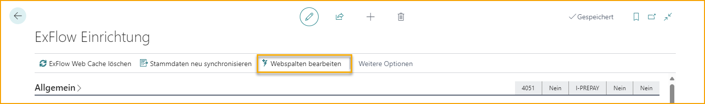
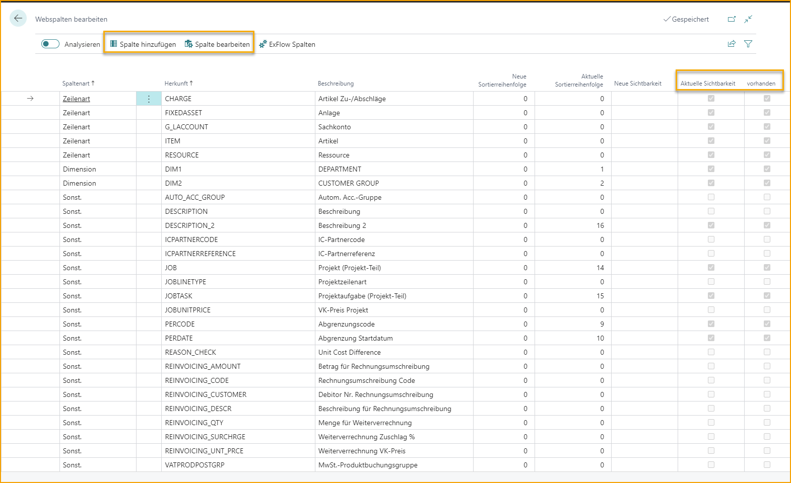
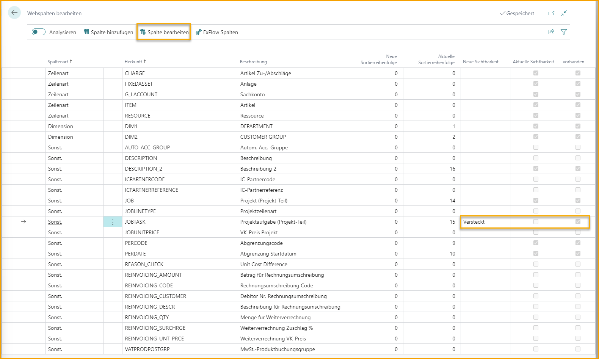
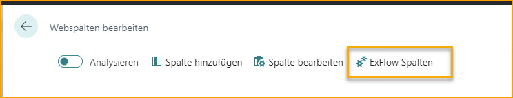
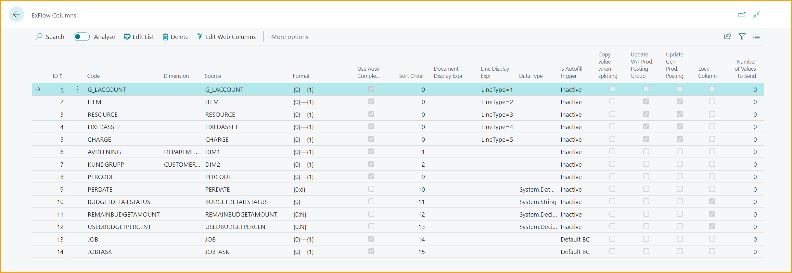

## ExFlow Web

 
Interessiert daran, alles über ExFlow Web zu lesen und zu lernen?      

 [***Alle notwendigen Informationen über ExFlow Web finden Sie hier!***](https://docs.exflow.cloud/web)    

### Web-Spalten in Business Central bearbeiten
Verwenden Sie die Funktion **Web-Spalten bearbeiten**, um ExFlow Web-Spalten zu verwalten.  

Gehen Sie zu **ExFlow Setup --> Web-Spalten bearbeiten** 

 

|Web-Spalten bearbeiten|
:-|:-|
|**Spalte hinzufügen**| Fügen Sie eine neue Spalte zu ExFlow Web hinzu.
|**Spalte bearbeiten**| Aktualisieren Sie eine vorhandene ExFlow Web-Spalte.
|**ExFlow-Spalten**| Verwalten Sie Änderungen an ExFlow Web-Spalten.

Web-Spalten, die in ExFlow Web vorhanden und sichtbar sind, haben sowohl das Kästchen "Aktuelle Sichtbarkeit" als auch das Kästchen "Vorhanden" angekreuzt. 

Wenn eine Spalte für die Web-Genehmiger hinzugefügt werden muss, stellen Sie sich einfach auf den ausgewählten Web-Spalten-Code und klicken Sie dann auf ''Spalte hinzufügen''.

Es ist möglich, eine vorhandene Web-Spalte in ExFlow Web auszublenden, indem Sie "Ausgeblendet" auswählen und dann auf "Spalte bearbeiten" klicken. In diesem Beispiel wird das Kästchen "Aktuelle Sichtbarkeit" für die Spalte "Job Task" dann nicht angekreuzt sein.  

### ExFlow-Spalten
 
Gehen Sie zu **ExFlow Setup --> Web-Spalten bearbeiten --> ExFlow-Spalten** 

Öffnen Sie ExFlow-Spalten und bearbeiten Sie die Liste, wenn Änderungen an den Spalten vorgenommen werden müssen.

|ExFlow-Spalten|
:-|:-|
|**ID**|Gibt die Spalten-ID an.
|**Code**| Gibt den Code an.
|**Dimension**| Eine Dimension aus der Allgemeinen Ledger-Konfiguration kann als ExFlow Web-Spalte hinzugefügt werden.
|**Quelle**| Kopie des Code-Werts.
|**Format** |Das Format, in dem der Wert und die Beschreibung an ExFlow Web gesendet werden.
|**Automatische Vervollständigung verwenden**| Angekreuztes Kästchen nimmt den angegebenen Datentyp. Nicht angekreuztes Kästchen = Freitext wie eine Beschreibung.
|**Sortierreihenfolge**| Sortierreihenfolge für alle Web-Spalten (außer für Linientypen).
|**Dokumentanzeigeausdruck**| Kann bestimmen, ob die Spalte für bestimmte Dokumenttypen verwendbar sein soll.
|**Zeilenanzeigeausdruck**| Gibt ExFlow Web an, dass es sich um einen Linientyp handelt und um welchen Linientyp es sich handelt.
|**Datentyp**| Wenn es sich um ein Datum oder eine Dezimalzahl handeln soll, die in ExFlow Web angezeigt wird, muss dieser Wert angegeben werden (Beschreibung hat "system.String").
|**Ist Ausfüllauslöser**| Wählen Sie aus, ob z.B. ein ausgewähltes Konto Aktualisierungen von Dimensionen aus den Standard Business Central-Kontoeinstellungen senden soll (Standard-BC). Es kann auch auf "Inaktiv" und "Angepasst" gesetzt werden.
|**Wert kopieren beim Aufteilen der Zeile**| Gibt an, ob Werte beim Aufteilen einer Zeile kopiert werden sollen.
|**Umsatzsteuer-Produktbuchungsgruppe aktualisieren von Nr.**| Gibt an, ob die Umsatzsteuer-Produktbuchungsgruppe von der Nr.-Karte übernommen werden soll.
|**Allgemeine Produktbuchungsgruppe aktualisieren von Nr.**| Gibt an, ob die allgemeine Produktbuchungsgruppe von der Nr.-Karte übernommen werden soll.
|**Spalte sperren**| Gibt an, ob Werte gesperrt und nicht bearbeitbar sein sollen.
|**Anzahl der zu sendenden Werte**| Wird zur Verbesserung der Leistung verwendet. Wenn 100 ausgewählt ist, sendet ExFlow nur die ersten 100 Werte gemäß dem aktuellen Filter.
