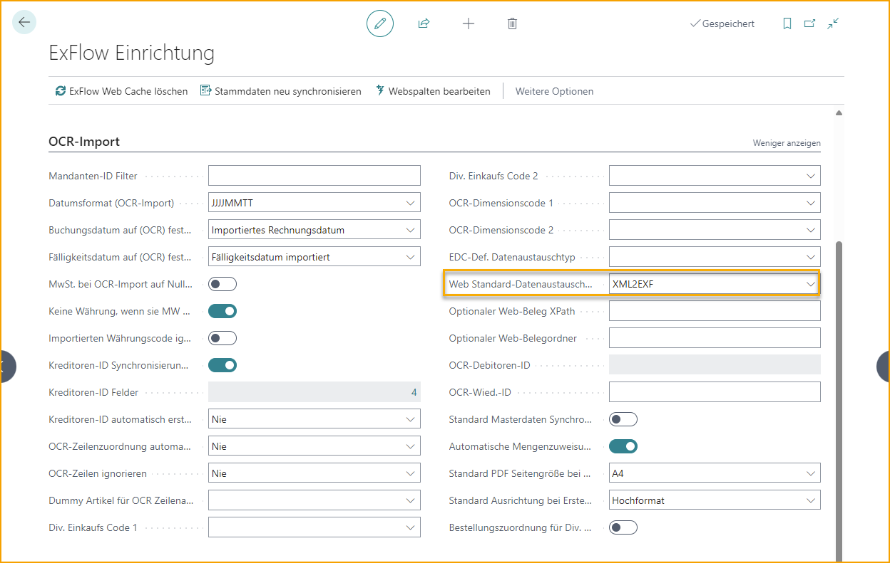
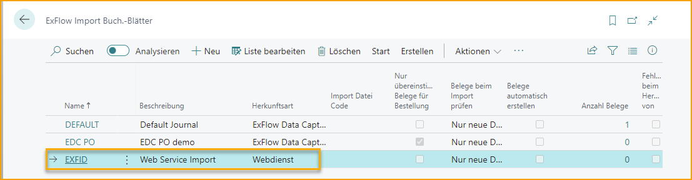

## Web Services - EXFID

### Einführung
ExFlow ist abhängig vom Import von Dokumenten aus verschiedenen Quellen wie dem lokalen Dateisystem, Azure Storage oder Web Services. In diesem Dokument werden Web Services beschrieben: Funktionalität, Einrichtung, Verwendung und Beispielcode als Projekt in C#/.NET 4.8 und Visual Studio 2019 zur Integration. Die Programmierung kann in jeder Sprache erfolgen, die Web Services-Anfragen mit dem SOAP-Protokoll unterstützt. Der aufgeführte Beispielcode kann leicht in VB.Net konvertiert werden. 
Die Verwendung von Web Services ermöglicht es Drittanbietern oder Business Central-Partnern, elektronische Rechnungen an ExFlow mit einem standardisierten Protokoll zu senden.

### Allgemein
Der Import von Rechnungen in ExFlow erfordert normalerweise zwei Dateien: eine XML-Datei, die die Rechnung in einer bekannten Struktur enthält, und die PDF-Datei, die eine Darstellung der Rechnung enthält. Die PDF-Datei kann optional sein, wenn eine XSL-Datei vorhanden ist, die eine in PDF konvertierbare HTML generieren kann.

Der Import über Web Services wird extern initiiert und nicht von ExFlow oder einer Job Queue Entry ausgelöst. Externe Systeme verbinden sich mit den Web Services in Business Central und rufen Methoden auf, um Dokumente in eingehende Dokumente und eingehende Dokumentanlagen hochzuladen. Beim Auslösen des Imports in ExFlow werden die Dokumente basierend auf den über den Web Service importierten eingehenden Dokumenten verarbeitet.

### Business Central / ExFlow
Installieren Sie ExFlow und führen Sie den Assistenten aus, um eine Einrichtung vorzunehmen. Importieren Sie eine nützliche Data Exchange Definition (DED), entweder eine von ExFlow oder verwenden Sie eine vorhandene DED in Business Central.  

#### ExFlow-Einrichtung
In der ExFlow-Einrichtung geben Sie einen Wert im Feld "Web Def. Data Exchange Type" ein und wählen Sie aus der Liste der Data Exchange Types aus. Wenn keine verfügbar sind, führen Sie "Import Data Exchange Definitions" aus und importieren Sie eine oder mehrere Data Exchange Definitions.

  

#### Importjournal
Erstellen oder konfigurieren Sie ein ExFlow Importjournal, um zu verarbeiten, was über den EXFID Web Service importiert wird.
* Erstellen Sie ein neues ExFlow Importjournal.
* Geben Sie einen Namen und eine Beschreibung ein.
* Setzen Sie den Quelltyp auf Web Service.

Verarbeiten Sie importierte Rechnungen über den Web Service, indem Sie "Import Documents" im neu erstellten ExFlow Importjournal ausführen oder "Batch Import Documents" ausführen.
