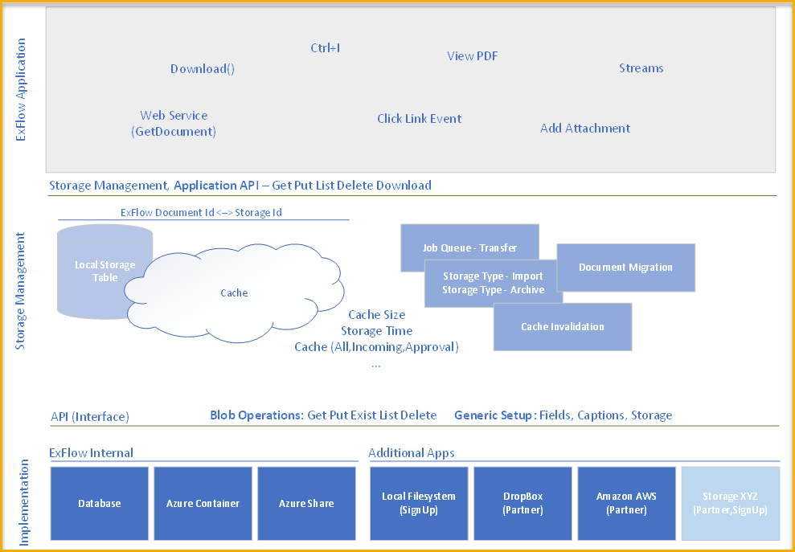
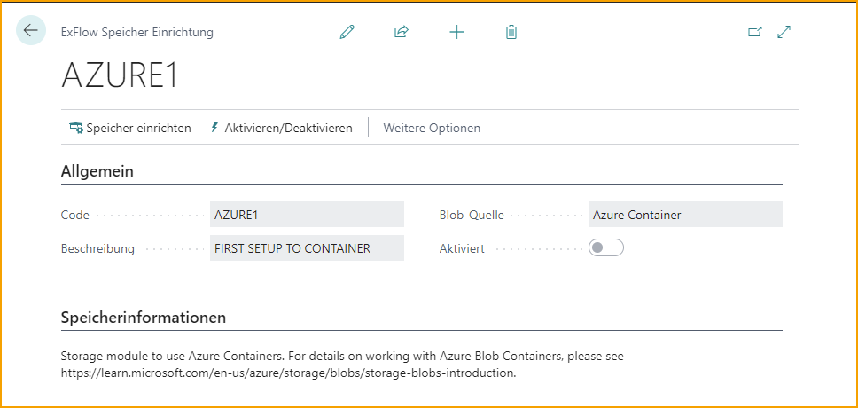

## Generischer Blob-Speicher

### Einführung
ExFlow verwendet derzeit die Business Central-Datenbank, um importierte Dokumente zu speichern. Die Dokumente bestehen hauptsächlich aus XML und PDF. Es könnten auch andere Formate wie DOCX oder PNG verwendet werden. 
Bei der Verwendung von Business Central als Speicherplatz nimmt der zugewiesene Speicherplatz aufgrund der Anzahl der Rechnungen, die der Kunde erhält, radikal zu. Da importierte Dokumente Bilder enthalten können, wird der Speicherplatz in BC Online stark erweitert.
Es besteht die Notwendigkeit, importierte Dokumente an günstigeren oder effizienteren Speicherorten zu speichern.

### Allgemein
Blobs sind Dateien im traditionellen Sinne. Ein Blob ist jedoch der Inhalt dessen, was wir als Datei betrachten. Eine Datei ist eher mit Metadaten wie Name, Erstellungsdatum, Änderungsdatum, Inhaltstyp und mehr verbunden. Blobs sind binäre Datenfolgen, die von den Metadaten beschrieben werden. Die Metadaten geben uns oder der Anwendung, die den Blob verwendet, an, wie der Inhalt verwendet werden soll.

Um Blobs effizienter zu verarbeiten, müssen sie von der Anwendung abstrahiert werden. Wenn ExFlow nach einem Blob fragt, erhält es Metadaten und den binären Inhalt. Die tatsächliche Quelle ist der Anwendung unbekannt.

Die vorgeschlagene Lösung verwendet mehrere Ebenen, um die Funktionalität abzustrahieren und zu isolieren.  

#### ExFlow-Anwendung
Die Anwendung, die die Blobs liest, schreibt, löscht und auflistet, oder Dateien, wenn Sie möchten.  

#### Speicherverwaltung
Verwaltet, wo, wann und wie ein Blob gespeichert wird. Die Cache-Verwaltung und der Speicher werden in dieser Ebene behandelt. Die Übertragung von Blobs und das Abrufen von Blobs erfolgt in dieser Ebene.  

#### Speicherimplementierung (Speicherschnittstelle)
Dies ist die Implementierung eines Speichertyps. Zu implementierende Funktionen sind die primitivsten, wie z.B. Get oder Put.

### Architektur
Die Architektur für den Blob-Speicher isoliert die Anwendung von der Art und Weise, wie auf Blobs zugegriffen wird.  

#### ExFlow-Anwendung
In Business Central werden Blobs in Blob-Feldern in Tabellen gespeichert. Beim Lesen eines Blobs werden Streams verwendet, um Daten aus dem Blob zu extrahieren. Beim Schreiben eines Blobs werden Streams verwendet, um Daten in einer Tabelle zu schreiben.
Derzeit werden Blobs in den folgenden Bereichen verwendet oder darauf verwiesen:
* ExFlow PDF-Add-In
* Anhang für eingehende Dokumente
    - InStream
    - OutStream
* Strg+I-Verknüpfung in ExFlow zum Herunterladen des Hauptanhangs auf den lokalen Computer
* Klicken Sie auf einen Dateinamen in Business Central, um einen beliebigen Anhang auf den lokalen Computer herunterzuladen  

**Isolierung:** Jede Anforderung zum Lesen eines Blobs wird über die Speicherverwaltung gesendet, die den Blob zurückgibt. Der Blob kann als Stream zurückgegeben oder auf den Client heruntergeladen werden.

Jede Anforderung zum Speichern eines Blobs wird über die Speicherverwaltung gesendet. Die Referenz besteht aus SystemId sowie TableID und FieldID, um es möglich zu machen, zwei Blobs in derselben Tabelle zu "speichern" und den externen Speicher dennoch zu verwenden.

Die Blob-Funktionalität wird hauptsächlich Standard-Blob-Methoden nachahmen, wenn sie für die Verwendung sinnvoll sind.  

#### Speicherverwaltung
Die Speicherverwaltung (SM) stellt Funktionen zum Lesen oder Schreiben von Blobs entweder direkt oder durch das Abhören von Ereignissen bereit.

Business Central löst Ereignisse aus, wenn Blobs gelesen werden, bevor Daten aus dem primären, am häufigsten verwendeten Speicher, dem Anhang für eingehende Dokumente, extrahiert werden.

SM verwaltet einen Cache von verwendeten Blobs. Verwendete Blobs können Blobs sein, die mit Import Journal oder Approval Status zusammenhängen, um nur einige zu nennen. Blobs können auch in archivierten Bereichen wie Posted Purchase Invoices oder Vendor Ledger Entries verwendet werden.

Wenn ein Blob angefordert wird, der sich auf gebuchte Dokumente bezieht, wird der Blob aus dem Blob-Speicher abgerufen und lokal zwischengespeichert und dann an die Anwendung zurückgegeben. Der Blob bleibt für eine bestimmte Zeit im Cache erhalten, die in der Konfiguration festgelegt ist.

Blobs, die für Bereiche wie Import Journal angefordert werden, bleiben im Anhang für eingehende Dokumente erhalten, bis die Rechnung gebucht wurde. Zu diesem Zeitpunkt wird der Anhang für eingehende Dokumente als ungültig markiert und wird auf regelmäßiger Basis von einer geplanten Aufgabe entfernt. Wenn eine Anforderung für einen Blob vorliegt, der sich auf einen neu gebuchten Eintrag bezieht und der Cache-Eintrag noch vorhanden ist, wird der Blob nicht erneut abgerufen und der Cache wird als gültig festgelegt und bleibt für die in der Konfiguration festgelegte Zeit gültig.

Die Benennungskonvention für Blobs ist generisch, wobei die Blob-Details in einer separaten Tabelle gespeichert werden, die den Namen des Blobs enthält. Der Blob muss einer generischen Benennungskonvention folgen, um keine Probleme mit der Dateinamenlänge zu verursachen. Ein empfohlener Name ist GUID, bei dem Teile davon als Pfad verwendet werden können.  

#### Speicherimplementierung
Die physische Speicherung von Blobs erfolgt mithilfe einer Schnittstelle in Business Central. Eine Schnittstelle ist eine Abstraktion ohne Code, sie kann als Definition einer API betrachtet werden. Die Schnittstelle enthält nur Funktionssignaturen. Es liegt in der Verantwortung der Implementierer, den Code zur Unterstützung der Schnittstelle hinzuzufügen.

Die Schnittstelle definiert eine oder mehrere überladene Funktionen im Zusammenhang mit Get, Put, Exist, List und Delete. Die Schnittstelle definiert auch überladene Funktionen im Zusammenhang mit Setup, Funktionen wie GetFieldCaption, SetFieldValue und GetFieldValue.

### Blob-Speicher-Setup
Gehe zu: ***ExFlow Setup --> Aktionen --> Funktionen --> Blob-Speicher-Verwaltung*** (--> Speicher-Setup)

Das Setup für den Blob-Speicher basiert auf der Schnittstelle, die zur Speicherimplementierung definiert ist. Das Blob-Speicher-Setup ist generisch und allgemein. Es enthält einige generische Textfelder wie Code, Beschreibung und Blob-Quelle.

Das Setup für den Blob-Speicher basiert auf der Schnittstelle, die zur Speicherimplementierung definiert ist. Das Blob-Speicher-Setup ist generisch und allgemein. Es enthält keine generischen, implementationsbezogenen Felder außer Beschreibung und Speichertyp.

Die Implementierung führt ihr eigenes Setup gegen ihre eigenen Tabellen aus, wie es erforderlich ist. Da die Implementierung möglicherweise OAuth oder einen anderen Authentifizierungstyp erfordert, liegt es in der Verantwortung der Implementierung, dies zu implementieren. Eine Implementierung der Schnittstelle kann sich dafür entscheiden, alle Konfigurationsparameter im isolierten Speicher zu speichern.

Die minimalen Werte für das Blob-Speicher-Setup sind Code, Beschreibung, Blob-Speichertyp und ob es aktiviert ist oder nicht.

Es kann mehr als ein Blob-Speicher-Setup pro Blob-Speichertyp geben, je nach Verwendung.

In dem Beispiel wird die Implementierung "Azure Container" gewählt.

Der Azure Container stellt eine Einrichtung dar, die beim Drücken von "Setup" die für die Implementierung benötigten Informationen sammelt.

Es liegt in der Verantwortung der Implementierung, Parameter auf relevante Weise in physischen Tabellen, isoliertem Speicher oder auf andere Weise zu speichern.

Alle Felder in der Blob Storage-Einrichtung sind für ExFlow oder Blob Storage Management irrelevant und machen nur für die Implementierung Sinn. Die Implementierung verwendet die Blob Storage-Einrichtung, um zu wissen, welche Einrichtung verwendet werden soll und aus ihrem eigenen Speicher, ihrer Tabelle oder ihrem isolierten Speicher abzurufen. Wenn also ein Aufruf an die Schnittstelle Get(Name, ...) erfolgt, wird die Implementierung die erforderliche Einrichtung und Verbindungen herstellen, um das angeforderte Blob abzurufen.

In diesem Fall ist Storage Management physisch speicheragnostisch, es weiß nicht, wie die Datei oder das Blob abgerufen werden kann, das überlässt es der Implementierung.

Ein Aufruf von Storage Management an Get(Name, ...) verhält sich gleich und gibt das Blob zurück, unabhängig davon, ob die Implementierung Azure Container, Datenbank, Azure Share, lokales Dateisystem, Amazon WS, Drobox oder eine andere Möglichkeit zur technischen Verarbeitung von Blobs ist.

### Storage Management
Storage Management (SM) stellt allgemeine Funktionen zur Verfügung, die von der Anwendung verwendet werden können, um Blobs basierend auf einer Schlüssel-/Namen-Kombination abzurufen, zu setzen, aufzulisten oder zu löschen. SM stellt den Blob an seinen ursprünglichen Speicherort wieder her, wenn eine Anforderung dafür gestellt wird.

SM speichert oder zwischenspeichert Blobs lokal in einer Tabelle innerhalb der Blob Storage-Funktionalität, um die Blob-Verwaltung für die Anwendung schnell zu machen.

Zwischengespeicherte Blobs werden nur für eine begrenzte Zeit gespeichert, wie in der Einrichtung festgelegt. Einschränkungen können Tage oder Funktionsbereiche umfassen.  

#### Zwischenspeicherung in Tagen
Für Bereiche, die nicht von vorübergehender Natur sind, wie z.B. gebuchte Dokumente, kann der Cache so eingestellt werden, dass zwischengespeicherte Einträge innerhalb einer festgelegten Anzahl von Tagen ablaufen. Sobald die Anzahl der Tage erreicht ist, werden die Cache-Einträge ungültig. Ein geplanter Job entfernt ungültige Einträge aus dem Cache.  

#### Cache pro Funktionsbereich
Die Archivierung von Blobs ist nur für gebuchte Dokumente relevant, da Dokumente im Zusammenhang mit Import Journal oder Genehmigungsstatus einen sofortigen Zugriff erfordern.  

#### Zwischenspeicherung in Anzahl der Einträge
Für den Cache im Zusammenhang mit Funktionsbereichen oder allgemein kann eine Cache-Speicherphilosophie darin bestehen, höchstens 1000 zwischengespeicherte Einträge zu behalten. Jedes Mal, wenn ein Blob aus dem Cache abgerufen wird, wird ein "Zuletzt verwendet"-Zeitstempel aktualisiert. "Zuletzt verwendet" kann als Referenz verwendet werden, wenn die Anzahl der Einträge den in der Einrichtung festgelegten Wert überschreitet. Diese Einträge werden von einem geplanten Job gelöscht. Es kann einen dynamischen Puffer geben, wenn die Anzahl der zwischengespeicherten Einträge den festgelegten Grenzwert überschreitet.

Die Zwischenspeicherung in Anzahl der Einträge gilt höchstwahrscheinlich nur für gültige Einträge. Ungültige Einträge werden ohnehin regelmäßig vom geplanten Job gelöscht.  

#### ExFlow Speicherdetails

Zeigt die aktuellen Speicherdetails des eingehenden Dokumentenanhangs in Business Central an. Die Details umfassen das Datum, an dem das Dokument im Blob-Speicher abgelegt wurde, das zuletzt abgerufene Datum und die Liste der eingehenden Dokumente, die sich noch in Business Central mit der System-ID als Kennung befinden.

#### Zusätzliche Funktionen
Storage Management kann zusätzliche Funktionen implementieren, um die Blob-Verarbeitung oder andere Funktionen zu beschleunigen. 

**Cache Cleanup-Prozess** 
Aktivieren Sie die manuelle Bereinigung des Caches.

**Cache-Paradigma** 

    - ***Vorab abrufen von Einträgen*** 
            Füllen Sie den Cache mit Einträgen im Incoming Document Attachment vor, da dies den Zugriff auf das Blob beschleunigt, da es sofort verfügbar sein wird.

    - ***On-Demand*** 
        Rufen Sie den Blob nur ab und füllen Sie den Cache, wenn der Blob angefordert wird. Dies ist möglicherweise keine praktikable Funktion, aber dennoch eine Funktion. 

**Dokumentmigration** 
Storage Management kann Dokumente von einem Blob Storage-Typ in einen anderen verschieben oder von einem Blob Storage-Typ des gleichen Typs wie der Zielspeicher in einen permanenten Azure Container (im Besitz des Kunden) lesen.

**Speicherumzug** 
Storage Management kann einen Umzug von einem Blob Storage-Typ in einen anderen implementieren. Der Kunde verwendet den Datenbank-Speichertyp und möchte zu Azure Container wechseln. Daher gibt das Storage Management einen Get(Name, ...) vom Datenbank-Speichertyp aus und gibt dann ein Put(Name, ...) an Azure Container für jedes Blob aus.  
Es wäre möglich, die externe Speicherung zu beenden, indem man eine Funktion verwendet, um Blobs aus dem externen Speicher wieder in den Incoming Document Attachment zu kopieren/verschieben.

