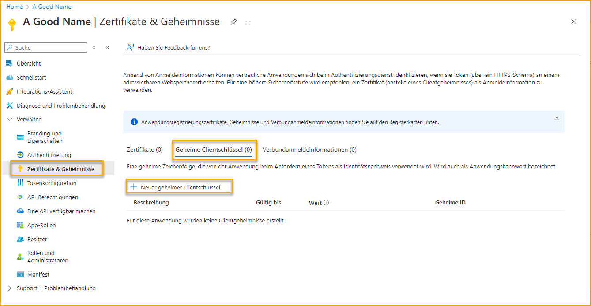
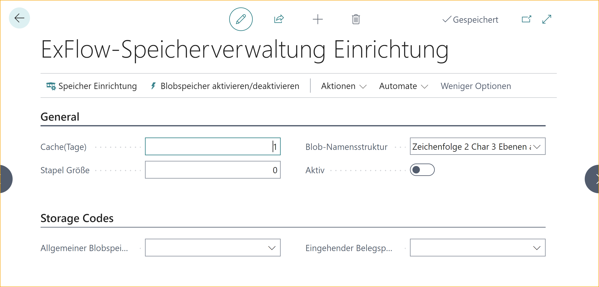
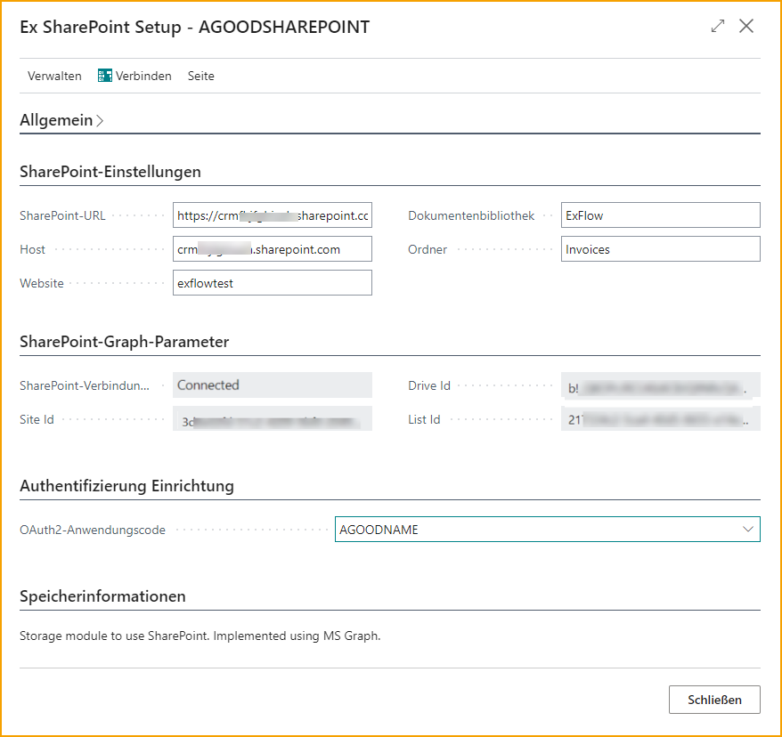
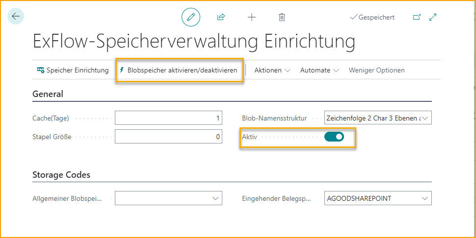
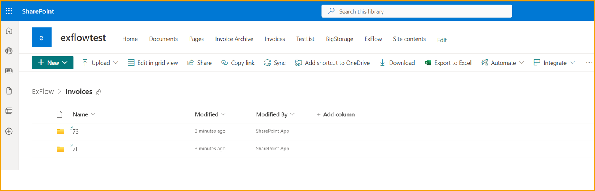

## OAuth 2.0 Anwendungen und Speicherung einrichten

Für Unterstützung in Bezug auf das Folgende wenden Sie sich bitte an Ihre interne IT-Abteilung oder vertrauenswürdigen Business Central-Partner.

### Anwendung oder Dienstprinzipal in MS Entra (oder Azure) erstellen

Geben Sie einen beliebigen Namen ein. Wählen Sie "Konten in einer beliebigen Organisationsverzeichnis" und klicken Sie dann auf "Registrieren".

 

Nach der Registrierung notieren Sie sich die "Anwendungs-ID (Client-ID)".

 

Gehen Sie zu den API-Berechtigungen, um eine Berechtigung hinzuzufügen.

 

Klicken Sie auf "Microsoft Graph" und "Anwendungsberechtigungen".  
Suchen Sie nach "site" und fügen Sie die Berechtigung hinzu: Sites.ReadWrite.All 

 

Klicken Sie erneut auf "SharePoint" und "Anwendungsberechtigungen". 
Wählen Sie beide Berechtigungen aus und fügen Sie sie hinzu: Sites.ReadWrite.All und Sites.Manage.All.  

 

Erteilen Sie die Administratorzustimmung für diese Berechtigungen:

 

Die Berechtigungen sollten wie folgt aussehen:

 

Gehen Sie zu "Zertifikate & Geheimnisse".

 

Erstellen Sie ein Clientgeheimnis:

 

Kopieren Sie das Geheimnis und/oder speichern Sie es. Das Geheimnis wird nicht mehr sichtbar sein. Wenn das Geheimnis vergessen oder verlegt wird, erstellen Sie ein neues Geheimnis und konfigurieren Sie die OAuth2-Anwendung erneut.

 

Gehen Sie zurück zur Liste der App-Registrierungen und klicken Sie auf "Endpunkte".
Kopieren Sie sowohl die OAuth2.0 v2-Endpunkte (Autorisierung und Token) als auch den Microsoft Graph API-Endpunkt.
 

 

Abgeschlossen mit Entra oder Azure AD oder AAD.  

### Konfigurieren einer OAuth2-Anwendung in ExFlow

Gehen Sie zu: **ExFlow Setup --> Aktionen --> Funktionen --> OAuth2-Anwendungen**

Starten Sie die Konfiguration, indem Sie auf "Neu" klicken, um eine neue OAuth 2.0-Anwendung zu erstellen.

| OAuth 2.0-Anwendungen | 
|:-|:-|
| **Zugriffstoken anfordern** | Öffnen Sie die Service-Autorisierungswebseite. Es werden Anmeldeinformationen angefordert. Der Autorisierungscode muss in das Feld "Autorisierungscode eingeben" kopiert werden.
| **Zugriffstoken aktualisieren** | Aktualisieren Sie das Zugriffs- und Aktualisierungstoken.
 

 

| Allgemein |
|:-|:-|
| **Code** | Gibt den Namen des Codes an.
| **Beschreibung** | Gibt die Codebeschreibung an.
| **Anwendungs-/Client-ID** | Gibt die Anwendungs-ID aus der Übersicht der Unternehmensanwendung an.
| **Clientgeheimnis** | Gibt das Clientgeheimnis an.
| **Grant-Typ** | Gibt den zu verwendenden Grant-Typ an. Es ist möglich, Autorisierungscode, Passwortanmeldeinformationen oder Clientanmeldeinformationen zu verwenden. Derzeit wird nur "Clientanmeldeinformationen" unterstützt.
| **Weiterleitungs-URL** | Gibt die Weiterleitungs-URL an, die derzeit nicht verwendet wird.
| **Bereich** | Gibt den Bereich an. Geben Sie den Graph-Endpunkt ein und fügen Sie ".default" hinzu. Stellen Sie sicher, dass der Endpunkt am Ende wie folgt aussieht: "...soft.com/.default"
 

| Endpunkte |
|:-|:-|
| **Autorisierungs-URL** | Gibt die Autorisierungs-URL an.
| **Zugriffstoken-URL** | Gibt die Zugriffstoken-URL an.
| **Auth.-URL-Parameter** | Gibt die Ressourcen-URL an, die derzeit nicht verwendet wird.

 

Fügen Sie alle erforderlichen Einrichtungsinformationen ein. Geben Sie einen Code und eine Codebeschreibung ein. Fügen Sie die Anwendungs-/Client-ID und das Client Secret aus dem MS Entra Admin Center ein.

Setzen Sie den Grant-Typ auf "Client Credentials" und die MS Graph Scope-URL (Microsoft Graph API).  

 

Unter dem Abschnitt "Endpoint" fügen Sie die zuvor kopierten URLs für den OAuth2.0 v2 Authorization Endpoint und den Token Endpoint ein.  

Testen Sie, indem Sie auf "Request Access Token" klicken. Wenn alles korrekt ist, sollte folgende Meldung angezeigt werden: "Access Token erfolgreich aktualisiert."  

### SharePoint-Einrichtung
Erstellen Sie in "Site Contents" eine neue Dokumentenbibliothek, in der ExFlow Daten speichern wird. Erstellen Sie einen Ordner in der gerade erstellten Dokumentenbibliothek. Dies wird der Speicherort der Dokumente sein. Klicken Sie auf den neu erstellten Ordner. Kopieren Sie die vollständige URL aus der Adressleiste des Browsers. Diese wird für die Konfiguration unten benötigt.

### Blob Storage-Einrichtung für SharePoint

Gehen Sie zu: **ExFlow Setup --> Actions --> Functions --> Blob Storage Mgmt (ExFlow Storage Management Setup)**

| Blob Storage Mgmt / ExFlow Storage Management Setup |
|:-|:-|
|**Storage Setup**|Konfigurieren Sie eine oder mehrere Speicherkonfigurationen
|**Enable/ Disable Blob Storage**|Aktivieren oder deaktivieren Sie den Blob-Speicher

 

Auf der Seite "ExFlow Storage Management Setup" klicken Sie auf **Storage Setup** und dann auf "Neu", um mit der Konfiguration zu beginnen.

 

Geben Sie einen Code und eine Beschreibung ein. Wählen Sie für "Blob Source" SharePoint aus. 

Klicken Sie dann auf **Setup Storage**, um die Konfiguration fortzusetzen.

 

Kopieren Sie die URL von SharePoint und fügen Sie sie in das Feld "SharePoint URL" ein. Sobald Sie das Feld verlassen, werden die Werte in Host, Site, Document Library und Folder extrahiert und eingefügt. Wenn eines der Felder fehlt, wahrscheinlich Folder, können Sie diese manuell eingeben.  

 

Wählen Sie die zuvor erstellte OAuth2-Anwendung aus und überprüfen Sie dies, indem Sie auf "Connect" klicken.  

Wenn etwas falsch ist, wie z.B. der Ordnername, wird eine Meldung wie "Not Found" angezeigt.  

Außerdem wird bei fehlenden Berechtigungen eine Meldung wie "Unauthorized" angezeigt.  

Wenn alles in Ordnung ist, wird der SharePoint-Verbindungsstatus auf "Connected" gesetzt und die Parameter werden in Site Id, Drive Id und List Id eingefügt.  

Es ist jetzt in Ordnung, diese Seite zu schließen, da die Blob Storage-Einrichtung für SharePoint abgeschlossen ist.  

Gehen Sie zurück zu **ExFlow Storage Setup**, um auf "Enabled" zu klicken.  

 

Schließen Sie die ExFlow Storage Setup und kehren Sie zu ExFlow Storage Management Setup / Blob Storage Mgmt zurück. 

Wählen Sie die neu erstellte SharePoint-Einrichtung unter "Incoming Doc. Storage Code" aus.  

 

Klicken Sie auf "Active" oder "Enable / Disable Blob Storage".  

 

Wenn bereits vorhandene Rechnungen mit ExFlow genehmigt wurden, wird ein Dialogfeld angezeigt, in dem Sie gefragt werden, ob diese übertragen werden sollen. Sie können dann "Ja" wählen.  

Es ist jetzt möglich, den Status der gebuchten Rechnungen im Blob Storage zu überprüfen, indem Sie "Actions --> Storage Details" auswählen.  

Klicken Sie auf "Sync Storage", um eine Übertragung nach SharePoint zu erzwingen.  

 

Aktualisieren Sie die SharePoint-Seite mit dem zuvor erstellten Ordner. Es sollte nun möglich sein, die neuen Ordner dort anzuzeigen.  

 
