## Upgrade und Migration von ExFlow-Daten

  

Fühlen Sie sich frei, Dokumente vor dem Start herunterzuladen und zu lesen:   [***Technische Dokumente herunterladen***](https://docs.exflow.cloud/business-central/docs/user-manual/help-and-support/documents-for%20download#documents-for-download)  

### Einführung
#### Hintergrund
Dieser Abschnitt beschreibt, wie Sie BC C/AL ExFlow-Daten auf BC AL ExFlow-Daten aktualisieren/migrieren können.   

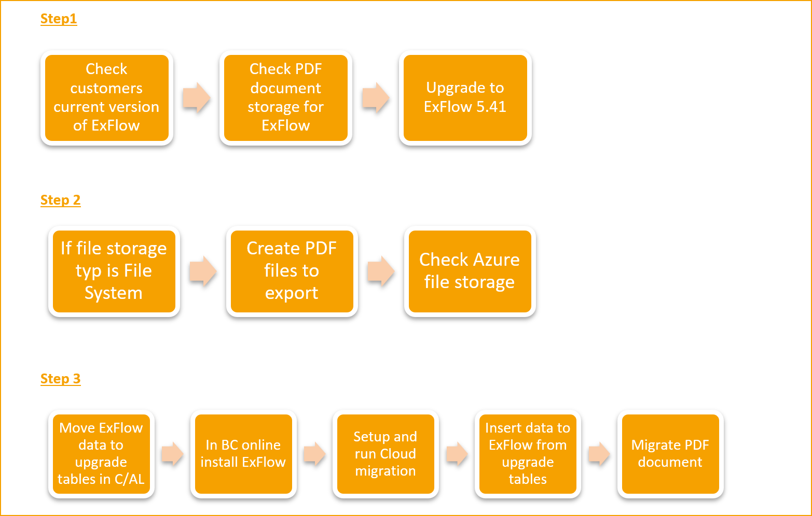 

#### Überlegungen
Die ExFlow AL BC-Version ist keine 1:1-Konvertierung der früheren C/AL-basierten Version von ExFlow. Es können also Unterschiede sowohl in der Funktionalität als auch in der Darstellung/Migration der Daten auftreten. Hier sind einige der wichtigsten Unterschiede zwischen den Versionen:    
• Die Requisition-Funktionalität wird in ExFlow Business Central AL nicht unterstützt. Dokumente und Einstellungen, die mit der Requisition-Funktionalität zusammenhängen, werden daher nicht migriert und die Funktion steht in BC AL nicht zur Verfügung.   

• Es gibt wesentliche Änderungen in der Funktionsweise/Darstellung von Kommentaren, daher werden einige Kommentare, die migriert werden, als von einem "Systembenutzer" erstellt/geschrieben angezeigt.  

#### Datenbank-Upgrade/-Umzug zu Microsoft SaaS
Stellen Sie sicher, dass die aktualisierte BC-Datenbank und das ExFlow-Add-On unterstützte Cloud-Versionen haben. Befolgen Sie dann die Anweisungen von Microsoft zum Cloud-Migration von lokalen Datenbanken zu SaaS.  

#### Voraussetzungen
Das ExFlow-Datenmodell muss vollständig auf die ExFlow-Version 5.41 in BC 14 aktualisiert werden. NAV/BC muss gemäß den Anweisungen von Microsoft auf eine von Microsoft unterstützte Version aktualisiert werden.

Schritte für ExFlow:
1. Aktualisieren Sie die ExFlow-Version auf ExFlow 5.41 in BC14. Siehe "ExFlow-Version auf ExFlow 5.41 in BC14 aktualisieren".
2. Behandeln Sie PDF/Bild für den Export von C/AL in den Dateispeicher. Siehe Anleitung "PDF-Dateien zum Export aus C/AL erstellen".
3. Erstellen Sie Daten für die ExFlow-Upgrade-Tabellen und migrieren Sie sie zu BC AL. Siehe "Beginnen Sie mit der Migration von BC14 ExFlow C/AL-Daten zu ExFlow AL-Daten".  

### Schritt 1
### Überprüfen Sie die aktuelle ExFlow-Version und NAV/BC-Version  

Gehen Sie zu: **Abteilungen--> ExFlow Setup--> Über ExFlow**, um Ihre ExFlow-Version zu finden:

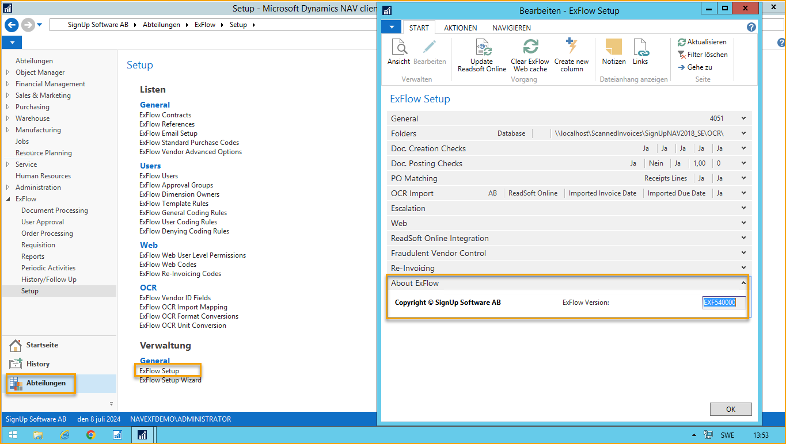 

Gehen Sie unter den Stapel in der Symbolleiste und klicken Sie auf **"Hilfe"** und **"Über Microsoft Dynamics 365 Business Central"**.

Wenn die aktuelle ExFlow-Version < ExFlow 5.22 ist, muss ein Upgrade von ExFlow auf ExFlow 5.41 mit dem Upgrade-Skript durchgeführt werden.
 
Lesen Sie mehr in Abschnitt "ExFlow 3.50 auf ExFlow 5.41 aktualisieren" oder "ExFlow 4.XX auf ExFlow 5.41 aktualisieren".

Wenn die aktuelle ExFlow-Version > ExFlow 5.22 ist, führen Sie den vorhandenen ExFlow-Code mit der Version ExFlow 5.41 in BC14 zusammen.
 
Upgrade-Skripte aus früheren Versionen können vom SignUp Software AB-Partnerportal heruntergeladen oder beim SignUp Software AB-Support angefordert werden. 

### Überprüfen Sie den PDF-Dokumentspeicher für ExFlow

Gehen Sie zu **"ExFlow Setup --> Ordner--> Dateispeichertyp"**, um zu überprüfen, ob die Dokumente in der Datenbank oder in einem Dateifreigabeordner gespeichert sind:

 

Wenn das Dokument im Dateifreigabeordner gespeichert ist, gibt es zwei Optionen: 
1. Importieren Sie das Dokument in die Datenbank. Lesen Sie mehr im Abschnitt "PDF/Bilder in die Datenbank importieren vor dem Upgrade".  
2. Exportieren Sie Dokumente aus BC/NAV C/AL in den Dateifreigabeordner und importieren Sie Dokumente aus dem Azure-Dateispeicher in BC AL.
Lesen Sie mehr im Abschnitt "Dokumente zum Export in C/AL erstellen und in AL importieren". 

### Importieren Sie PDF/Bilder in die Datenbank vor dem Upgrade
Starten Sie den BC RTC-Client in ExFlow-Version > 5.22.  

Gehen Sie zu: **Abteilungen --> ExFlow Setup --> Navigieren --> ExFlow-Dateien migrieren (Erweitert)**

Klicken Sie auf **ExFlow-Dateien migrieren (Erweitert)** und bearbeiten Sie das Fenster "ExFlow-Dateien migrieren" mit den erforderlichen Importinformationen. 

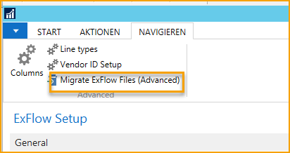 

Wenn mehrere Unternehmen ExFlow verwenden, überprüfen Sie, ob die Dateipfade in der ExFlow-Setup aktualisiert wurden.  

Wenn es nur ein Unternehmen gibt, können Sie, abhängig davon, wo sich der Dateifreigabeordner befindet, entweder die Dateien aus den Pfaden in der Setup importieren oder sie manuell aus **Rechnungspfad** und **Anhangspfad** auswählen. 

Stellen Sie sicher, dass das Feld **XML-Dateien migrieren** nicht aktiviert ist und das Feld **Dateikonflikte ersetzen/ignorieren** aktiviert ist. 

Wenn es viele Dokumente gibt, können Sie den Import durch Eingabe von Ordnernamen in **Bildname von** und **Bildname bis** begrenzen. 

Darüber hinaus können Sie das Unternehmen auswählen, aus dem Sie Dateien importieren möchten, indem Sie das Unternehmen in **Nur in Unternehmen migrieren** auswählen. 

Sie können die Pfade in der Registerkarte "Ordner" in der ExFlow-Setup ändern. 
Klicken Sie auf "Vorschau", um fortzufahren. 

 

### Upgrade ExFlow-Version auf ExFlow 5.41 in BC 14
#### Upgrade ExFlow 3.50 auf ExFlow 5.41

Beenden Sie alle Dokumente im Importjournal in ExFlow. 

Importieren Sie ExFlow_350_to_5XX_STEP1_(NAV2009R2).fob. 

Führen Sie Codeunit 12057134 EX Upgrade 350 to 5XX Step1.fob aus.  

Löschen Sie die gespeicherten Prozeduren im SQL-Manager.  

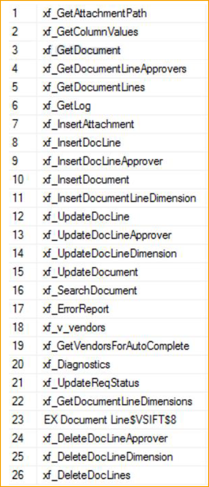 

Upgrade NAV2009R2 auf (NAV2015 oder höher) 

Merge ExFlow 5.XX in Kunden (NAV 2015 oder höher) Objekt. 

Importiere zusammengeführte ExFlow 5.XX Objekte in aktualisierte (NAV2015 oder höher)  

Wähle: Sync. Schema später 

Importiere Upgrade-Tool ExFlow_350_to_5XX_STEP2_(NAV2015 oder höher).fob 

Wähle: Sync. Schema später 

Kompiliere ExFlow-Objekte jetzt  

Wähle: Sync. Mit Validierung 

Starte Tool --> Daten-Upgrade in (NAV2015 oder höher) 

 

ExFlow 5.XX Daten bereit für ExFlow-Setup-Konfiguration und Web-Installation. 

#### Upgrade ExFlow 4.XX auf ExFlow 5.41
Merge ExFlow 5.41 mit Kundenversion von ExFlow auf BC14-Version und erstelle eine fob mit ExFlow-Objekten.  

Starte BC14-Entwicklungsumgebung.  

Führe Synchronisierung der Tabellen aus.  

Wähle: ''Tools--> Sync. Schema für alle Tabellen--> Mit Validierung''.  

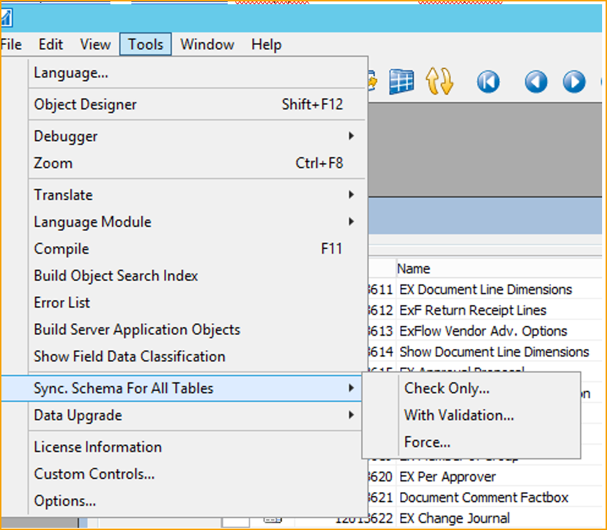 

Importiere zusammengeführte Kunden-ExFlow 5.41-Objekte, die erstellt wurden. 

Wähle: ''Sync. Schema für alle Tabellen--> Später''. 

Importiere Upgrade-Tool ExFlow_UpgradeTool_from500_to541 (BC).fob. 

Wähle: ''Sync. Schema später'' 

Kompiliere ExFlow-Objekt. 

Wähle: Jetzt – mit Validierung 

 

Wähle Tools --> Daten-Upgrade --> Start  

 

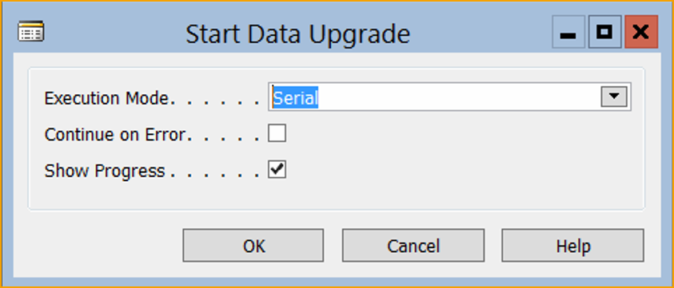 

Daten-Upgrade abgeschlossen.  

Validiere ExFlow-Daten.  

### Schritt 2

### Erstellen von Dokumenten-Dateien zum Exportieren in C/AL und Importieren von Dokumenten in AL
Dies kann vor oder nach dem Upgrade erfolgen (wenn Dokumentenbilder nicht aktualisiert werden) 

### Exportieren von Bildern/PDF-Dokumenten aus BC C/AL

Holen Sie sich DocMigrate_New_BC14.fob und importieren Sie es in die C/AL-Entwicklungsumgebung. 

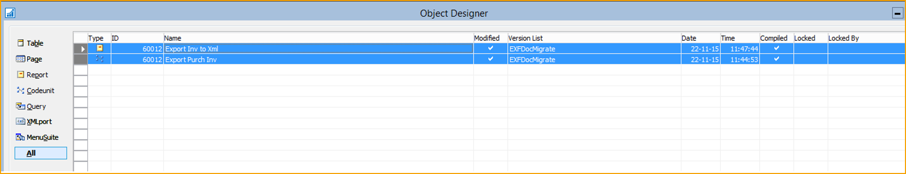 

Führen Sie den Bericht 60012 Export Inv to XML aus. 

Wählen Sie einen ''Pfad zum Exportieren'', es ist der Stammordner, in dem Bilder/PDFs gespeichert sind, und klicken Sie dann auf OK. 

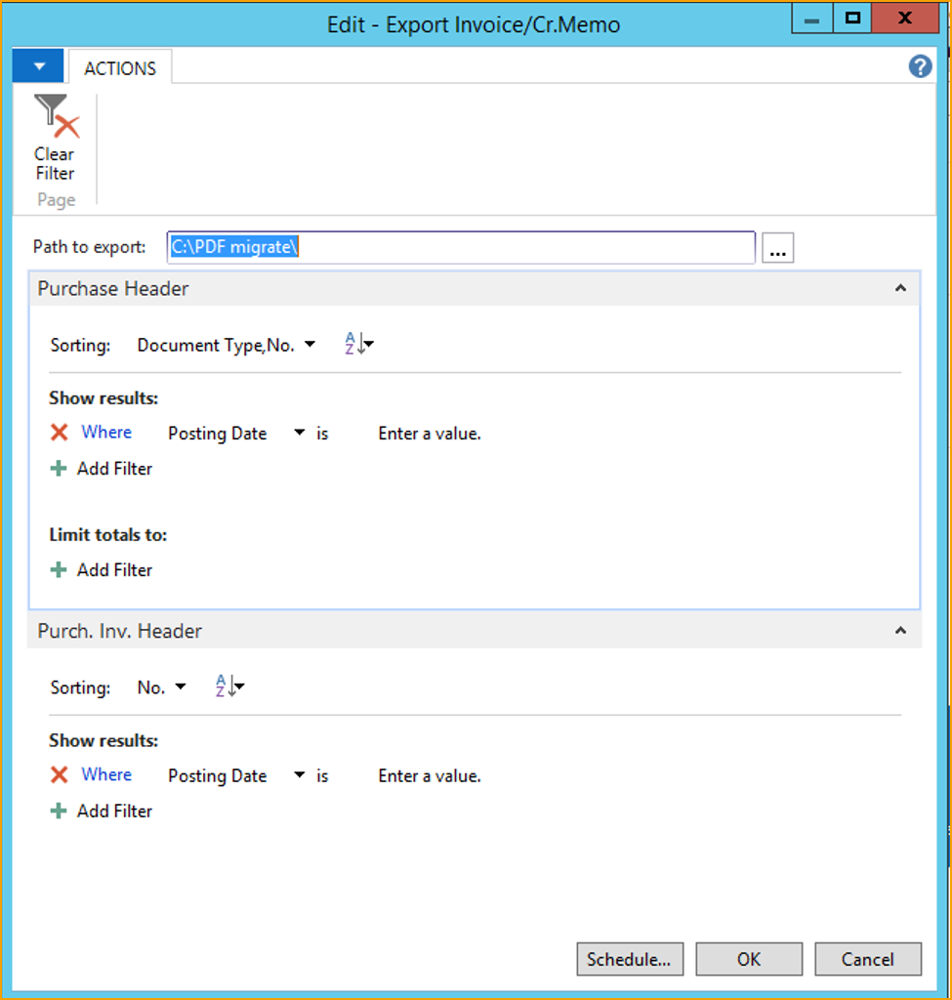 

 

Klicken Sie auf Ja, um alle Datensätze in der Datenbank zu exportieren. Es wird eine Popup-Nachricht mit der Gesamtsumme der exportierten Bilder angezeigt.

 

Erstellen Sie Ordner und Dateien:

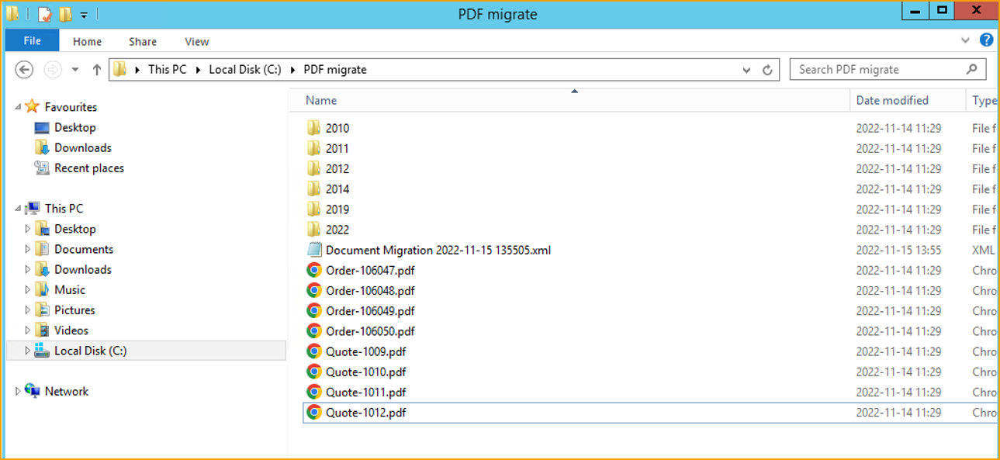 

### Erstellen von Azure File Storage
Für Unterstützung in Bezug auf das Folgende wenden Sie sich bitte an Ihre interne IT-Abteilung oder vertrauenswürdigen Business Central-Partner.  

Um eine Dateiimportkonfiguration in ExFlow Business Central erstellen zu können, muss zuerst ein Azure File Storage erstellt werden. Der Zugriffsschlüssel (unter anderem) wird benötigt.  

#### Azure Storage Account erstellen
Melden Sie sich bei [***Azure Portal***](https://portal.azure.com/) an und klicken Sie auf ''Speicherkonten'', um ein Speicherkonto zu erstellen.  

 

Klicken Sie auf ''Speicherkonto erstellen'', verwenden Sie die Standardeinstellungen und füllen Sie alle erforderlichen Einstellungen aus.  

Stellen Sie sicher, dass der öffentliche Endpunkt im Netzwerk-Tab ausgewählt ist.  

Wählen Sie "Überprüfen" und erstellen Sie das Konto. 

#### Azure File Share erstellen
Im Azure Portal fahren Sie fort, um einen Azure File Share zu erstellen.

Wählen Sie das Speicherkonto aus und gehen Sie zu "File shares" unter "Data Storage".  

Erstellen Sie einen File Share und klicken Sie dann auf den neu erstellten File Share. 

Erstellen Sie ein Verzeichnis (Unterordner) im File Share mit dem Namen "ExFlow" oder einem anderen Namen Ihrer Wahl.  

### Schritt 3

#### Starten Sie die Migration von BC14 ExFlow C/AL-Daten zu ExFlow AL-Daten mit Cloud-Migration

#### Verschieben Sie ExFlow-Daten in Upgrade-Tabellen 
Nach dem Upgrade auf ExFlow 5.41 starten Sie den Import. Führen Sie Datei -> Importieren aus und wählen Sie die Datei "Upgrade_New_BC14_XX.fob". 

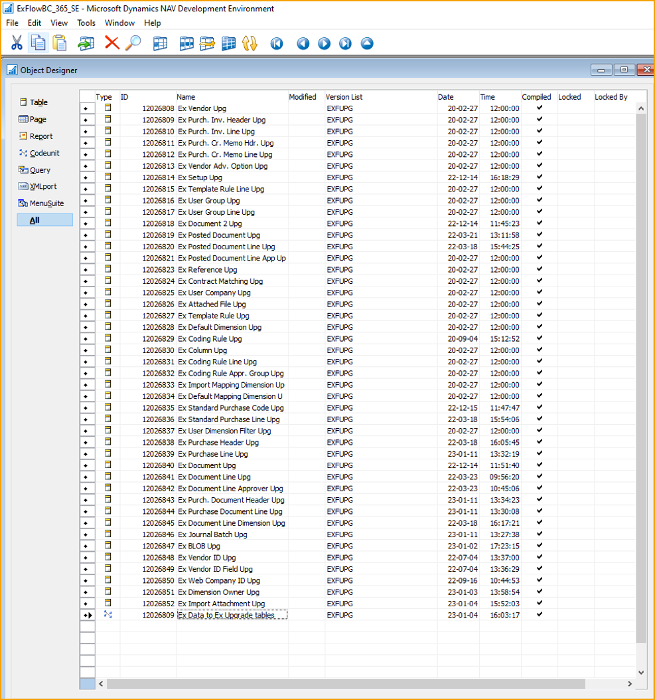 

Führen Sie Codeunit 12026809 aus, um alle ExFlow-Firmendaten in alle ExFlow-Upgrade-Tabellen zu kopieren. 

#### Starten Sie die Cloud-Migration  
Richten Sie die Cloud-Migration in der aktuellen Business Central-Version ein (folgen Sie den Anweisungen von Microsoft). 

Starten Sie die Cloud-Migrationsverwaltung und wählen Sie "Benutzerdefinierte Tabellen verwalten". 

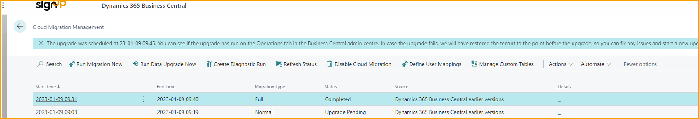 

***Wichtig!:***
Wählen Sie nur alle ExFlow-Tabellen mit ''Upg'' oder ''Up'' nach dem Namen aus, siehe untenstehendes Bild der ''Migration Table Mapping''. 

Entfernen Sie alle anderen ExFlow-Tabellen, damit keine Daten aus diesen Tabellen verschoben werden. 

 

Führen Sie die Migration aus.  

Nach Abschluss der Migration suchen Sie nach **Ex Upgrade From CAL** in Business Central:  

 

Gehen Sie von der Seite ''Ex Upgrade From CAL'' zu ''Aktionen --> ExFlow-Migration für aktuelles Unternehmen ausführen''.  

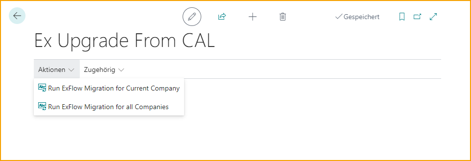 

Wenn es mehr als ein Unternehmen gibt, gehen Sie zu ''Aktionen --> ExFlow-Migration für alle Unternehmen ausführen''.

Gehen Sie zu * Verwandt-- > ExFlow-Migrationsstatusinfo*, um das Protokoll des Upgrade-Vorgangs pro Unternehmen anzuzeigen.  

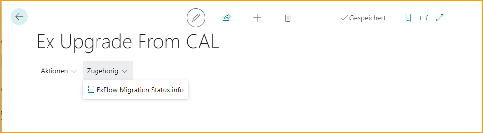 

Nach dem Upgrade befolgen Sie die Anweisungen im folgenden Abschnitt ''Nach dem Upgrade durchzuführende Aktivitäten''. 

#### Nach dem Upgrade durchzuführende Aktivitäten
Diese Aktionen erfordern möglicherweise Anwendungswissen über das ExFlow BC AL-Addon und welche Funktionen in der aktualisierten ExFlow BC-Version verwendet wurden/werden sollen.
Verwenden Sie den ExFlow-Assistenten für jedes Unternehmen, in dem ExFlow eingerichtet werden soll.   

* Im Standardunternehmen: 
1) Weisen Sie ExFlow das Standardunternehmen erneut zu. 
2) Richten Sie ExFlow-E-Mail-Benachrichtigungen ein. 

* In allen (relevanten) Unternehmen: 
1) Aktivieren Sie das Unternehmen für ExFlow Web. 
2) Richten Sie EDC-Integrations-Einstellungen ein. 
3) Importieren Sie die erforderliche Data Exchange-Definition. 

Beantragen und aktivieren Sie außerdem einen ExFlow Business Central-Lizenzschlüssel. 

### Daten in ExFlow aus Upgrade-Tabellen einfügen

#### ExFlow-Dateiimport-Einrichtungen
Gehen Sie zu: **ExFlow-Dateiimport-Einrichtungen**, um Bilder/PDF-Dokumente in Business Central zu importieren.

| Datei-Import-Einrichtungen      | 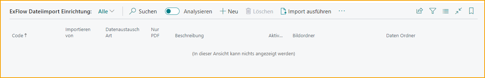    |
|:-|:-|
|**Neu:**                               | Erstellen Sie eine neue Datei-Import-Einrichtung
|**Verwalten:**                               | Bearbeiten, anzeigen oder löschen Sie die Einrichtung
|**Import ausführen:**                               | Führen Sie den Importprozess aus
|**Aktivieren/Deaktivieren:**                               | Aktivieren/Deaktivieren Sie die Importquelle
|Weitere Optionen--> Aktionen--> **Laufende Importe anzeigen**   | Zeigt eine Liste der ausstehenden Importdateien an
 

#### Importieren von Bildern/PDF-Dokumenten nach BC AL über ExFlow-Dateiimport-Setups

Gehen Sie zu **ExFlow-Dateiimport-Setups** und klicken Sie auf Neu, um ein neues Dateiimport-Setup zu erstellen.

Geben Sie unter dem Abschnitt Allgemein einen Code, eine Beschreibung ein und wählen Sie ''Importieren von: Azure File''. Wenn ''Azure File'' ausgewählt ist, werden sowohl ''Bildordner'' als auch ''Bildordner'' standardmäßig unter dem Abschnitt ''Daten (XML)'' und ''Bild (PDF)'' auf ''exflow'' festgelegt.

Fügen Sie unter dem Abschnitt ''Daten (XML)'' den ''Datenaustauschtyp'' hinzu. Unter dem Abschnitt ''Azure File'' fügen Sie Informationen zum Kontonamen, Zugriffsschlüssel, Dateifreigabe und der Basis-URL hinzu.

Aktivieren Sie das Setup.

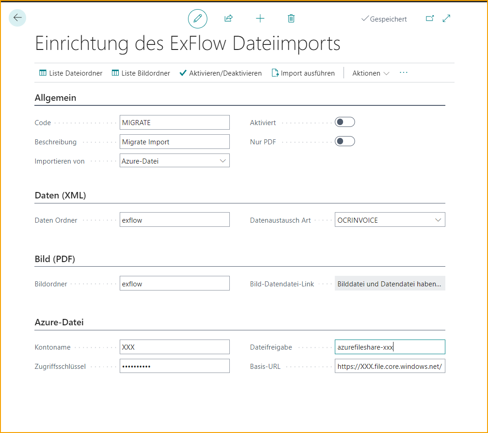 

Kopieren Sie alle Dateien und Ordner in den erstellten Azure-Dateispeicherbildordner (in diesem Beispiel ist der Ordnername ExFlow).

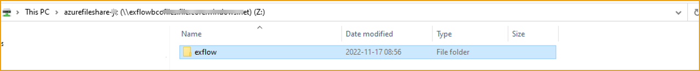 

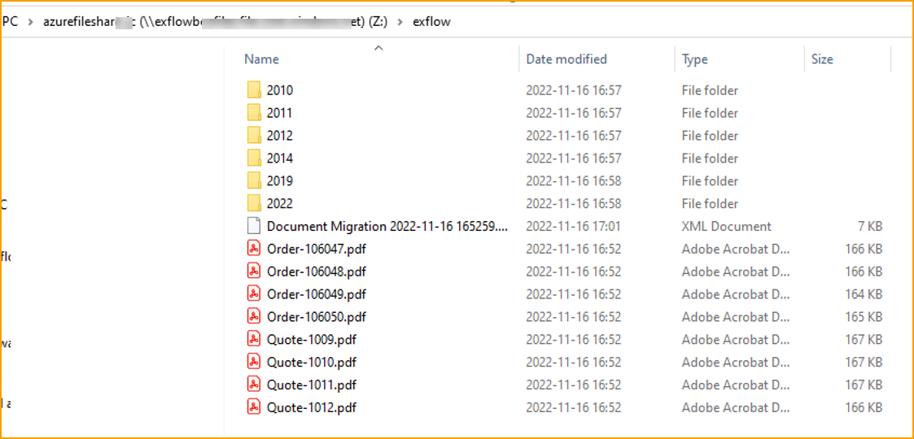 

### Dokumente über das Dokument-Migrationswerkzeug migrieren

Der nächste Schritt besteht darin, das Dokument-Migrationswerkzeug zu nutzen.

Gehen Sie zu: **ExFlow Setup-Seite --> Aktion --> Funktionen --> Dokumente migrieren**

| Dokument-Migrationswerkzeug     | 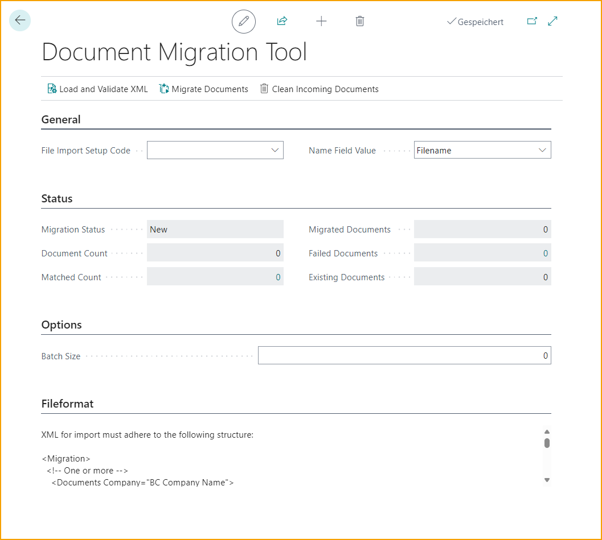   |
|:-|:-|
|**XML laden und validieren**                               | Erstellen Sie eine neue Datei-Import-Konfiguration
|**Dokumente migrieren**                               | Dokumente lesen, importieren und migrieren
|**Eingehende Dokumente bereinigen:**                               | Alle migrierten Dokumente löschen, wenn ein erneuter Import erforderlich ist
 

| Allgemein  |  |
|:-|:-|
|**Code der Datei-Import-Konfiguration:**                               | Geben Sie den Code der Datei-Import-Konfiguration ein
|**Wert des Namensfelds**                               | Geben Sie das zu verwendende Namensformat an. Folgende Optionen stehen zur Verfügung:  
 

| Status  |  |
|:-|:-|
|**Migrationsstatus:**                               | Status der Migration
|**Anzahl der Dokumente**                               | Anzahl der zu migrierenden Dokumente mit übereinstimmendem Firmennamen
|**Anzahl der Übereinstimmungen**                               | Anzahl der Dokumente, die im aktuellen Unternehmen übereinstimmen. Klicken Sie hier, um eine Liste der nicht übereinstimmenden Dokumente anzuzeigen
|**Migrierte Dokumente**                               | Anzahl der in den übereinstimmenden Firmennamen migrierten Dokumente
|**Fehlgeschlagene Dokumente**                               | Dokumente, die nicht migriert werden konnten. Klicken Sie hier, um eine Liste und den Grund anzuzeigen
|**Vorhandene Dokumente**                               | Anzahl der bereits migrierten Dokumente
 

| Optionen  |  |
|:-|:-|
|**Batchgröße:**                               | Legen Sie einen Wert ungleich Null fest, um höchstens so viele Dokumente auf einmal zu importieren
 

| Dateiformat  |  |
|:-|:-|
|**Dateiformat**                               | Zeigt die erforderliche Import-XML-Struktur
 

Um mit dem Migrationsbeispiel fortzufahren, klicken Sie auf **XML laden und validieren**, um eine Datei auszuwählen.

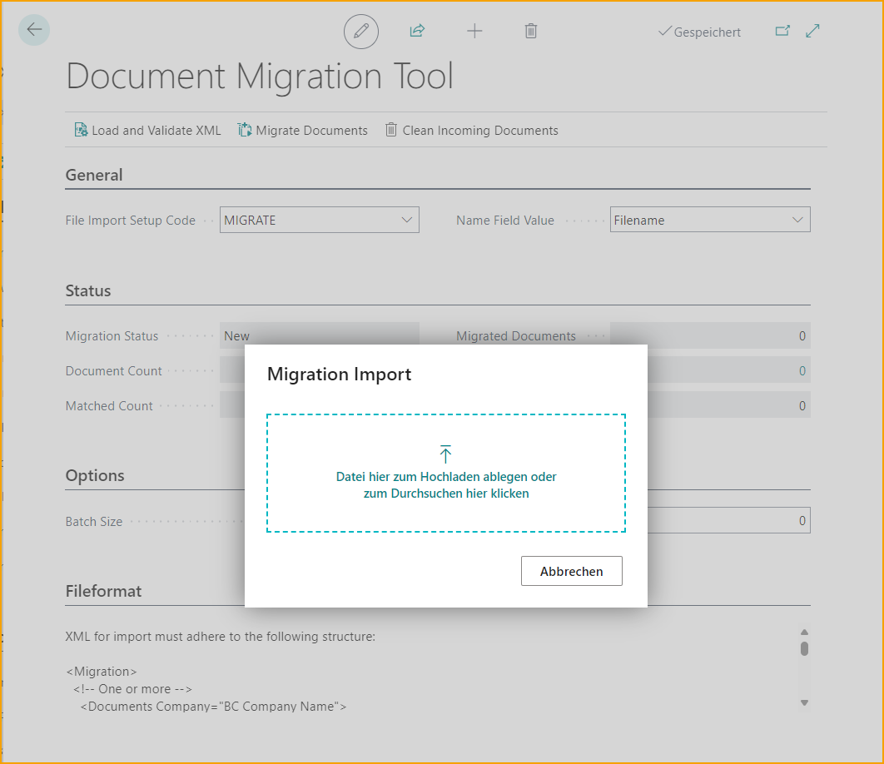

Wählen Sie die Datei ''Document Migration XML document*.xml'' im azurefileshare-Bildordner ''exflow'' aus.  

 

Dann wird der Migrationsstatus auf ''Validiert'' gesetzt. 

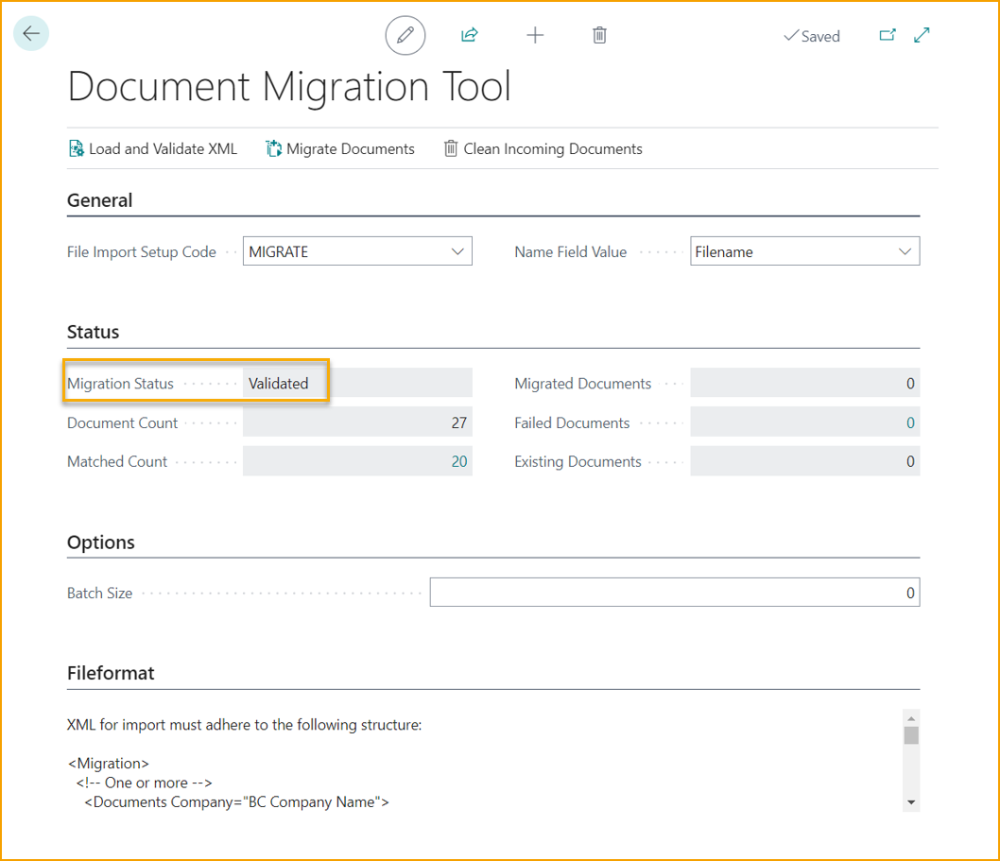 

Wählen Sie den Tab ''Dokument migrieren'' und warten Sie, bis der Migrationsstatus auf ''Migriert'' gesetzt ist. 

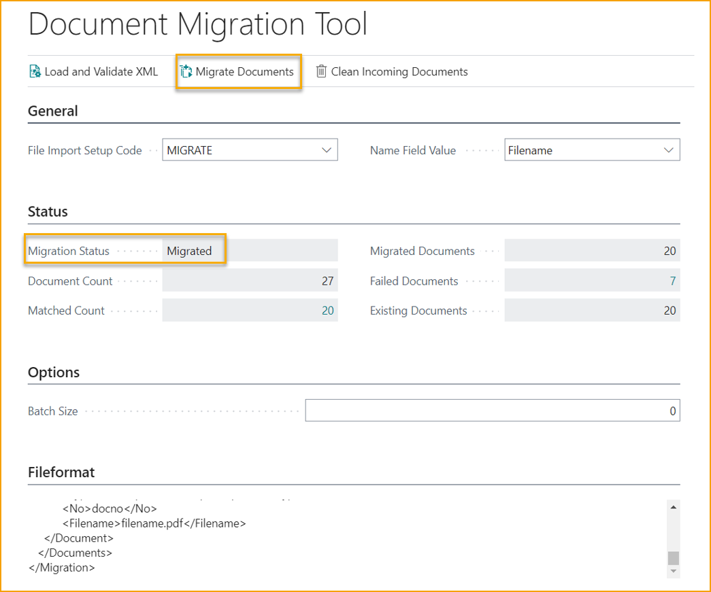 

Migration abgeschlossen.  

Überprüfen Sie, ob alle PDF-Bilder den Einkaufsdokumenten angehängt sind.
