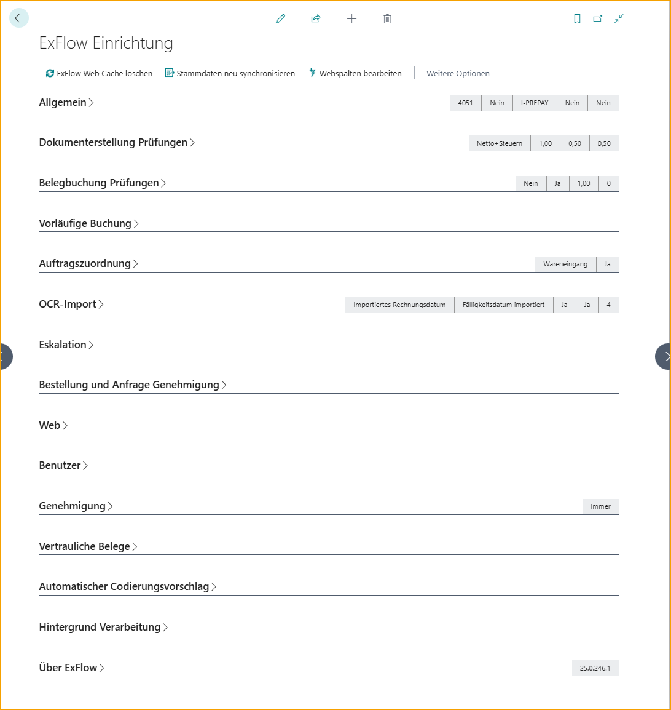
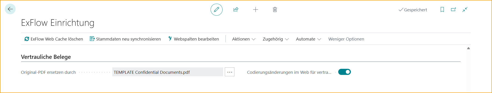

## ExFlow Einrichtung

Die ExFlow Einrichtung ist in verschiedene Abschnitte unterteilt, um den Prozess der Erstellung des optimalen Workflows für die Anforderungen Ihres Unternehmens zu vereinfachen. 

Gehe zu: **ExFlow Einrichtung**

 

| ExFlow Einrichtung| |
|:-|:-|
|**ExFlow Web Cache leeren:**	|Verwenden Sie diese Funktion, um den ExFlow Web Cache zu leeren
|**Stammdaten neu synchronisieren**	|Synchronisieren Sie Stammdaten und Lieferantenbankkonten mit dem ExFlow Data Capture/OCR Service
|**Web-Spalten bearbeiten**	|Ändern Sie die aktuellen ExFlow Web-Spalten.    Lesen Sie mehr darüber im Abschnitt [ExFlow Web](https://docs.exflow.cloud/business-central/docs/user-manual/technical/exflow-web#exflow-web)  

 

Gehe zu: **ExFlow Einrichtung --> Aktionen --> Funktionen**  

 

| Aktionen --> Funktionen | |
|:-|:-|
|**Standard ExFlow Sicherheitsrollen anwenden/aktualisieren** 	|Erstellt Standard-Webbenutzerberechtigungen, wenn keine vorhanden sind oder geändert wurden.    Lesen Sie mehr darüber im Abschnitt [***Webbenutzerberechtigungen***](https://docs.exflow.cloud/business-central/docs/user-manual/business-functionality/web-user-level-permissions)
|**Einrichtung kopieren**	|Kopieren Sie die Einrichtung von einem anderen Unternehmen innerhalb desselben Mandanten, indem Sie Tabellen auswählen (z.B. Genehmigungsregeln), die von einem bereits konfigurierten ExFlow-Unternehmen kopiert werden sollen.    Lesen Sie mehr darüber im Abschnitt [***Einrichtung von einem anderen Unternehmen kopieren***](https://docs.exflow.cloud/business-central/docs/user-manual/welcome-to-exflow/get-started#copy-setup-from-another-company)
|**Blob Storage Verwaltung**	|Öffnet die ExFlow Storage Management Einrichtung.    Lesen Sie mehr darüber im Abschnitt [***Generische Blob Storage***](https://docs.exflow.cloud/business-central/docs/user-manual/technical/generic-blob-storage#generic-blob-storage) und [***OAuth 2.0 Anwendungen und Storage Einrichtung***](https://docs.exflow.cloud/business-central/docs/user-manual/technical/oauth-storage-setup#oauth-20-applications-and-storage-setup)
|**Power BI**	|**Power BI Web Services erstellen**: Erstellt Web Services für Power BI  **Power BI Web Services löschen:** Löscht alle Web Services für Power BI  **BC DataSource abrufen:** Diese Funktion erstellt eine URL-Zeichenfolge (DataSource) für den BC-Client. Verwenden Sie diesen Link und fügen Sie ihn in Power BI ein, wenn Sie die Vorlage ausführen  **Power BI Vorlage abrufen:** Öffnet eine Website zum Herunterladen der Vorlage  Lesen Sie mehr darüber im Abschnitt [***Power BI***](https://docs.exflow.cloud/business-central/docs/user-manual/business-intelligence-and-reporting/power-bi#power-bi)
|**Einrichtungen exportieren/importieren**	|Exportieren und Importieren der ExFlow Einrichtung (.json Datei) zwischen Umgebungen.    Lesen Sie mehr darüber im Abschnitt [***ExFlow Daten exportieren/importieren***](https://docs.exflow.cloud/business-central/docs/user-manual/business-functionality/export-import-setup#exportimport-exflow-data)
|**ExFlow Daten von CAL aktualisieren**	|Führen Sie eine ExFlow-Migration für ein aktuelles Unternehmen oder alle Unternehmen durch.    Lesen Sie mehr darüber im Abschnitt [***ExFlow Daten aktualisieren und migrieren***](https://docs.exflow.cloud/business-central/docs/user-manual/technical/upgrade-exflow-data-from-cal#upgrade-and-migrate-exflow-data)
|**Dokumente migrieren**	|Öffnet das Dokumentenmigrationstool.    Lesen Sie mehr darüber im Abschnitt [***ExFlow Daten aktualisieren und migrieren***](https://docs.exflow.cloud/business-central/docs/user-manual/technical/upgrade-exflow-data-from-cal#upgrade-and-migrate-exflow-data)
|**OAuth2 Anwendungen**	|Öffnet die OAuth 2.0 Anwendungen Seite.    Lesen Sie mehr darüber im Abschnitt [***OAuth 2.0 Anwendungen und Storage Einrichtung***](https://docs.exflow.cloud/business-central/docs/user-manual/technical/oauth-storage-setup#oauth-20-applications-and-storage-setup)
|**OCR**	|**Lieferanten-ID für alle Lieferanten aktualisieren:**  Synchronisiert alle Lieferanten-IDs.  **Erweiterte Zuordnung**:  Öffnet ExFlow Erweiterte Zuordnungen.   **Importdaten-Austauschdefinitionen importieren:** Zeigt alle Importdaten-Austauschdefinitionscodes und deren Blob-Namen usw. an.  **Andere --> Stammdaten neu synchronisieren:** Synchronisieren Sie Stammdaten und Lieferantenbankkonten mit dem ExFlow Data Capture/OCR Service
|**Web**	|**Web verwendete Lieferantennamen aktualisieren**:  Aktualisiert Lieferantennamen im Web  **Unternehmen für ExFlow Web aktivieren**:  Aktivieren Sie das aktuelle Unternehmen für ExFlow Web  **Unternehmen für ExFlow Web deaktivieren.**: Deaktivieren Sie das aktuelle Unternehmen für ExFlow Web  **Als Standard ExFlow Web Unternehmen festlegen**: Legen Sie das aktuelle Unternehmen als Standard für ExFlow Web fest  **Azure Active Directory Anwendung erstellen**: Erstellen Sie eine Microsoft Entra Anwendung   **Standard-Webdienste erstellen/aktualisieren**: Erstellen oder aktualisieren Sie den aktuellen Webdienst EXFID und EXFWeb   **Andere --> Web-Spalten bearbeiten**: Ändern Sie die aktuellen ExFlow Web-Spalten  **Andere --> ExFlow Web Cache leeren**: Leeren Sie den ExFlow Web Cache    Lesen Sie mehr darüber im Abschnitt [ExFlow Web](https://docs.exflow.cloud/business-central/docs/user-manual/technical/exflow-web#exflow-web)  

 

Gehe zu: **ExFlow Einrichtung --> Verwandt --> Erweitert**

 

| Verwandt --> Erweitert | |
|:-|:-|	
|**Spalten**	|Öffnet ExFlow Spalten, um alle sichtbaren Spalten im ExFlow Web anzuzeigen    Lesen Sie mehr darüber im Abschnitt [***Web-Spalten in Business Central bearbeiten***](https://docs.exflow.cloud/business-central/docs/user-manual/technical/exflow-web#edit-web-columns-in-business-central)
|**ExFlow Lieferanteneinrichtung**	|Öffnet die Lieferanteneinrichtung, um lieferantenspezifische Einstellungen festzulegen    Lesen Sie mehr darüber im Abschnitt [***Lieferanteneinrichtung***](https://docs.exflow.cloud/business-central/docs/user-manual/business-functionality/vendor-setup#vendor-setup)
|**Lieferanten-ID Einrichtung**	|Zeigt Lieferanten-ID-Felder und die ExFlow Data Capture Exportreihenfolge an
|**FactBox Standardgrößen**	|Bearbeiten/Wiederherstellen der FactBox-Größen für verschiedene ExFlow-Seiten    Lesen Sie mehr darüber im Abschnitt [***FactBox Standardgröße festlegen***](https://docs.exflow.cloud/business-central/docs/user-manual/business-functionality/set-factbox-default-size#set-factbox-default-size)
|**Zahlungsvalidierung Einrichtung**	|Geben Sie Felder ein, die während des Import- und Dateninterpretationsprozesses in der Zahlungsvalidierung überprüft werden sollen.    Lesen Sie mehr darüber im Abschnitt [***Zahlungsvalidierung Einrichtung***](https://docs.exflow.cloud/business-central/docs/user-manual/business-functionality/payment-validation-and-payment-suggestion#payment-validation-setup)
|**Vorläufige Buchung Einrichtung**	|Öffnet die Vorläufige Buchung Einrichtung.   Hinweis: Diese Einstellung muss im Abschnitt „Vorläufige Buchung“ aktiviert sein, um angezeigt zu werden.   Lesen Sie mehr darüber im Abschnitt [***Vorläufige Buchung***](https://docs.exflow.cloud/business-central/docs/user-manual/business-functionality/preliminary-posting#preliminary-posting)
|**PO-Header-Werte auf Rechnung Einrichtung**	|Öffnet die PO-Header-Werte auf Rechnung Einrichtung Seite. Hinweis: Diese Einstellung muss im Abschnitt „PO-Abgleich“ aktiviert sein, um angezeigt zu werden.    Lesen Sie mehr darüber im Abschnitt [***Kopieren von Bestellkopfwerten***](https://docs.exflow.cloud/business-central/docs/user-manual/business-functionality/copy-po-header#copy-purchase-order-header-values)
|**Automatische Empfangszeilenart Einrichtung**	|Zeigen oder bearbeiten Sie Zeilenarten, die automatisch empfangen werden sollen.   Lesen Sie mehr darüber im Abschnitt [***Rechnung mit Empfangs-, Bestell- oder sowohl Empfangs- als auch Bestellzeilen abgleichen***](https://docs.exflow.cloud/business-central/docs/user-manual/approval-workflow/purchase-order-matching-process#match-invoice-with-receipt--order--or-both-receipt-and-order-lines)
|**Re-Invoicing Einrichtung**| Öffnet die Einrichtung für Re-Invoicing.    Lesen Sie mehr darüber im Abschnitt [***Re-Invoicing***](https://docs.exflow.cloud/business-central/docs/user-manual/business-functionality/re-invoicing#re-invoicing)
|**Artikel-Nr. Abgleichspriorität**| Diese Funktion bietet die Möglichkeit, eine Prioritätenliste im Artikel-Nr.-Abgleichsprozess nach Abgleichstyp wie OCR-Zuordnung oder Artikelreferenz usw. einzurichten.     Lesen Sie mehr darüber im Abschnitt [***Artikel-Nr. Abgleichspriorität***](https://docs.exflow.cloud/business-central/docs/user-manual/approval-workflow/purchase-order-matching-process#item-no-matching-priority)
|**Einrichtung zur Umgehung der Änderungsüberprüfung**| Öffnet das Einstellungsfenster zur Umgehung der Änderungsüberprüfung.    Lesen Sie mehr darüber im Abschnitt [***Änderungsüberprüfung umgehen***](https://docs.exflow.cloud/business-central/docs/user-manual/business-functionality/bypass-verify-changes)

 

### ExFlow Einrichtungsabschnitte

Finden Sie alle ExFlow Einrichtungsabschnitte wie unten beschrieben. 

  

### Allgemein

  

|Allgemein||
|:-|:-|	
|**Vordefiniertes Konto**	|Gibt das Standard-G/L-Konto an, das von ExFlow verwendet wird, wenn eine Standardrechnungszeile auf neu importierten (Aufwands-)Rechnungen erstellt wird. Kann pro Lieferant überschrieben werden
|**Vorschlag für USt.-Zeile**	|Gibt an, ob eine separate USt.-Zeile automatisch erstellt werden soll (beim Import von Rechnungen) oder ob die Standard-USt.-Handhabung von Business Central verwendet werden soll. Stellen Sie sicher, dass die Felder USt.-Produktbuchungsgruppe 0% und USt.-Produktbuchungsgruppe 100% ausgefüllt sind.     Lesen Sie mehr über diese Funktion unter [***Vorschlag für USt.-Zeilen***](https://docs.exflow.cloud/business-central/docs/user-manual/business-functionality/propose-vat-lines)
|**Automatische Eingangsregistrierung (SweBase)**	|Gibt an, ob die Eingangsregistrierung aus Einkaufszeilen (Vorschlag aus Zeilenfunktion in SweBase) generiert und gebucht werden soll
|**Standard-Produktbuchungsgruppe**	|Gibt die Standard-Produktbuchungsgruppe an, die von ExFlow verwendet werden soll, wenn die Produktbuchungsgruppe auf der Belegzeile fehlt, wenn die Zeile im Importjournal erstellt wird
|**Standard-USt.-Produktbuchungsgruppe** 	|Gibt die Standard-Produktbuchungsgruppe an, die von ExFlow verwendet werden soll, wenn die Produktbuchungsgruppe auf der Belegzeile fehlt, wenn die Zeile im Importjournal erstellt wird
|**Belegdatum auf**	|Gibt an, ob das Belegdatum auf der importierten Rechnung auf das Buchungsdatum gesetzt werden soll, wenn das Buchungsdatum geändert wird
|**Buchungsbeschreibung auf**	|Gibt an, welche Buchungsbeschreibung BC beim Buchen der Rechnung verwendet. Gilt nur für Buchungen, die das Kreditoren-G/L-Konto verwenden
|**ExFlow Einkaufs-Code**	|Gibt den Standard-ExFlow-Einkaufs-Code an, der verwendet werden soll, wenn eine Standardrechnungszeile auf neu importierten (Aufwands-)Rechnungen erstellt wird. Kann pro Lieferant überschrieben werden.    Lesen Sie mehr darüber im Abschnitt [***Einkaufscodes***](https://docs.exflow.cloud/business-central/docs/user-manual/business-functionality/purchase-codes#purchase-codes)
|**Min. Zeilengenehmigungsbetrag (LCY)** 	|Gibt den Mindestgenehmigungsbetrag für eine Rechnungszeile an, d.h. Zeilen mit einem kleineren Betrag werden nicht zur Genehmigung durch ExFlow gesendet. Null bedeutet, dass alle Rechnungszeilen zur Genehmigung gesendet werden
|**Min. Dokumentgenehmigungsbetrag (LCY)** 	|Gibt den Mindestgenehmigungsbetrag für eine Rechnung an, d.h. Rechnungen mit einem Gesamtbetrag, der niedriger ist als dieser Betrag, werden nicht zur Genehmigung durch ExFlow gesendet. Null bedeutet, dass alle Rechnungen zur Genehmigung gesendet werden
|**USt.-Produktbuchungsgruppe 0%**	|Gibt die USt.-Produktbuchungsgruppe für "Keine USt." an, wenn die Einstellung "Vorschlag für USt.-Zeile" ausgewählt ist
|**USt.-Produktbuchungsgruppe 100%** 	|Gibt die USt.-Produktbuchungsgruppe für "Nur USt." an, wenn die Einstellung "Vorschlag für USt.-Zeile" ausgewählt ist
|**Betragsänderung genehmigter Zeile blockieren** 	|Gibt an, ob Betragsänderungen in genehmigten Rechnungszeilen blockiert werden sollen.
|**Ersten Genehmiger in den Genehmigungsfluss kopieren** 	|Gibt an, ob der "Erste Genehmiger-Filter" aus der Genehmigungsregel für eine bestimmte Rechnungszeile auch (als erster Genehmiger) zum Genehmigungsvorschlag hinzugefügt werden soll
|**Standard-Projektaufgaben-Nr.** 	|Die Standard-Projektaufgaben-Nr. wird auf Zeilen mit Projekt-Nr. hinzugefügt, wenn keine Projektaufgabe ausgewählt ist.
|**Änderungen genehmigter Dokumente zulassen**	|Gibt an, ob ein ExFlow-Administrator berechtigt ist, einen Einkaufsbelegkopf und/oder Zeilen mit dem Status Genehmigt zu ändern.
|**Genehmigung erforderlich**	|Wenn dies aktiviert ist, muss der Benutzer das ExFlow-Genehmigungsflag auf der Rechnung/Gutschrift markieren, bevor sie gebucht werden kann. (Wenn es sich um eine Bestellung/Angebot handelt, bevor sie freigegeben werden kann.)     Lesen Sie mehr darüber im Abschnitt [***Genehmigung erforderlich***](https://docs.exflow.cloud/business-central/docs/user-manual/business-functionality/require-approval)
|**Vorauszahlungsrechnungs-Nr.**	|Fügen Sie eine Vorauszahlungsrechnungs-Nr.-Serie hinzu. Sollte nicht dieselbe sein wie die gebuchten Rechnungs-Nr. in der Einkaufs- und Zahlungseinrichtung, da dies eine Lücke verursacht und eine leere gebuchte Rechnung erstellt, um diese Lücke in der Nummernserie zu füllen.    Lesen Sie mehr darüber im Abschnitt [***Vorauszahlungsrechnungen***](https://docs.exflow.cloud/business-central/docs/user-manual/business-functionality/prepayment-invoices#prepayment-invoices)
|**Zahlungsvalidierung** 	|Gibt an, ob der Zahlungsvalidierungsprozess während des Import- und Dateninterpretationsprozesses angewendet wird.    Lesen Sie mehr darüber im Abschnitt [***Zahlungsvalidierung Einrichtung***](https://docs.exflow.cloud/business-central/docs/user-manual/business-functionality/payment-validation-and-payment-suggestion#payment-validation-setup)
|**Empfängerbankkonto vorschlagen** 	|Gibt an, ob der Vorschlag des Empfängerbankkontos aktiviert ist.    Lesen Sie mehr darüber im Abschnitt [***Empfängerbankkonto vorschlagen***](https://docs.exflow.cloud/business-central/docs/user-manual/business-functionality/payment-validation-and-payment-suggestion#suggest-recipient-bank-account)
|**Abgrenzung vorwärts verschieben** 	|Wenn das Buchungsdatum im Abgrenzungsplan vor dem zulässigen Buchungsdatum für den Benutzer liegt, wird dieser Zeitraum am ersten zulässigen Buchungsdatum in der Einrichtung des Hauptbuchs oder der Benutzereinrichtung gebucht. ExFlow verschiebt Abgrenzungen nur für geschlossene Perioden vorwärts.    Lesen Sie mehr darüber im Abschnitt [***Abgrenzung vorwärts verschieben***](https://docs.exflow.cloud/business-central/docs/user-manual/approval-workflow/exflow-import-journals#move-deferral-forward)

 

### Dokumentenerstellungsprüfungen

|Dokumentenerstellungsprüfungen||
|:-|:-|	
|**Dimensionen überprüfen**	|Gibt an, ob die Standarddimensionseinstellungen in Business Central überprüft werden sollen, wenn die Rechnung erstellt wird.
|**Mindestanzahl von Genehmigern überprüfen** 	|Gibt an, ob die Mindestanzahl von Genehmigern beim Erstellen eines Einkaufsdokuments überprüft werden soll.   Lesen Sie mehr darüber im Abschnitt [***Mindestanzahl von Genehmigern überprüfen***](https://docs.exflow.cloud/business-central/docs/user-manual/business-functionality/minimum_no_of_approvers#setup-minimum-no-of-approvers)
|**Beträge testen** 	|Gibt an, ob die Brutto-/Netto-/MwSt.-Beträge auf dem Dokument auf Abweichungen (Differenz zwischen Summe der Dokumentzeilen und dem entsprechenden Betrag im Dokumentenkopf) überprüft werden sollen, bevor die Rechnung erstellt wird.
|**Maximale Bruttoabweichung erlaubt (LCY)** 	|Gibt die maximal zulässige Bruttobetragsabweichung (in LCY) an, wenn "Beträge testen" aktiv ist.
|**Maximale Nettoabweichung erlaubt (LCY)** 	|Gibt die maximal zulässige Nettobetragsabweichung (in LCY) an, wenn "Beträge testen" aktiv ist.
|**Maximale MwSt.-Abweichung erlaubt (LCY)** 	|Gibt die maximal zulässige MwSt.-Betragsabweichung (in LCY) an, wenn "Beträge testen" aktiv ist.
|**Währungskennzeichen des Lieferanten abgleichen**	|Gibt an, ob der Währungscode auf dem importierten Dokument mit dem Währungscode auf der Lieferantenkarte übereinstimmen muss.    Lesen Sie mehr darüber im Abschnitt [***Währungskennzeichen des Lieferanten abgleichen***](https://docs.exflow.cloud/business-central/docs/user-manual/approval-workflow/exflow-import-journals#match-vendors-currency)
|**Fälligkeitsdatum-Warnung bei älter als X Tagen** 	|Gibt die maximale Anzahl von Tagen an, die das Fälligkeitsdatum des Dokuments vom heutigen Datum abweichen darf. 0 = deaktiviert diese Überprüfung.
|**Warnung bei Abweichung der MwSt. von der Einrichtung** 	|Gibt an, ob der berechnete MwSt.-Prozentsatz auf dem Dokument als Einstellung in der MwSt.-Buchungseinrichtung vorhanden sein muss.
|**Rechnungsskontobetrag bei Dokumentenprüfung neu berechnen** 	|Gibt an, ob der Rechnungsskontobetrag bei der Dokumentenprüfung auf den Zeilen neu berechnet werden soll.
|**Referenzen überprüfen** 	|Wenn aktiviert, muss das Dokument eine ExFlow-Referenz enthalten.
|**Automatische Zuweisung der MwSt.-Abweichung bei Erstellung** 	|Gibt an, ob die automatische Zuweisung der MwSt.-Abweichung erfolgen soll, wenn die Abweichung der MwSt. auf den Zeilen und im Kopf innerhalb der maximal zulässigen MwSt.-Abweichung liegt.

 

### Dokumentenbuchungsprüfungen

|Dokumentenbuchungsprüfungen||
|:-|:-|	
|**Vordefiniertes Konto nicht buchen**	|Gibt an, ob die endgültige Buchung auf das angegebene vordefinierte Sachkonto (falls vorhanden) erlaubt sein soll.
|**Bruttobetrag überprüfen** 	|Gibt an, ob die Einstellung "Max. Bruttoabweichung" verwendet werden soll.
|**Maximale Abweichung für Bruttobetrag (LCY)** 	|Gibt die maximal zulässige Bruttobetragsabweichung beim Buchen einer Rechnung an.
|**Mindestanzahl von Genehmigern** 	|Gibt die Mindestanzahl von Genehmigern auf einer Rechnungszeile an. Wenn die tatsächliche Anzahl der Genehmiger geringer ist, ist das Buchen der Rechnung nicht erlaubt. 0 = deaktiviert.    Lesen Sie mehr darüber im Abschnitt [***Mindestanzahl von Genehmigern***](https://docs.exflow.cloud/business-central/docs/user-manual/business-functionality/minimum_no_of_approvers#minimum-no-of-approvers)
|**Sachkontenzeilen mit Zeilenbetrag = Null löschen** 	|Gibt an, ob die Sachkontenzeilen mit Zeilenbetrag = Null während der Aktualisierung des Dokuments in der Überprüfung der Änderungen vom Genehmigungsstatus gelöscht werden sollen.    Lesen Sie mehr darüber im Abschnitt [***Sachkontenzeilen mit Zeilenbetrag = Null löschen***](https://docs.exflow.cloud/business-central/docs/user-manual/approval-workflow/exflow-import-journals#delete-gl-account-lines-with-line-amount--zero)
|**Automatische Zuweisung der MwSt.-Abweichung für Buchung** 	|Gibt an, ob die automatische Zuweisung der MwSt.-Abweichung erfolgen soll, wenn die Abweichung der MwSt. auf den Zeilen und im Kopf innerhalb der maximal zulässigen MwSt.-Abweichung liegt.
|**Änderungsüberprüfung umgehen**| Gibt an, ob die Überprüfung der Änderungen vom Genehmigungsstatus nach der Genehmigung des Dokuments umgangen werden soll. Öffnet das Einstellungsfenster zum Umgehen der Änderungsüberprüfung.    Lesen Sie mehr darüber im Abschnitt [***Änderungsüberprüfung umgehen***](https://docs.exflow.cloud/business-central/docs/user-manual/business-functionality/bypass-verify-changes)

 

### Vorläufige Buchung

|Vorläufige Buchung||
|:-|:-|	
|**Vorläufige Buchung**| 	Aktivieren Sie die vorläufige Buchung beim Erstellen eines Dokuments aus dem Importjournal. Nach der Genehmigung und Buchung wird diese Buchung am selben Buchungsdatum wie die endgültige Buchung storniert.
|**Quellcode**|  	Gibt den Quellcode an, der für vorläufige Buchungszeilen verwendet wird.
|**Allgemeines Journalvorlage**|  	Die ausgewählte allgemeine Journalvorlage wird verwendet, wenn das vorläufige Dokument gebucht wird.
|**Allgemeines Journalbatch**|  	Der ausgewählte allgemeine Journalbatch wird zusammen mit der allgemeinen Journalvorlage verwendet, wenn das vorläufige Dokument gebucht wird.
|**In Bearbeitung**|  	Wird bei vorläufigen Buchungen im Kreditorenposten hinzugefügt. Gibt an, dass der zugehörige Eintrag eine unbezahlte Rechnung darstellt, für die entweder ein Zahlungsvorschlag, eine Mahnung oder eine Zinsrechnung existiert.
|**Rechnungsrundung**|  	Überprüfen Sie, ob der Bruttobetrag abhängig von der maximalen Bruttoabweichung mit dem Zeilenbetrag übereinstimmt, und fügen Sie eine gerundete Zeile beim Buchen einer Rechnung hinzu.
|**Buchungsbeschreibung**|  	Gibt die Buchungsbeschreibung für alle vorläufigen Buchungszeilen im Sachkonto an.
|**Beschreibung der Stornobuchung**|  	Gibt die Buchungsbeschreibung für alle stornierten vorläufigen Buchungszeilen im Sachkonto an.    Lesen Sie mehr darüber im Abschnitt [***Vorläufige Buchung***](https://docs.exflow.cloud/business-central/docs/user-manual/business-functionality/preliminary-posting#preliminary-posting)
| **MwSt.-Produktbuchungsgruppe 0%:**   | Fügen Sie die MwSt.-Produktbuchungsgruppe mit 0% zur vorläufigen Buchung ohne MwSt. hinzu, anstatt die MwSt.-Produktbuchungsgruppe zur Dokumentzeile hinzuzufügen. Diese Buchung wird storniert und die MwSt.-Buchung wird nur bei der endgültigen Buchung mit der zur Rechnung hinzugefügten MwSt.-Produktbuchungsgruppe gebucht.

 

### PO-Abgleich

|PO-Abgleich||
|:-|:-|	
|**Dokumente abgleichen mit**|  	Gibt an, ob ExFlow Zeilen aus Bestellungen oder aus gebuchten Wareneingängen oder aus beiden Bestellungen und Wareneingängen abgleichen und abrufen soll.    Lesen Sie mehr darüber im Abschnitt [***Rechnung mit Wareneingangs-, Bestell- oder sowohl Wareneingangs- als auch Bestellzeilen abgleichen***](https://docs.exflow.cloud/business-central/docs/user-manual/approval-workflow/purchase-order-matching-process#match-invoice-with-receipt--order--or-both-receipt-and-order-lines)
|**Bestellzeilen automatisch empfangen**|  	Gibt an, ob Bestellzeilen jedes Zeilentyps automatisch empfangen werden sollen, wenn die abgeglichene Rechnung auf "Bereit zur Buchung" gesetzt wird. Diese Option ist nur anwendbar, wenn die Einstellung "Dokumente abgleichen mit" als "Bestellung" oder "Bestellung und Wareneingang" konfiguriert ist.   Beim Ausführen von Änderungen im Genehmigungsstatus überprüfen, wird der Wareneingang der abgeglichenen Bestellzeilen am Rechnungsdokumentdatum gebucht.   Das Mehrwertsteuerdatum im Bestellkopf und die Abgrenzungsbuchungsdaten in den Bestellzeilen werden automatisch aktualisiert, wenn das Bestelldatum vom Rechnungsbuchungsdatum abweicht.   Wenn sowohl die Bestellung als auch die Rechnung dasselbe Buchungsdatum haben, wenn Änderungen überprüft werden, gibt es keine Aktualisierungen an der Bestellung.  Das Buchungsdatum der Bestellung wird ebenfalls aktualisiert, wenn es leer ist. (Einkaufs- und Verbindlichkeitssetup - Standardbuchungsdatum = Kein Datum)
|**Zeilen automatisch abrufen**|  	Automatisch alle verfügbaren Zeilen aus der Bestellung oder dem gebuchten Wareneingang abrufen, wenn auf Kopfebene abgeglichen wird.
|**Rechnungen automatisch genehmigen**|  	Gibt an, ob die Rechnung automatisch genehmigt werden soll, wenn die zugehörige Bestellung genehmigt ist.    Lesen Sie mehr darüber im Abschnitt [***Rechnungen automatisch genehmigen***](https://docs.exflow.cloud/business-central/docs/user-manual/approval-workflow/purchase-order-matching-process#auto-approve-purchase-order-matching-invoices)
|**Benutzer für automatische Genehmigung**|  	Gibt den ExFlow-Benutzer an, der für automatisch genehmigte Rechnungen verwendet werden soll. Wenn diese Einstellung leer ist, wird die ID des angemeldeten BC-Benutzers verwendet.
|**Max. Rechnungsbetrag für Systemgenehmigung (LCY)**|  	Gibt den maximal zulässigen Rechnungsbetrag für automatische Genehmigungen an. 0 = deaktiviert.
|**Direkte Stückkosten überprüfen**|	Gibt an, dass ExFlow die Stückkosten in der Rechnungszeile überprüfen soll, wenn Rechnungen mit Bestellungen abgeglichen werden. Die importierte Rechnung muss zeileninterpretiert sein, damit dies funktioniert.
|**Zeilenrabatt % überprüfen**|  	Gibt an, dass ExFlow den Zeilenrabatt % in der Rechnungszeile überprüfen soll, wenn Rechnungen mit Bestellungen abgeglichen werden. Die importierte Rechnung muss zeileninterpretiert sein, damit dies funktioniert.
|**Max. Sonstige Kosten (LCY)**|  	Toleranz für das Feld "Rechnungen automatisch genehmigen". Der Gesamtbetrag der Rechnungszeilen, die nicht mit Bestellzeilen abgeglichen wurden. (Zum Beispiel Fracht). Wenn eine Rechnung erstellt wird, werden Zeilen nicht automatisch genehmigt, wenn der maximale sonstige Betrag überschritten wurde.
|**Abgleichsverzögerung Dokumentdatum (Tage)**|  	Gibt an, dass ExFlow den Abgleich mit Bestellungen bis xx Tage nach dem Rechnungsimportdatum verzögern soll.
|**Abgleichsverzögerung Fälligkeitsdatum (Tage)**|  	Gibt an, dass ExFlow den Abgleich mit Bestellungen bis xx Tage vor dem Rechnungsfälligkeitsdatum verzögern soll.    Lesen Sie mehr darüber im Abschnitt [***PO-Abgleichsverzögerung Dokumentdatum und Fälligkeitsdatum***](https://docs.exflow.cloud/business-central/docs/user-manual/approval-workflow/purchase-order-matching-process#po-matching-delay-doc-date-and-due-date)
|*Zeilenabweichung Stückkosten*| 	
|**Abweichung direkte Stückkosten (%)**|  	Gibt die maximal zulässige Preisabweichung zwischen den Stückkosten der Rechnung und den Stückkosten der Bestellung (in %) an.
|**Abweichung direkte Stückkosten (Betrag LCY)**|  	Gibt die maximal zulässige Preisabweichung zwischen den Stückkosten der Rechnung und den Stückkosten der Bestellung (in LCY) an.    Lesen Sie mehr darüber im Abschnitt [***Abweichung direkte Stückkosten (%) und Abweichung direkte Stückkosten (Betrag LCY)***](https://docs.exflow.cloud/business-central/docs/user-manual/business-functionality/order-matching-wizard#deviation-direct-unit-cost--and-deviation-direct-unit-cost-amount-lcy)
|*Automatische Differenzzeile*|	
|**Differenzzeile vorschlagen**|  	Gibt an, dass ExFlow eine neue Zeile mit dem Differenzbetrag erstellen soll, wenn es eine Preisabweichung zwischen dem Bestellgesamtbetrag und dem Rechnungsgesamtbetrag gibt.    Lesen Sie mehr darüber im Abschnitt [***Automatische Differenzzeile***](https://docs.exflow.cloud/business-central/docs/user-manual/approval-workflow/purchase-order-matching-process#automatic-difference-line)
|**Differenzzeile ExFlow Einkaufs-Code**|  	Gibt an, welchen Einkaufscode ExFlow verwenden soll, wenn die Differenzzeile erstellt wird.
|**Max. Differenzbetrag (LCY)**|  	Gibt den maximalen Betrag an, wenn die Differenzzeile erstellt wird. Wenn der Differenzbetrag diese Einstellung überschreitet, wird keine Differenzzeile erstellt. 0 = deaktiviert.
|**Max. Differenz %**|  	Gibt den maximalen Differenzprozentsatz an, wenn die Differenzzeile erstellt wird. Wenn der Differenzprozentsatz diese Einstellung überschreitet, wird keine Differenzzeile erstellt. 0 = deaktiviert.
|**Abgleichtoleranz Stückkosten %**|  	Gibt die Abgleichtoleranz (in %) an, wenn eine Rechnung mit einer Bestellung unter Verwendung der Zeilenstückkosten abgeglichen wird. 0 = deaktiviert, d.h. exakte Übereinstimmung erforderlich.
|**Abgleichtoleranz Menge %**|  	Gibt die Abgleichtoleranz (in %) an, wenn eine Rechnung mit einer Bestellung unter Verwendung der Zeilenmenge abgeglichen wird. 0 = deaktiviert, d.h. exakte Übereinstimmung erforderlich.
|**Zeilen basierend auf abrufen**|	Gibt an, wie (in welcher Reihenfolge) Wareneingangszeilen abgerufen werden sollen, wenn eine Rechnung mit einer Bestellung abgeglichen wird. Zeilen basierend auf Zeilennummer, Artikelnummer oder Artikelnummer mit Varianten abrufen.
|**Automatische Zuordnung von Artikelzuschlägen**|  	Gibt an, welche Art der Artikelzuschlagszuordnung beim Buchen von Rechnungen verwendet werden soll. Dies kann automatisch gleichmäßig, nach Betrag, nach Gewicht oder nach Volumen erfolgen. Keine = keine automatische Zuordnung erfolgt.    Lesen Sie mehr darüber im Abschnitt [***Artikelzuschlagszuordnung***](https://docs.exflow.cloud/business-central/docs/user-manual/approval-workflow/exflow-import-journals#item-charge-assignment)
|**Verwenden Sie die Lieferantennummer aus der abgeglichenen Bestellung**|  	Gibt an, dass die Lieferantennummer der abgeglichenen Bestellung anstelle der importierten Rechnungsinformationen des Lieferanten verwendet werden soll.
|**Anhänge von Bestellung auf gebuchten Wareneingang kopieren**|  	Kopiert alle Anhänge von der Bestellung auf den gebuchten Wareneingang und zeigt sie auf zugehörigen Dokumenten an.
|**Abgeglichene Zeilen in OCR-Mapping speichern**|  	Diese Option kann verwendet werden, um manuell abgeglichene Rechnungszeilen aus der "Abgleichsansicht" basierend auf Lieferant, interpretierter Artikelnummer automatisch zu speichern. Diese Zeilen werden in der ExFlow OCR-Import-Mapping-Tabelle gespeichert und können erneut verwendet werden, um Vorschläge für zukünftige PO-Rechnungen mit denselben Kriterien zu machen.
|**Mehrfachzeilenabgleich**|  	Diese Einstellung ermöglicht es ExFlow, eine Rechnungszeile mit mehreren Bestellzeilen oder Wareneingangszeilen abzugleichen. Wenn die Menge der Rechnungszeile größer ist als die Menge der Bestellzeile, wird ExFlow die Rechnungszeile aufteilen und mit anderen verfügbaren Bestellzeilen oder Wareneingangszeilen teilweise abgleichen.
|**Aufgeteilte Rechnungszeilen überprüfen**|  	Wenn "Mehrfachzeilenabgleich" aktiviert ist, gibt ExFlow Aktionsmeldungen für jede Zeile aus, die aufgeteilt wurde, was dem Benutzer die Möglichkeit gibt, den vorgeschlagenen Abgleich manuell zu bestätigen, bevor das Dokument erstellt wird. Wenn diese Einstellung auf "falsch" gesetzt ist, werden keine Aktionsmeldungen für abgeglichene aufgeteilte Zeilen angezeigt.
|**Währungsfilter in Wareneingangszeilen abrufen deaktivieren**|  	Dies kann zur Leistungsverbesserung verwendet werden, wenn Wareneingangszeilen im Importjournal abgerufen werden. Es wird dann kein Filter auf den Währungscode gesetzt, wenn die Auswahlseite geöffnet wird (Eine Überprüfung, ob die richtige Währung ausgewählt ist, erfolgt stattdessen beim Einfügen der Rechnungszeile).
|**Warnmeldungen für Bestellabgleich deaktivieren**|	Wenn deaktiviert, werden im Importjournal keine Warnmeldungen bezüglich des Bestellabgleichs angezeigt.
|**PO-Kopfwerte auf Rechnung verwenden**|  	Felder aktivieren, die von der Bestellung auf die Rechnung (oder Rücksendebestellung auf die Gutschrift) im Importjournal übertragen werden sollen, wenn der Bestellabgleich auf Kopfebene verwendet wird. Ausgewählte Werte können unter "Verwandt --> Erweitert --> PO-Kopfwerte im Rechnung-Setup" gefunden und aktualisiert werden.    Lesen Sie mehr darüber im Abschnitt [***Bestellkopfwerte kopieren***](https://docs.exflow.cloud/business-central/docs/user-manual/business-functionality/copy-po-header#copy-purchase-order-header-values)
|**Erinnerung an nicht empfangene Bestellung bei Genehmigung senden**|  	Eine Erinnerung an nicht empfangene Bestellungen wird gesendet, wenn das Dokument genehmigt wird und nicht alle Bestellzeilen vollständig empfangen wurden. Damit dies funktioniert, sollte "Dokumente abgleichen mit" auf "Wareneingang" gesetzt sein.    Lesen Sie mehr darüber im Abschnitt [***Nicht empfangene Bestellung - Genehmigt***](https://docs.exflow.cloud/business-central/docs/user-manual/approval-workflow/email-reminders#unreceived-order---approved)

 

### OCR-Import

|OCR-Import|| 
|:-|:-| 
|**Company-ID-Filter**| Gibt die Firmen-ID an, die beim Importieren von Rechnungen verwendet wird. Diese ID muss genau mit der ID im Company ID-XML-Tag übereinstimmen. 
|**Datumsformat (OCR-Import)**| Gibt das Datumsformat an, das ExFlow beim Dekodieren importierter Rechnungsdaten verwendet. 
|**Buchungsdatum festlegen auf (OCR)**| Gibt an, wie das Standard-Buchungsdatum der Rechnung beim Importieren einer Rechnung festgelegt werden soll. 
|**Fälligkeitsdatum festlegen auf (OCR)**| Gibt an, wie das Standard-Fälligkeitsdatum beim Importieren einer Rechnung festgelegt werden soll. 
|**Mehrwertsteuer auf Null setzen bei OCR-Import**| Gibt an, dass der Mehrwertsteuerbetrag bei allen importierten Rechnungen auf 0 gesetzt werden soll. 
|**Währung löschen, wenn gleich LCY**| Gibt an, dass der Währungscode gelöscht werden soll (d. h. kein Code verwendet wird), wenn der importierte Währungscode mit der lokalen Währung in den Firmeneinstellungen übereinstimmt. 
|**Importierten Währungscode ignorieren**| Gibt an, dass ExFlow den importierten Währungscode immer löschen soll, d. h. keine Währung wird beim Importieren von Rechnungen verwendet. 
|**Aktivieren der Lieferanten-ID-Synchronisation**| Gibt an, ob die Synchronisation der Lieferanten-ID verwendet werden soll. 
|**Lieferanten-ID-Felder**| Gibt an, welche Lieferantenfelder beim ersten Abgleich eines Lieferanten während des Rechnungsimports verwendet werden. 
|**Automatische Erstellung der Lieferanten-ID**| Gibt an, ob die Verknüpfungen der Lieferanten-ID automatisch von ExFlow erstellt werden sollen. 
|**Automatische Erstellung der OCR-Zeilen-Mapping**| Gibt an, ob OCR-Mapping-Verknüpfungen automatisch von ExFlow erstellt werden sollen. 
|**OCR-Zeilen ignorieren**| Gibt an, dass ExFlow importierte Rechnungszeilen immer ignorieren soll, d. h. nur Rechnungsheader-Informationen werden verwendet. 
|**Dummy-Artikel für OCR-Zeilenabgleich**| Gibt eine "Dummy"-Artikelnummer an, die verwendet wird, wenn ExFlow die importierte Artikelnummer nicht finden kann. Gilt nur für zeileninterpretierte Rechnungen. 
|**Misc. 1 Einkaufscode**| Gibt den Standard-Einkaufscode an, wenn der Misc 1-Code im ExFlow-Importspezifikation verwendet wird. 
|**Misc. 2 Einkaufscode**| Gibt den Standard-Einkaufscode an, wenn der Misc 2-Code im ExFlow-Importspezifikation verwendet wird. 
|**OCR-Dimension Code 1**| Gibt den Standard-Dimension-Code an, wenn der Dim 1-Code im ExFlow-Importspezifikation verwendet wird. 
|**OCR-Dimension Code 2**| Gibt den Standard-Dimension-Code an, wenn der Dim 2-Code im ExFlow-Importspezifikation verwendet wird. 
|**EDC Def. Datenaustauschtyp**| Gibt den Standard-Datenaustauschtyp für ExFlow Data Capture an. 
|**Web Def. Datenaustauschtyp**| Gibt den Standard-Datenaustauschtyp für ExFlow Web an.    Lesen Sie mehr darüber im Abschnitt [***Web Services - EXFID***](https://docs.exflow.cloud/business-central/docs/user-manual/technical/web-services-document#web-services---exfid) 
|**Web Optionales Dokument XPath**| Gibt den XPath zu optionalen Web Service-Anhängen an. Muss zuerst mit AddAttachment hochgeladen werden. 
|**Web Optionales Dokumentenverzeichnis**| Gibt das optionale Verzeichnis an, in dem Azure Share-Anhänge gespeichert werden. Wird nur mit Azure File Import verwendet. 
|**OCR-Kunden-ID**| Gibt die Organisations-ID in ExFlow Data Capture an, wo ExFlow interpretierte Rechnungen abrufen soll. 
|**OCR-Käufer-ID**| Gibt die Firmen-ID in ExFlow Data Capture an, wo ExFlow interpretierte Rechnungen abrufen soll. 
|**Standard-Synchronisations-Master-Daten-Job deaktivieren**| Dies ist für die Einstellung: Wenn aktiviert, wird der Standard-Job 882 OCR - Sync Master Data nicht automatisch erstellt. 
|**Automatische Mengenzuweisung**| Gibt an, ob die Menge auf 1 umgerechnet werden soll, wenn die importierte Menge 0 ist. 
|**Standardgröße des generierten PDFs**| Wählen Sie die Größe eines generierten PDFs, wenn für Peppol, UBL und andere XSL-Stylesheets anstelle des importierten PDFs verwendet werden. 
|**Standardausrichtung des generierten PDFs**| Wählen Sie die Ausrichtung eines generierten PDFs, wenn für Peppol, UBL und andere XSL-Stylesheets anstelle des importierten PDFs verwendet werden. 
|**Automatische Deaktivierung der PO-Abgleichung für sonstige Gebühren**| Gibt an, ob das Feld "Keine Bestellabgleichung" automatisch aktiviert wird, wenn die Zuordnung zu einem Sachkonto oder einer Gebühr (Artikel) erfolgt.    Lesen Sie mehr darüber im Abschnitt [***Automatische Deaktivierung der PO-Abgleichung für sonstige Gebühren***](https://docs.exflow.cloud/business-central/docs/user-manual/approval-workflow/purchase-order-matching-process#automatically-disable-po-matching-for-misc-charges)

 

### Eskalation

|Eskalation|| 
|:-|:-| 
|**Tage vor Eskalation**| Gibt die Anzahl der Tage an, die ein Genehmiger eine Rechnung haben kann (ohne sie zu genehmigen), bevor die Rechnung eskaliert wird. Diese Einstellung kann pro Genehmiger überschrieben werden.    Lesen Sie mehr darüber im Abschnitt [***Eskalation***](https://docs.exflow.cloud/business-central/docs/user-manual/business-functionality/approval-groups#escalation) 
|**Senior Manager**| Gibt den Senior Manager an, der die Rechnung erhalten soll, wenn sie automatisch genehmigt und dann eskaliert wird. Diese Einstellung kann pro Genehmiger überschrieben werden.    Lesen Sie mehr darüber im Abschnitt [***Eskalations-Job***](https://docs.exflow.cloud/business-central/docs/user-manual/approval-workflow/periodic-activities#escalation-job) 
|**Basis-Kalendercode**| Gibt den Basis-Kalendercode an, der für die Berechnung der Arbeitstage bei der Eskalation verwendet werden soll. Wenn leer, werden alle Wochentage (Mo-Fr) als Arbeitstage behandelt. 
|**Eskalationstext**| Gibt den Text an, der für eskalierte Genehmigungszeilen verwendet werden soll. 
|**Ausführen bei Überprüfung von Änderungen**| Gibt an, ob offene Rechnungen bei jedem Ausführen des Änderungsjournals auf Eskalation überprüft werden sollen. 
|**System-Genehmiger**| Gibt die Genehmiger-ID für den System-Genehmiger an, der beim automatischen Genehmigen eskalierter Rechnungen verwendet wird. Wenn leer, wird der aktuelle BC-Benutzer verwendet. 
|**Hervorheben abgelehnter und überfälliger Dokumente**| Aktivieren Sie diese Einstellung, um den Text abgelehnter und/oder überfälliger Dokumente im Genehmigungsstatus rot zu markieren, um sie leichter zu erkennen. 
|**Anzahl der überfälligen Tage vor Hervorhebung**| Legen Sie eine Anzahl von Tagen fest, nach denen das Dokument im Genehmigungsstatus mit rotem Text angezeigt werden soll. Die Anzahl der Tage bezieht sich auf das Fälligkeitsdatum des Dokuments. "0" hebt das Dokument am Fälligkeitsdatum hervor.

 

### Bestell- und Angebotsgenehmigung

|Bestell- und Angebotsgenehmigung|| 
|:-|:-| 
|**Genehmigung der Bestellung**| Gibt an, ob die Genehmigung der Bestellung verwendet werden soll. 
|**Bestellbericht**| Gibt die Berichts-ID für den Bericht an, der beim Erstellen von Bestelldokumenten verwendet wird. 
|**Name des Bestellberichts**| Gibt den Berichtsnamen für den Bericht an, der beim Erstellen von Bestelldokumenten verwendet wird. 
|**Nur genehmigte Bestellungen empfangen**| Wenn diese Einstellung aktiviert ist, können nur Bestellungen gebucht werden, die genehmigt sind. 
|**Genehmigung des Angebots**| Gibt an, ob die Genehmigung des Angebots verwendet werden soll. 
|**Angebotsbericht**| Gibt die Berichts-ID für den Bericht an, der beim Erstellen von Angebotsdokumenten verwendet wird. 
|**Name des Angebotsberichts**| Gibt den Berichtsnamen für den Bericht an, der beim Erstellen von Angebotsdokumenten verwendet wird. 
|**Automatische Genehmigung der aus dem Angebot erstellten Bestellung**| Wählen Sie, ob die aus dem genehmigten Angebot erstellte Bestellung automatisch auf genehmigt gesetzt werden soll. Alle Genehmiger aus dem Angebot werden auf die Bestellung übertragen. 
|**Aktuellen Benutzer als Standard-Erstgenehmiger für Bestellung/Angebot festlegen**| Gibt an, ob der Standard-Erstgenehmiger beim Erstellen einer Rechnung aus einem Angebot oder einer Bestellung hinzugefügt werden soll. 
|**Rechnung im Importjournal blockieren, wenn Bestellung nicht genehmigt ist**| Gibt an, ob die Rechnung blockiert werden soll, wenn die zugehörige Bestellung nicht genehmigt ist. 
|**Überprüfung der Mindestanzahl von Genehmigern für Angebote und Bestellungen**| Gibt an, ob eine Überprüfung der Mindestanzahl von Genehmigern beim Überprüfen eines Angebots oder einer Bestellung durchgeführt werden soll. 
|**Angebots-PDF auf Bestellung kopieren**| Fügt ein PDF des Angebots zur Bestellung hinzu, wenn diese erstellt wird. 
|**Drucken/Senden ungenehmigter Bestellungen blockieren**| Gibt an, ob das Drucken oder Senden einer Bestellung oder eines Angebots blockiert werden soll, wenn die Bestellung oder das Angebot zur Genehmigung gesendet und nicht vollständig genehmigt wurde. 
|**E-Mail für genehmigte Bestellung/Angebot senden**| Wenn aktiviert, wird eine Benachrichtigung über die genehmigte Bestellung oder das genehmigte Angebot an den Ersteller der Bestellung oder des Angebots gesendet, wenn das Dokument genehmigt wird.    Lesen Sie mehr darüber im Abschnitt [***Genehmigte Bestellung/Angebot***](https://docs.exflow.cloud/business-central/docs/user-manual/approval-workflow/email-reminders#approved-orderquote)

 

### Web

|Web||
|:-|:-|	
|**ExFlow Web Aktiviert**| 	Gibt an, ob das aktuelle Unternehmen für ExFlow Web aktiviert ist
|**Standard-Web-Unternehmen**| 	Gibt das Standard-ExFlow-Unternehmen für die aktuelle Installation an

 

### Benutzer

|Benutzer||
|:-|:-| 	
|**Sprachcode**| 	Gibt den Standard-Sprachcode für das aktuelle Unternehmen an
|**Bevorzugter Genehmigungsklient**| 	Gibt den Standard-Genehmigungsklienten an. Kann entweder ExFlow Web oder der BC-Klient sein
|**Genehmigungsauswahl-Timeout**| 	Gibt das Timeout für die Genehmigungsauswahl an
|**Standard-Benutzer-Codierungsregel-ID**| 	Gibt die Standard-Benutzer-Codierungsregel-ID an, die beim Erstellen einer neuen Berechtigungslinie für einen ExFlow-Benutzer verwendet wird
|**Standard-Admin-Rollen-ID**| 	Gibt die Standard-Berechtigungsrollen-ID an, die beim Erstellen neuer Admin-Benutzer verwendet wird
|**Standard-Buchhalter-Rollen-ID**| 	Gibt die Standard-Berechtigungsrollen-ID an, die beim Erstellen neuer Benutzer verwendet wird
|**Standard-Genehmiger-Rollen-ID**| 	Gibt die Standard-Berechtigungsrollen-ID an, die beim Erstellen neuer Benutzer verwendet wird
|**Standard-Basis-Rollen-ID**| 	Gibt die Standard-Berechtigungsrollen-ID an, die beim Erstellen neuer Benutzer verwendet wird
|**Standard-Leser-Rollen-ID**| 	Gibt die Standard-Berechtigungsrollen-ID an, die beim Erstellen neuer Benutzer verwendet wird
|**Standard-Webdienst-Rollen-ID**| 	Gibt die Standard-Sicherheitsrollen-ID an, die beim Erstellen neuer AAD-Apps verwendet wird
|**Standard-Einkäufer-Rollen-ID**| 	Gibt die Standard-Berechtigungsrollen-ID an, die beim Erstellen neuer Benutzer verwendet wird
|**Automatisch ExFlow-Referenz erstellen**| 	Gibt an, ob eine ExFlow-Referenz erstellt wird, wenn ein neuer ExFlow-Benutzer erstellt wird
|**Standard-Rollen-ID für vertrauliche Dokumente**| 	Gibt die Standard-Berechtigungsrollen-ID an, die beim Erstellen neuer Benutzer verwendet wird.    Lesen Sie mehr darüber im Abschnitt [***ExFlow Benutzer***](https://docs.exflow.cloud/business-central/docs/user-manual/business-functionality/exflow-user#exflow-user)

 

### Genehmigung

|Genehmigung||
|:-|:-|	
|**Prüfen der Dimensionen in der Genehmigung**| 	Gibt an, ob ExFlow die Dimensionseinstellungen in BC überprüfen soll, bevor die Genehmigung einer Rechnungszeile erlaubt wird
|**Immer neue Genehmiger vorschlagen**| 	Gibt an, ob ExFlow die Genehmigungsregeln auswerten und versuchen soll, einen neuen (falls vorhanden) Genehmigungsfluss basierend auf neuer Kodierung zu finden.    Lesen Sie mehr darüber im Abschnitt [***Immer neue Genehmiger vorschlagen***](https://docs.exflow.cloud/business-central/docs/user-manual/business-functionality/approval-rules#always-propose-new-approvers)
|**Max. Differenz für Bruttobetrag in Genehmigung (LCY)**| 	Maximal zulässige Bruttobetragsdifferenz bei der Genehmigung in Business Central
|**MwSt.-Zeilen genehmigen**| 	Gibt an, ob die MwSt.-Zeilen in den Genehmigungsfluss einbezogen werden sollen. Bei Verwendung des ExFlow-Kaufcodes auf dem Kopf wird diese Einstellung ignoriert.    Lesen Sie mehr darüber im Abschnitt [***MwSt.-Zeilen genehmigen***](https://docs.exflow.cloud/business-central/docs/user-manual/business-functionality/approve-vat-lines)
|**Prüfen der Mindestanzahl von Genehmigern vor der Genehmigung**| 	Gibt an, ob überprüft wird, ob die Mindestanzahl von Genehmigern erfüllt ist, bevor der letzte Genehmiger die Rechnung genehmigt.    Lesen Sie mehr über Genehmigungen in Business Central im Abschnitt [***Genehmigungen in Business Central***](https://docs.exflow.cloud/business-central/docs/user-manual/approval-workflow/approval-in-business-central#approval-in-business-central)

 

### Vertrauliche Dokumente

|Vertrauliche Dokumente||
|:-|:-| 	
|**Original-PDF ersetzen durch**| 	Laden Sie ein PDF hoch, das vertraulich markierte Dokumente ersetzt, um das spezifische Dokumentenbild für andere Benutzer ohne Zugriff auf vertrauliche Dokumente zu verbergen.    Lesen Sie mehr darüber im Abschnitt [***Vertrauliche Dokumente***](https://docs.exflow.cloud/business-central/docs/user-manual/business-functionality/confidental-documents#confidential-documents)

 

### Automatische Kodierungsvorschläge

|Automatische Kodierungsvorschläge||
|:-|:-|	
|**Gruppierung von Dokumenten in Vorschlagszeilen mit Betrag**|	Gibt an, wie die Dokumente basierend auf dem Betrag des Dokuments gruppiert werden.
|**Entscheidung für automatische Kodierungsvorschläge basierend auf dem Betrag**| 	Gibt an, wie die Vorschlagszeile basierend auf dem Betrag des Dokuments ausgewählt wird.
|**Automatische Kodierungsvorschläge für importierte Dokumente vorschlagen**| 	Gibt an, wie die automatischen Kodierungsvorschläge verwendet werden.
|**Automatische Vorschläge ab Datum berechnen**| 	Gibt das Startdatum des Dokuments an, das in den automatischen Kodierungsvorschlägen verwendet werden soll.
|**Automatische Kodierungsbeträge aus Kodierungsset-ID vorschlagen**|	Gibt an, ob die Beträge automatisch in den erstellten Zeilen aus der Kodierungsset-ID vorgeschlagen werden.    Lesen Sie mehr im Abschnitt [***Automatische Kodierungsvorschläge einrichten***](https://docs.exflow.cloud/business-central/docs/user-manual/business-functionality/automatic-coding-suggestion-setup#automatic-coding-suggestion-setup)

 

### Hintergrundverarbeitung

|Hintergrundverarbeitung||
|:-|:-|	
|**Mit Job-Warteschlange überprüfen**| 	Gibt an, ob die Überprüfung genehmigter Dokumente geplant im Hintergrund ausgeführt werden soll. Wird standardmäßig so konfiguriert, dass es einmal pro Stunde ausgeführt wird.
|**Mit Job-Warteschlange überprüfen und buchen**| 	Gibt an, ob Dokumente mit dem Status Bereit zur Buchung nach der Überprüfung gebucht werden sollen.
|**Änderungen automatisch überprüfen**| 	Wenn ein Dokument genehmigt wird, werden Änderungen automatisch überprüft. Wenn keine Änderungen am Dokument vorhanden sind, wird der Status Bereit zur Buchung gesetzt.
|**Dokumente automatisch erstellen**| 	Wenn dies aktiviert ist, wird das Feld Dokumente automatisch erstellen auf allen Importjournalen gesetzt.    Lesen Sie mehr darüber im Abschnitt [***Hintergrundverarbeitung***](https://docs.exflow.cloud/business-central/docs/user-manual/approval-workflow/exflow-approval-status#background-processing)

 

### Über ExFlow

|Über ExFlow||
|:-|:-| 	
|**ExFlow-Version**| 	Derzeit installierte Version von ExFlow
|**Business Central-Version**| 	Derzeit installierte Version von Business Central
|**Benutzerhandbuch für ExFlow**| 	Finden Sie Anleitungen, Einrichtungsanweisungen, Videos und allgemeine Unterstützung zur Verwendung von ExFlow
|**Versionshinweise für ExFlow**| 	Finden Sie Details zu den Versionen von ExFlow und was behoben, hinzugefügt oder geändert wurde
|**Urheberrecht © SignUp Software**| 	Gibt den Urheberrechtshinweis für die App an
|**Lizenzschlüssel**| 	Gibt den Lizenzschlüssel für die App an
|**Lizenztyp**|	Gibt den Lizenztyp für die App an
|**Verbleibende Tage**|	Gibt die Anzahl der verbleibenden Tage im Lizenzzeitraum an
|**Kulanz-Tage**| 	Gibt die Anzahl der Kulanz-Tage für die Lizenz an
|**Status Aktiv**|	Gibt den Lizenzstatus an
