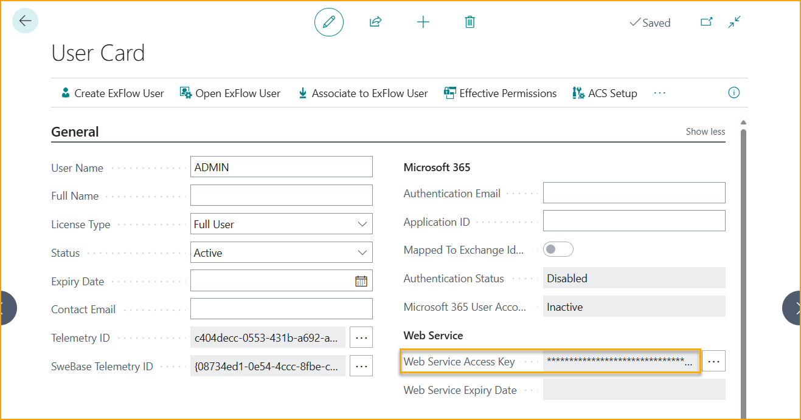
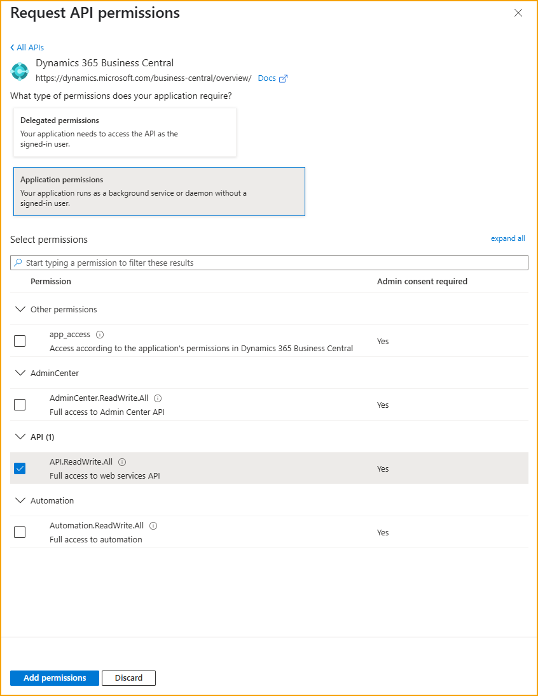

## Web Services - EXFID

### Einleitung
ExFlow ist auf den Import von Dokumenten aus einer Vielzahl von Quellen angewiesen: Lokales Dateisystem, Azure Storage oder Web Services. 

In diesem Text werden Web Services beschrieben; Funktionalität, Einrichtung, Verwendung sowie Beispielcode als Projekt in C#/.NET 4.8 und Visual Studio 2019 für die Integration. Die Programmierung kann in jeder Sprache erfolgen, die Web Services-Anfragen unter Verwendung des SOAP-Protokolls unterstützt. Der aufgeführte Beispielcode kann einfach in VB.Net konvertiert werden.

Die Verwendung von Web Services ermöglicht es Drittanbietern oder Business Central-Partnern, elektronische Rechnungen über ein standardisiertes Protokoll an ExFlow zu senden.

### Allgemeines
Der Import von Rechnungen in ExFlow erfordert in der Regel zwei Dateien: eine XML-Datei, die die Rechnung in einer bekannten Struktur enthält, und die PDF-Datei mit einer Darstellung der Rechnung. Die PDF-Datei kann optional sein, wenn eine XSL-Datei existiert, die ein in PDF konvertierbares HTML generieren kann.

Die Verwendung von Web Services für den Import wird extern initiiert und nicht von ExFlow oder Aufgabenwarteschlangeneinträgen. Externe Systeme verbinden sich mit Web Services in Business Central und rufen Methoden zum Hochladen von Dokumenten in eingehende Dokumente und eingehende Dokumentanlagen auf. Bei der Auslösung des Imports in ExFlow werden Dokumente auf Basis eingehender Dokumente verarbeitet, die vom Web Service importiert wurden.

### Business Central / ExFlow
Installieren Sie ExFlow und führen Sie den Assistenten aus, um eine Einrichtung zu erhalten. 

Importieren Sie eine nützliche Datenaustausch-Definition (DED), entweder eine von ExFlow oder verwenden Sie eine bestehende DED in Business Central. 

#### ExFlow-Einrichtung
Gehen Sie zu: **ExFlow-Einrichtung --> OCR-Import --> Web Def. Datenaustauschtyp** 

ExFlow-Einrichtung: Setzen Sie einen Wert im Feld "Web Def. Datenaustauschtyp", indem Sie aus der Liste der Datenaustauschtypen auswählen. Wenn keine verfügbar sind, führen Sie "Datenaustausch-Definitionen importieren" aus und importieren Sie eine oder mehrere Datenaustausch-Definitionen.

#### Importjournal
Gehen Sie zu: **ExFlow-Importjournale**

Erstellen oder konfigurieren Sie ein [ExFlow-Importjournal](https://docs.signupsoftware.com/business-central/docs/user-manual/approval-workflow/exflow-import-journals#exflow-import-journals), um das zu verarbeiten, was über den EXFID-Webdienst importiert wird.

Um ein neues ExFlow-Importjournal zu erstellen, bearbeiten Sie einfach die Liste und legen Sie einen Namen und eine Beschreibung für das neue Journal fest. 

Setzen Sie dann den Quelltyp auf ''Webdienst''.

Verarbeiten Sie importierte Rechnungen über den Webdienst, indem Sie "Dokumente importieren" im neu erstellten ExFlow-Importjournal oder "Batch-Dokumente importieren" ausführen.

##### Optionale Anlagen
Optionale Anlagen können hochgeladen werden, um mehr Dokumente als die Standard-XML und Pdf einzuschließen. Konfigurationen der Datenaustauschdefinition wie Peppol und OIOUBL unterstützen eingebettete optionale Anlagen, indem die Anlagen als BASE64-kodierte Daten in der XML enthalten sind. Bitte importieren Sie die Peppol-Datenaustauschdefinition, um zu sehen, wie sie konfiguriert ist, da sie für jedes XML-Format verwendet werden kann.

###### Vorab gesendete Anlagen
Wenn das verwendete XML-Format keine eingebetteten Anlagen unterstützt oder wenn es technisch schwierig ist, die Anlagen einzubetten, können Anlagen vor der eigentlichen XML-Rechnung gesendet werden.
Optionale Anlagen können vor der eigentlichen XML-Rechnung gesendet werden.

###### Eingebettete Anlagen
Eingebettete Anlagen sind BASE64-kodiert, optional mit gzip komprimiert, Streams, wie sie in Peppol- und OIOUBL-XML-Formaten zu sehen sind.

Um zu sehen, wie man eingebettete Anlagen aus XML importiert, importieren Sie entweder Peppol nach ExFlow oder OIOUBL nach ExFlow-Datenaustauschdefinitionen.

### Authentifizierung
#### Webdienstzugangsschlüssel
Für einen lokalen Container erstellen Sie einen Webdienstzugangsschlüssel für den Benutzer, der in Visual Studio verwendet werden soll. Öffnen Sie die Benutzerkarte in Business Central und aktivieren Sie einen Webdienstzugangsschlüssel. Kopieren Sie den Schlüssel und ersetzen Sie den Schlüssel in der Zeile mit NetworkCredentials.

 

#### OAuth
Seit ExFlow 19.2 unterstützt ExFlow die Authentifizierung für unseren Webdienst über OAuth. 

Zuerst muss eine Microsoft Entra-Anwendung erstellt werden, falls noch keine vorhanden ist. Fügen Sie einen relevanten Namen für den Import hinzu und weisen Sie die Berechtigungssatz: ''EX WEB SERVICE'' unter den Benutzergenehmigungssätzen zu. Dieser Berechtigungssatz sollte das Unternehmensfeld leer lassen. 

Nachdem dies geschehen ist, wird eine Client-ID generiert, die für die Authentifizierung benötigt wird.

Jetzt muss eine App-Registrierung im Azure-Portal erstellt werden. Beachten Sie, dass ein globaler Administrator dieser App die Zustimmung erteilen muss. 

Registrieren Sie eine Anwendung, benennen Sie sie und wählen Sie den relevanten Mandantentyp aus.

Setzen Sie nun die API-Berechtigungen auf "Anwendungsberechtigungen" und fügen Sie ''API.ReadWrite.ALL'' hinzu.

 

Gewähren Sie zuletzt die Administratorzustimmung für die App-Registrierung. 

Wenn dies erledigt ist, ist alle erforderliche Einrichtung abgeschlossen, um sich über OAuth authentifizieren zu können.