## OAuth 2.0 Anwendungen und Speicher-Setup

Für Unterstützung bezüglich der folgenden Schritte wenden Sie sich bitte an Ihre interne IT-Abteilung oder Ihren vertrauenswürdigen Business Central-Partner.

### Anwendung oder Dienstprinzipal in MS Entra (oder Azure) erstellen

Geben Sie einen Namen Ihrer Wahl ein. Wählen Sie: „Konten in jedem Organisationsverzeichnis“ und klicken Sie dann auf „Registrieren“.
 
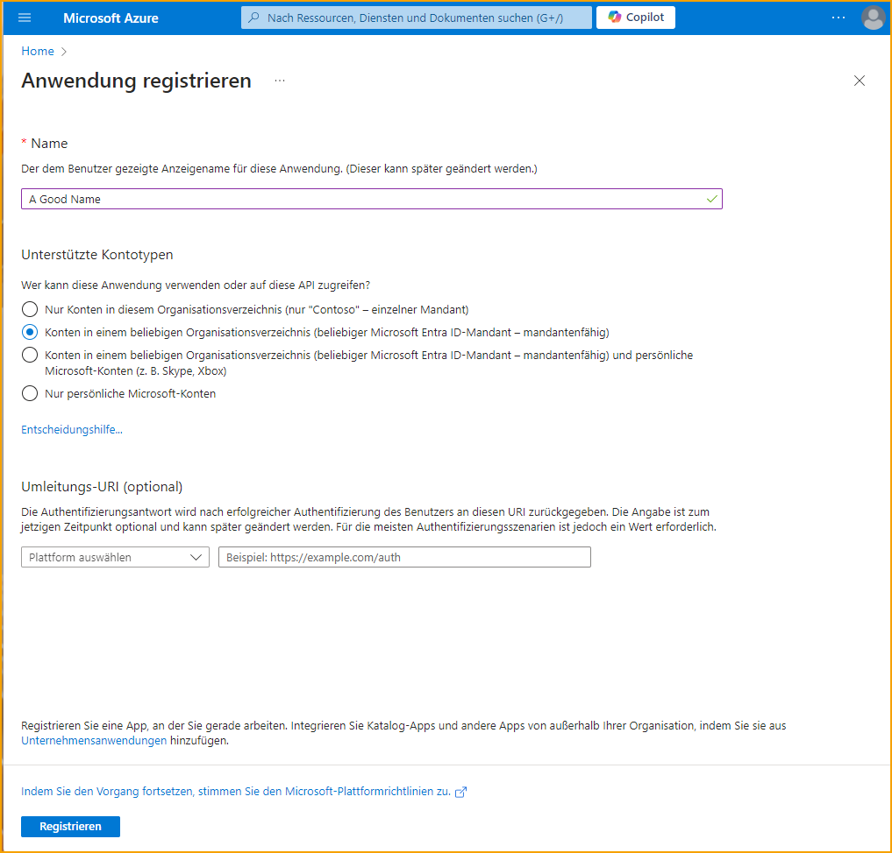 

Nach der Registrierung notieren Sie sich die „Anwendungs-ID (Client-ID)“.
 
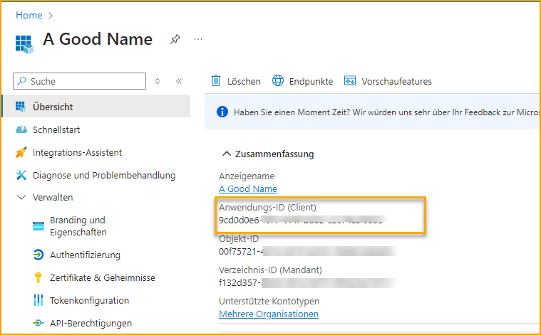 

Gehen Sie zu API-Berechtigungen, um eine Berechtigung hinzuzufügen.
 
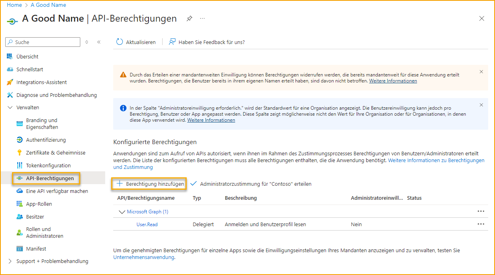 

Klicken Sie auf „Microsoft Graph“ und „Anwendungsberechtigungen“.  
Suchen Sie nach „site“ und fügen Sie die Berechtigung hinzu: Sites.ReadWrite.All 

 
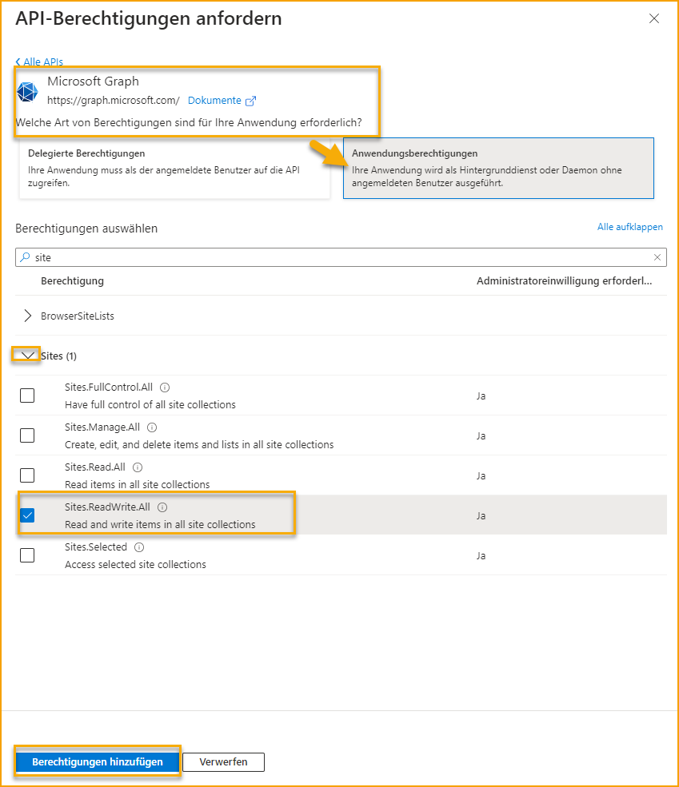 

Klicken Sie erneut auf „SharePoint“ und „Anwendungsberechtigungen“.  
Wählen und fügen Sie beide Berechtigungen hinzu: Sites.ReadWrite.All und Sites.Manage.All.  

 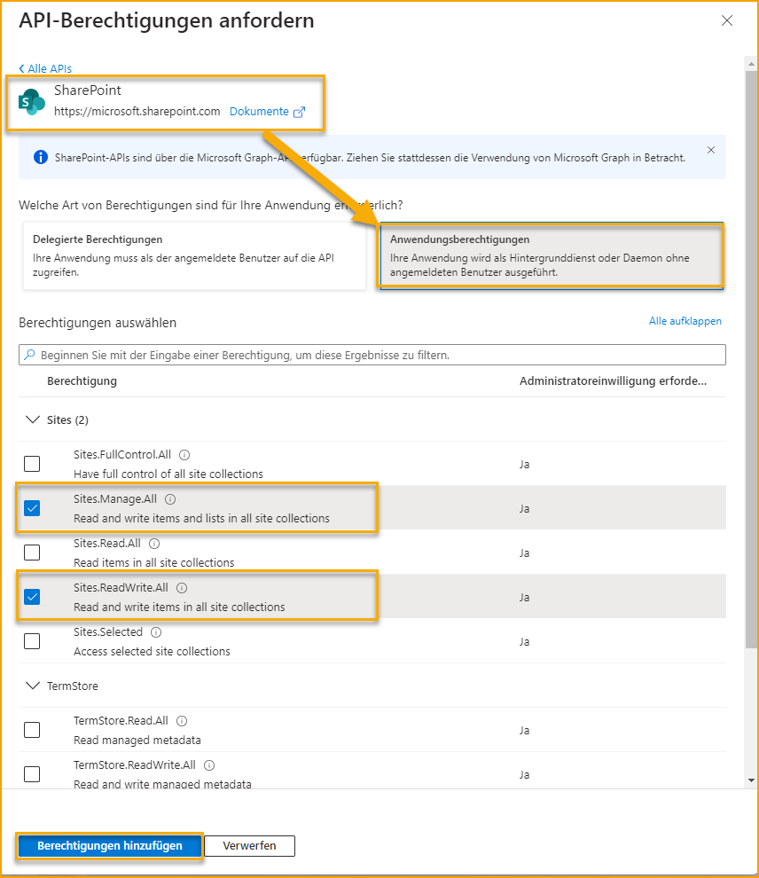 

Erteilen Sie die Admin-Zustimmung für diese Berechtigungen:

 
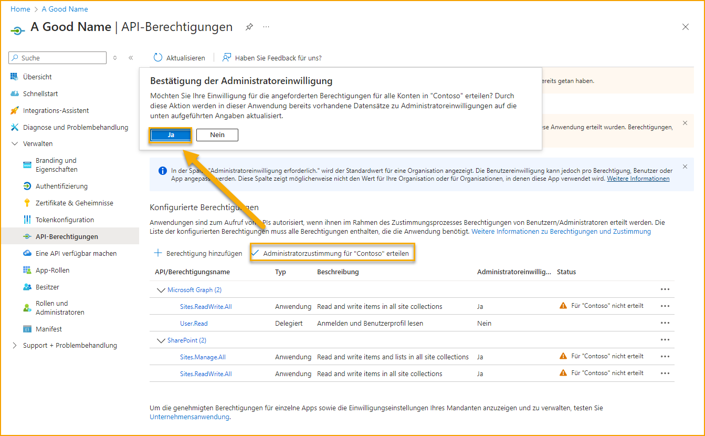 

Die Berechtigungen sollten wie folgt aussehen:
 
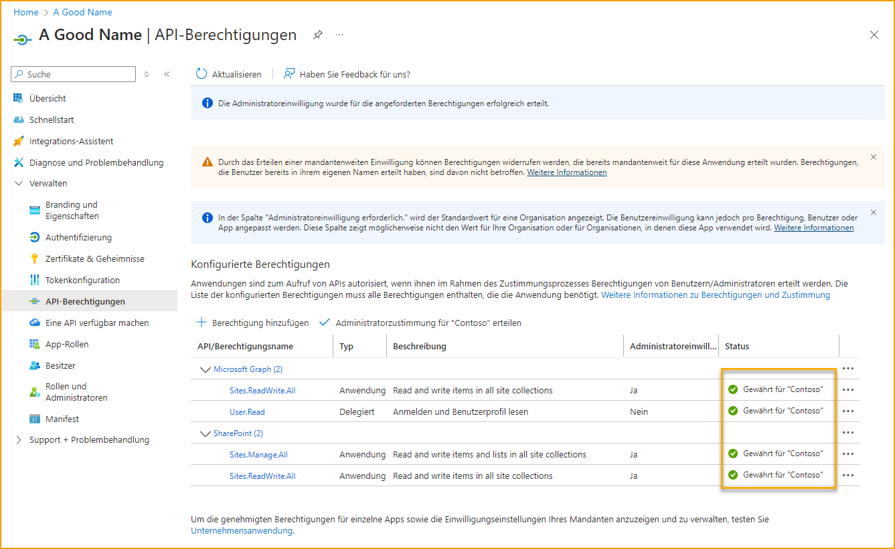 

Gehen Sie zu „Zertifikate & Geheimnisse“.
 
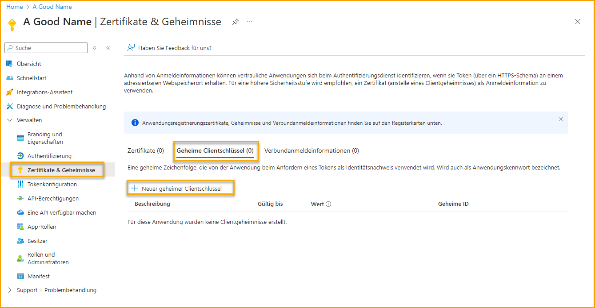 

Erstellen Sie ein Client-Geheimnis:
 
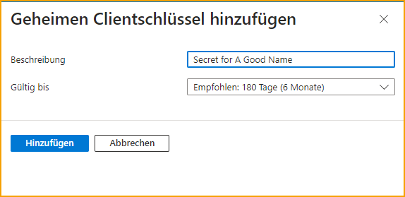 

Kopieren und/oder speichern Sie das Geheimnis. Das Geheimnis wird nicht mehr sichtbar sein. Wenn das Geheimnis vergessen oder verlegt wird, erstellen Sie ein neues Geheimnis und konfigurieren Sie die OAuth2-Anwendung neu.
 
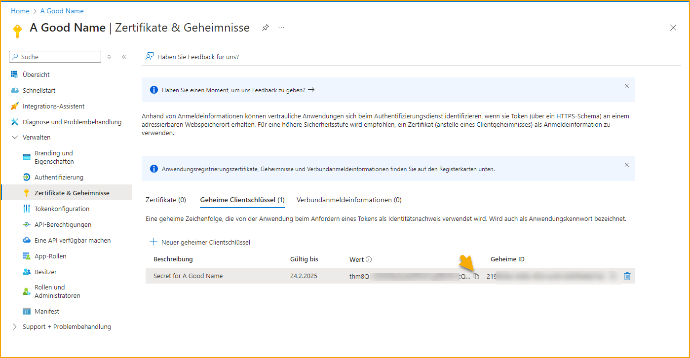 

Gehen Sie zurück zur Liste der App-Registrierungen und klicken Sie auf Endpunkte.
Kopieren Sie sowohl die OAuth2.0 v2 Endpunkte; Autorisierung und Token. Kopieren Sie auch den Microsoft Graph API-Endpunkt.
 

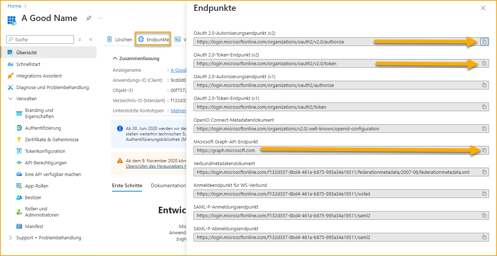 

Abgeschlossen mit Entra oder Azure AD oder AAD.  

### Konfigurieren einer OAuth2-Anwendung in ExFlow

Gehen Sie zu: **ExFlow Setup --> Aktionen --> Funktionen --> OAuth2-Anwendungen**

Starten Sie die Konfiguration, indem Sie auf „Neu“ klicken, um eine neue OAuth 2.0-Anwendung zu erstellen.
 

| OAuth 2.0 Anwendungen|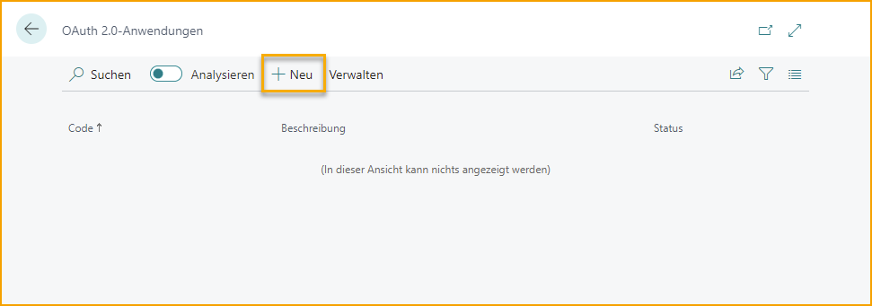
|:-|:-|
|**Zugriffstoken anfordern**|Öffnen Sie die Service-Autorisierungs-Webseite. Anmeldeinformationen werden abgefragt. Der Autorisierungscode muss in das Feld Autorisierungscode eingeben kopiert werden.
|**Zugriffstoken aktualisieren**|Aktualisieren Sie die Zugriffs- und Aktualisierungstoken.
 

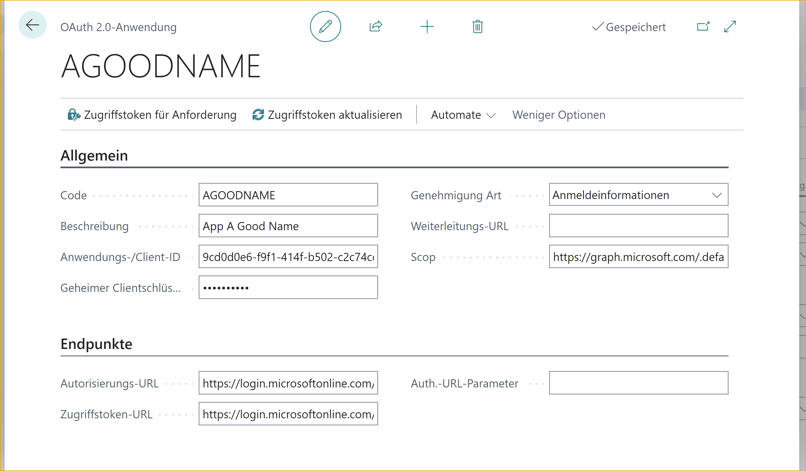 

|Allgemein||
|:-|:-|
|**Code**|Gibt den Namen des Codes an
|**Beschreibung**|Gibt die Beschreibung des Codes an
|**Anwendungs-/Client-ID**| Gibt die Anwendungs-ID aus der Übersicht der Unternehmensanwendung an.
|**Client-Geheimnis**| Gibt das Client-Geheimnis an
|**Grant-Typ**| Gibt den zu verwendenden Grant-Typ an. Es ist möglich, Autorisierungscode, Passwort-Anmeldeinformationen oder Client-Anmeldeinformationen zu verwenden. Derzeit wird nur „Client-Anmeldeinformationen“ unterstützt.
|**Umleitungs-URL**| Gibt die Umleitungs-URL an, derzeit nicht in Gebrauch.
|**Scope**| Gibt den Scope an. Geben Sie den Graph-Endpunkt ein und fügen Sie „.default“ hinzu. Stellen Sie sicher, dass der Endpunkt am Ende wie folgt aussieht: „…soft.com/.default“

 

|Endpunkte||
|:-|:-|
|**Autorisierungs-URL**| Gibt die Autorisierungs-URL an
|**Zugriffstoken-URL**| Gibt die Zugriffstoken-URL an
|**Auth. URL Parms**| Gibt die Ressourcen-URL an, derzeit nicht in Gebrauch.

 

Geben Sie alle erforderlichen Setup-Informationen ein. Geben Sie einen Code und eine Codebeschreibung ein. Fügen Sie die Application/Client-ID und das Client Secret aus dem MS Entra Admin Center ein.

Setzen Sie den Grant Type auf ''Client Credentials'' und die MS Graph Scope URL (Microsoft Graph API).  

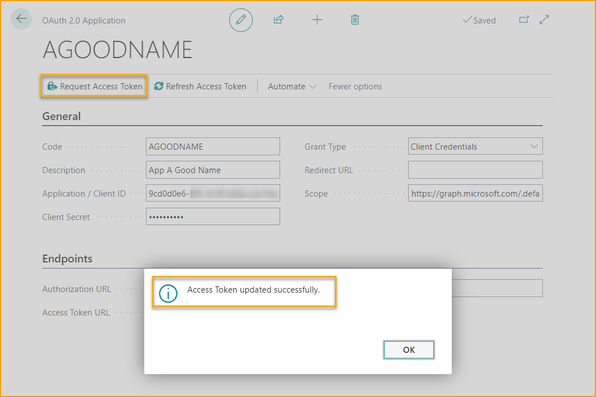 

Unter dem Abschnitt Endpoint fügen Sie die zuvor kopierten URLs für sowohl den OAuth2.0 v2 Authorization Endpoint als auch den Token Endpoint ein.  

Testen Sie, indem Sie auf „Request Access Token“ drücken. Folgende Meldung sollte angezeigt werden, wenn alles korrekt ist: „Access Token updated successfully.“  

### SharePoint Setup
Erstellen Sie in Site Contents eine neue Dokumentbibliothek, die den Ordner enthält, in dem ExFlow Daten speichert. Erstellen Sie einen Ordner in der gerade erstellten Dokumentbibliothek. Dies wird der Speicherort der Dokumente sein. Klicken Sie auf den neu erstellten Ordner. Kopieren Sie die vollständige URL aus dem Adressfeld im Browser, diese wird in der folgenden Konfiguration benötigt.

### Blob Storage Setup für SharePoint

Gehen Sie zu: **ExFlow Setup -- > Actions --> Functions --> Blob Storage Mgmt (ExFlow Storage Management Setup)** 

| Blob Storage Mgmt / ExFlow Storage Management Setup |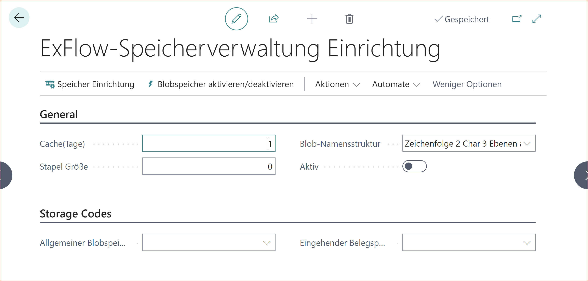
|:-|:-|
|**Storage Setup**|Konfigurieren Sie eine oder mehrere Speicher-Konfigurationen
|**Enable/ Disable Blob Storage**|Aktivieren oder deaktivieren Sie den Blob-Speicher

 

Klicken Sie auf der Seite ExFlow Storage Management Setup auf **Storage Setup** und dann auf „New“, um mit der Konfiguration zu beginnen.

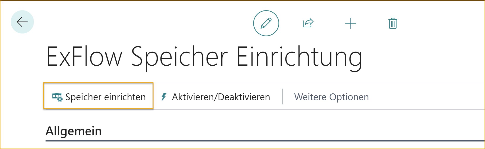 

Geben Sie einen Code und eine Beschreibung ein. Wählen Sie für Blob Source SharePoint. 

Klicken Sie dann auf **Setup Storage**, um die Konfiguration fortzusetzen.

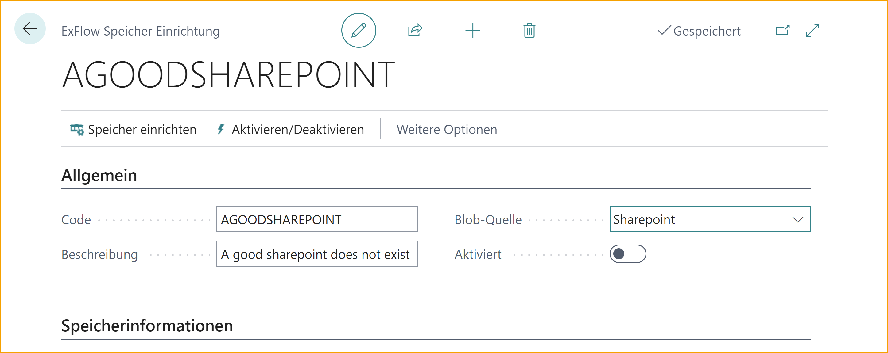 

Kopieren Sie die URL von SharePoint und fügen Sie diese in das Feld ''SharePoint URL'' ein. Sobald Sie das Feld verlassen, werden Werte extrahiert und in Host, Site, Document Library und Folder eingefügt. Wenn eines der Felder fehlt, höchstwahrscheinlich Folder, können diese manuell eingegeben werden.  

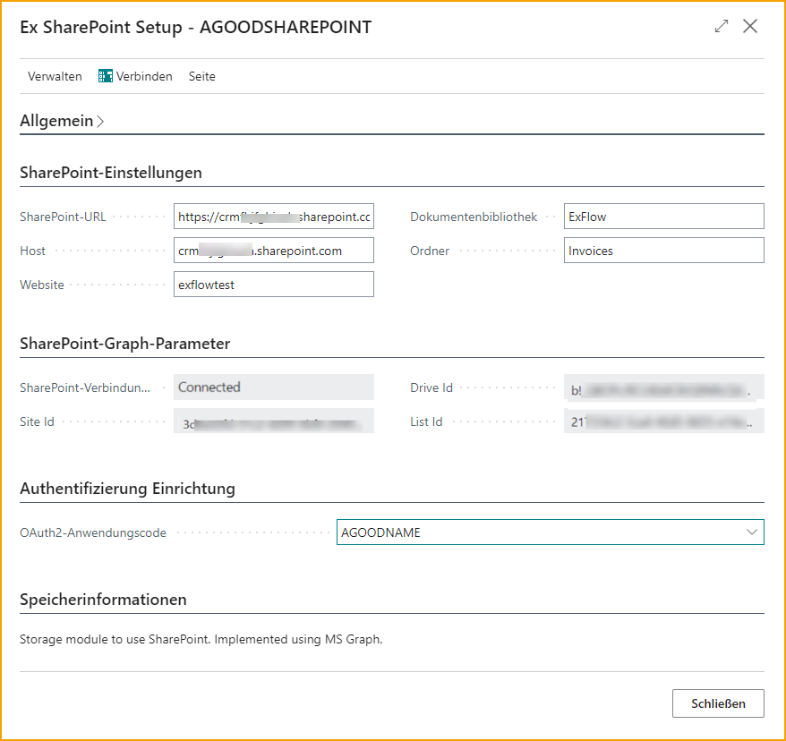 

Wählen Sie die zuvor erstellte OAuth2-Anwendung aus und verifizieren Sie, indem Sie auf „Connect“ klicken.  

Wenn etwas falsch ist, wie z.B. der Ordnername, erscheint eine Meldung wie „Not Found“.  

Wenn Berechtigungen fehlen, erscheint eine Meldung wie „Unauthorized“.  

Wenn alles in Ordnung ist, wird der SharePoint Connection Status auf „Connected“ gesetzt und Parameter werden in Site Id, Drive Id und List Id eingefügt.  

Es ist jetzt in Ordnung, diese Seite zu schließen, da das Blob Storage Setup für SharePoint abgeschlossen ist.  

Gehen Sie zurück zu **ExFlow Storage Setup**, um dieses Setup zu aktivieren, indem Sie auf „Enabled“ klicken.  

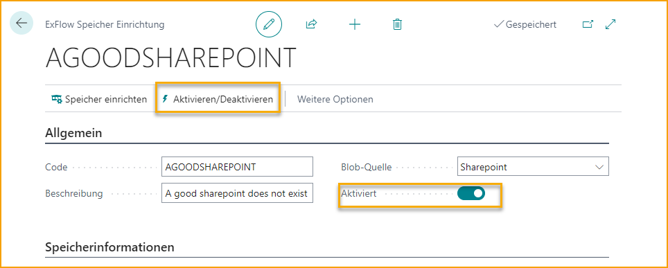 

Schließen Sie ExFlow Storage Setup und kehren Sie zu ExFlow Storage Management Setup / Blob Storage Mgmt zurück. 

Wählen Sie das neu erstellte SharePoint-Setup im Feld „Incoming Doc. Storage Code“ aus.  

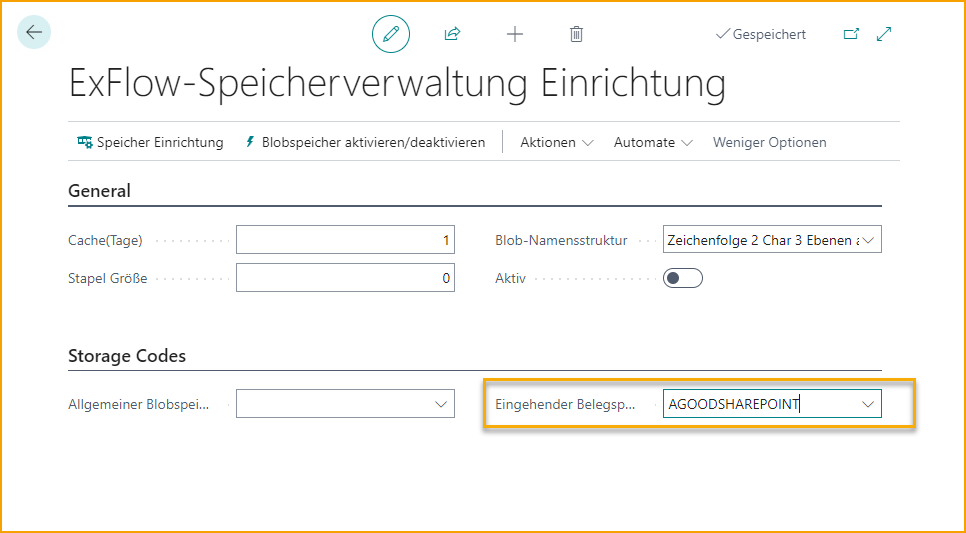 

Klicken Sie auf „Active“ oder „Enable / Disable Blob Storage“.  

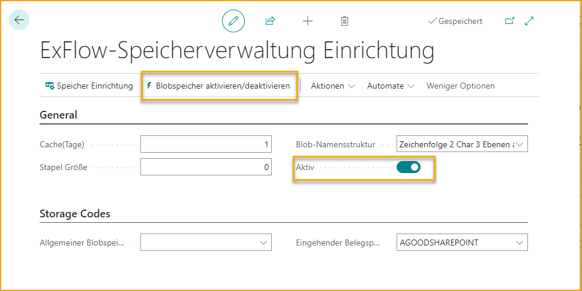 

Wenn bereits gebuchte Rechnungen mit ExFlow genehmigt wurden, wird ein Dialog angezeigt, der fragt, ob diese übertragen werden sollen. Es ist dann möglich, „Ja“ zu wählen.  

Es ist jetzt möglich, den Status für gebuchte Rechnungen im Blob-Speicher zu überprüfen, indem Sie „Actions --> Storage Details“ auswählen.  

Klicken Sie auf „Sync Storage“, um eine Übertragung nach SharePoint zu erzwingen.  

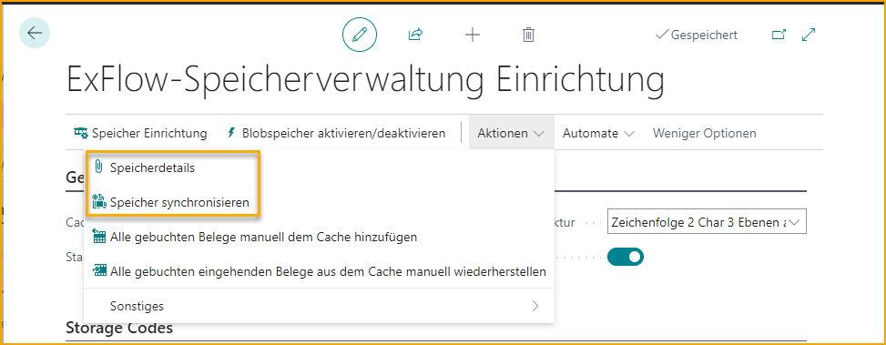 

Aktualisieren Sie die SharePoint-Seite mit dem zuvor erstellten Ordner, es sollte jetzt möglich sein, die neuen Ordner dort zu sehen.  

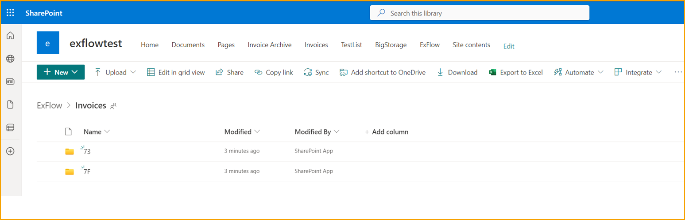 

