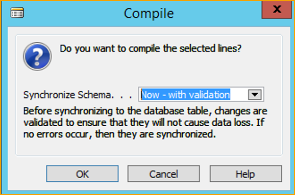

## Upgrade und Migration von ExFlow-Daten

  

Fühlen Sie sich frei, die Dokumente herunterzuladen und zu lesen, bevor Sie beginnen:   [***Technische Dokumente herunterladen ***](https://docs.exflow.cloud/business-central/docs/user-manual/help-and-support/documents-for%20download#documents-for-download)  

### Einführung
#### Hintergrund
Dieser Abschnitt beschreibt, wie BC C/AL ExFlow-Daten auf BC AL ExFlow-Daten aktualisiert/migriert werden.   

 

#### Überlegungen
Die ExFlow AL BC-Version ist keine 1-1-Konvertierung der früheren C/AL-basierten Version von ExFlow, d.h. es kann Unterschiede sowohl in der Funktionalität als auch in der Darstellung/Migration der Daten geben. Hier sind einige der wichtigsten Unterschiede zwischen den Versionen:    
•	Die Anforderungsfunktionalität wird in ExFlow Business Central AL nicht unterstützt. Dokumente und Einstellungen, die sich auf die Anforderungsfunktionalität beziehen, werden daher nicht migriert und die Funktion ist in BC AL nicht verfügbar.   

•	Es gibt wesentliche Änderungen in der Funktionsweise/Darstellung von Kommentaren, daher werden einige migrierte Kommentare als von einem „Systembenutzer“ erstellt/geschrieben angezeigt.  

#### Upgrade/Umzug der Datenbank zu Microsoft SaaS
Stellen Sie sicher, dass die aktualisierte BC-Datenbank und das ExFlow-Add-on unterstützte verfügbare Cloud-Versionen haben. Befolgen Sie dann die Anweisungen von Microsoft zur Cloud-Migration lokaler Datenbanken zu SaaS.  

#### Voraussetzungen
Das ExFlow-Datenmodell muss vollständig auf die ExFlow-Version 5.41 in BC 14 aktualisiert sein. NAV/BC muss auf eine von Microsoft unterstützte Version aktualisiert werden und gemäß den Anweisungen von Microsoft.

ExFlow-Schritte:
1.	Upgrade der ExFlow-Version auf ExFlow 5.41 in BC14 siehe ‘’Upgrade ExFlow-Version auf ExFlow 5.41 in BC14.’’
2.	PDF/Bild für den Export von C/AL in die Dateispeicherung behandeln, siehe Anleitung ''PDF-Dateien für den Export aus C/AL erstellen.''
3.	Daten in ExFlow-Upgrade-Tabellen erstellen und auf BC AL upgraden, siehe ‘’Starten der Migration von BC14 ExFlow C/AL-Daten zu ExFlow AL-Daten.’’  

### Schritt 1
### Überprüfen Sie die aktuelle ExFlow-Version und die NAV/BC-Version  

Gehen Sie zu: **Abteilungen--> ExFlow Setup--> Über ExFlow**, um Ihre ExFlow-Version zu finden:

 

Gehen Sie unter den Stapel im Menüband und klicken Sie auf **''Hilfe''** und **''Über Microsoft Dynamics 365 Business Central''**.

Wenn die aktuelle ExFlow-Version < ExFlow 5.22 ist, muss ein Upgrade von ExFlow auf ExFlow 5.41 mit einem Upgrade-Skript durchgeführt werden.
 
Lesen Sie mehr im Abschnitt Upgrade ExFlow 3.50 auf ExFlow 5.41 oder Upgrade ExFlow 4.XX auf ExFlow 5.41

Wenn die aktuelle ExFlow-Version > ExFlow 5.22 ist, dann vorhandenen ExFlow-Code in ExFlow-Objekte in BC14 mit Version ExFlow 5.41 zusammenführen.
 
Upgrade-Skripte aus früheren Versionen können vom SignUp Software AB Partnerportal heruntergeladen oder vom SignUp Software AB Support angefordert werden. 

### Überprüfen Sie die PDF-Dokumentenspeicherung für ExFlow

Gehen Sie zunächst zu **‘’ExFlow Setup --> Ordner--> Dateispeichertyp’’**, um zu überprüfen, ob die Dokumente in der Datenbank oder in einem Dateifreigabe gespeichert sind:

 

Wenn das Dokument in einer Dateifreigabe gespeichert ist, gibt es zwei Optionen: 
1.	Dokument in die Datenbank importieren. Lesen Sie mehr im Abschnitt Importieren von PDF/Bildern in die Datenbank vor dem Upgrade.  
2.	Dokumente aus BC/NAV C/AL in die Dateifreigabe exportieren und Dokumente aus dem Azure-Dateispeicher in BC AL importieren. 
Lesen Sie mehr im Abschnitt ''Erstellen von Dokumentdateien zum Export in C/AL und Importieren von Dokumenten in AL.'' 

### Importieren von PDF/Bildern in die Datenbank vor dem Upgrade
Starten Sie den BC RTC-Client in ExFlow-Version > 5.22.  

Gehen Sie zu: **Abteilungen --> ExFlow Setup --> Navigieren --> ExFlow-Dateien migrieren (Erweitert)**

Klicken Sie auf **ExFlow-Dateien migrieren (Erweitert)** und bearbeiten Sie das Fenster ExFlow-Dateien migrieren mit den erforderlichen Importinformationen. 

 

Wenn mehrere Unternehmen ExFlow verwenden, überprüfen Sie, ob die Dateipfade im ExFlow-Setup aktualisiert sind.  

Wenn es nur ein Unternehmen gibt, je nachdem, wo sich die Dateifreigabe befindet, ist es möglich, die Dateien entweder aus den Pfaden im Setup zu importieren oder manuell aus **Rechnungspfad** und **Anhangspfad** auszuwählen. 

Stellen Sie sicher, dass das Feld **XML-Dateien migrieren** nicht angekreuzt ist und dass das Feld **Dateikonflikte ersetzen/ignorieren** angekreuzt ist. 

Wenn es viele Dokumente gibt, ist es möglich, den Import zu begrenzen, indem Sie Ordnernamen in **Bildname von** und **Bildname bis** eingeben. 

Darüber hinaus ist es auch möglich, das Unternehmen auszuwählen, aus dem die Dateien importiert werden sollen, indem Sie das Unternehmen in **Nur in Unternehmen migrieren** auswählen. 

Es ist möglich, Pfade im Tab „Ordner“ im ExFlow-Setup zu ändern. 
Klicken Sie auf ‘’Vorschau’’, um fortzufahren. 

 

### Upgrade der ExFlow-Version auf ExFlow 5.41 in BC 14
#### Upgrade von ExFlow 3.50 auf ExFlow 5.41

Beenden Sie alle Dokumente im Importjournal in ExFlow. 

Importieren Sie ExFlow_350_to_5XX_STEP1_(NAV2009R2).fob. 

Führen Sie Codeunit 12057134 EX Upgrade 350 to 5XX Step1.fob aus.  

Löschen Sie das gespeicherte Verfahren im SQL-Manager.  

 

Upgrade NAV2009R2 auf (NAV2015 oder später) 

Zusammenführen von ExFlow 5.XX in die Kundenobjekte (NAV 2015 oder später). 

Importieren der zusammengeführten ExFlow 5.XX-Objekte in das aktualisierte (NAV2015 oder später) 

Wählen: Schema später synchronisieren 

Importieren Sie das Upgrade-Tool ExFlow_350_to_5XX_STEP2_(NAV2015 oder später).fob 

Wählen: Schema später synchronisieren 

Kompilieren Sie jetzt die ExFlow-Objekte 

Wählen: Synchronisieren mit Validierung 

Starten Sie das Tool --> Daten-Upgrade in (NAV2015 oder später) 

 

ExFlow 5.XX-Daten sind bereit für die ExFlow-Setup-Konfiguration und Web-Installation. 

#### Upgrade ExFlow 4.XX auf ExFlow 5.41
Zusammenführen von ExFlow 5.41 mit der Kundenversion von ExFlow zur BC14-Version und Erstellen einer fob mit ExFlow-Objekten. 

Starten Sie die BC14-Entwicklungsumgebung. 

Führen Sie die Synchronisierung der Tabellen durch. 

Wählen: ''Tools--> Schema für alle Tabellen synchronisieren--> Mit Validierung''.  

 

Importieren Sie die erstellten zusammengeführten Kunden-ExFlow 5.41-Objekte. 

Wählen: ‘’Schema für alle Tabellen synchronisieren--> Später’’. 

Importieren Sie das Upgrade-Tool ExFlow_UpgradeTool_from500_to541 (BC).fob. 

Wählen: ‘’Schema später synchronisieren’’ 

Kompilieren Sie das ExFlow-Objekt. 

Wählen: Jetzt – mit Validierung 

 

Wählen Sie Tools --> Daten-Upgrade --> Starten 

 

 

Daten-Upgrade abgeschlossen. 

Validieren Sie die ExFlow-Daten.  

### Schritt 2

### Erstellen von Dokumentdateien zum Exportieren in C/AL und Importieren von Dokumenten in AL
Dies kann vor oder nach dem Upgrade erfolgen (wenn Dokumentbilder nicht aktualisiert werden)

### Exportieren von Bildern/PDF-Dokumenten aus BC C/AL

Holen Sie sich DocMigrate_New_BC14.fob und importieren Sie es in die C/AL-Entwicklungsumgebung. 

 

Führen Sie den Bericht 60012 Export Inv to XML aus. 

Wählen Sie einen ‘’Pfad zum Exportieren’’, dies ist der Stammordner, in dem Bilder/PDFs gespeichert werden, und klicken Sie dann auf OK. 

 

 

Klicken Sie auf Ja, um alle Datensätze in der Datenbank zu exportieren. Eine Popup-Nachricht mit der Summe der exportierten Bilder wird dann angezeigt.

 

Erstellen Sie Ordner und Dateien:

 

### Erstellen von Azure-Dateispeicher
Für Unterstützung bei den folgenden Schritten wenden Sie sich bitte an Ihre interne IT-Abteilung oder Ihren vertrauenswürdigen Business Central-Partner. 

Um eine Dateiimport-Einrichtung in ExFlow Business Central erstellen zu können, muss zuvor ein Azure-Dateispeicher erstellt werden. Der Zugriffsschlüssel (neben anderen Dingen) wird benötigt. 

#### Erstellen eines Azure-Speicherkontos
Melden Sie sich beim [***Azure-Portal***](https://portal.azure.com/) an und klicken Sie auf ''Speicherkonten'', um ein Speicherkonto zu erstellen. 

 

Klicken Sie auf ''Speicherkonto erstellen'', verwenden Sie die Standardeinstellungen und füllen Sie alle erforderlichen Einstellungen aus. 

Stellen Sie sicher, dass im Netzwerk-Tab der öffentliche Endpunkt ausgewählt ist. 

Wählen Sie Überprüfen und erstellen Sie das Konto. 

#### Erstellen Sie ein Azure-Dateifreigabe
Erstellen Sie im Azure-Portal eine Azure-Dateifreigabe.

Wählen Sie das Speicherkonto aus und gehen Sie zu Dateifreigaben unter Datenspeicherung.  

Erstellen Sie eine Dateifreigabe und klicken Sie dann auf die neu erstellte Dateifreigabe. 

Erstellen Sie ein Verzeichnis (Unterordner) in der Dateifreigabe mit dem Namen ExFlow oder einem anderen Namen Ihrer Wahl.  

### Schritt 3

#### Beginnen Sie mit der Migration von BC14 ExFlow C/AL-Daten zu ExFlow AL-Daten mit Cloud-Migration

#### Verschieben Sie ExFlow-Daten in ExFlow-Upgrade-Tabellen
Nach dem Upgrade auf ExFlow 5.41 starten Sie den Import. Führen Sie Datei -> Importieren aus und wählen Sie die Datei Upgrade_New_BC14_XX.fob. 

 

Führen Sie Codeunit 12026809 aus, um alle ExFlow-Firmendaten in alle ExFlow-Upgrade-Tabellen zu kopieren. 

#### Starten Sie die Cloud-Migration  

Richten Sie die Cloud-Migration in der aktuellen Business Central-Version ein (folgen Sie den Anweisungen von Microsoft). 

Starten Sie das Cloud Migration Management und wählen Sie Benutzerdefinierte Tabellen verwalten. 

 

***Wichtig!:***
Wählen Sie nur alle ExFlow-Tabellen mit ''Upg'' oder ''Up'' nach dem Namen aus, siehe untenstehendes Bild der ''Migration Table Mapping''. 

Entfernen Sie alle anderen ExFlow-Tabellen, damit keine Daten aus diesen Tabellen verschoben werden. 

 

Führen Sie die Migration durch.  

Nach Abschluss der Migration suchen Sie in Business Central nach **Ex Upgrade From CAL**:  

 

Gehen Sie auf der Seite ''Ex Upgrade From CAL'' unter ''Aktionen --> ExFlow-Migration für das aktuelle Unternehmen ausführen''.  

 

Wenn es mehr als ein Unternehmen gibt, gehen Sie unter ''Aktionen --> ExFlow-Migration für alle Unternehmen ausführen''.

Gehen Sie unter * Verwandt --> ExFlow-Migrationsstatusinfo*, um das Protokoll des Upgrade-Verfahrens pro Unternehmen anzuzeigen.  

 

Nach dem Upgrade folgen Sie den Anweisungen im untenstehenden Abschnitt ''Aktivitäten nach dem Upgrade''.  

#### Aktivitäten nach dem Upgrade
Diese Aktionen erfordern möglicherweise Anwendungskenntnisse des ExFlow BC AL-Addons und welche Funktionen im aktualisierten ExFlow BC verwendet wurden/werden.
Verwenden Sie den ExFlow-Assistenten für jedes Unternehmen, in dem ExFlow eingerichtet werden soll.  

* Im Standardunternehmen: 
1) (Neu)-Zuweisung des ExFlow-Standardunternehmens. 
2) Einrichten von ExFlow-E-Mail-Benachrichtigungen. 

* In allen (relevanten) Unternehmen: 
1) Aktivieren Sie das Unternehmen für ExFlow Web. 
2) Einrichten der EDC-Integrations-Einstellungen. 
3) Importieren Sie die erforderliche Daten-Austausch-Definition. 

Fordern Sie auch einen ExFlow Business Central-Lizenzschlüssel an und aktivieren Sie ihn. 

### Daten aus Upgrade-Tabellen in ExFlow einfügen

#### ExFlow-Dateiimport-Einstellungen
Gehen Sie zu: **ExFlow-Dateiimport-Einstellungen**, um Bilder/PDF-Dokumente in Business Central zu importieren.

| Dateiimport-Einstellungen      |     |
|:-|:-|
|**Neu:**                               | Erstellen Sie eine neue Dateiimport-Einstellung
|**Verwalten:**                               | Bearbeiten, anzeigen oder löschen Sie die Einstellung
|**Import ausführen:**                               | Führen Sie den Importvorgang aus
|**Aktivieren/Deaktivieren:**                               | Aktivieren/Deaktivieren Sie die Importquelle
|Weitere Optionen--> Aktionen--> **Laufende Importe anzeigen**   | Zeigt eine Liste der ausstehenden Importdateien an
 

#### Importieren von Bildern/PDF-Dokumenten in BC AL über ExFlow File Import Setups

Gehen Sie zu **ExFlow File Import Setups** und klicken Sie auf Neu, um ein neues File Import Setup zu erstellen.

Geben Sie im Abschnitt Allgemein einen Code, eine Beschreibung ein und wählen Sie ''Import From: Azure File''. Wenn ''Azure File'' ausgewählt wird, werden sowohl ''Image Folder'' als auch ''Image Folder'' standardmäßig auf ''exflow'' im Abschnitt ''Data (XML)'' und im Abschnitt ''Image (PDF)'' gesetzt.

Fügen Sie ''Data Exchange Type'' im Abschnitt ''Data (XML)'' hinzu. Fügen Sie im Abschnitt ''Azure File'' Informationen über den Kontonamen, den Zugriffsschlüssel, die Dateifreigabe und die Basis-URL hinzu.

Aktivieren Sie die Einrichtung.

 

Kopieren Sie alle Dateien und Ordner in den erstellten Azure-Dateispeicher-Image-Ordner (in diesem Beispiel lautet der Ordnername ExFlow).

 

 

### Dokumente über das Dokumentenmigrationstool migrieren

Der nächste Schritt ist die Nutzung des Migrate Document Tools.

Gehen Sie zu: **ExFlow Setup-Seite --> Aktion --> Funktionen --> Dokumente migrieren**

| Dokumentenmigrationstool     |    |
|:-|:-|
|**XML laden und validieren**                               | Erstellen Sie ein neues File Import Setup
|**Dokumente migrieren**                               | Lesen, importieren und migrieren Sie Dokumente
|**Eingehende Dokumente bereinigen:**                               | Löschen Sie alle migrierten Dokumente, wenn ein neuer Import erforderlich ist
 

| Allgemein  |  |
|:-|:-|
|**File Import Setup Code:**                               | Geben Sie den File Import Setup Code ein
|**Name Field Value**                               | Geben Sie das zu verwendende Namensformat an. Folgende Optionen sind verfügbar:  
 

| Status  |  |
|:-|:-|
|**Migrationsstatus:**                               | Status der Migration
|**Dokumentenzahl**                               | Anzahl der Dokumente, die in den entsprechenden Firmennamen migriert werden sollen
|**Übereinstimmende Anzahl**                               | Anzahl der Dokumente, die im aktuellen Unternehmen übereinstimmen, klicken Sie für eine Liste der nicht übereinstimmenden Dokumente
|**Migrierte Dokumente**                               | Anzahl der Dokumente, die in den entsprechenden Firmennamen migriert wurden
|**Fehlgeschlagene Dokumente**                               | Dokumente, die nicht migriert werden konnten, klicken Sie für eine Liste und den Grund
|**Vorhandene Dokumente**                               | Anzahl der bereits migrierten Dokumente
 

| Optionen  |  |
|:-|:-|
|**Batchgröße:**                               | Setzen Sie einen Wert ungleich Null, um maximal so viele Dokumente gleichzeitig zu importieren
 

| Dateiformat  |  |
|:-|:-|
|**Dateiformat**                               | Zeigt die erforderliche Import-XML-Struktur an
 

Um mit dem Migrationsbeispiel fortzufahren, klicken Sie auf **XML laden und validieren**, um die Datei auszuwählen.

Wählen Sie die Datei ''Document Migration XML document*.xml'' im Azure-Dateifreigabe-Image-Ordner ''exflow'' aus.  

 

Dann wird der Migrationsstatus auf ''Validiert'' gesetzt. 

 

Wählen Sie die Registerkarte ''Dokument migrieren'' und warten Sie, bis der Migrationsstatus auf ''Migriert'' gesetzt wird. 

 

Migration abgeschlossen.  

Überprüfen Sie, ob alle PDF-Bilder an die Einkaufsdokumente angehängt sind.
