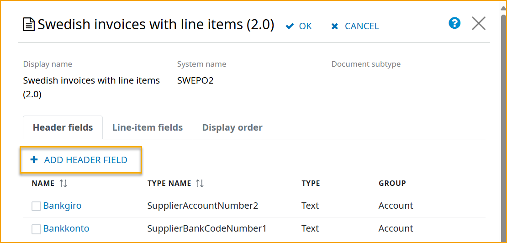
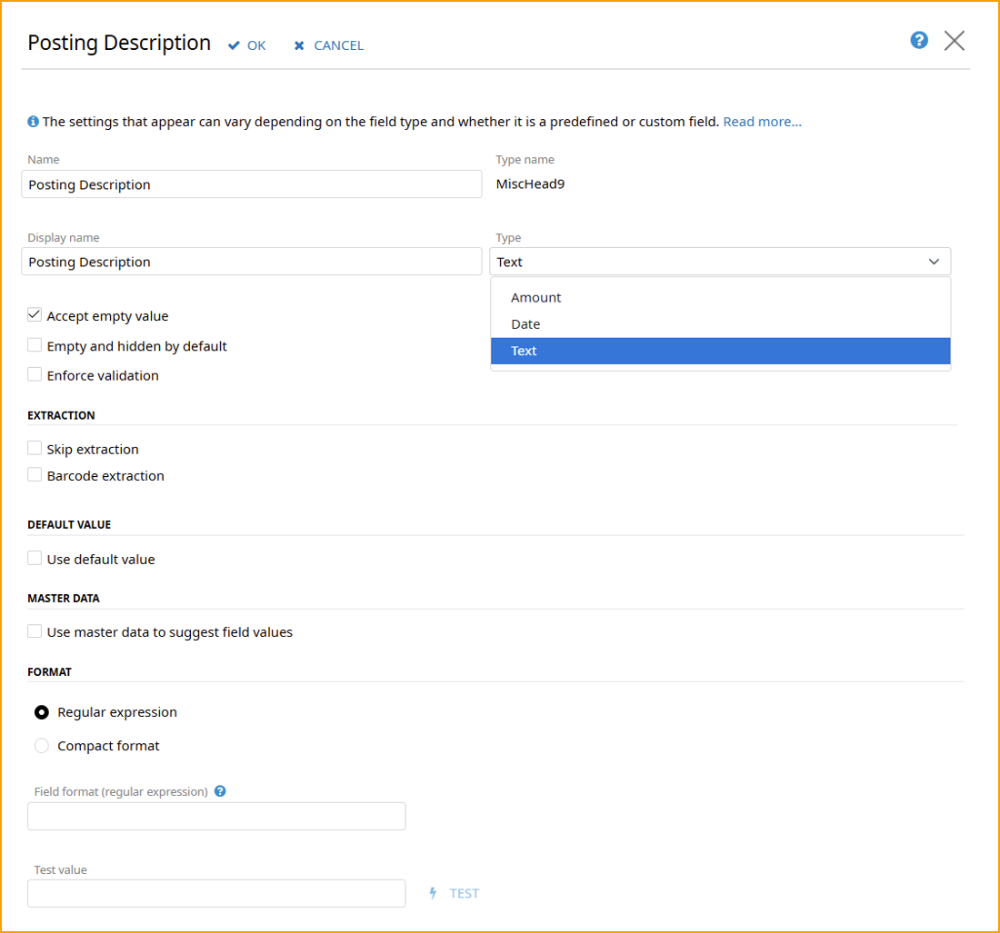
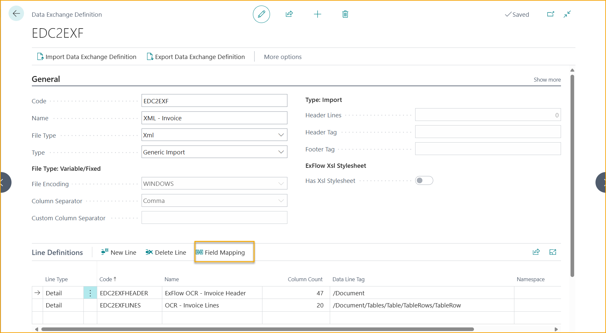
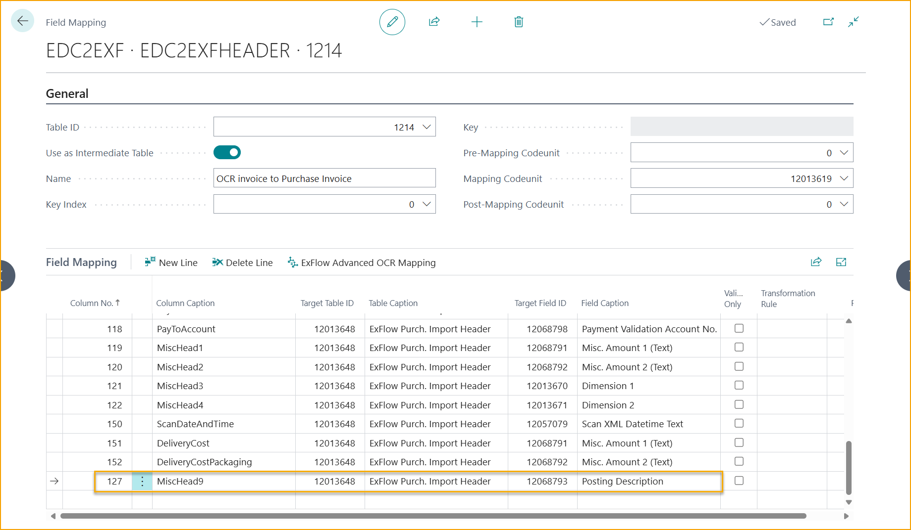
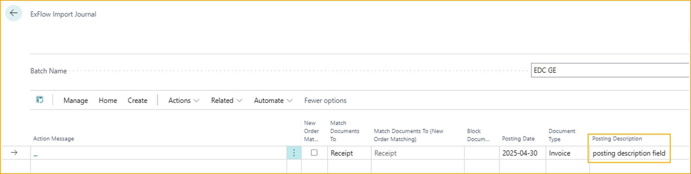
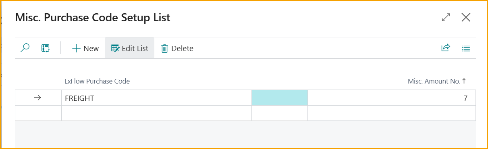

## Feld-Mapping 
Es gibt Situationen, in denen zusätzliche Felder in Dokumenten interpretiert werden müssen, um diese Felder auszufüllen oder einfach die Importfelder anderen Feldern im Import-Journal zuzuordnen. 

Beispiele für Felder sind ''Buchungsbeschreibung'', ''Projektaufgaben-Nr.'' oder ''Beschreibung'' usw.

Hier folgt eine einfache Anleitung mit einem Workflow-Beispiel, wie man ein benutzerdefiniertes Feld in ExFlow Data Capture erstellt und wie es in ExFlow Business Central zugeordnet werden kann.

### Voraussetzungen - ExFlow Data Capture

1.	Admin-Zugriff auf ein ExFlow Data Capture (EDC)-Konto für das Unternehmen, für das Sie die Vorlage ändern möchten.  
2.	Identifizierung, welche Datenaustausch-Definitionsdatei für den Dokumentimport in der ExFlow-Installation verwendet wird.  
3.	Konfiguration von EDC-Vorlagen und Hinzufügen von Feldern.  
4.	Konfiguration der ExFlow-Datenaustausch-Definition in Business Central.  

### Benutzerdefiniertes Feld in EDC erstellen
[Bei EDC anmelden](https://signup.readsoftonline.com) mit dem bereitgestellten EDC-Admin-Konto und zum kaufenden Unternehmen navigieren. Nach der Identifizierung klicken Sie auf *Extraktion* und dann auf *Bearbeiten* und klicken Sie auf die Vorlage, die angepasst werden soll.
 
Scrollen Sie in der Vorlagenliste nach unten, bis Sie die Dokumenttyp-Vorlage finden, zu der Sie Felder hinzufügen möchten, und wählen Sie diese aus.

Wählen Sie die Registerkarte *Kopf* oder *Positionsfelder* und klicken Sie auf *Kopf-/Positionsfeld hinzufügen*, je nachdem, welchen Feldtyp Sie hinzufügen möchten. 
 

 
Fügen Sie Feldname, Typname, Anzeigename und Typname hinzu.

Verfügbare Typnamen für das Hinzufügen neuer Kopffelder sind: ''MiscHead 5-10'' und verfügbare Typnamen für das Hinzufügen neuer Positionsfelder sind: ''LIT_MiscLine 5-10''

Es gibt zusätzliche Feldeinstellungen, die konfiguriert werden können, wie Leerwert akzeptieren, Validierung überspringen, Extraktion überspringen, Validierung erzwingen usw., sowie die Vordefinition, welcher Feldtyp es sein soll (Betrag, Datum oder Text)

In diesem Beispiel wird ''MiscHead9'' als neues Kopffeld hinzugefügt, benannt als "Buchungsbeschreibung", und dieses Feld wird in Business Central auf *MiscHead9* abgebildet.

Klicken Sie auf OK, schließen Sie die Seite und klicken Sie dann auf "SPEICHERN" auf der Extraktionsseite, um die Änderungen zu speichern.

Für Felder wie die Zahlungsvalidierungsfunktion wäre es ausreichend, nur das benutzerdefinierte Kopffeld in EDC zu erstellen, da das Feld ''PayToAccount'' standardmäßig in der Datenaustausch-Definition (in Spalte Nr. 118 --> Ziel-Feld-ID 12068798) zugeordnet ist.

### Zuordnung des benutzerdefinierten Feldes in Business Central 
Gehen Sie zu: **Datenaustausch-Definitionen**

Navigieren Sie in Business Central zu *Datenaustausch-Definitionen* und wählen Sie die Definition aus, die Sie für den Dokumentimport verwendet haben, und wählen Sie diese aus. 

Da dies eine Zuordnung auf Kopfebene ist, wird die 'ExFlow OCR – Rechnungs-Kopf' ausgewählt.

Klicken Sie auf 'Feldzuordnung', um die Feldzuordnungen zu konfigurieren.
 

Erstellen Sie eine neue Zeile und fügen Sie den Datentyp "MiscHead9" hinzu, den wir in EDC konfiguriert haben, und setzen Sie die Zieltabelle auf '12013648' und das Zielfeld 'Buchungsbeschreibung: 12068793'

### Dokumentenimport
Das hinzugefügte Kopffeld für 'Buchungsbeschreibung' ist nun sichtbar und zur Interpretation in EDC verfügbar. 

Wenn die Interpretation abgeschlossen ist und das Dokument in Business Central importiert wird, wird ExFlow dann das zugehörige Zielfeld im ExFlow-Import-Journal ausfüllen: 'Buchungsbeschreibung: 12068793'.
 
Der Kopfwert für die Buchungsbeschreibung wird dann erfolgreich in den ExFlow-Import-Journal-Kopf importiert.

## Zusätzliche Zuordnung von sonstigen Einkaufscodes

### Feld in EDC erstellen
Diese Konfiguration erfolgt auf die gleiche Weise wie im obigen [Beispiel](https://docs.signupsoftware.com/business-central/docs/user-manual/technical/field-mapping#mapping-the-custom-field-in-business-central). 

Melden Sie sich an bei: [ExFlow Data Capture](https://signup.readsoftonline.com) als EDC-Admin.

Fügen Sie zusätzliche sonstige Einkaufscodes zu EDC zur Interpretation hinzu und lassen Sie sie so zuordnen, dass sie im ExFlow-Import-Journal ausgefüllt werden. Es könnte sich um Fracht, Palettengebühr, Treibstoffzuschlag oder andere Gebühren handeln. 

ExFlow unterstützt die Zuordnung für acht sonstige Einkaufscodes. Spezifisch für das Hinzufügen zusätzlicher ExFlow-Einkaufscodes ist, dass die "Ziel-Feld-ID" "Misc. Amount XX (Text)" sein sollte.
 

### ExFlow-Einrichtung 
Gehen Sie zu: **ExFlow-Einrichtung --> OCR-Import --> Sonstige Einkaufscodes**

Wenn die Zuordnung abgeschlossen ist, navigieren Sie zurück zur ExFlow-Einrichtung und setzen Sie einen zugehörigen Einkaufscode auf das Feld "Misc Amount 7 (Text)", das wir für die Zuordnung verwendet haben.

Klicken Sie auf die drei Punkte (''…'') und fügen Sie den ExFlow-Einkaufscode und die zugehörige Nummer (7) im Feld "Misc. Amount No." hinzu.
 

