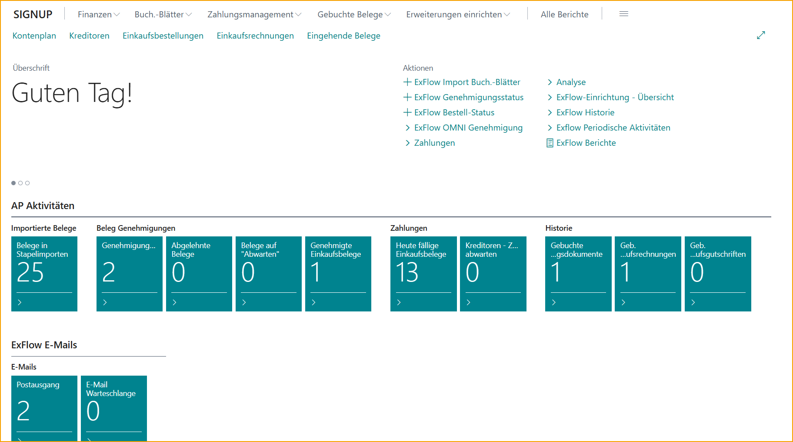
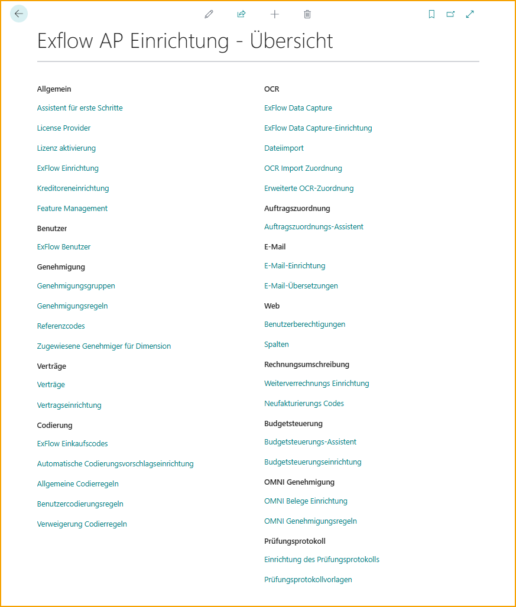

## ExFlow-Menü

Verwenden Sie das ExFlow-Menü, um ExFlow-Seiten, Aufgaben, Berichte usw. in Business Central zu entdecken.

Nutzen Sie die Business Central-Suchfunktion und geben Sie ExFlow ein, um alle ExFlow-Vorschläge zu sehen.

## ExFlow Rollencenter 

ExFlow hat derzeit zwei Rollen: ExFlow Accountant und ExFlow Approver.

### Rollencenter - ExFlow Accountant

Wechseln Sie einfach die Rolle zu "ExFlow Accountant" in "Meine Einstellungen", um dieses ExFlow-Menü zu erhalten.

Benutzer können über diese Rolle einfach auf Import-Journale, Genehmigungsstatus, Berichte usw. zugreifen.

Klicken Sie auf die drei Linien oben in der rechten Ecke, um das Menü über Business Central anzuzeigen.

Je nach ausgewählter Rolle in "Meine Einstellungen" wird ein Startmenü ausgewählt.

Klicken Sie auf "Weitere Rollen erkunden" und dann auf ExFlow-Menü - Erkunden, um das Menü zu erweitern.

Jetzt ist das ExFlow-Menü unabhängig von der Rolle in "Meine Einstellungen" sichtbar.

### ExFlow Setup Übersicht
Gehen Sie zu: **ExFlow Setup - Übersicht** oder greifen Sie über das ExFlow Accountant Rollencenter auf diese Übersicht zu.

Finden Sie alle ExFlow AP-Einstellungen in der ExFlow AP Setup - Übersicht.

 

### Rollencenter - ExFlow Approver

Benutzer können auch das ExFlow Approver Rollencenter nutzen, um einfach auf ExFlow Genehmigungsaktivitäten und ihre genehmigte Dokumenthistorie zuzugreifen.

