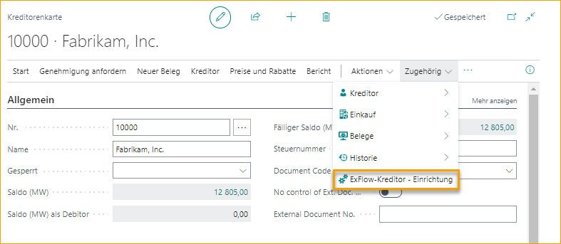

## Lieferantenkarte

Gehe zu: **Lieferanten --> Lieferantenkarte**

In ExFlow 23.0.0.0 wurden alle Einstellungen von der Lieferantenkarte und den erweiterten Lieferantenoptionen von ExFlow in die ExFlow Lieferanteneinrichtung verschoben. Dies geschieht automatisch beim Upgrade von ExFlow.

Gehe zu **Verwandt** und klicke auf **ExFlow Lieferanteneinrichtung**, um ExFlow-spezifische Details für einen bestimmten Lieferanten hinzuzufügen.

Lesen Sie mehr darüber, wie Sie Einstellungen für einen bestimmten Lieferanten vornehmen, unter [***Lieferanteneinrichtung***](https://docs.exflow.cloud/business-central/docs/user-manual/business-functionality/vendor-setup#vendor-setup).