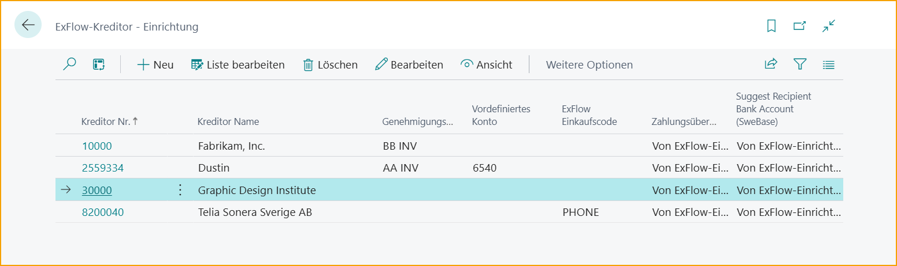

## Lieferanteneinrichtung

Gehe zu: ***ExFlow Lieferanteneinrichtung***

Fügen Sie lieferantenspezifische priorisierte Einstellungen hinzu, indem Sie die ExFlow Lieferanteneinrichtung verwenden. Die ExFlow Lieferanteneinrichtung kann durch Suchen, von der Standard-Lieferantenkarte, ExFlow Setup und Import Journal erreicht werden.

Bearbeiten Sie einfach die ExFlow Lieferanteneinrichtungsliste oder klicken Sie auf „Neu“, um die spezifische Lieferanteneinrichtungskarte zu öffnen und Einstellungen hinzuzufügen/zu ändern.

Die Standardeinstellungen werden in der ExFlow Lieferanteneinrichtungsliste angezeigt. Verwenden Sie Personalisieren, um die Liste bei Bedarf mit weiteren Feldern zu ändern.

| Lieferanteneinrichtungsmenü |  |
|:-|:-|
|**Neu** |Neuen Lieferanteneinrichtung hinzufügen
|**Liste bearbeiten** |Lieferanteneinrichtungsliste bearbeiten
|**Löschen** |Aktuelle Lieferanteneinrichtung löschen
|**Bearbeiten** |Aktuelle Lieferanteneinrichtungskarte bearbeiten
|**Anzeigen** |Aktuelle Lieferanteneinrichtungskarte öffnen
|*Weitere Optionen --> Verwandt* |
|**Verwandt --> Automatische Empfangszeilentypen** |Bearbeiten oder Anzeigen von Zeilentypen, die für einen bestimmten Lieferanten automatisch empfangen werden sollen.   Lesen Sie mehr darüber im Abschnitt [***Rechnung mit Empfangs-, Bestell- oder sowohl Empfangs- als auch Bestellzeilen abgleichen***](https://docs.signupsoftware.com/business-central/docs/user-manual/approval-workflow/purchase-order-matching-process#match-invoice-with-receipt--order--or-both-receipt-and-order-lines)
|**Verwandt --> Artikelnummer-Abgleichspriorität** |Bestimmen Sie die Reihenfolge, in der das System versucht, importierte Rechnungen mit Artikeln und Bestellzeilen abzugleichen.    Lesen Sie mehr darüber im Abschnitt [***Artikelnummer-Abgleichspriorität***](https://docs.signupsoftware.com/business-central/docs/user-manual/approval-workflow/purchase-order-matching-process#item-no-matching-priority)
|**Verwandt --> ExFlow Setup** |Öffnet [***ExFlow Setup***](https://docs.signupsoftware.com/business-central/docs/user-manual/technical/exflow-setup)
|**Verwandt --> Audit-Log --> Audit-Log** |Öffnet die Audit-Log-Übersicht.    Lesen Sie mehr darüber im Abschnitt [***Audit-Log***](https://docs.signupsoftware.com/business-central/docs/user-manual/business-functionality/audit-log#audit-log)

 

### Lieferanteneinrichtungskartenabschnitte

Öffnen Sie die ExFlow Lieferanteneinrichtungskarte, um ExFlow-bezogene Einstellungen pro Lieferant anzuzeigen/zu bearbeiten.

Klicken Sie auf den Abschnitt oder „Mehr anzeigen“, um alle Einstellungen anzuzeigen.

### Allgemein

Die Option „Von ExFlow Setup“ ist standardmäßig in den meisten Einstellungen gesetzt, was bedeutet, dass ExFlow die Standardkonfiguration (aus [***ExFlow Setup***](https://docs.signupsoftware.com/business-central/docs/user-manual/technical/exflow-setup#exflow-setup)) übernimmt, wenn keine andere Konfiguration auf der Lieferanteneinrichtungskarte für den spezifischen Lieferanten ausgewählt ist.

|Allgemein|  |
|:-|:-|
|**Lieferantennummer** |Gibt die Lieferantennummer an
|**Lieferantenname** |Gibt den Lieferantennamen an
|**Genehmigungsregel** |Gibt die Standardgenehmigungsregel an, die für einen bestimmten Lieferanten angewendet werden soll
|**Vordefiniertes Konto** |Das vordefinierte ExFlow-Konto kann verwendet werden, um nur ein Sachkonto für die Rechnungen/Gutschriften dieses Lieferanten vorzuschlagen. Dieses Feld kann nicht zusammen mit dem ExFlow-Einkaufscode verwendet werden.  Wenn „ExFlow vordefiniertes Konto“ und „ExFlow Einkaufscode“ leer sind, kann stattdessen das „Vordefinierte Konto“ aus dem ExFlow Setup verwendet werden.
|**ExFlow Einkaufscode** |Der ExFlow Einkaufscode wird verwendet, wenn nur ein Sachkonto nicht ausreicht. Dieses Feld kann nicht zusammen mit dem ExFlow vordefinierten Konto verwendet werden. Wenn „ExFlow vordefiniertes Konto“ und „ExFlow Einkaufscode“ leer sind, kann stattdessen der „ExFlow Einkaufscode“ aus dem ExFlow Setup verwendet werden.   Lesen Sie mehr darüber im Abschnitt [***Einkaufscodes***](https://docs.signupsoftware.com/business-central/docs/user-manual/business-functionality/purchase-codes#purchase-codes)
|**Änderungen automatisch überprüfen** |Wenn ein Dokument genehmigt ist, wird die Überprüfung der Änderungen automatisch durchgeführt. Wenn es keine Änderungen am Dokument gibt, wird der Status „Bereit zum Buchen“ angezeigt.
|**Doppelte Rechnungen zulassen** |Beim Empfang von Rechnungen mit derselben Rechnungsnummer von einem Lieferanten. Z.B. Versicherung und Steuerbehörde. Dieses Kontrollkästchen kann verwendet werden, um die Kontrolle der Rechnungsnummer dieses Lieferanten zu umgehen. Es ist nun möglich, mehr als eine Rechnung für diesen Lieferanten mit derselben Lieferantendokumentnummer zu buchen.
|**Vorschlag für Mehrwertsteuerzeile** |Wenn ein bestimmter Lieferant Mehrwertsteuerzeilen hat, die in den Genehmigungsfluss aufgenommen werden sollen, kann diese Einstellung auf Lieferantenebene auf „Ja“ gesetzt werden. Andernfalls wird standardmäßig die allgemeine Einstellung aus dem ExFlow Setup verwendet.
|**Factoring-Lieferant** |Wenn der Lieferant nur für Factoring verwendet wird, gibt es ein Kontrollkästchen, das verhindert, dass Rechnungen/Gutschriften für diesen Lieferanten erstellt werden, und er kann nur als „Zahlung an Lieferantennummer“ über „Kauf von Lieferant“ verwendet werden.    Markieren Sie das Kontrollkästchen „Factoring-Lieferant“ bei der „Zahlung an Lieferantennummer“ und fügen Sie diese Lieferantennummer auf der „Kauf-von-Lieferantenkarte“ hinzu.     Wenn ein Dokument auf einem Factoring-Lieferanten interpretiert wird, gibt das ExFlow Import Journal eine Aktionsmeldung aus: „Diese Rechnung ist als Factoring gekennzeichnet und darf daher nicht erstellt werden!“.
|**Zahlungsvalidierung** |Gibt an, ob der Zahlungsvalidierungsprozess während des Import- und Dateninterpretationsprozesses angewendet wird.    Lesen Sie mehr darüber im Abschnitt [***Zahlungsvalidierungs-Setup***](https://docs.signupsoftware.com/business-central/docs/user-manual/business-functionality/payment-validation-and-payment-suggestion)
|**Empfängerbankkonto vorschlagen** |Gibt an, ob der Vorschlag des Empfängerbankkontos aktiviert ist.    Lesen Sie mehr darüber im Abschnitt [***Empfängerbankkonto vorschlagen***](https://docs.signupsoftware.com/business-central/docs/user-manual/business-functionality/payment-validation-and-payment-suggestion#setup-payment-validation--suggest-recipient-bank-account)
|**Abgrenzung vorwärts verschieben** |Wenn das Buchungsdatum im Abgrenzungsplan vor dem zulässigen Buchungsdatum für den Benutzer liegt, wird dieser Zeitraum am ersten zulässigen Buchungsdatum im Hauptbuch-Setup oder Benutzer-Setup gebucht. ExFlow verschiebt Abgrenzungen nur für geschlossene Perioden vorwärts.    Lesen Sie mehr darüber im Abschnitt [***Abgrenzung vorwärts verschieben***](https://docs.signupsoftware.com/business-central/docs/user-manual/approval-workflow/exflow-import-journals#move-deferral-forward)
|**Vertrauliche Dokumente** |Gibt an, ob Dokumente als vertrauliche Dokumente behandelt werden sollen.

 

### Dokumentenerstellungsprüfungen

|Dokumentenerstellungsprüfungen|  |
|:-|:-|
|**Dokumente automatisch erstellen** |Aktivieren Sie dieses Feld, wenn interpretierte Dokumente automatisch aus dem ExFlow Import Journal für einen bestimmten Lieferanten erstellt werden sollen. Wenn das Feld auf der Lieferantenkarte aktiviert ist, werden alle interpretierten Dokumente ohne Fehler- oder Warnmeldungen automatisch erstellt und zur Genehmigung gesendet.   Diese Funktion kann ohne Einrichtung im ExFlow Import Journal verwendet werden. Es ist jedoch möglich, die ExFlow Import Journal-Liste zu personalisieren und die Spalte „Dokumente automatisch erstellen“ hinzuzufügen, um ein dediziertes Journal für die automatische Dokumentenerstellung zu haben.   Lesen Sie mehr darüber im Abschnitt [***Batch-Import von Dokumenten aus der Interpretation***](https://docs.signupsoftware.com/business-central/docs/user-manual/approval-workflow/exflow-import-journals#batch-import-documents-from-interpretation) und im Abschnitt [***Hintergrundverarbeitung***](https://docs.signupsoftware.com/business-central/docs/user-manual/approval-workflow/exflow-approval-status#background-processing)
|**Referenzen überprüfen** |Wenn aktiviert, muss das Dokument eine ExFlow-Referenz enthalten.
|**Währungscode des Lieferanten abgleichen** |Gibt an, ob der Währungscode auf dem importierten Dokument mit dem Währungscode auf der Lieferantenkarte übereinstimmen muss.    Lesen Sie mehr darüber im Abschnitt [***Währungscode des Lieferanten abgleichen***](https://docs.signupsoftware.com/business-central/docs/user-manual/approval-workflow/exflow-import-journals#match-vendors-currency)
|**Im Import Journal blockieren** |Gibt an, ob Dokumente von der Erstellung blockiert werden sollen
|**Ausschließen, wenn Lieferantendokumentnummer mit beginnt** |Gibt den Ausschluss des importierten Dokuments von der Erstellungsblockierung an, wenn die Lieferantendokumentnummer mit… beginnt. Diese Einstellung wird angezeigt, wenn „Im Import Journal blockieren“ aktiviert ist.
|**Dimensionen überprüfen** |Gibt an, ob die Standarddimensionseinstellungen in Business Central überprüft werden sollen, wenn die Rechnung erstellt wird
|**Automatische Zuordnung der Mehrwertsteuerdifferenz für die Erstellung** |Gibt an, ob die automatische Zuordnung der Mehrwertsteuerdifferenz erfolgen soll, wenn die Differenz der Mehrwertsteuer auf den Zeilen und im Kopf innerhalb der maximal zulässigen Mehrwertsteuerdifferenz liegt
|**Beträge testen** |Gibt an, ob die Brutto-/Netto-/Mehrwertsteuerbeträge auf dem Dokument auf Abweichungen (Differenz zwischen der Summe der Dokumentzeilen und dem entsprechenden Betrag im Dokumentenkopf) überprüft werden sollen, bevor die Rechnung erstellt wird.

 

### Dokumentenbuchungsprüfungen

|Dokumentenbuchungsprüfungen|  |
|:-|:-|
|**Dokumente automatisch buchen**| Aktivieren Sie "Dokumente automatisch buchen", um Dokumente für einen bestimmten Lieferanten im Genehmigungsstatus automatisch zu buchen, wenn das Dokument bereit zum Buchen ist. ExFlow versucht nur einmal zu buchen. Wenn während des Buchungsvorgangs Fehlermeldungen auftreten, bleibt das Dokument im Genehmigungsstatus ungebucht zusammen mit einer Fehlermeldung. Korrigieren Sie den Fehler und buchen Sie manuell.
|**Vor dem Buchen blockieren**| Gibt an, ob Dokumente vor dem Buchen blockiert werden sollen.

 

### PO-Abgleich

|PO-Abgleich|  |
|:-|:-|
|**Dokumente abgleichen mit**| Gibt an, ob ExFlow Zeilen aus Bestellungen oder aus gebuchten Wareneingängen oder aus beiden Bestellungen und Wareneingängen abgleichen und abrufen soll.    Lesen Sie mehr darüber im Abschnitt [***Rechnung mit Empfangs-, Bestell- oder sowohl Empfangs- als auch Bestellzeilen abgleichen***](https://docs.signupsoftware.com/business-central/docs/user-manual/approval-workflow/purchase-order-matching-process#match-invoice-with-receipt--order--or-both-receipt-and-order-lines)
|**Bestellung automatisch empfangen**| Gibt an, ob Bestellzeilen jedes Zeilentyps automatisch empfangen werden sollen, wenn die abgeglichene Rechnung auf "Bereit zum Buchen" gesetzt ist. Diese Option ist nur anwendbar, wenn die Einstellung "Dokumente abgleichen mit" als "Bestellung" oder "Bestellung und Wareneingang" konfiguriert ist.
|**Spezifische Zeilendifferenz-Einheitskosteneinstellung**| Die Felder ''In LCY'' und ''Prozent %'' werden sichtbar, wenn diese Einstellung aktiviert ist.
|**Spezifische Max. Sonstige Einstellung**| Aktivieren, um die Max. Sonstige Funktion zu aktivieren.
|**Max. Sonstige Kosten (LCY)**| Geben Sie die maximalen sonstigen Kosten in LCY ein.
|**Diff. Zeilen-Einkaufscode**| Wählen Sie den ExFlow-Einkaufscode, der für die Differenzzeile ausgewählt werden soll.
|**Spezifische Differenzeinstellung**| Aktivieren, um die spezifische Differenzeinstellung zu aktivieren.
|**Empfangsnummer erforderlich**| Aktivieren, wenn die Empfangsnummer erforderlich ist.
|**Bestellungen nicht abgleichen**| Aktivieren, wenn für diesen Lieferanten kein Bestellabgleich erfolgen soll.
|**Genehmigung nur für Abweichungen**| Wählen Sie, ob die Genehmigung nur für Abweichungen mit der Option: ExFlow-Einrichtung, Ja oder Nein angewendet werden soll.
|**Automatische Zuordnung der Artikelkosten**| Gibt an, welcher Typ der Artikelkosten-Zuordnung beim Buchen von Rechnungen verwendet werden soll. Es kann gleichmäßig, nach Betrag, nach Gewicht oder nach Volumen automatisch erfolgen. Keine = keine automatische Zuordnung erfolgt.    Lesen Sie mehr darüber im Abschnitt [***Artikelkosten-Zuordnung***](https://docs.signupsoftware.com/business-central/docs/user-manual/approval-workflow/exflow-import-journals#item-charge-assignment)
|**Abgeglichene Zeilen in OCR-Zuordnung speichern**| Diese Option kann verwendet werden, um manuell abgeglichene Rechnungszeilen aus der "Abgleichsansicht" basierend auf Lieferant, interpretiertem Artikel Nr. automatisch zu speichern. Diese Zeilen werden in der ExFlow OCR Import Mapping-Tabelle gespeichert und können erneut verwendet werden, um den Abgleich für zukünftige PO-Rechnungen mit denselben Kriterien vorzuschlagen.
|**Mehrfachzeilenabgleich**| Diese Einstellung ermöglicht es ExFlow, eine Rechnungszeile mit mehreren Bestellzeilen oder Empfangszeilen abzugleichen. Wenn die Menge der Rechnungszeile größer ist als die Menge der Bestellzeile, teilt ExFlow die Rechnungszeile auf und fährt fort, teilweise mit anderen verfügbaren Bestellzeilen oder Empfangszeilen abzugleichen.
|**Aufgeteilte Rechnungszeilen überprüfen**| Wenn "Mehrfachzeilenabgleich" aktiviert ist, gibt ExFlow Aktionsmeldungen für jede Zeile aus, die aufgeteilt wurde, was dem Benutzer die Möglichkeit gibt, den vorgeschlagenen Abgleich manuell zu bestätigen, bevor das Dokument erstellt wird. Wenn diese Einstellung auf "false" gesetzt ist, wird keine Aktionsmeldung für abgeglichene aufgeteilte Zeilen angezeigt.
|**PO-Header-Werte auf Rechnung verwenden**| Aktivieren Sie Felder, um sie aus der Bestellung auf die Rechnung (oder Rücksendebestellung auf Gutschrift) im Import Journal zu übertragen, wenn der Bestellabgleich auf Header-Ebene verwendet wird. Ausgewählte Werte können unter Verwandt --> Erweitert --> PO-Header-Werte auf Rechnung eingerichtet und aktualisiert werden.    Lesen Sie mehr darüber im Abschnitt [***Kopieren von Bestellkopfwerten***](https://docs.signupsoftware.com/business-central/docs/user-manual/business-functionality/copy-po-header#copy-purchase-order-header-values)
|**Rechnungen automatisch genehmigen**| Gibt an, ob die Rechnung automatisch genehmigt werden soll, wenn die zugehörige Bestellung genehmigt ist.    Lesen Sie mehr darüber im Abschnitt [***Rechnungen automatisch genehmigen***](https://docs.signupsoftware.com/business-central/docs/user-manual/approval-workflow/purchase-order-matching-process#auto-approve-purchase-order-matching-invoices)
|**Max. Rechnungsbetrag für Systemgenehmigung (LCY)**| Gibt den maximal zulässigen Rechnungsbetrag für automatische Genehmigungen an. 0 = deaktiviert
|**Benutzer für automatische Genehmigung**| Gibt den ExFlow-Benutzer an, der für automatisch genehmigte Rechnungen verwendet werden soll. Wenn diese Einstellung leer ist, wird die ID des angemeldeten BC-Benutzers verwendet.
|**Direkte Einheitskosten überprüfen**| Geben Sie an, ob ExFlow die Einheitskosten auf der Rechnungszeile überprüfen soll, wenn Rechnungen mit Bestellungen abgeglichen werden. Die importierte Rechnung muss zeileninterpretiert sein, damit dies funktioniert.

 

### OCR-Import

|OCR-Import|  |
|:-|:-|
|**Fälligkeitsdatum setzen auf (OCR)**| Gibt an, wie das Standardfälligkeitsdatum beim Import einer Rechnung festgelegt werden soll.
|**Importierten Währungscode ignorieren**| Gibt an, dass ExFlow den importierten Währungscode immer löschen soll, d.h. keine Währung wird beim Import von Rechnungen verwendet.
|**OCR-Zeilen ignorieren**| Gibt an, dass ExFlow importierte Rechnungszeilen immer ignorieren soll, d.h. nur Rechnungsheader-Informationen werden verwendet.
|**Spezifische Sonstige Code-Einstellung**| Aktivieren, um sonstige Einkaufscodes zu nutzen.
|**Sonstige Einkaufscodes**| Gibt den Standard-Einkaufscode an, wenn die Sonstige Code-Zuordnung verwendet wird. Klicken Sie auf die drei Punkte, um die Einkaufscode-Einrichtungsliste zu öffnen.
|**Automatische Mengenzuordnung**| Gibt an, ob die Menge auf 1 umgerechnet werden soll, wenn die importierte Menge 0 ist.
|**Master-Daten-Synchronisation ignorieren**| Es ist möglich, die Master-Daten-Synchronisation auf Lieferantenebene zu ignorieren. Aktivieren Sie einfach das Kontrollkästchen "Master-Daten-Synchronisation ignorieren" auf dem gewählten Lieferanten in seiner Lieferanteneinrichtungskarte, um sicherzustellen, dass seine Stammdaten nicht an ExFlow Data Capture gesendet werden.
|**Artikelnummer-Abgleichspriorität**| Bestimmen Sie die Reihenfolge, in der das System versucht, importierte Rechnungen mit Artikeln und Bestellzeilen abzugleichen. Aktuelle Optionen sind: ''Aus ExFlow-Einrichtung'', ''Kein Abgleich'' und ''Aus Lieferanteneinrichtung''.    Lesen Sie mehr darüber im Abschnitt [***Artikelnummer-Abgleichspriorität***](https://docs.signupsoftware.com/business-central/docs/user-manual/approval-workflow/purchase-order-matching-process#item-no-matching-priority)

 

### Genehmigung

|Genehmigung|  |
|:-|:-|
|**Mehrwertsteuerzeilen genehmigen**| Gibt an, ob die Mehrwertsteuerzeilen in den Genehmigungsfluss aufgenommen werden sollen. Wenn ein ExFlow-Einkaufscode im Kopf verwendet wird, wird diese Einstellung ignoriert.    Lesen Sie mehr darüber im Abschnitt [***Mehrwertsteuerzeilen genehmigen.***](https://docs.signupsoftware.com/business-central/docs/user-manual/business-functionality/approve-vat-lines)

 

### Automatische Kodierungsvorschläge

|Automatische Kodierungsvorschläge|  |
|:-|:-|
|**Automatische Kodierungsvorschläge für importiertes Dokument**| Gibt an, wie der automatische Kodierungsvorschlag für den Lieferanten verwendet wird.
|**Startdatum für automatische Vorschläge berechnen**| Gibt das Startdatum des Dokuments an, das in den automatischen Kodierungsvorschlägen für diesen Lieferanten verwendet werden soll.
|**Automatische Kodierungssumme aus Kodierungssatz-ID vorschlagen**| Gibt an, ob der Betrag automatisch auf die Dokumentenzeile basierend auf dem Nutzungsprozentsatz in der Kodierungssatz-ID für diesen Lieferanten vorgeschlagen wird.    Lesen Sie mehr darüber im Abschnitt [***Einrichtung der automatischen Kodierungsvorschläge***](https://docs.signupsoftware.com/business-central/docs/user-manual/business-functionality/auto-coding-suggestion-setup#auto-coding-suggestion-setup)

