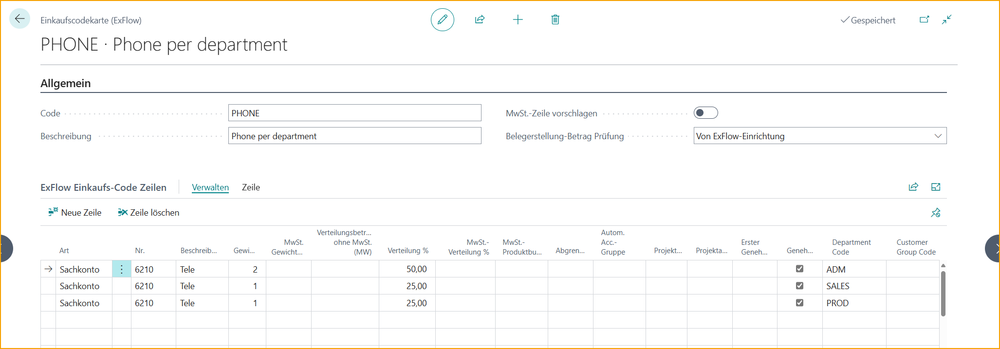
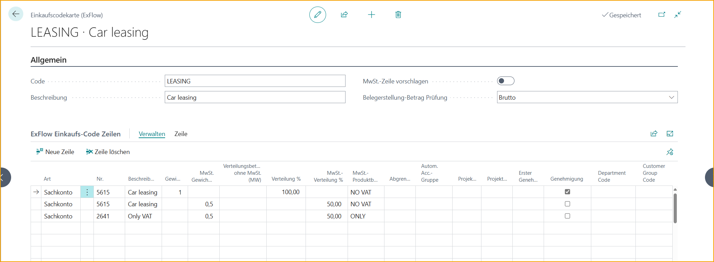

## Einkaufscodes

Gehe zu: ***Setup \--\> ExFlow Manual Setup \--\> ExFlow Purchase Codes***

Ein ExFlow-Einkaufscode kann verwendet werden, um automatisch Codierungen auf Rechnungszeilen aus der Lieferanteneinrichtungskarte, Referenz, Vertrag oder ExFlow-Einrichtung hinzuzufügen. Ein ExFlow-Einkaufscode kann Zeilen auf mehrere Dimensionscodes, MwSt.-Produktbuchungsgruppen usw. aufteilen.

### Einen neuen ExFlow-Einkaufscode erstellen

#### Allgemein
Beginnen Sie, indem Sie auf "Neu" klicken. Geben Sie einen Code und eine Beschreibung ein, die zum ExFlow-Einkaufscode passen.

| Allgemein      |    |
|:-|:-|
| **MwSt.-Zeile vorschlagen:**             | Diese Einstellung muss in der ExFlow-Einrichtung für die MwSt.-Produktbuchungsgruppe 0% und die MwSt.-Produktbuchungsgruppe 100% vorgenommen werden. Dann kann eine separate Zeile für den MwSt.-Betrag automatisch für einen bestimmten ExFlow-Einkaufscode hinzugefügt werden.
| **Dok.-Erstellungsbetragsprüfung:**   | In der ExFlow-Einrichtung gibt es eine Einstellung für Dok.-Erstellungsprüfungen im Testbetrag. Durch diese Einstellung ist eine separate Betragskontrolle für einen bestimmten ExFlow-Einkaufscode möglich.   **Keine:** Keine Prüfung zwischen Betrag im Kopf und Zeilen   **Brutto:** Prüfung nur für den Gesamtbetrag inkl. MwSt. zwischen Kopf und Zeilen  **Netto+MwSt.:** Prüfung sowohl des Betrags ohne MwSt. als auch des MwSt.-Betrags zwischen Kopf und Zeilen  **ExFlow-Einrichtung:** Verwendung der Einstellung aus der ExFlow-Einrichtung   

#### ExFlow-Einkaufscodezeilen

In den ExFlow-Einkaufscodezeilen können ein oder mehrere Felder verwendet werden:

| ExFlow-Einkaufscodezeilen      | |
|:-|:-|
|**Typ:**                      | Sachkonto, Artikel, Ressource, Anlagevermögen oder Gebühr (Artikel)
| **Nr.:**                      | Aus der Liste auswählen
| **Beschreibung:**              | Ändern oder wie vorgeschlagen verwenden
| **Gewicht:**                   | Die Zahl in diesem Feld gibt die Anzahl der Teile an, die dieser Zeile zugewiesen werden. Beispiel: Wenn in diesem Feld eine 1 eingegeben wird und 3 andere Zeilen ebenfalls eine 1 in diesem Feld haben, wird 1 Teil des Kostenbetrags von insgesamt 4 zugewiesen, also 25%. Wenn mehr als eine Zeile verwendet wird und der Betrag manuell im ExFlow-Importjournal ausgewählt wird, lassen Sie dieses Feld leer.
| **MwSt.-Gewicht**:               | Wie oben, aber für MwSt.
| **Zuweisungsbetrag**:        | Einen festen Betrag der Rechnungszeile zuweisen. Diese Spalte kann nicht gleichzeitig mit einer der Gewichtsspalten ausgefüllt werden.
| **Zuweisungs-%:**             | Diese Spalte zeigt den berechneten Prozentsatz aus der Gewichtsspalte an.
| **MwSt.-Zuweisungs-%:**         | Wie oben, aber für MwSt.
| **MwSt.-Produktbuchungsgruppe:**  | Bei Verwendung dieses Feldes wird der Wert auf Typ/Nr. und "Standard-MwSt.-Produktbuchungsgruppe" in der "ExFlow-Einrichtung" überschrieben.
| **Abgrenzungscode:**            | Aus der Liste auswählen. Das Abgrenzungsstartdatum wird automatisch aus der Abgrenzungskarte ausgewählt.
| **Projektnr.:**                  | Aus der Liste auswählen
| **Projektaufgabennr.:**             | Aus der Liste auswählen
| **Erster Genehmiger:**           | Aus der Liste auswählen. Wie dies verwendet wird, hängt von den Einstellungen in der ExFlow-Einrichtung ab.
| **Dimensionen:**               | Aus der Liste auswählen
| **Genehmigung**:                 | Gibt an, ob die markierte Zeile zur Genehmigung gesendet werden soll oder nicht.

Hier ist ein Beispiel für die Aufteilung der Kosten nach Abteilung:

In diesem Beispiel wird die MwSt. auf das Sachkonto mit 50 % gewichtet, aber die Betragsprüfung erfolgt immer für Brutto, anstatt die ExFlow-Einrichtung zu berücksichtigen. Dies kann in Schweden nützlich sein, wo 50% der MwSt. abzugsfähig ist. Interpretieren Sie die gesamte MwSt. und nur 50% werden als separate Zeile hinzugefügt.

Dies kann nützlich sein, wenn die volle MwSt. in einem bestimmten Fall nicht abzugsfähig ist, z.B. bei der Kfz-Leasing in Schweden.

Hier ist ein Beispiel, wie ein ExFlow-Einkaufscode eingerichtet wird, wenn eine Genehmigung des MwSt.-Betrags erforderlich ist. Fügen Sie die gewünschte Codierung und eine separate Zeile mit einem MwSt.-Sachkonto hinzu und markieren Sie manuell das Genehmigungsfeld.

Zeilen mit einem Gewicht werden automatisch zur Genehmigung markiert. Die Genehmigung ist optional bei Zeilen mit einem MwSt.-Gewicht, daher denken Sie daran, das Genehmigungsfeld zu markieren, wenn eine Genehmigung der MwSt. für die ausgewählten ExFlow-Einkaufscodes gewünscht wird.

Fügen Sie die gewünschte Codierung für das Kostenkonto hinzu (KEINE MwSt. = Ohne MwSt. in der MwSt.-Produktbuchungsgruppe) und eine separate Zeile mit einem MwSt.-Sachkonto (NUR = Nur manuell gebuchte MwSt. in der MwSt.-Produktbuchungsgruppe). Geben Sie eine MwSt.-Produktbuchungsgruppe in den Zeilen an, wenn sie von der Einrichtung auf der Sachkontokarte abweicht.

Bitte beachten Sie, wenn MwSt.-Zeilen immer zur Genehmigung gesendet werden sollen, kann die Funktion ''MwSt.-Zeilen genehmigen'' genutzt werden.

Lesen Sie mehr darüber im Abschnitt [***MwSt.-Zeilen genehmigen.***](https://docs.exflow.cloud/business-central/docs/user-manual/business-functionality/approve-vat-lines)
