## Vertrag

Gehe zu: ***Setup \--\> ExFlow Manuelle Einrichtung \--\> ExFlow Verträge***

ExFlow Vertrag kann verwendet werden, um den Überblick über erhaltene und fehlende Rechnungen für Verträge zu behalten und kann auch automatisch abgeglichene Rechnungen genehmigen. Beginnen Sie, indem Sie auf "Neu" klicken, um einen neuen Vertrag zu erstellen.

Um Verträge einzurichten und zu genehmigen, lesen Sie mehr im Abschnitt [***OMNI Genehmigung***](https://docs.exflow.cloud/business-central/docs/user-manual/business-functionality/omni-approval).

### Allgemein
Unter diesem Abschnitt fügen Sie allgemeine Informationen für diesen spezifischen Vertrag hinzu, Lieferant, Genehmigungsworkflow und Codierung.

|Allgemein |  |
|:-|:-|
| **Vertragsnummer**:                         | Automatisch in der Reihenfolge erstellt, in der sie erstellt wurden
| **Lieferantennummer**:                           | Lieferanten aus der Liste auswählen
| **Lieferantenname**:                          | Name für ausgewählte Lieferantennummer anzeigen
| **Externe Vertragsnummer**:                | Referenz, die auf der Rechnung interpretiert werden kann, um einen bestimmten Vertrag abzugleichen  Wenn ein Referenzcode erstellt wird, kann die externe Vertragsnummer nicht mehr geändert werden.  Um zu aktualisieren, ändern Sie die externe Vertragsnummer und drücken Sie die Eingabetaste 
| **Nachricht**:                              | Sie dürfen die externe Vertragsnummer nicht aktualisieren. Möchten Sie stattdessen eine verwandte Referenz hinzufügen? Antworten Sie mit Ja, und die verwandte Referenz wird automatisch auf der Referenzkarte hinzugefügt
| **Deaktiviert**:                          | Ja oder Nein. Um eine Rechnung abzugleichen, muss der Vertrag aktiv sein
| **Anlage zur abgeglichenen Rechnung kopieren**:   | Ja oder Nein. Wenn ja, fügen Sie eine Anlage hinzu
| **Referenz erstellt**:                    | Wenn eine Referenz erstellt wird, wird der Referenzcode mit einem Link zur ExFlow-Referenzkarte angezeigt
| **ExFlow Einkaufscode**:                 | Fügen Sie den ExFlow Einkaufscode hinzu, und Rechnungspositionen werden automatisch im Importjournal erstellt
| **Erster Genehmiger**:                       | Gibt den ersten Genehmiger an, der für abgeglichene Rechnungen verwendet werden soll. Aufgrund der Einstellung "Ersten Genehmiger in den Genehmigungsworkflow kopieren" in der ExFlow-Einrichtung kann der erste Genehmiger als Genehmiger oder zur Definition einer Genehmigungsregel mit Übereinstimmung des ersten Genehmigers verwendet werden
| **Genehmigungsregel**:                        | Gibt die Genehmigungsregel an, die verwendet werden soll, wenn eine Rechnung mit diesem Vertrag abgeglichen wird  Fügen Sie eine spezifische Genehmigungsregel hinzu, die immer für diesen Vertrag verwendet werden soll. Der Genehmigungsworkflow wird nicht aktualisiert, auch wenn die Codierung im Genehmigungsprozess geändert wird  Der erste Genehmiger kann auch als Filter verwendet werden, um automatisch eine Genehmigungsregel zur Rechnung hinzuzufügen, aber in diesem Fall kann die Genehmigungsregel nicht für den ExFlow-Vertrag verwendet werden
| **Einkäufercode**:                       | Gibt einen Einkäufercode an, der angewendet werden soll, wenn eine Rechnung mit diesem Vertrag abgeglichen wird. Kann verwendet werden, um eine Genehmigungsregel festzulegen, wenn keine Genehmigungsregel oben hinzugefügt wurde
| **Referenzbeschreibung**:                | Gibt die Beschreibung an, die zur Referenz hinzugefügt wird  Beim Aktualisieren der Beschreibung wird die erstellte Referenzbeschreibung automatisch aktualisiert
| **Selbstabrechnungsrechnung**:                 | Um Selbstabrechnungsrechnungen zu erstellen, müssen PDF-Anlagen hinzugefügt werden
| **Selbstabrechnungsrechnung erstellen**:          | Wählen Sie aus, wie Selbstabrechnungsrechnungen erstellt werden sollen - **Pro Periode:** Eine Rechnung pro Periode bis zum heutigen Datum  - **Alle:** Eine Rechnung pro Periode für alle erstellten Perioden
| **Lieferantenrechnungsnummer**:                   | Dadurch wird eine Lieferantenrechnungsnummer für Selbstabrechnungsrechnungen erstellt

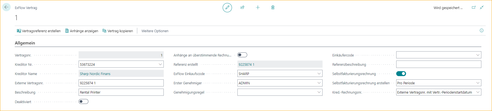

### Allgemeine Bedingungen
Unter Allgemeine Bedingungen fügen Sie die Gesamtsummen für diesen spezifischen Vertrag hinzu.

|Allgemeine Bedingungen|  |
|:-|:-|
| **Gültig von Datum und Gültig bis Datum**:    | Bedingungen des Vertrags  Wenn Rechnungsperioden erstellt werden, kann das Gültig bis Datum verwendet werden, um Rechnungsperioden zu verlängern  Lesen Sie mehr unten im Abschnitt [***Rechnungsperioden***](https://docs.exflow.cloud/business-central/docs/user-manual/business-functionality/contract#extend-contract-with-invoice-periods)
| **Währungscode**:                        | Der Währungscode, der bei der Rechnungsstellung des Vertrags verwendet werden soll
| **Gesamtvertragsbetrag (Nettowährung)**: | Gibt den Gesamtvertragsbetrag einschließlich Toleranzen an.

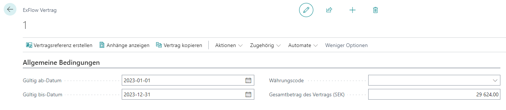

### Periodizität
Fügen Sie den Rechnungsbetrag, die Periodizität und die Anzahl der Rechnungen pro Periode hinzu.
Bei der Arbeit mit Rechnungsperioden wird dieser Abschnitt nur verwendet, um Werte zu kopieren, wenn Perioden erstellt werden.

|Periodizität |  |
|:-|:-|
| **Rechnungsperiode**:                     | Wenn Rechnungsperiode zum Beispiel pro Quartal = 3M oder jeden Monat = 1M
| **Periode Startdatum**:                    | Startdatum für die nächste Rechnung
| **Periode Enddatum**:                      | Wird automatisch aufgrund der Rechnungsperiode berechnet
| **Daten basierend auf**:                 | Buchungsdatum, Dokumentdatum oder Fälligkeitsdatum
| **Anzahl der Rechnungen pro Periode:**         | Gibt die Anzahl der erwarteten Rechnungen während der Rechnungsperiode an
| **Perioden überprüfen**:                        | Ja oder Nein. Gibt an, ob der Vertragszeitraum überprüft werden soll. Wenn deaktiviert, erfolgt keine Überprüfung pro Rechnung, sondern nur für Vertragssummen unter Allgemeine Bedingungen
| **Max. Rechnungsbetrag (Nettowährung)**:   | Gibt den maximalen Betrag für eine Rechnung an, die mit diesem Vertrag verbunden ist.
| **Toleranzprozentsatz**:                 | Wird zusammen mit dem Toleranzbetrag verwendet und ermöglicht das Abgleichen und automatische Genehmigen von abgeglichenen Rechnungen innerhalb von Toleranzen  Wenn Vertragsperioden hinzugefügt werden, muss für jede Periode eine Toleranz hinzugefügt werden
| **Toleranzbetrag**:                     | Wird zusammen mit dem Toleranzprozentsatz verwendet und ermöglicht das Abgleichen und automatische Genehmigen von abgeglichenen Rechnungen innerhalb von Toleranzen  Wenn Vertragsperioden hinzugefügt werden, muss für jede Periode eine Toleranz hinzugefügt werden
| **Zahlungsbedingungen Code**:                   | Wird für diesen spezifischen Vertrag anstelle des aktuellen Lieferantenkarten kopiert

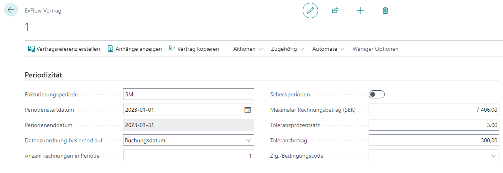

### Rechnungsperioden
Rechnungsperioden können verwendet werden, um Rechnungen mit unterschiedlichen Beträgen oder Toleranzen pro Periode abzugleichen, aber auch um eine Erinnerung zu senden, wenn für eine bestimmte Periode eine Rechnung fehlt. 
Für Selbstabrechnungsrechnungen ist es erforderlich, erstellte Rechnungen im Auge zu behalten.

#### Rechnungsperiode erstellen
Gehe zu: ***ExFlow Vertrag --> Rechnungsperioden --> Zeilen --> Rechnungsperioden erstellen*** 
Rechnungsperioden können automatisch erstellt werden, indem das Gültig von und bis Datum zusammen mit den Rechnungsperioden verwendet wird. 
Bei der Erstellung der Zeilen wird der Periodenbetrag aus "Max. Rechnungsbetrag (NET Währung)" multipliziert mit "Anzahl der Rechnungen pro Periode" unter Periodizität berechnet.

Wenn der Max. Rechnungsbetrag fehlt, wird die Berechnung aus dem Gesamtvertragsbetrag (NET Währung) durch Anzahl der Perioden durchgeführt.

Toleranzen und Zahlungsbedingungen Code werden aus Periodizität kopiert.

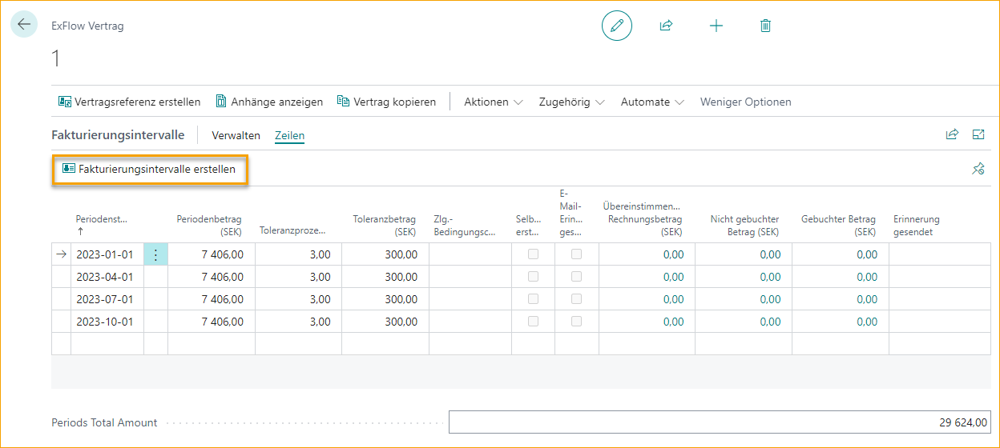

|Rechnungsperioden |  |
|:-|:-|
| **Periode Startdatum**:                        | Jede Periode hat ein Start- und Enddatum. Das Enddatum wird aus dem nächsten Startdatum -1 Tag berechnet. Rechnungen werden aufgrund der Einstellung "Daten basierend auf" für den aktuellen Vertrag der Periode zugeordnet. Das Periode Startdatum wird auch als Rechnungsdokumentdatum und Buchungsdatum verwendet, wenn Selbstabrechnungsrechnungen erstellt werden
| **Periode Betrag (NET Währung)**:             | Der Periodenbetrag ist der maximale Betrag pro Periode. Die Anzahl der Rechnungen wird nicht berechnet. Für Selbstabrechnungsrechnungen gibt es nur eine Rechnung pro Rechnungsperiodenzeile
| **Toleranzprozentsatz**:                     | Wird zusammen mit dem Toleranzbetrag verwendet und ermöglicht das Abgleichen und automatische Genehmigen von abgeglichenen Rechnungen innerhalb von Toleranzen. Verschiedene Toleranzen können pro Periode hinzugefügt werden
| **Zahlungsbedingungen Code**:                       | Der Zahlungsbedingungen Code auf dem ExFlow Vertrag ersetzt die Zahlungsbedingungen von der Lieferantenkarte. Verschiedene Zahlungsbedingungen können pro Periode hinzugefügt werden
| **Selbstabrechnungsrechnung erstellt**:             | Wird auf true gesetzt, wenn eine Selbstabrechnungsrechnung für diese spezifische Periode erstellt wird. Wenn das Dokument im Importjournal oder im Genehmigungsstatus gelöscht wird, wird es automatisch auf false gesetzt, und eine Selbstabrechnungsrechnung kann erneut erstellt werden
| **Abgeglichener Rechnungsbetrag (Nettowährung)**:    | Summen des Rechnungsbetrags pro Periode, der im Importjournal abgeglichen wurde. Über "Betrag (Netto LCY) personalisieren" kann hinzugefügt werden  Klicken Sie auf den Betrag, um alle Rechnungen anzuzeigen, und erweitern Sie die Ansicht, um alle Zeilen pro Rechnung anzuzeigen
| **Nicht gebuchter Betrag (Nettowährung)**:         | Summen des erstellten, aber nicht gebuchten Rechnungsbetrags pro Periode, der im Genehmigungsstatus abgeglichen wurde. Über "Nicht gebuchter Betrag (Netto LCY) personalisieren" kann hinzugefügt werden  Klicken Sie auf den Betrag, um alle Dokumente anzuzeigen, und erweitern Sie die Ansicht, um alle Zeilen pro Dokument anzuzeigen
| **Gebuchter Betrag (Nettowährung)**: | Summen der gebuchten Rechnungsbeträge pro Periode, die im Genehmigungsstatusverlauf abgeglichen wurden. Über "Gebuchter Betrag (Netto LCY) personalisieren" kann hinzugefügt werden  Klicken Sie auf den Betrag, um alle Dokumente anzuzeigen, und erweitern Sie die Ansicht, um alle Zeilen pro Dokument anzuzeigen

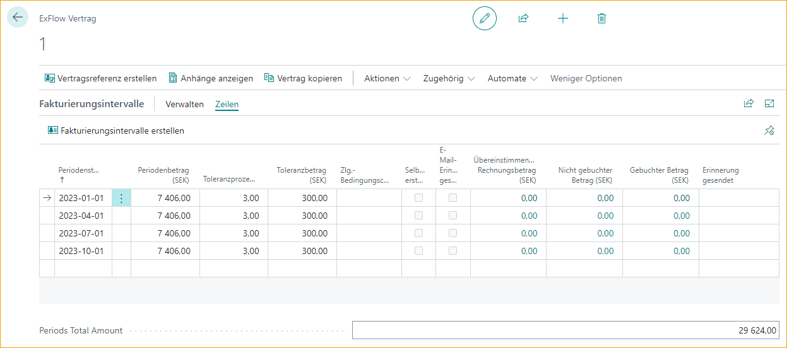

Für abgerechnete Summen siehe [***FactBox --> Details --> Statistik zum Kaufvertrag***](https://docs.exflow.cloud/business-central/docs/user-manual/business-functionality/contract#factbox--details--purchase-contract-statistic) unten.

### Vertrag mit Rechnungsperioden verlängern
Um einen Vertrag zu verlängern, der Perioden enthält, fügen Sie ein neues "Gültig bis Datum" in Allgemeine Bedingungen hinzu und aktualisieren Sie die Werte, die aus Periodizität kopiert werden.

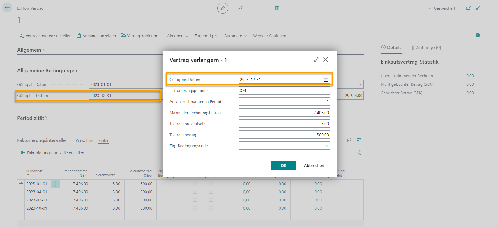

### Rechnungserinnerung
Es gibt eine Funktion, um Erinnerungen für Verträge zu senden, die Rechnungsperioden und ExFlow E-Mail-Einrichtung haben.
Lesen Sie mehr im Abschnitt [***E-Mail-Erinnerungen --> Vertragsrechnungserinnerung***](https://docs.exflow.cloud/business-central/docs/user-manual/approval-workflow/email-reminders#contract-invoice-reminder)

|Rechnungserinnerung |  |
|:-|:-|
| **Erinnerung senden**:            | Aktivieren, um eine E-Mail-Erinnerung oder Benachrichtigungen zu senden. Um E-Mails und/oder BC-Benachrichtigungen senden zu können, muss der ExFlow-Benutzer Zugriff auf E-Mail/Benachrichtigungen für die Vertragsrechnungserinnerung haben.  Lesen Sie mehr im Abschnitt [***ExFlow-Benutzer***](https://docs.exflow.cloud/business-central/docs/user-manual/business-functionality/exflow-user#add-a-new-user-manually)
| **Genehmigungsgruppen**:          | Fügen Sie Genehmigungsgruppen für diesen spezifischen Vertrag hinzu. Wenn keine vorhanden sind, werden Erinnerungen an "Genehmigungsgruppen" in der ExFlow E-Mail-Einrichtung gesendet
| **Rechnungserinnerungszeitraum**:  | Verwenden Sie die Standarddatumsformel, die auf dem Periode Startdatum berechnet wird, um anzugeben, wann die Rechnung überfällig ist

### Vertrags-Erinnerung
Die Vertrags-Erinnerung dient dazu, Erinnerungen vor Ablauf eines Vertrags zu versenden. Wenn es Zeit ist, den Vertrag zu überprüfen oder zu kündigen.

|Vertrags-Erinnerung |  |
|:-|:-|
| **Vertrags-Erinnerungszeitraum**:     | Gibt den Zeitraum vor dem Vertragsende an, zu dem eine Erinnerung gesendet werden soll.
| **Benutzer zur Erinnerung**:               | ExFlow-Benutzer, an den die Erinnerungen gesendet werden sollen.
| **Erinnerung gesendet**:                | Datum und Uhrzeit, zu der die Vertrags-Erinnerung gesendet wird.
| **Benutzer-E-Mail**:                   | E-Mail-Adresse, an die die Erinnerung gesendet wird.

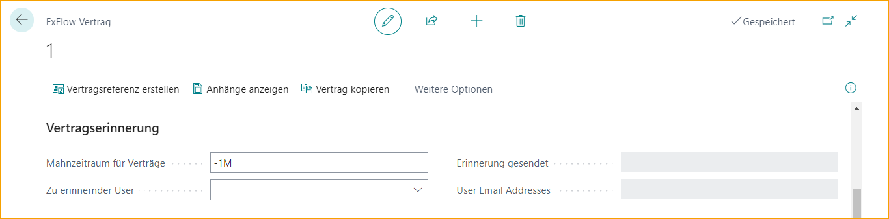

### Abgleich
Aktivieren, wenn abgeglichene Rechnungen automatisch genehmigt werden sollen.

|Vertrags-Erinnerung |  |
|:-|:-|
| **Automatische Genehmigung abgeglichener Rechnungen**: | Für die automatische Genehmigung erstellen Sie eine Genehmigungsregel mit Genehmigern, die mit den Informationen im Vertrag übereinstimmen, und aktivieren Sie "Automatische Genehmigung abgeglichener Rechnungen im Vertrag".

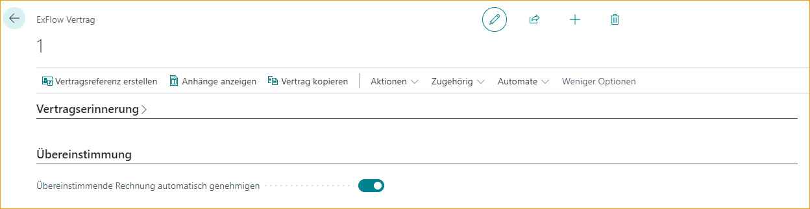

### Funktion - Vertragsreferenz erstellen
Klicken Sie auf "Vertragsreferenz erstellen", um die externe Vertragsnummer als ExFlow-Referenz zu erstellen. Diese kann nun zur Interpretation und zum Abgleich im Importjournal verwendet werden.

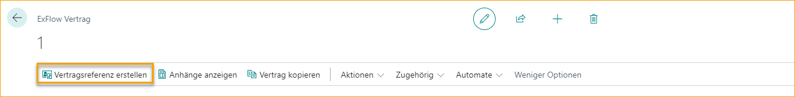

### Funktion - Anhänge anzeigen
Verwenden Sie diese Funktion, um die Vertragsanhänge anzuzeigen.

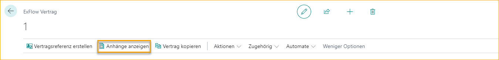

### Funktion - Aktionen – Selbstabrechnungsrechnung erstellen
Verwenden Sie diese Funktion, um nur für den aktuellen Vertrag eine Selbstabrechnungsrechnung zu erstellen.

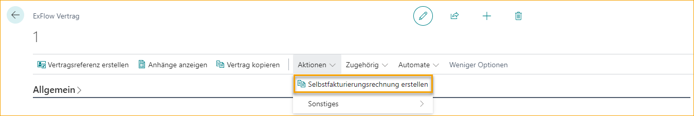

Dies kann auch automatisch über eine Job-Warteschlange erfolgen. Lesen Sie mehr im Abschnitt [***Einrichtung des Selbstabrechnungsvertrags***](https://docs.exflow.cloud/business-central/docs/user-manual/business-functionality/contract#self-billing-contract-setup)

### Funktion - Vertrag kopieren
Verwenden Sie diese Funktion, um den Inhalt eines bestehenden Vertrags in einen neu erstellten Vertrag zu kopieren. 

Wenn die Funktion "Vertrag kopieren" verwendet wird, werden einige Felder nicht kopiert.
-	**Externe Vertragsnummer** muss pro Lieferant eindeutig sein.
-	**Deaktiviert** kann bei Vorlagenverträgen verwendet werden und wird nicht kopiert.
-	**Referenz erstellt** Die Referenz bezieht sich auf die externe Vertragsnummer und muss für jeden neuen Vertrag erstellt werden.
-	**Anhänge zur abgeglichenen Rechnung kopieren** Die Anhänge müssen zu jedem Vertrag hinzugefügt werden.
-	**Selbstabrechnungsrechnung** Es muss eine PDF-Datei als Anhang vorhanden sein, bevor die Selbstabrechnung aktiviert werden kann. Anhänge werden nicht kopiert.
-	**Rechnungszeiträume** können aus der Funktion "Rechnungszeiträume erstellen" erstellt werden, da Zeiträume nicht aktualisiert werden, wenn Daten oder Beträge nicht mit den kopierten übereinstimmen.

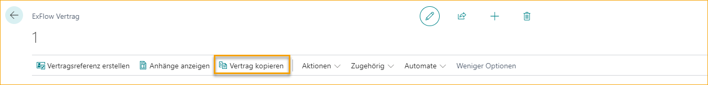

### Funktion - Verwandt – Dimensionen
Wählen Sie Dimension(en)/Wert(e) aus, die in der Vertragsrechnung verwendet werden sollen.

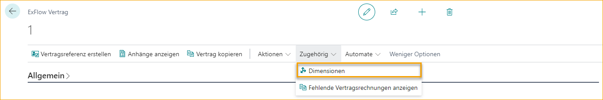

### FactBox – Details – Statistik zum Einkaufsvertrag
In der FactBox "Statistik zum Einkaufsvertrag" werden alle zugehörigen Rechnungen im Importjournal, Genehmigungsstatus und Genehmigungsstatusverlauf insgesamt angezeigt.

|Statistik zum Einkaufsvertrag |  |
|:-|:-|
| **Abgeglichener Rechnungsbetrag (Nettowährung)**:    | Summe des im Importjournal abgeglichenen Rechnungsbetrags. Durch Personalisierung kann der Betrag (Netto-LCY) hinzugefügt werden.  Klicken Sie auf den Betrag, um alle Dokumente anzuzeigen, und erweitern Sie die Ansicht, um alle Zeilen pro Dokument anzuzeigen.
| **Nicht gebuchter Betrag (Nettowährung)**:         | Summe des erstellten, aber nicht gebuchten Rechnungsbetrags im Genehmigungsstatus. Durch Personalisierung kann der Betrag (Netto-LCY) hinzugefügt werden.  Klicken Sie auf den Betrag, um alle Dokumente anzuzeigen, und erweitern Sie die Ansicht, um alle Zeilen pro Dokument anzuzeigen.
| **Gebuchter Betrag (Nettowährung)**:             | Summe der gebuchten Rechnungsbeträge im Genehmigungsstatusverlauf. Durch Personalisierung kann der Betrag (Netto-LCY) hinzugefügt werden.  Klicken Sie auf den Betrag, um alle Dokumente anzuzeigen, und erweitern Sie die Ansicht, um alle Zeilen pro Dokument anzuzeigen.

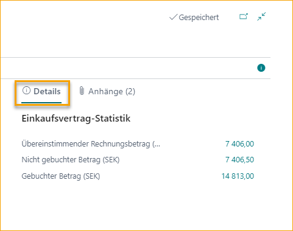

### FactBox – Anhänge und Notizen
Die Anzahl der hinzugefügten Anhänge und Notizen für den aktuellen Vertrag kann in der Überschrift gesehen werden.
Fügen Sie Anhänge oder Benachrichtigungen hinzu, indem Sie auf das Bild klicken.

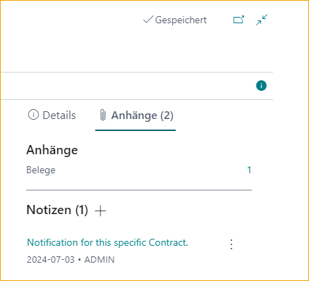

#### Anhänge
Anhänge können hinzugefügt werden, indem Sie auf die Anzahl der Dokumente klicken. Wenn die Anhänge zur abgeglichenen Rechnung hinzugefügt werden sollen, muss "Anhänge zur abgeglichenen Rechnung kopieren" aktiviert sein.

#### Notizen
Notizen, die zu einem ExFlow-Vertrag hinzugefügt wurden, werden nicht in andere Dokumente kopiert.

### Vertragsworkflow
So arbeiten Sie mit ExFlow-Verträgen.
1.	Beginnen Sie damit, einen Vertrag wie oben beschrieben zu erstellen.
2.	Erstellen Sie eine Vertragsreferenz (ExFlow-Referenz)  
Wenn die Rechnung innerhalb der Daten und Betrags-Toleranzen liegt, kann der folgende Workflow automatisch von ExFlow aufgrund der Konfiguration durchgeführt werden. 
3.  Interpretieren Sie die Rechnung mit der externen Vertragsnummer als Referenz.
4.	Importieren Sie das Dokument in das Importjournal. 
Die Rechnung wird mit dem ExFlow-Vertrag abgeglichen.
5.	Erstellen Sie die Rechnung.
6.	Buchen Sie das Dokument.
 
### Nachverfolgung von Verträgen ohne Rechnungszeiträume
Für Verträge ohne Rechnungszeiträume kann die Nachverfolgung über ***FactBox --> Details --> Kaufvertragsstatistik*** erfolgen.

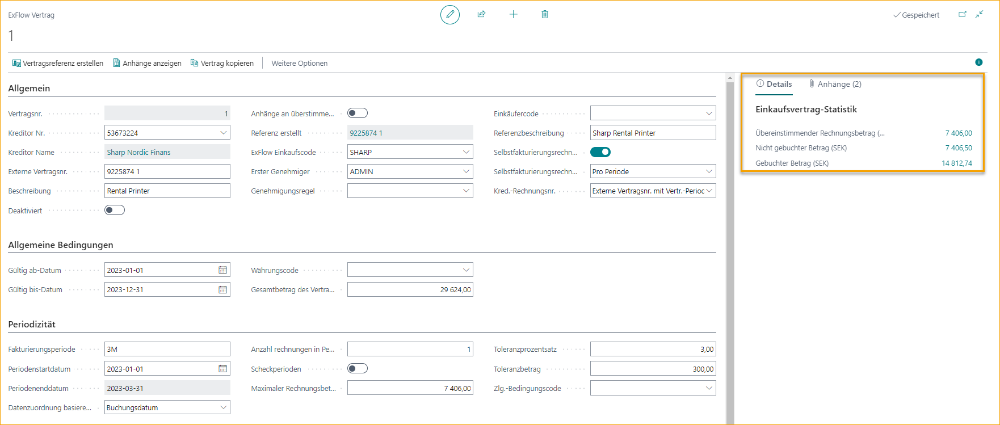

Klicken Sie auf den Betrag, um weitere Rechnungsdetails anzuzeigen.

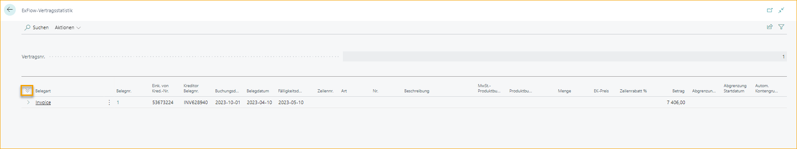

Erweitern Sie die Rechnungen, um die Positionen anzuzeigen.

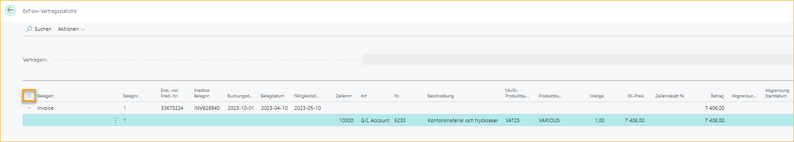

### Nachverfolgung von Verträgen mit Rechnungszeiträumen
Wenn der Vertrag Rechnungszeiträume enthält, kann die Nachverfolgung pro Zeitraum wie folgt erfolgen. Aber auch für den Gesamtvertrag wie oben beschrieben.
Klicken Sie auf den Betrag, um weitere Rechnungsdetails anzuzeigen.

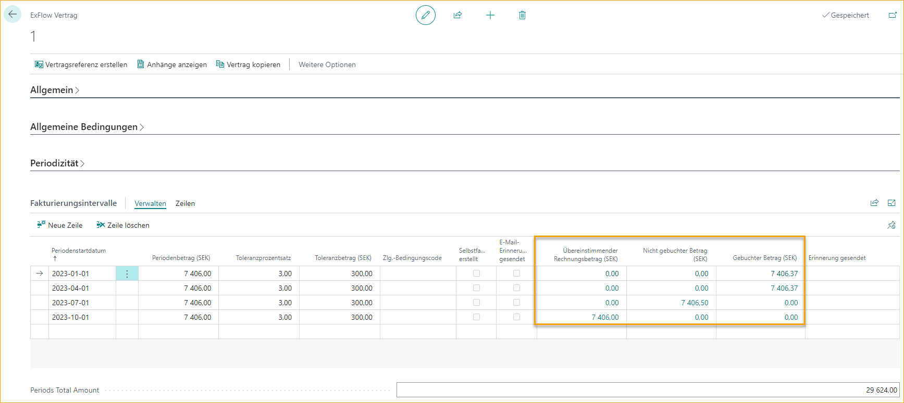

### Selbstabrechnungsvertrag
Ein Selbstabrechnungsvertrag ist hilfreich für regelmäßige Zahlungen an einen bestimmten Lieferanten ohne den Erhalt von Rechnungen. Die Erstellung von Einkaufsrechnungen kann automatisch oder manuell pro Vertrag erfolgen.

### Einrichtung eines Selbstabrechnungsvertrags
Für die Selbstabrechnung gibt es einige optionale Einrichtungen, die nützlich sein können. 
Gehen Sie zu: ***Setup --> ExFlow Manual Setup --> Verträge (Liste) --> Verwandt --> Vertragseinrichtung***

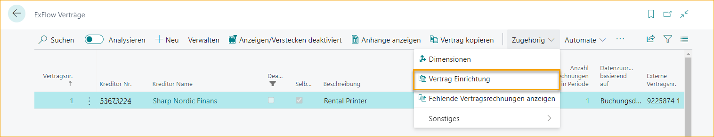

#### Hintergrundverarbeitung

|Hintergrundverarbeitung |  |
|:-|:-|
| **Aktiver Job Queue-Eintrag für Selbstabrechnung**: | Um eine Job Queue zu aktivieren, die automatisch alle Selbstabrechnungsrechnungen erstellt

#### Nummernkreise

|Nummernkreise für Selbstabrechnungsrechnungen |  |
|:-|:-|
| **Nummernkreis für Selbstabrechnungsrechnungen**:                    | Fügen Sie einen separaten Nummernkreis für Selbstabrechnungsrechnungen hinzu, um den Überblick zu behalten.  Wenn kein Nummernkreis hinzugefügt wird, werden die Standardnummern verwendet
| **Nummernkreis für gebuchte Selbstabrechnungsrechnungen**:             | Fügen Sie einen separaten Nummernkreis für gebuchte Selbstabrechnungsrechnungen hinzu, um den Überblick zu behalten.  Wenn kein Nummernkreis hinzugefügt wird, werden die Standardnummern verwendet.

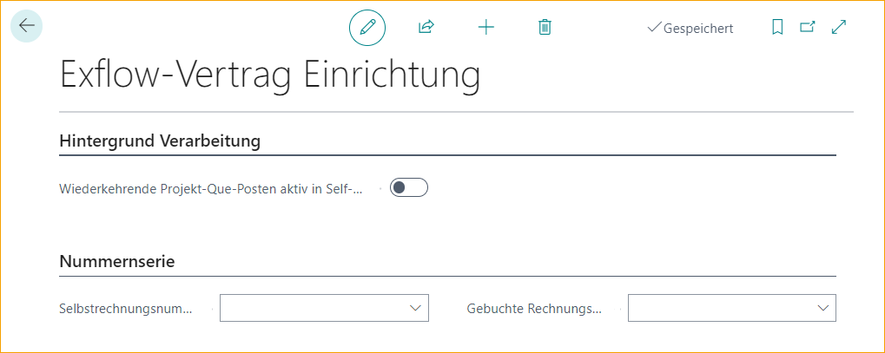

### Importieren von Journaleinträgen für Selbstabrechnungsrechnungen
Durch die Personalisierung in Importjournaleinträgen ist es möglich, ein bestimmtes Journal für erstellte Selbstabrechnungsrechnungen zu aktivieren. Rechnungen können auch automatisch erstellt werden, indem "Dokumente automatisch erstellen" verwendet wird.   

### Erstellen von Selbstabrechnungsrechnungen
Um eine Selbstabrechnungsrechnung erstellen zu können, sind einige Einstellungen auf dem ExFlow-Vertrag erforderlich.

#### Aktivierung für Selbstabrechnung
1.	Aktivieren Sie die Selbstabrechnungsrechnung und fügen Sie ein PDF-Dokument hinzu, das beim Erstellen von Rechnungen hinzugefügt wird.
2.	Erstellen Sie Selbstabrechnungsrechnungen 
***- Pro Zeitraum:*** – um Rechnungszeiträume bis zum heutigen Datum zu erstellen 
***- Alle:*** – um Rechnungen für alle Zeiträume im Vertrag zu erstellen
3.	Lieferantenrechnungsnummer – Fügen Sie eine Einstellung hinzu, um die Lieferantenrechnungsnummer hinzuzufügen. 
***- Externe Vertragsnummer mit Suffix Startdatum des Zeitraums*** 
***- Selbstabrechnungsnummernkreis*** Fügen Sie einen Nummernkreis in Lieferantenrechnungsnummern hinzu oder erstellen Sie ihn.

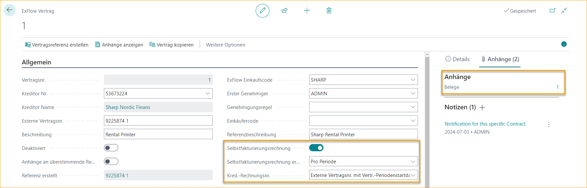

#### Hinzufügen von Rechnungszeiträumen
Fügen Sie Rechnungszeiträume manuell hinzu oder verwenden Sie die Funktion "Rechnungszeiträume erstellen".

#### Automatisches Erstellen von Selbstabrechnungsrechnungen
Lesen Sie mehr im Abschnitt [***Einrichtung eines Selbstabrechnungsvertrags***](https://docs.exflow.cloud/business-central/docs/user-manual/business-functionality/contract#self-billing-contract-setup)

#### Manuelles Erstellen von Selbstabrechnungsrechnungen
Lesen Sie mehr im Abschnitt [***Erstellen einer Selbstabrechnungsrechnung***](https://docs.exflow.cloud/business-central/docs/user-manual/business-functionality/contract#function---actions--create-self-billing-invoice)

 

### Grund für die Genehmigung einer vertragsübereinstimmenden Rechnung in ExFlow Web

Im Falle von Abweichungen bleibt das vertragsübereinstimmende Dokument im Importjournal mit einer Aktionsmeldung, die besagt, dass ''Es gibt noch nicht akzeptierte Warnmeldungen'' und das Dokument daher nicht automatisch genehmigt werden kann.  

Die Aktionsmeldung wird angezeigt, wenn zum Beispiel der Vertragsbetrag höher ist als erwartet oder andere Szenarien, die von den Vertragssetup-Kriterien abweichen.

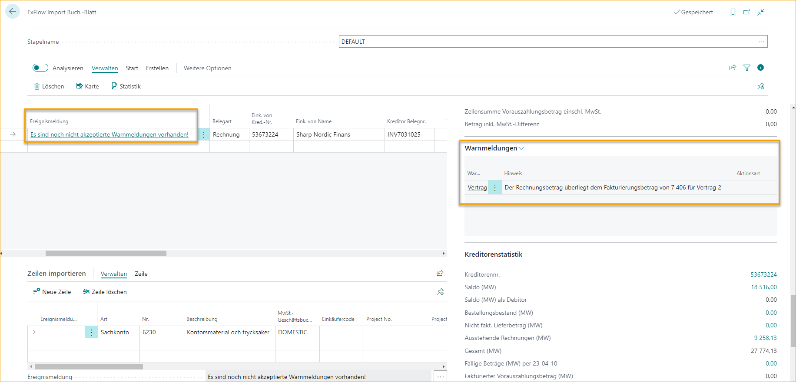

Wenn das Dokument korrekt ist und erstellt werden soll, muss der AP-Benutzer die Aktionsmeldung akzeptieren. 

Die Aktionsmeldung wird dann in das Diskussionsfeld kopiert, wenn das Dokument erstellt wird. 

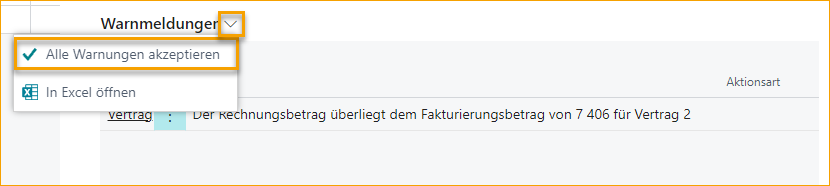

Im Diskussionsfeld im Genehmigungsstatus hat das vertragsübereinstimmende Dokument eine ''Vertragswarnung'' und kann wie folgt aussehen:  *''Vertragswarnung: Rechnungsbetrag übersteigt den Periodenrechnungsbetrag von 1.000 für Vertrag 2.''*

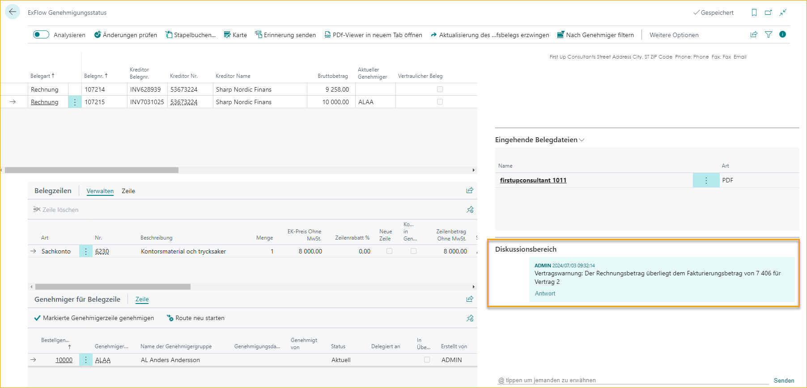

Die gleiche Meldung wird als Chat-Nachricht an den Web-Genehmiger gesendet, damit der Web-Genehmiger weiß, dass es sich um ein vertragsübereinstimmendes Dokument handelt und warum dieses spezielle Dokument ihre Genehmigung benötigt.

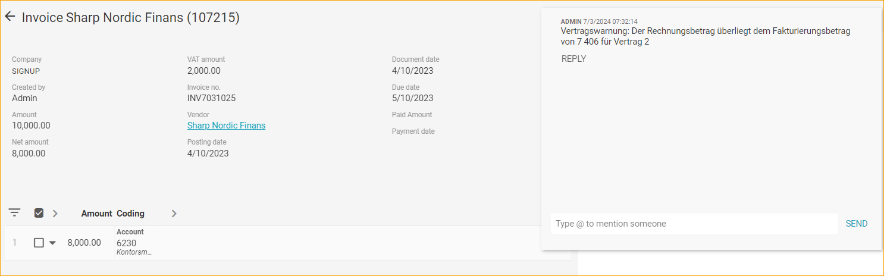
