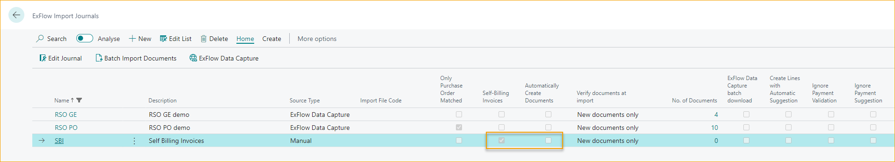

## Vertrag

Gehe zu: ***ExFlow-Setup – Übersicht ExFlow Contracts***

ExFlow Vertrag kann verwendet werden, um empfangene und fehlende Rechnungen für Verträge zu verfolgen und kann auch automatisch übereinstimmende Rechnungen genehmigen. Beginnen Sie mit der Erstellung eines neuen Vertrags, indem Sie auf "Neu" klicken.

Um die Einrichtung und Genehmigung für Verträge zu konfigurieren, lesen Sie mehr im Abschnitt [***OMNI Approval***](https://docs.signupsoftware.com/business-central/docs/user-manual/business-functionality/omni-approval).

### Allgemein
Unter diesem Abschnitt fügen Sie allgemeine Informationen für diesen spezifischen Vertrag, Lieferanten, Genehmigungsfluss und Kodierung hinzu.

|Allgemein |  |
|:-|:-|
| **Vertragsnummer**:                         | Automatisch in der Reihenfolge zugewiesen, in der sie erstellt werden
| **Lieferantennummer**:                      | Wählen Sie den Lieferanten aus der Liste aus
| **Lieferantenname**:                        | Zeigt den Namen für die ausgewählte Lieferantennummer an
| **Externe Vertragsnummer**:                 | Referenz, die auf der Rechnung interpretiert werden kann, um einen bestimmten Vertrag zuzuordnen  Wenn ein Referenzcode erstellt wird, kann die externe Vertragsnummer nicht mehr geändert werden.  Um zu aktualisieren, ändern Sie die externe Vertragsnummer und drücken Sie die Eingabetaste 
| **Nachricht**:                              | Sie dürfen die externe Vertragsnummer nicht aktualisieren. Möchten Sie stattdessen eine zugehörige Referenz hinzufügen? Antworten Sie mit Ja und die zugehörige Referenz wird automatisch auf der Referenzkarte hinzugefügt
| **Inaktiviert**:                            | Ja oder Nein. Um eine Rechnung abzugleichen, muss der Vertrag aktiv sein
| **Anhang zur abgeglichenen Rechnung kopieren**: | Ja oder Nein. Wenn ja, fügen Sie einen Anhang hinzu
| **Referenz erstellt**:                      | Wenn eine Referenz erstellt wird, wird der Referenzcode mit einem Link zur ExFlow-Referenzkarte angezeigt
| **ExFlow-Kaufcode**:                        | Fügen Sie den ExFlow-Kaufcode hinzu und Rechnungszeilen werden automatisch im Importjournal erstellt
| **Erster Genehmiger**:                      | Gibt den ersten Genehmiger an, der für abgeglichene Rechnungen verwendet werden soll. Aufgrund der Einstellung in „Ersten Genehmiger in den Genehmigungsfluss kopieren“ in der ExFlow-Einrichtung kann der erste Genehmiger als Genehmiger oder zur Definition einer Genehmigungsregel mit Abgleich auf dem Filter des ersten Genehmigers verwendet werden
| **Genehmigungsregel**:                      | Gibt die Genehmigungsregel an, die verwendet werden soll, wenn eine Rechnung mit diesem Vertrag abgeglichen wird  Fügen Sie eine spezifische Genehmigungsregel hinzu, die immer für diesen Vertrag verwendet werden soll. Der Genehmigungsfluss wird nicht aktualisiert, selbst wenn die Kodierung im Genehmigungsprozess geändert wird  Der erste Genehmiger kann auch als Filter verwendet werden, um automatisch eine Genehmigungsregel zur Rechnung hinzuzufügen, aber in diesem Fall kann die Genehmigungsregel nicht auf dem ExFlow-Vertrag verwendet werden
| **Einkäufercode**:                          | Gibt einen Einkäufercode an, der angewendet werden soll, wenn eine Rechnung mit diesem Vertrag abgeglichen wird. Kann verwendet werden, um eine Genehmigungsregel zu definieren, wenn keine Genehmigungsregel oben hinzugefügt wurde
| **Referenzbeschreibung**:                   | Gibt die zur Referenz hinzugefügte Beschreibung an  Beim Aktualisieren der Beschreibung wird die erstellte Referenzbeschreibung automatisch aktualisiert
| **Selbstabrechnungsrechnung**:              | Um Selbstabrechnungsrechnungen zu erstellen, muss ein PDF-Anhang hinzugefügt werden
| **Selbstabrechnungsrechnung erstellen**:    | Wählen Sie aus, wie Selbstabrechnungsrechnungen erstellt werden sollen - **Pro Periode:** Eine Rechnung pro Periode bis zum heutigen Datum  - **Alle:** Eine Rechnung pro Periode für alle erstellten Perioden
| **Lieferantenrechnungsnummer**:             | Dies erstellt die Lieferantenrechnungsnummer für Selbstabrechnungsrechnungen

### Allgemeine Bedingungen
Unter Allgemeine Bedingungen fügen Sie die Gesamtsummen für diesen spezifischen Vertrag hinzu.

|Allgemeine Bedingungen|  |
|:-|:-|
| **Gültig ab Datum und Gültig bis Datum**:    | Bedingungen des Vertrags  Wenn Rechnungsperioden erstellt werden, kann das Gültig-bis-Datum verwendet werden, um Rechnungsperioden zu verlängern  Lesen Sie mehr unten im Abschnitt [***Rechnungsperioden***](https://docs.signupsoftware.com/business-central/docs/user-manual/business-functionality/contract#extend-contract-with-invoice-periods)
| **Währungscode**:                           | Der Währungscode, der bei der Rechnungsstellung des Vertrags verwendet werden soll
| **Gesamtvertragsbetrag (Netto-Währung)**:   | Gibt den Gesamtvertragsbetrag einschließlich Toleranzen an.

### Periodizität
Fügen Sie den Rechnungsbetrag, die Periodizität und die Anzahl der Rechnungen pro Periode hinzu.
Beim Arbeiten mit Rechnungsperioden wird dieser Abschnitt nur verwendet, um Werte zu kopieren, wenn Perioden erstellt werden.

|Periodizität |  |
|:-|:-|
| **Rechnungsperiode**:                      | Wenn die Rechnungsperiode beispielsweise vierteljährlich = 3M oder jeden Monat = 1M ist
| **Periodenstartdatum**:                    | Startdatum für die nächste Rechnung
| **Periodenenddatum**:                      | Berechnet sich automatisch aufgrund der Rechnungsperiode
| **Abgleich der Daten basierend auf**:      | Buchungsdatum, Belegdatum oder Fälligkeitsdatum
| **Anzahl der Rechnungen in der Periode**:  | Gibt die Anzahl der Rechnungen an, die während der Rechnungsperiode erwartet werden
| **Perioden überprüfen**:                   | Ja oder Nein. Gibt an, ob die Vertragsperiode überprüft werden soll. Wenn deaktiviert, erfolgt keine Überprüfung pro Rechnung, nur für Vertragssummen unter Allgemeine Bedingungen
| **Max. Rechnungsbetrag (Netto-Währung)**:  | Gibt den Höchstbetrag für jede Rechnung an, die mit diesem Vertrag verbunden ist.
| **Toleranzprozentsatz**:                   | Wird zusammen mit dem Toleranzbetrag verwendet und ermöglicht es, übereinstimmende Rechnungen innerhalb der Toleranzen abzugleichen und automatisch zu genehmigen  Wenn Vertragsperioden hinzugefügt werden, muss die Toleranz für jede Periode hinzugefügt werden
| **Toleranzbetrag**:                        | Wird zusammen mit dem Toleranzprozentsatz verwendet und ermöglicht es, übereinstimmende Rechnungen innerhalb der Toleranzen abzugleichen und automatisch zu genehmigen  Wenn Vertragsperioden hinzugefügt werden, muss die Toleranz für jede Periode hinzugefügt werden
| **Zahlungsbedingungen-Code**:              | Wird für diesen spezifischen Vertrag verwendet, anstatt von der aktuellen Lieferantenkarte kopiert zu werden

### Rechnungsperioden
Rechnungsperioden können verwendet werden, um Rechnungen mit unterschiedlichen Beträgen oder Toleranzen pro Periode abzugleichen, aber auch um eine Erinnerung zu senden, wenn eine Rechnung für eine bestimmte Periode fehlt. 
Für Selbstabrechnungsrechnungen ist es erforderlich, die erstellten Rechnungen zu verfolgen.

#### Rechnungsperiode erstellen
Gehe zu: ***ExFlow Vertrag --> Rechnungsperioden --> Zeilen --> Rechnungsperioden erstellen*** 
Rechnungsperioden können automatisch erstellt werden, indem das Gültig-von- und -bis-Datum zusammen mit den Rechnungsperioden verwendet wird. 
Beim Erstellen der Zeilen berechnet sich der Periodenbetrag aus dem "Max. Rechnungsbetrag (NET-Währung)" multipliziert mit der "Anzahl der Rechnungen in der Periode" unter Periodizität.

Wenn der Max. Rechnungsbetrag fehlt, erfolgt die Berechnung aus dem Gesamtvertragsbetrag (NET-Währung) geteilt durch die Anzahl der Perioden.

Toleranzen und Zahlungsbedingungen-Code werden aus der Periodizität kopiert.

|Rechnungsperioden |  |
|:-|:-|
| **Periodenstartdatum**:                        | Jede Periode hat ein Start- und Enddatum. Das Enddatum wird aus dem nächsten Startdatum -1 Tag berechnet. Rechnungen werden der Periode gemäß der Einrichtung in „Abgleich der Daten basierend auf“ für den aktuellen Vertrag zugeordnet. Das Periodenstartdatum wird auch als Rechnungsbelegdatum und Buchungsdatum verwendet, wenn Selbstabrechnungsrechnungen erstellt werden
| **Periodenbetrag (NET-Währung)**:              | Der Periodenbetrag ist der Höchstbetrag pro Periode. Die Anzahl der Rechnungen wird nicht berechnet. Für Selbstabrechnungsrechnungen gibt es nur eine Rechnung pro Rechnungsperiodenzeile
| **Toleranzprozentsatz**:                       | Dies wird zusammen mit dem Toleranzbetrag verwendet und ermöglicht es, übereinstimmende Rechnungen innerhalb der Toleranzen abzugleichen und automatisch zu genehmigen. Unterschiedliche Toleranzen können pro Periode hinzugefügt werden
| **Zahlungsbedingungen-Code**:                  | Der Zahlungsbedingungen-Code auf dem ExFlow-Vertrag ersetzt die Zahlungsbedingungen von der Lieferantenkarte. Unterschiedliche Zahlungsbedingungen können pro Periode hinzugefügt werden
| **Selbstabrechnungsrechnung erstellt**:        | Wird auf wahr gesetzt, wenn eine Selbstabrechnungsrechnung für diese spezifische Periode erstellt wird. Wenn das Dokument im Importjournal oder Genehmigungsstatus gelöscht wird, wird es automatisch auf falsch gesetzt und die Selbstabrechnungsrechnung kann erneut erstellt werden
| **Abgeglichener Rechnungsbetrag (Netto-Währung)**: | Gesamtsummen des Rechnungsbetrags pro Periode, die im Importjournal abgeglichen wurden. Durch Personalisierung kann der Betrag (Netto-LCY) hinzugefügt werden  Klicken Sie auf den Betrag, um alle Rechnungen zu sehen und die Ansicht zu erweitern, um alle Zeilen pro Rechnung zu sehen
| **Nicht gebuchter Betrag (Netto-Währung)**:    | Gesamtsummen des erstellten, aber nicht gebuchten Rechnungsbetrags pro Periode, die im Genehmigungsstatus abgeglichen wurden. Durch Personalisierung kann der nicht gebuchte Betrag (Netto-LCY) hinzugefügt werden  Klicken Sie auf den Betrag, um alle Dokumente zu sehen und die Ansicht zu erweitern, um alle Zeilen pro Dokument zu sehen
| **Gebuchter Betrag (Netto-Währung)**:          | Gesamtsummen der gebuchten Rechnungsbeträge, die pro Periode im Genehmigungsstatusverlauf abgeglichen wurden. Durch Personalisierung kann der gebuchte Betrag (Netto-LCY) hinzugefügt werden  Klicken Sie auf den Betrag, um alle Dokumente zu sehen und die Ansicht zu erweitern, um alle Zeilen pro Dokument zu sehen

Für fakturierte Gesamtsummen siehe [***FactBox --> Details --> Einkaufsvertragsstatistik***](https://docs.signupsoftware.com/business-central/docs/user-manual/business-functionality/contract#factbox--details--purchase-contract-statistic) unten.

### Vertrag mit Rechnungsperioden verlängern
Um einen Vertrag zu verlängern, der Perioden enthält, fügen Sie ein neues "Gültig-bis-Datum" in Allgemeine Bedingungen hinzu und aktualisieren Sie die Werte, die aus der Periodizität kopiert werden.

### Rechnungs-Erinnerung
Es gibt eine Funktion, um Erinnerungen für Verträge zu senden, die Rechnungsperioden und ExFlow-E-Mail-Einrichtung haben.
Lesen Sie mehr im Abschnitt [***E-Mail-Erinnerungen --> Vertragsrechnungs-Erinnerung***](https://docs.signupsoftware.com/business-central/docs/user-manual/approval-workflow/email-reminders#contract-invoice-reminder)

|Rechnungs-Erinnerung |  |
|:-|:-|
| **Erinnerung senden**:            | Aktivieren, um E-Mail-Erinnerungen oder Benachrichtigungen zu senden. Um E-Mails und/oder BC-Benachrichtigungen senden zu können, muss der ExFlow-Benutzer Zugriff auf E-Mail/Benachrichtigungen für die Vertragsrechnungs-Erinnerung haben.  Lesen Sie mehr im Abschnitt [***ExFlow-Benutzer***](https://docs.signupsoftware.com/business-central/docs/user-manual/business-functionality/exflow-user#add-a-new-user-manually)
| **Genehmigungsgruppen**:          | Fügen Sie Genehmigungsgruppen für diesen spezifischen Vertrag hinzu. Wenn keine vorhanden sind, werden Erinnerungen an "Genehmigungsgruppen" in der ExFlow-E-Mail-Einrichtung gesendet
| **Rechnungs-Erinnerungsperiode**: | Verwenden Sie die Standard-Datumsformel, die auf dem Periodenstartdatum berechnet wird, um anzugeben, wann die Rechnung überfällig ist
| **Feste E-Mail-Adressen**:        | Um Erinnerungen an Benutzer außerhalb von ExFlow für diesen spezifischen Vertrag zu senden. Wenn keine vorhanden sind, werden Erinnerungen an "Feste E-Mail-Adressen" in der ExFlow-E-Mail-Einrichtung gesendet

### Vertrags-Erinnerung
Die Vertrags-Erinnerung dient dazu, Erinnerungen zu senden, bevor der Vertrag abläuft. Wenn es Zeit ist, den Vertrag zu überprüfen oder zu kündigen.

|Vertrags-Erinnerung |  |
|:-|:-|
| **Vertrags-Erinnerungsperiode**:     | Gibt die Periode vor dem Vertragsenddatum an, um eine Erinnerung zu senden.
| **Zu erinnernder Benutzer**:         | ExFlow-Benutzer, an den Erinnerungen gesendet werden sollen. Dieser spezifische Benutzer wird in der ExFlow-Vertragsliste für eine bessere Übersicht angezeigt.
| **Erinnerung gesendet**:             | Datum und Uhrzeit, wann die Vertrags-Erinnerung gesendet wurde.
| **Benutzer-E-Mail**:                 | E-Mail-Adresse, an die die Erinnerung gesendet wird.

### Abgleich
Aktivieren Sie diese Option, wenn eine abgeglichene Rechnung automatisch genehmigt werden soll.

|Vertragserinnerung |  |
|:-|:-|
| **Autom. Genehmigung abgeglichener Rechnungen**: | Für die automatische Genehmigung erstellen Sie eine Genehmigungsregel mit Genehmigern, die den Informationen im Vertrag entsprechen, und aktivieren Sie "Autom. Genehmigung abgeglichener Rechnungen im Vertrag".

### Funktion - Vertragsreferenz erstellen
Klicken Sie auf "Vertragsreferenz erstellen", um die externe Vertragsnummer als ExFlow-Referenz zu erstellen. Diese kann nun für die Interpretation und den Abgleich im Importjournal verwendet werden.

### Funktion - Anhänge anzeigen
Verwenden Sie diese Funktion, um die Vertragsanhänge anzuzeigen.

### Funktion - Aktionen – Selbstabrechnungsrechnung erstellen
Verwenden Sie diese Funktion, um eine Selbstabrechnungsrechnung nur für den aktuellen Vertrag zu erstellen.

Dies kann auch automatisch über eine Jobwarteschlange erfolgen. Lesen Sie mehr im Abschnitt [***Selbstabrechnungsvertrag einrichten***](https://docs.signupsoftware.com/business-central/docs/user-manual/business-functionality/contract#self-billing-contract-setup)

### Funktion - Vertrag kopieren
Verwenden Sie diese Funktion, um den Inhalt eines bestehenden Vertrags in einen neu erstellten Vertrag zu kopieren. 

Wenn Sie die Funktion „Vertrag kopieren“ verwenden, werden einige Felder nicht kopiert.
-	**Externe Vertragsnummer**: Muss pro Lieferant eindeutig sein.
-	**Deaktiviert**: Kann bei Vorlageverträgen verwendet werden und wird nicht kopiert.
-	**Referenz erstellt**: Die Referenz bezieht sich auf die externe Vertragsnummer und muss für jeden neuen Vertrag erstellt werden.
-	**Anhänge zu abgeglichener Rechnung kopieren**: Die Anhänge müssen zu jedem Vertrag hinzugefügt werden.
-	**Selbstabrechnungsrechnung**: Es muss ein PDF als Anhang vorhanden sein, bevor die Selbstabrechnung aktiviert werden kann. Anhänge werden nicht kopiert.
-	**Rechnungsperioden**: Können über die Funktion „Rechnungsperioden erstellen“ erstellt werden, da Perioden nicht aktualisiert werden, wenn die Daten oder Beträge nicht mit den kopierten übereinstimmen.

### Funktion - Verwandt – Dimensionen
Wählen Sie die Dimensionscodes/Werte aus, die in der Vertragsrechnung verwendet werden sollen.

### FactBox – Details – Einkaufsvertragsstatistik
In der FactBox Einkaufsvertragsstatistik werden alle zugehörigen Rechnungen im Importjournal, Genehmigungsstatus und Genehmigungsstatusverlauf insgesamt angezeigt.

|Einkaufsvertragsstatistik |  |
|:-|:-|
| **Abgeglichener Rechnungsbetrag (Netto Währung)**:    | Gesamtsumme der im Importjournal abgeglichenen Rechnungsbeträge. Durch Personalisierung kann der Betrag (Netto LCY) hinzugefügt werden.  Klicken Sie auf den Betrag, um alle Dokumente anzuzeigen und die Ansicht zu erweitern, um alle Zeilen pro Dokument zu sehen.
| **Nicht gebuchter Betrag (Netto Währung)**:         | Gesamtsumme der erstellten, aber nicht gebuchten Rechnungsbeträge im Genehmigungsstatus. Durch Personalisierung kann der nicht gebuchte Betrag (Netto LCY) hinzugefügt werden.  Klicken Sie auf den Betrag, um alle Dokumente anzuzeigen und die Ansicht zu erweitern, um alle Zeilen pro Dokument zu sehen.
| **Gebuchter Betrag (Netto Währung)**:             | Gesamtsumme der gebuchten Rechnungsbeträge im Genehmigungsstatusverlauf. Durch Personalisierung kann der gebuchte Betrag (Netto LCY) hinzugefügt werden.  Klicken Sie auf den Betrag, um alle Dokumente anzuzeigen und die Ansicht zu erweitern, um alle Zeilen pro Dokument zu sehen.

### FactBox – Anhänge und Notizen
Die Anzahl der hinzugefügten Anhänge und Notizen für den aktuellen Vertrag kann in der Überschrift angezeigt werden.
Fügen Sie Anhänge oder Benachrichtigungen hinzu, indem Sie auf das untenstehende Bild klicken.

#### Anhänge
Anhänge können hinzugefügt werden, indem Sie auf die Anzahl der Dokumente klicken. Wenn die Anhänge zur abgeglichenen Rechnung hinzugefügt werden sollen, muss „Anhänge zu abgeglichener Rechnung kopieren“ aktiviert werden.

#### Notizen
Notizen, die zu einem ExFlow-Vertrag hinzugefügt werden, werden nicht in Dokumente kopiert.

### Vertragsworkflow
So arbeiten Sie mit ExFlow-Verträgen.
1.	Beginnen Sie mit der Erstellung eines Vertrags wie oben beschrieben.
2.	Erstellen Sie eine Vertragsreferenz (ExFlow-Referenz).  
Wenn die Rechnung innerhalb der Datums- und Betragsgrenzen liegt, kann der folgende Workflow aufgrund der Einrichtung automatisch von ExFlow durchgeführt werden. 
3.  Interpretieren Sie die Rechnung mit der externen Vertragsnummer als Referenz.
4.	Dokument in das Importjournal importieren. 
Die Rechnung wird dem ExFlow-Vertrag zugeordnet.
5.	Rechnung erstellen.
6.	Dokument buchen.
 
### Verträge ohne Rechnungsperioden nachverfolgen
Für Verträge ohne Rechnungsperioden kann die Nachverfolgung über ***FactBox --> Details --> Einkaufsvertragsstatistik*** erfolgen.

Klicken Sie auf den Betrag für weitere Rechnungsdetails.

Erweitern Sie die Rechnungen, um die Zeilen anzuzeigen.

### Verträge mit Rechnungsperioden nachverfolgen
Wenn der Vertrag Rechnungsperioden enthält, kann die Nachverfolgung pro Periode wie unten beschrieben erfolgen. Aber auch für den gesamten Vertrag wie oben.
Klicken Sie auf den Betrag für weitere Rechnungsdetails.

### Selbstabrechnungsvertrag
Ein Selbstabrechnungsvertrag ist hilfreich für regelmäßige Zahlungen an einen bestimmten Lieferanten, ohne dass Rechnungen empfangen werden müssen. Die Erstellung von Einkaufsrechnungen kann automatisch oder manuell pro Vertrag erfolgen.

### Einrichtung des Selbstabrechnungsvertrags
Für die Selbstabrechnung gibt es einige optionale Einstellungen, die nützlich sein können. 
Gehe zu: ***Setup --> ExFlow Manual Setup --> Contracts (List)--> Related --> Contract Setup***

#### Hintergrundverarbeitung

|Hintergrundverarbeitung |  |
|:-|:-|
| **Selbstabrechnung Wiederkehrender Job Que Entry Aktiv**: | Um eine Job-Warteschlange zu aktivieren, die automatisch alle Selbstabrechnungsrechnungen erstellt

#### Nummernserien

|Selbstabrechnungsrechnungsnummern |  |
|:-|:-|
| **Selbstabrechnungsrechnungsnummern**:                    | Fügen Sie eine separate Nummernserie für Selbstabrechnungsrechnungen hinzu, um den Überblick zu behalten.  Wenn keine Nummernserie hinzugefügt wird, werden die Standardnummern von Business verwendet.
| **Selbstabrechnungsbuchungsrechnungsnummern**:             | Fügen Sie eine separate Nummernserie für Selbstabrechnungsbuchungsrechnungen hinzu, um den Überblick zu behalten.  Wenn keine Nummernserie hinzugefügt wird, werden die Standardnummern von Business verwendet.

### Importjournal für Selbstabrechnungsrechnungen
Durch die Personalisierung in Importjournalen ist es möglich, ein spezifisches Journal für erstellte Selbstabrechnungsrechnungen zu aktivieren. Rechnungen können auch automatisch durch die Verwendung von "Dokumente automatisch erstellen" erstellt werden.   

### Selbstabrechnungsrechnungen erstellen
Um eine Selbstabrechnungsrechnung erstellen zu können, sind einige Einstellungen im ExFlow-Vertrag erforderlich.

#### Für Selbstabrechnung aktivieren
1.	Die Selbstabrechnungsrechnung aktivieren und ein PDF-Dokument hinzufügen, das beim Erstellen von Rechnungen hinzugefügt wird.
2.	Selbstabrechnungsrechnungen erstellen 
***- Pro Periode:*** – um Rechnungsperioden bis zum heutigen Datum zu erstellen 
***- Alle:*** – um Rechnungen für alle Perioden im Vertrag zu erstellen
3.	Lieferantenrechnungsnummer – Einstellung hinzufügen, um die Lieferantenrechnungsnummer hinzuzufügen. 
***- Externe Vertragsnummer mit Suffix Periodenstartdatum*** 
***- Selbstabrechnungsnummernserie*** Fügen Sie eine Nummernserie in Lieferantenrechnungsnummern hinzu oder erstellen Sie eine.

#### Rechnungsperioden hinzufügen
Rechnungsperioden manuell hinzufügen oder die Funktion Rechnungsperioden erstellen verwenden.

#### Selbstabrechnungsrechnungen automatisch erstellen
Lesen Sie mehr im Abschnitt [***Einrichtung des Selbstabrechnungsvertrags***](https://docs.signupsoftware.com/business-central/docs/user-manual/business-functionality/contract#self-billing-contract-setup)

#### Selbstabrechnungsrechnungen manuell erstellen
Lesen Sie mehr im Abschnitt [***Selbstabrechnungsrechnung erstellen***](https://docs.signupsoftware.com/business-central/docs/user-manual/business-functionality/contract#function---actions--create-self-billing-invoice)

 

### Grund für die Genehmigung einer vertragsabgeglichenen Rechnung im ExFlow-Web

Im Falle von Abweichungen bleibt das vertragsabgeglichene Dokument im Importjournal mit einer Aktionsnachricht, die besagt, dass ''Es gibt noch nicht akzeptierte Warnmeldungen'' und das Dokument daher nicht automatisch genehmigt werden kann, wenn es erstellt wird.

Eine Aktionsnachricht wird angezeigt, wenn beispielsweise der Vertragsbetrag höher als erwartet ist oder andere Szenarien vorliegen, die von den Vertragskriterien abweichen.

Wenn das Dokument korrekt ist und erstellt werden soll, muss der AP-Benutzer die Aktionsnachricht akzeptieren.

Die Aktionsnachricht wird dann in das Diskussionspanel kopiert, wenn das Dokument erstellt wird.

Im Diskussionspanel im Genehmigungsstatus wird das vertragsabgeglichene Dokument eine ''Vertragswarnung'' haben und kann so aussehen:  *''Vertragswarnung: Der Rechnungsbetrag übersteigt den Periodenrechnungsbetrag von 1.000 für Vertrag 2.''*

Die gleiche Nachricht wird als Chatnachricht an den Web-Genehmiger gesendet, damit der Web-Genehmiger weiß, dass dieses Dokument ein vertragsabgeglichenes Dokument ist und warum dieses spezielle Dokument ihre Genehmigung benötigt.

