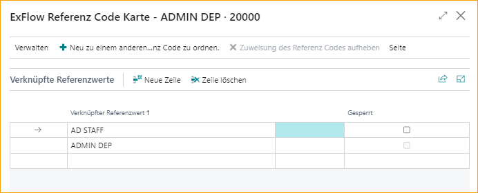

## Referenzcodes

Gehe zu: ***Setup \--\> ExFlow Manual Setup \--\> ExFlow Referenzcodes***

Wenn eine Interpretation der Referenz vor dem Importieren des Rechnungsdokuments in den ExFlow Import Journal erfolgt, kann die Referenz z.B. einen Genehmigungsworkflow auslösen. Wenn eine Referenz gefunden wird, kann ein Genehmigungsworkflow entweder mit dem ersten Genehmiger oder einer Genehmigungsregel angewendet werden.

Wenn eine Referenz im importierten Dokument gefunden wird, wird dieser Referenzwert auch in der Einkaufsrechnung/Gutschrift gespeichert und in der gebuchten Einkaufsrechnung/Gutschrift angezeigt.

Die Referenz kann einen vordefinierten ExFlow-Kaufcode hinzufügen, der zur Zuordnung von Codierungen zu den Rechnungspositionen (Hauptbuchkonto, Dimensionen usw.) verwendet wird.

Es ist möglich, eine Kombination aus Referenz und Lieferantennummer zu verwenden. Wenn eine Referenz für einen bestimmten Lieferanten interpretiert wird, wird ein spezieller Genehmigungsworkflow verwendet. Darüber hinaus können Sie die Liste bearbeiten und z.B. eine Dimension oder einen Einkäufercode zur markierten ExFlow-Referenz hinzufügen. Es ist auch möglich, mehrere verwandte Referenzen mit demselben Referenzcode zu verknüpfen, um die Verwaltung der Referenzcodes zu erleichtern.

### Erstellen eines neuen ExFlow-Referenzcodes aus dem Import Journal

Wenn der Referenzwert eine neue Referenz ist, klicken Sie beim Klicken auf die Assistenzschaltfläche (im Referenzfeld) auf:

ExFlow fragt, ob eine neue Referenz erstellt werden soll:

Durch Auswahl von "Ja" wird eine leere ExFlow-Referenzcode-Karte geöffnet, in der zusätzliche Informationen zur Referenz hinzugefügt werden können:

Wenn das ExFlow-Referenzfeld leer ist, klicken Sie auf "Neu" oder "Liste bearbeiten" und geben Sie die Informationen direkt in der Zeile ein. Eine alternative Möglichkeit besteht darin, auf "Bearbeiten" zu klicken, um die Referenzkarte zu öffnen und die Informationen dort zu bearbeiten.

Um eine verwandte Referenz zum Referenzcode hinzuzufügen, klicken Sie auf "ExFlow verwandte Referenzwerte" und "Zeilen bearbeiten".

Geben Sie den neuen Wert ein:

Schließen Sie dann und dieser neue Wert wird mit dem aktuellen Referenzcode verknüpft.

Wenn Sie einen Referenzcode zu einem bereits vorhandenen Code hinzufügen möchten, jedoch als Referenzwert, können Sie dies mit der Option "Zu einem anderen Referenzcode neu zuweisen" tun. Dadurch wird der ursprüngliche Referenzcode blockiert und alle verwandten Referenzwerte werden dem neuen Referenzcode zugeordnet. Diese Änderung kann auch in der Referenzcode-Karte vorgenommen werden.

### Automatisches Erstellen von Referenzen durch ExFlow-Benutzer
Gehe zu: ***ExFlow Setup --> Benutzer --> Automatisch ExFlow-Referenzen erstellen***

In der ExFlow-Konfiguration gibt es die Einstellung "Automatisch ExFlow-Referenzcode erstellen", die automatisch einen ExFlow-Referenzcode erstellt, wenn ein neuer ExFlow-Benutzer erstellt wird.

Wenn ein neuer ExFlow-Benutzer erstellt wird, wird ein ExFlow-Referenzcode mit demselben "Referenzcode" wie der "Benutzername" erstellt und der aktuelle ExFlow-Benutzer automatisch als erster Genehmiger hinzugefügt.

Ein ExFlow-Referenzcode wird nur erstellt, wenn die Einstellung "Automatisch ExFlow-Referenz erstellen" aktiviert ist und das aktuelle Unternehmen in den "ExFlow-Benutzerberechtigungen" auf der ExFlow-Benutzerkarte vorhanden ist.

Es ist möglich, ExFlow-Referenzcodes für alle bereits vorhandenen Benutzer mit "Batch Create ExFlow Reference" von der ExFlow-Benutzerseite aus zu erstellen. ExFlow-Referenzcodes werden für alle Benutzer erstellt, die das aktuelle Unternehmen in den "ExFlow-Benutzerberechtigungen" auf der ExFlow-Benutzerkarte haben.

Außerdem kann ein ExFlow-Referenzcode nur für einen ausgewählten ExFlow-Benutzer von der ExFlow-Benutzerseite oder der ExFlow-Benutzerkarte mit "Create ExFlow Reference" erstellt werden.

