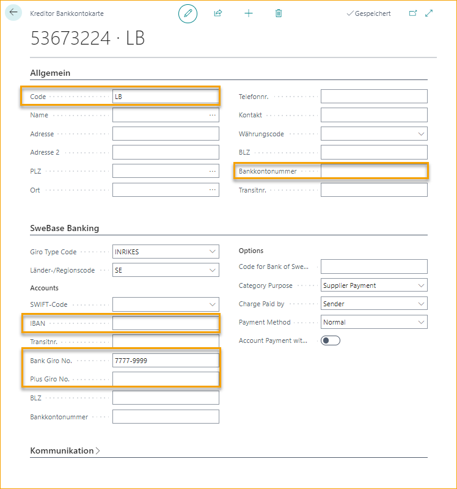

## Zahlungsvalidierung und Zahlungsvorschlag

Lassen Sie ExFlow ein interpretiertes Konto validieren und sicherstellen, dass der vorgeschlagene Lieferantenkontocode gesetzt ist.

### Zahlungsvalidierung Einrichtung

Um mit der Zahlungsvalidierung arbeiten zu können, muss das (Bank-)Konto in ExFlow Data Capture interpretiert werden und die folgenden Einstellungen müssen konfiguriert sein.

Gehen Sie zu **ExFlow Setup --> Verwandt --> Erweitert --> Zahlungsvalidierung Einrichtung** oder aktivieren Sie das Kontrollkästchen Zahlungsvalidierung unter Allgemein in ExFlow Setup.

Diese Funktion gibt an, ob der Zahlungsvalidierungsprozess während des Import- und Dateninterpretationsprozesses angewendet wird.

Klicken Sie auf Neu oder Liste bearbeiten, um die erforderlichen Felder hinzuzufügen:

### Empfängerbankkonto vorschlagen

Um "Empfängerbankkonto vorschlagen" zu aktivieren, muss das Kontrollkästchen "Zahlungsvalidierung" in ExFlow Setup aktiviert sein und SweBase muss installiert sein.

### ExFlow Zahlungsvalidierung im ExFlow Import Journal

Der interpretierte Wert "Zahlung-an-Konto" im Feld "Zahlungsvalidierung Kontonummer" sollte das Lieferantenbankkonto mit einem Filter auf die ausgewählte Zahlung-an-Lieferantenkarte betrachten.

Fügen Sie die erforderlichen Lieferantenkontodaten auf der Lieferantenbankkontokarte hinzu.

Das interpretierte Zahlung-an-Konto wird im Kopf des Import Journals zusammen mit dem spezifischen Empfängerbankkonto angezeigt.

Vom Import Journal aus ist es möglich, die Lieferantenbankkontokarte zu öffnen und die Konten anzuzeigen/bearbeiten.

#### Warnmeldungen im Import Journal

Wenn das interpretierte Konto nicht mit dem vorhandenen Konto übereinstimmt oder wenn das Konto auf der Zahlung-an-Lieferantenkarte fehlt, wird eine Warnmeldung unter "Warnmeldungen" auf der rechten Seite bei den FactBoxes angezeigt.

Dasselbe gilt für den Zahlungsvorschlag, wenn diese Funktion in ExFlow Setup aktiviert ist.  
Die folgenden Warnmeldungen werden ausgelöst, wenn ein (Bank-)Konto in ExFlow Data Capture (und Import) interpretiert wird, das nicht mit dem bevorzugten Bankkontocode übereinstimmt, der auf der Lieferantenkarte in ExFlow Business Central festgelegt ist.

Mit diesen Warnungen gibt ExFlow die Möglichkeit, das Dokument noch einmal zu überprüfen, um sicherzustellen, dass alles korrekt ist, bevor es erstellt wird, oder ob Anpassungen erforderlich sind. Wenn nichts korrigiert werden muss, klicken Sie einfach auf "Alle Warnungen akzeptieren", um fortzufahren.

#### Zahlungsvalidierung und Zahlungsvorschlag in einem dedizierten Journal ignorieren

Wenn eine oder beide der oben genannten Einstellungen in ExFlow Setup aktiviert sind, es jedoch erforderlich ist, mit manuellen Dokumenten im Import Journal zu arbeiten, bei denen z.B. ein interpretiertes Bankkonto fehlt, besteht die Möglichkeit, ein dediziertes manuelles Journal zu haben, das die Validierung überspringt und keine Warnmeldungen bezüglich der Zahlungsvalidierung oder des Zahlungsvorschlags im Import Journal anzeigt.

#### Zahlungsvalidierung und Vorschläge in ExFlow Lieferanteneinrichtung

Es ist möglich, Zahlungsvalidierungs- und Vorschlagseinstellungen auch auf Lieferantenebene zu verwalten. Gehen Sie zu ExFlow Lieferanteneinrichtung, wenn ein bestimmter Lieferant von dieser Funktion ausgeschlossen werden muss.

Bearbeiten Sie die Liste oder drücken Sie "Neu", um "Zahlungsvalidierungswarnung ignorieren" und "Zahlungsvorschlagswarnung ignorieren" zu aktivieren.

Es ist auch möglich, "Empfängerbankkonto vorschlagen" standardmäßig (aus ExFlow Setup), immer oder nie auszuwählen.

