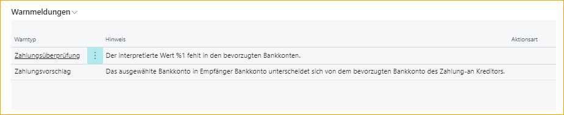

## Zahlungsvalidierung und Zahlungsvorschlag

Lassen Sie ExFlow ein interpretiertes Konto validieren und stellen Sie sicher, dass der vorgeschlagene Kontocode des Lieferanten festgelegt ist.

### Einrichtung der Zahlungsvalidierung

Um mit der Zahlungsvalidierung arbeiten zu können, muss das (Bank-)Konto in ExFlow Data Capture interpretiert werden und die folgenden Einstellungen müssen konfiguriert sein.

Gehen Sie zu **ExFlow Setup --> Verwandt --> Erweitert --> Zahlungsvalidierung einrichten** oder aktivieren Sie das Kontrollkästchen "Zahlungsvalidierung" unter "Allgemein" in der ExFlow-Einrichtung.

Diese Funktion legt fest, ob der Zahlungsvalidierungsprozess während des Import- und Dateninterpretationsprozesses angewendet wird.

Klicken Sie auf "Neu" oder "Liste bearbeiten", um die erforderlichen Felder hinzuzufügen:

### Empfängerbankkonto vorschlagen

Um "Empfängerbankkonto vorschlagen" zu aktivieren, muss das Kontrollkästchen "Zahlungsvalidierung" in der ExFlow-Einrichtung aktiviert und SweBase installiert sein.

### ExFlow-Zahlungsvalidierung im Importjournal von ExFlow

Der interpretierte Wert "Zu zahlendes Konto" für das Feld "Zahlungsvalidierung Kontonummer" sollte das Lieferantenbankkonto mit einem Filter auf die ausgewählte Lieferantenkarte betrachten.

Fügen Sie die erforderlichen Lieferantenkontodetails auf der Lieferantenbankkontokarte hinzu.

Das interpretierte Zu-Zahl-Konto wird zusammen mit dem spezifischen Empfängerbankkonto im Header des Importjournals angezeigt.

Aus dem Importjournal heraus ist es möglich, die Lieferantenbankkontokarte zu öffnen und die Konten anzuzeigen/bearbeiten.

#### Warnmeldungen im Importjournal

Wenn das interpretierte Konto nicht mit dem vorhandenen Konto übereinstimmt oder das Konto in der Lieferantenkarte fehlt, wird eine Warnmeldung unter "Warnmeldungen" auf der rechten Seite der FactBoxes angezeigt.

Das Gleiche gilt für den Zahlungsvorschlag, wenn diese Funktion in der ExFlow-Einrichtung aktiviert ist.  
Untenstehende Warnmeldungen werden ausgelöst, wenn ein (Bank-)Konto in ExFlow Data Capture interpretiert wird (und importiert wird), das nicht mit dem auf der Lieferantenkarte in ExFlow Business Central festgelegten bevorzugten Bankkontocode übereinstimmt.

Mit diesen Warnungen bietet ExFlow die Möglichkeit, das Dokument zu überprüfen, um sicherzustellen, dass alles korrekt ist, bevor es erstellt wird, oder ob Anpassungen erforderlich sind. Wenn nichts korrigiert werden muss, klicken Sie einfach auf "Alle Warnungen akzeptieren", um fortzufahren.

#### Zahlungsvalidierung und Zahlungsvorschlag in der ExFlow-Lieferanteneinrichtung

Es ist auch möglich, Zahlungsvalidierungs- und Vorschlagseinstellungen auf Lieferantenebene zu bearbeiten. Gehen Sie zur ExFlow-Lieferanteneinrichtung, wenn ein bestimmter Lieferant von dieser Funktion ausgeschlossen werden soll.

Bearbeiten Sie die Liste oder klicken Sie auf "Neu", um "Zahlungsvalidierungswarnung ignorieren" und "Vorschlagswarnung ignorieren" zu aktivieren.

Es ist auch möglich, "Empfängerbankkonto vorschlagen" standardmäßig (aus ExFlow Setup), immer oder nie festzulegen.

