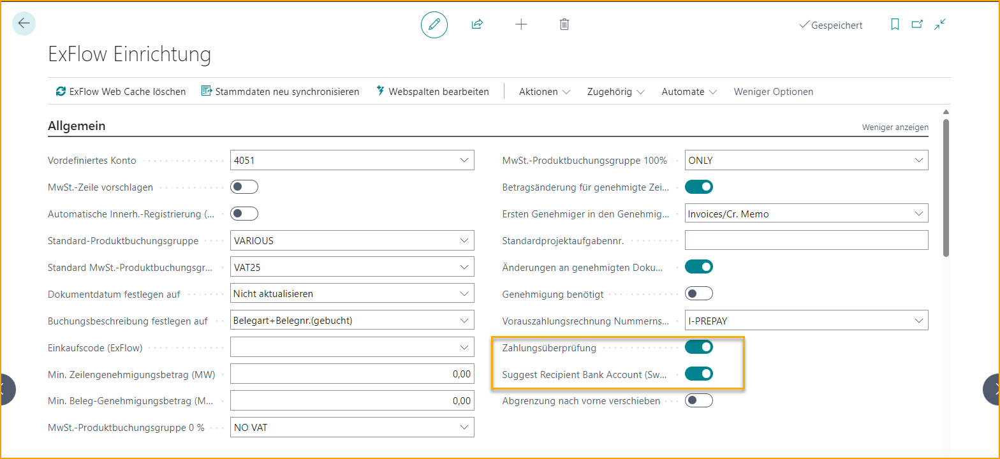
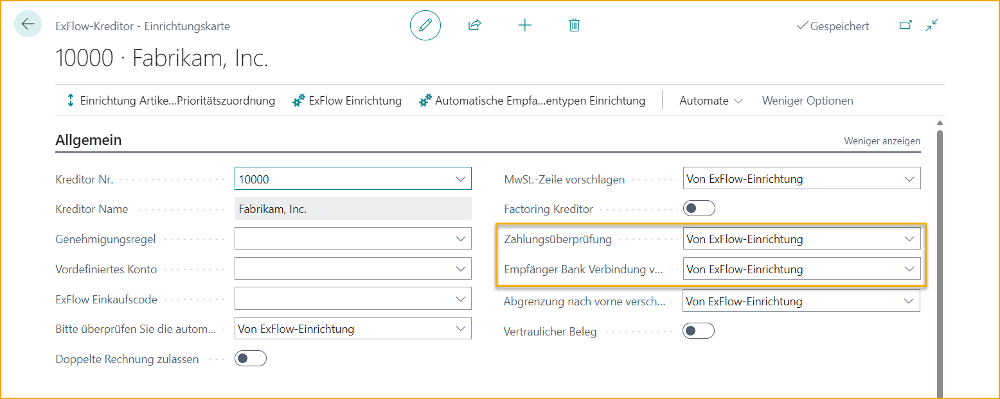

## Zahlungsvalidierung und Zahlungsvorschlag

Um mit der Zahlungsvalidierung arbeiten zu können, muss das (Bank-)Konto in ExFlow Data Capture interpretiert werden und die unten aufgeführten Einstellungen müssen konfiguriert sein.

Lassen Sie ExFlow überprüfen, ob das interpretierte Bankkonto in den aktuellen Pay-to Vendor Bank Accounts vorhanden ist. Und wenn ISV SweBase installiert ist, schlagen Sie das validierte Vendor Bank Account für das Dokument zur Zahlung vor.

Die Zahlungsvalidierung und der Vorschlag des Empfängerbankkontos können für alle Lieferanten aktiviert und für ausgewählte Lieferanten deaktiviert werden. Oder nur für bestimmte Lieferanten aktiviert werden.

### Einrichtung der Zahlungsvalidierung / Vorschlag des Empfängerbankkontos

#### Einrichtung von ExFlow Data Capture

Das Feld *„Pay-to-Account“* in ExFlow Data Capture muss im Dokumentenkopfbereich hinzugefügt werden.

#### Zahlungsvalidierung in ExFlow Setup

Beginnen Sie mit der Aktivierung der Zahlungsvalidierung. Dies aktiviert die Zahlungsvalidierung für alle Lieferanten.

Gehen Sie zu: **ExFlow Setup --> Related --> Advanced --> Payment Validation Setup** oder über **ExFlow Setup --> General**

Fügen Sie Felder aus dem Vendor Bank Account hinzu, die mit dem interpretierten Wert abgeglichen werden sollen.

Klicken Sie auf Neu oder Liste bearbeiten und wählen Sie die erforderlichen Felder aus:

 

#### Vorschlag des Empfängerbankkontos in ExFlow Setup
Die Zahlungsvalidierung muss aktiviert und ISV SweBase installiert sein.

Um den Vorschlag des Empfängerbankkontos für alle Lieferanten nutzen zu können: 

Gehen Sie zu: **ExFlow Setup --> General** und aktivieren Sie den Vorschlag des Empfängerbankkontos

 

### ExFlow Lieferanteneinrichtung
#### Zahlungsvalidierung

Fügen Sie den Lieferanten durch Bearbeiten der Liste hinzu oder klicken Sie auf Neu.

Wählen Sie den Lieferanten in der Liste und den Wert im Feld Zahlungsvalidierung aus.

Oder öffnen Sie die Lieferanteneinrichtungskarte:

| Zahlungsvalidierung|  |
|:-|:-|
| **Aus ExFlow Setup**:              | Verwenden Sie die gleiche Einstellung wie im ExFlow Setup
| **Ja**:                         | Aktivieren Sie die Zahlungsvalidierung für diesen speziellen Lieferanten, unabhängig von der Einstellung im ExFlow Setup
| **Nein**:                         | Deaktivieren Sie die Zahlungsvalidierung für diesen speziellen Lieferanten, unabhängig von der Einstellung im ExFlow Setup
 

#### Vorschlag des Empfängerbankkontos
Die Zahlungsvalidierung muss aktiviert und ISV SweBase installiert sein. 

Fügen Sie den Lieferanten durch Bearbeiten der Liste hinzu oder klicken Sie auf Neu. 

Wählen Sie den Lieferanten in der Liste und den Wert im Feld Vorschlag des Empfängerbankkontos aus.

| Vorschlag des Empfängerbankkontos |  |
|:-|:-|
| **Aus ExFlow Setup**:           | Verwenden Sie die gleiche Einstellung wie im ExFlow Setup
| **Ja**:                         | Aktivieren Sie den Vorschlag des Empfängerbankkontos für diesen speziellen Lieferanten, unabhängig von der Einstellung im ExFlow Setup
| **Nein**:                         | Deaktivieren Sie den Vorschlag des Empfängerbankkontos für diesen speziellen Lieferanten, unabhängig von der Einstellung im ExFlow Setup

 

### Zahlungsvalidierung / Vorschlag des Empfängerbankkontos im Import Journal

Wenn die Zahlungsvalidierung aktiviert ist, vergleicht ExFlow den im Pay-to-Account in ExFlow Data Capture interpretierten Wert mit den Pay-to Vendor Bank Accounts.

Der interpretierte Wert wird ohne Sonderzeichen verglichen und muss in einem oder mehreren der in der Zahlungsvalidierung hinzugefügten Felder vorhanden sein.

Der interpretierte Pay-to-Account wird im Kopfbereich des Import Journals (Payment Validation Account No.) zusammen mit dem ausgewählten Empfängerbankkonto angezeigt, falls aktiviert.

Wenn ein Empfängerbankkonto ausgewählt ist, wird die Priorität auf die interpretierte Währung und das Pay-to-Account gelegt. Wenn kein Pay-to Vendor Bank Account mit der aktuellen Währung vorhanden ist, wird ein Bankkonto ohne Währung ausgewählt.

Vom Import Journal aus ist es möglich, die Vendor Bank Account Cards zu öffnen.
Verwenden Sie das Feld Empfängerbankkonto oder:  
Gehen Sie zu: **Import Journal --> Related --> Document --> Vendor Bank Account**

### Warnmeldungen
Wenn das interpretierte Konto nicht mit dem vorhandenen Pay-to Vendor Bank Account übereinstimmt oder das Konto fehlt, wird eine Warnmeldung unter "Warnmeldungen" rechts bei den FactBoxes angezeigt.

Dasselbe gilt für den Zahlungsvorschlag, wenn diese Funktion im ExFlow Setup aktiviert ist.

Die folgenden Warnmeldungen werden ausgelöst, wenn ein (Bank-)Konto in ExFlow Data Capture interpretiert (und importiert) wird, das nicht mit dem auf der Lieferantenkarte in ExFlow Business Central festgelegten bevorzugten Bankkonto übereinstimmt.

Mit diesen Warnungen gibt ExFlow die Möglichkeit, das Dokument zu überprüfen, um sicherzustellen, dass alles korrekt ist, bevor es erstellt wird, oder ob Anpassungen erforderlich sind.

Wenn nichts korrigiert werden muss, klicken Sie einfach auf ''Alle Warnungen akzeptieren'', um fortzufahren.

### Zahlungsvalidierung oder Zahlungsvorschlag in einem speziellen Journal ignorieren
Wenn eine oder beide der oben genannten Einstellungen aktiviert sind, es jedoch erforderlich ist, mit manuellen Dokumenten im Import Journal zu arbeiten, bei denen z.B. ein interpretiertes Bankkonto fehlt, besteht die Möglichkeit, ein spezielles manuelles Journal zu haben, das die Validierung überspringt und keine Warnmeldungen bezüglich der Zahlungsvalidierung oder des Zahlungsvorschlags im Import Journal anzeigt.

