## OMNI Genehmigung

ExFlow OMNI Genehmigung ist eine Möglichkeit für Business Central-Benutzer, verschiedene Funktionen in ExFlow zu genehmigen, z.B. ExFlow-Verträge und ExFlow-Genehmigungsregeln. Dies bedeutet, dass ein Vertrag oder eine Genehmigungsregel in ExFlow nicht verwendet werden kann, bevor sie vollständig genehmigt ist.

### ExFlow OMNI Dokumenteneinrichtung

Gehen Sie zu: ***Setup --> ExFlow OMNI Genehmigung --> ExFlow OMNI Dokumenteneinrichtung***

In der ExFlow OMNI Dokumenteneinrichtung gibt es zwei verschiedene OMNI-Typen: Vertrag und Genehmigungsregel.

Eine Einrichtung ist für den OMNI-Typ erforderlich, in diesem Fall ein Vertrag.

Der OMNI-Typ ist der Bereich, der eine Genehmigung erfordert. Es ist möglich, die Mindestanzahl von Genehmigern festzulegen. Wenn "Genehmigung erforderlich" aktiviert ist, erfordern alle neu erstellten Verträge eine Genehmigung.

Aktivieren Sie "Gleichzeitige Genehmigung zulassen", wenn alle Genehmigungsgruppen das Dokument gleichzeitig genehmigen dürfen oder zum ersten Business Central-Benutzer in der Liste gehen sollen.

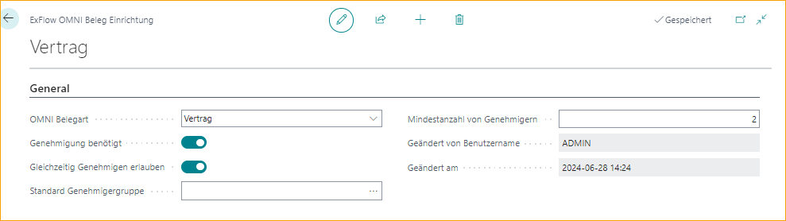

Die gleiche Art der Einrichtung muss für den OMNI-Typ "Genehmigungsregel" vorgenommen werden, wenn eine Genehmigung für eine ExFlow-Genehmigungsregel erforderlich ist, bevor sie verwendet werden kann.

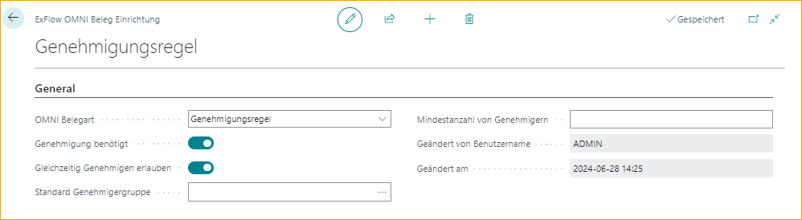

### ExFlow OMNI Genehmigungsregeln

Gehen Sie zu: ***Setup --> ExFlow OMNI Genehmigung --> ExFlow OMNI Genehmigungsregel***

Die ExFlow OMNI Genehmigungsregel ermöglicht verschiedene Genehmigungsregeln für die verschiedenen OMNI-Typen "Vertrag" und "Genehmigungsregel".

#### **ExFlow OMNI Genehmigungsregel für Verträge**

Fügen Sie "Vertrag" als "OMNI-Dokumenttyp" hinzu und benennen Sie ihn. Wie bei regulären Genehmigungsregeln kann die Priorität festgelegt werden. Wenn die Genehmigungsregel-Filter und Genehmigungsregel-Zeilen festgelegt sind, kann die OMNI-Genehmigungsregel vom Business Central-Benutzer aktiviert werden.

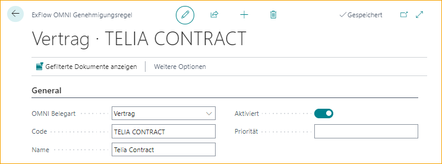

Legen Sie die Filter fest, indem Sie auf ***Verwalten \--\> Filter festlegen*** unter Genehmigungsregel-Filter klicken.

Fügen Sie die erforderlichen Filter hinzu, die für die aktuelle Genehmigungsregel verwendet werden sollen.

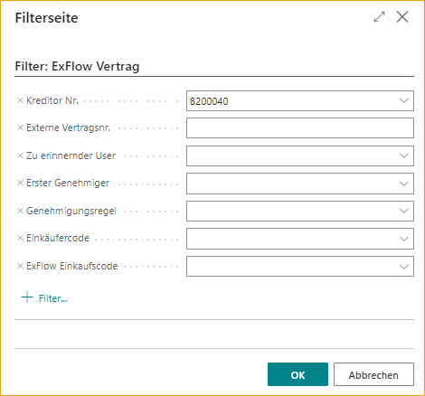

Vertragsdimensionen können auch hinzugefügt werden, indem Sie auf Filter festlegen klicken, wie oben erwähnt, oder indem Sie auf die Filterzelle klicken.

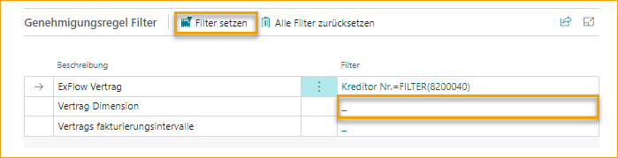

Listen Sie die Genehmiger in der gleichen Reihenfolge auf, in der sie unter den Genehmigungsregel-Zeilen genehmigt werden.

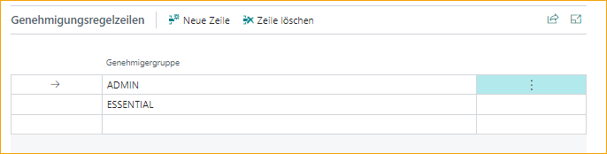

Wenn Genehmigungsregel-Filter und Genehmigungsregel-Zeilen hinzugefügt sind, kann die ExFlow OMNI Genehmigungsregel aktiviert werden.

#### **ExFlow OMNI Genehmigungsregel für Genehmigungsregeln**

Fügen Sie "Genehmigungsregeln" als "OMNI-Dokumenttyp" hinzu und benennen Sie ihn. Wie bei regulären Genehmigungsregeln kann die Priorität festgelegt werden. Wenn die erforderlichen Genehmigungsregel-Filter und Genehmigungsregel-Zeilen festgelegt sind, kann die OMNI-Genehmigungsregel manuell vom Business Central-Benutzer aktiviert werden.

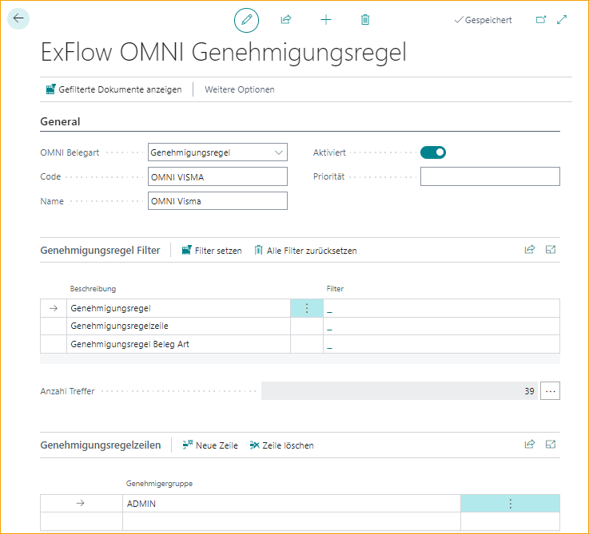

Wählen Sie eine vorhandene ExFlow-Genehmigungsregel aus oder erstellen Sie eine neue Regel gemäß dem regulären ExFlow-Standard.

Lesen Sie mehr darüber im Abschnitt **"ExFlow Genehmigungsregel"**.

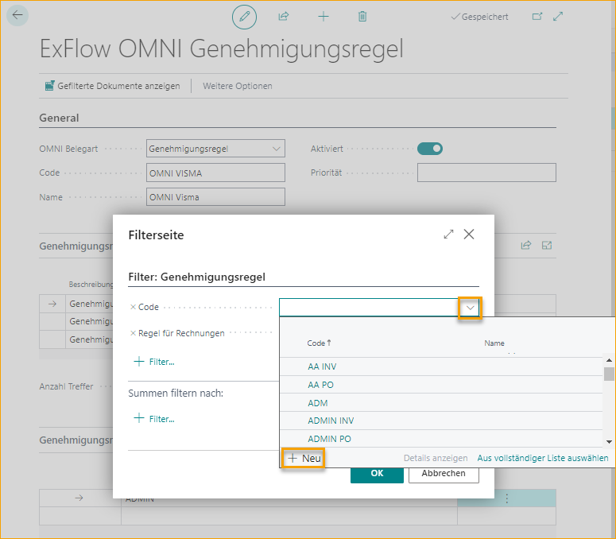

Fügen Sie den erforderlichen Filter hinzu. Wenn die Regel fertig ist und manuell aktiviert wird, wird sie zur Genehmigung an den/die Business Central-Benutzer gesendet.

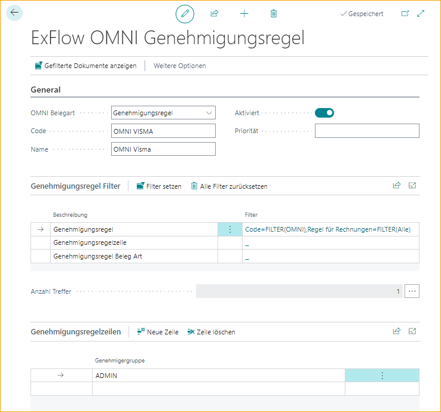

Wenn der Business Central-Benutzer die Seite schließt, ohne die ExFlow OMNI Genehmigungsregel zu aktivieren, erscheint folgende Frage: *"Möchten Sie die ExFlow OMNI Genehmigungsregel aktivieren?"*.

Alle ExFlow OMNI Genehmigungsregeln können in der ExFlow OMNI Genehmigungsregelliste eingesehen werden.

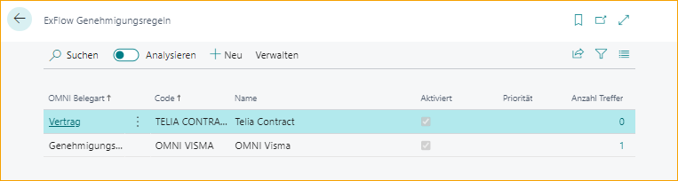

### ExFlow OMNI Genehmigungsstatus

Gehen Sie zu: ***Setup --> ExFlow OMNI Genehmigung --> ExFlow OMNI Genehmigungsstatus***

Der Business Central-Benutzer kann alle Dokumente sehen, die in ExFlow OMNI Genehmigung zur Genehmigung ausstehen. Es ist auch möglich, genehmigte, weitergeleitete und abgelehnte OMNI-Dokumente zu sehen. Wenn der Status eines Dokuments "Genehmigt" ist, kann das Dokument in ExFlow verwendet werden.

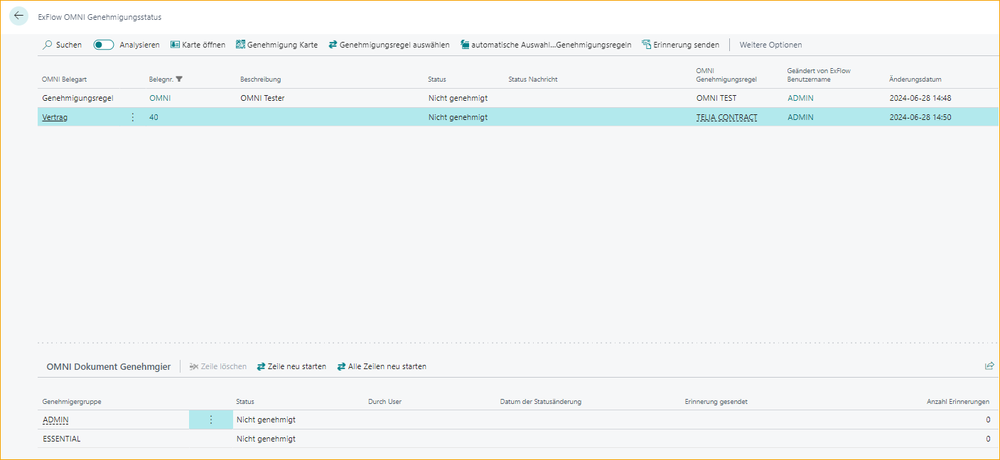

Gehen Sie zu **Karte öffnen**, um den ExFlow-Vertrag zu öffnen.

Um den Genehmigungsablauf eines Dokuments zu ändern, gehen Sie zu: ***Genehmigungskarte***

Von dieser Seite aus ist es möglich, die Originalkarte zu öffnen, zu einer anderen Genehmigungsregel zu wechseln und Genehmiger hinzuzufügen/zu löschen. Es ist auch möglich, die Genehmigung aller Zeilen oder einer ausgewählten Zeile neu zu starten.

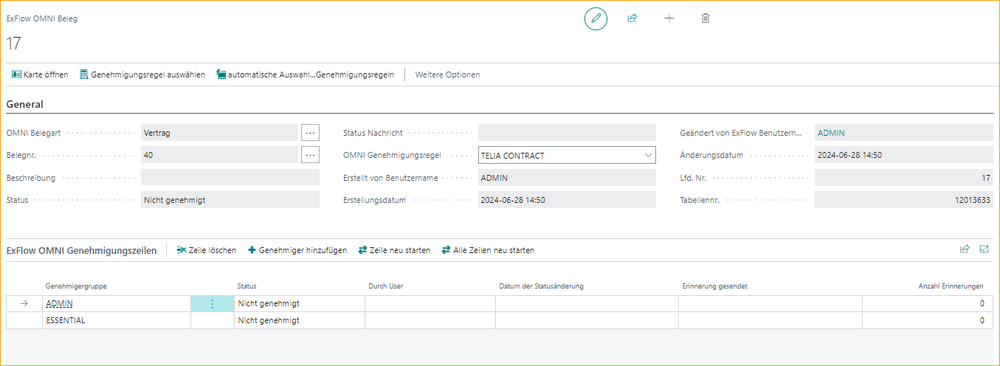

### ExFlow OMNI Genehmigungsdokumente

Gehen Sie zu: ***Setup --> ExFlow OMNI Genehmigung --> ExFlow OMNI Genehmigungsdokumente***

In ExFlow OMNI Genehmigungsdokumente kann der spezifische Business Central-Benutzer alle seine Dokumente sehen, die zur Genehmigung ausstehen, in "Meine aktuellen Genehmigungen". Es ist auch möglich, die zukünftigen und historischen Genehmigungen des Business Central-Benutzers zu sehen.

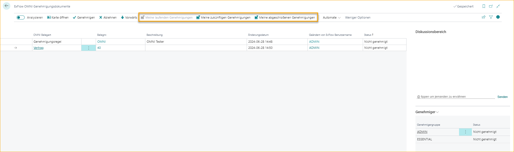

Öffnen Sie die Karte, um die Originalkarte anzuzeigen, in diesem Fall würde sie zu ExFlow Vertrag 2 weiterleiten.

Das OMNI-Dokument Vertrag kann vom betreffenden Business Central-Benutzer genehmigt, abgelehnt oder weitergeleitet werden.

Verwenden Sie das Diskussionsfeld, um Kommentare zu schreiben und andere Business Central-Benutzer zu erwähnen.

Um den aktuellen Genehmigungsablauf für ein bestimmtes Dokument zu sehen, gehen Sie zu FactBox unter "Genehmiger".

Wenn der Business Central-Benutzer ADMIN genehmigt hat, wird das Genehmigungsdokument zu "Meine historischen Genehmigungen" verschoben und geht zum nächsten Business Central-Benutzer ESSENTIAL im Genehmigungsablauf.

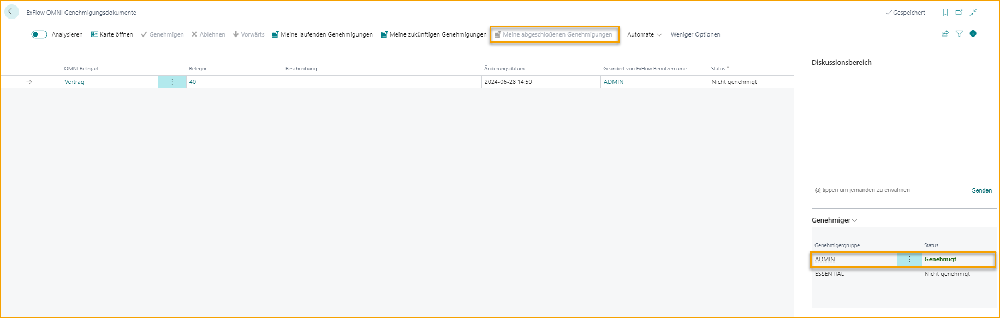

Wenn alle Genehmiger genehmigt haben, ändert sich der Status in "Genehmigt" in ExFlow OMNI Genehmigungsdokumente.

Klicken Sie einfach auf "Genehmigen", um die Genehmigungsregel zu genehmigen.

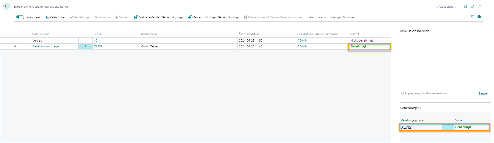

Wenn eine Genehmigungsregel genehmigt wird, ändert sich der Status von "Nicht genehmigt" zu "Genehmigt" in ExFlow OMNI Genehmigungsdokumente und auch in der ExFlow Genehmigungsregelliste.

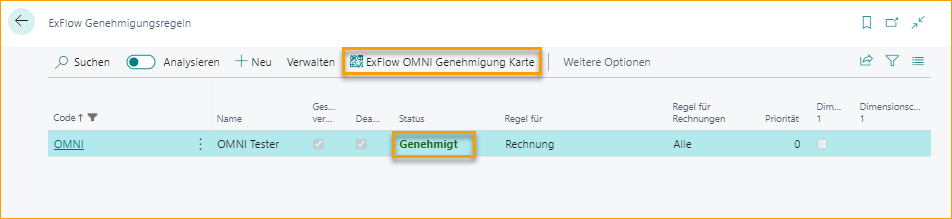

Von der ExFlow Genehmigungsregelliste aus ist es auch möglich, auf die ExFlow OMNI Genehmigungskarte zu klicken, um das ExFlow OMNI-Dokument anzuzeigen.

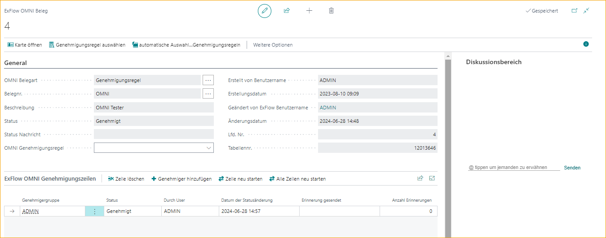
