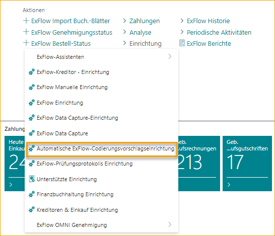
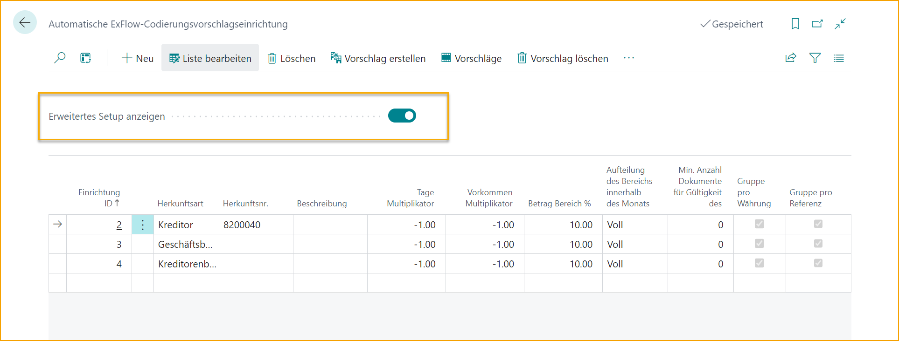
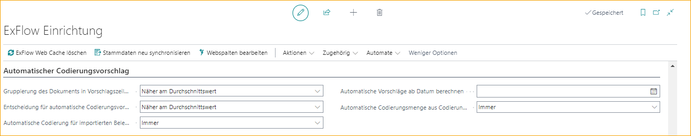
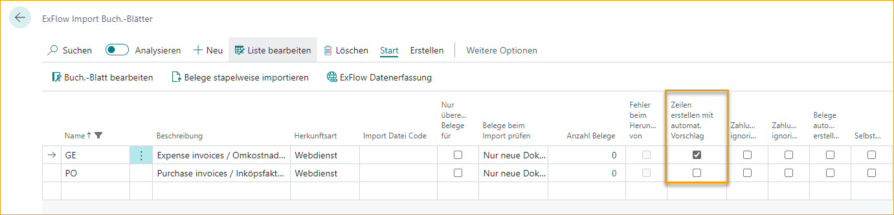

## Einrichtung der automatischen Kodierungsvorschläge

Gehe zu: ***Setup --> ExFlow Auto Coding Suggestion Setup*** 

Diese Funktion in ExFlow ermöglicht es, automatische Kodierungsvorschläge im Importjournal basierend auf historisch gebuchten Dokumenten zu erhalten. Diese Funktion funktioniert für Rechnungen und Gutschriften.

Um diese Funktion nutzen zu können, muss sie zuerst an einigen Stellen eingerichtet werden.

Aktiviere die **''Erweiterte Einrichtung anzeigen''** auf der Seite Auto Coding Suggestion Setup, um die vollständige Seitenübersicht zu erhalten.

Bitte beachten Sie, dass die letzten beiden Felder im obigen Bild (''Gruppieren nach Währung'' und ''Gruppieren nach Referenz'') standardmäßig ausgeblendet sind und über die Seitenpersonalisierung hinzugefügt werden können.

| Auto Coding Suggestion Setup Ribbon     |	|
|:-|:-|
| **Neu**:    | Einen neuen Kodierungsvorschlag hinzufügen
| **Liste bearbeiten**:    | Die Kodierungsvorschlags-Einrichtungsliste bearbeiten
| **Löschen**:    | Einen Kodierungsvorschlag löschen
| **Vorschlag erstellen**:    | Diese Schaltfläche durchläuft die Einrichtung und fügt Vorschläge zur Vorschlags-ID hinzu
| **Vorschläge:**          | Zeigt die erstellte Vorschlags-ID für die ausgewählte Einrichtung an
| **Vorschläge löschen:**   | Löscht die Vorschlags-IDs
| **Kodierungsdokumenthistorie:**   | Öffnet die Seite ExFlow Auto Coding Suggestion Document History
| **Dokumente gruppieren nach:**   | Öffnet die Liste ExFlow Auto Coding Suggestion Grouping
| **Felder anwenden:**   | Öffnet die Einrichtung der Übertragungsfelder für automatische Kodierungsvorschläge

 

### Einen neuen automatischen Kodierungsvorschlag hinzufügen

| Auto Coding Suggestion Setup --> Neu/Liste bearbeiten      |	|
|:-|:-|
| **Einrichtungs-ID:**                                          | Gibt die ID der Kodierungsvorschlagseinrichtung an.
| **Quelltyp:**                                          | Gen. Bus. Posting Group, Vendor Posting Group, Vendor oder Alle. Dies definiert die Gruppierung der von ExFlow erstellten Vorschläge
| **Quellnummer:**                                            | Dies definiert, welche Nummer aus dem spezifischen "Quelltyp" in dieser Einrichtung verwendet werden soll.  Wenn die Quellnummer für den Quelltyp Vendor leer bleibt, erfolgt die Gruppierung pro Vendor für alle Vendors.  Durch das Erstellen einer Einrichtungs-ID als "Quelltyp" Vendor und leerer "Quellnummer" werden Kodierungsvorschläge von jedem Vendor erstellt, wobei die Vorschläge immer nach Vendor gefiltert werden
| **Beschreibung:**                                          | Beschreibender Text. (max. 100 Zeichen)
| **Tagesmultiplikator:**                                      | Dies definiert, wie stark die Anzahl der Tage seit der letzten Rechnung für diese Einrichtung die Priorität für den vorgeschlagenen Kodierungsvorschlag beeinflusst. Je größer die Zahl, desto größer der Multiplikator. Der Multiplikator sollte einen negativen Wert haben. Z.B. -10 hat einen größeren Einfluss als -1
| **Vorkommensmultiplikator:**                                | Dies definiert, wie stark die Anzahl der Rechnungen in der Vorschlags-ID innerhalb dieser Einrichtung die Priorität für den vorgeschlagenen Kodierungsvorschlag beeinflusst. Je größer die Zahl, desto größer der Multiplikator. Der Multiplikator sollte einen negativen Wert haben. Z.B. -10 hat einen größeren Einfluss als -1
| **Betragsbereich %:**                                       | Dies definiert den Prozentsatz (plus/minus) des Betrags, der auf die Vorschlags-ID angewendet wird, in der eine spezifische Kodierung für ein Dokument gespeichert wird
| **Mindestanzahl an Dokumenten für die Gültigkeit des Vorschlags:**  | Die Mindestanzahl an Dokumenten, die der Vorschlagseinrichtungs-ID hinzugefügt werden müssen, damit ein Vorschlag aus dieser Vorschlags-ID automatisch ausgewählt wird
| **Gruppieren nach Währung:**                                   | Dies definiert, ob die Gruppierung nach Währung erfolgen soll.    Dieses Feld ist standardmäßig ausgeblendet, fügen Sie dieses Feld bei Bedarf über die Seitenpersonalisierung hinzu.
| **Gruppieren nach Referenz**:                                  | Dies definiert, ob die Gruppierung nach ExFlow-Referenzcodes erfolgen soll.    Dieses Feld ist standardmäßig ausgeblendet, fügen Sie dieses Feld bei Bedarf über die Seitenpersonalisierung hinzu.

 

### Automatische Kodierungsvorschläge aktivieren

#### ExFlow Einrichtung

Aktivieren Sie diese Funktion in der ExFlow-Einrichtung, indem Sie diese Funktion für alle Vendors oder ausgewählte Vendors aktivieren.

Wenn "Ausgewählte Vendors" aktiviert ist, muss auch "Automatische Kodierungsvorschläge verwenden" für die Vendors in der [***ExFlow Vendor Setup***](https://docs.exflow.cloud/business-central/docs/user-manual/business-functionality/vendor-setup) Karte aktiviert werden, die diese Funktion aktiviert haben sollen.

| ExFlow Einrichtung --> Abschnitt Auto Coding Suggestion     |	|
|:-|:-|
| **Gruppierung von Dokumenten in Vorschlagszeilen mit Betrag:**    | Gibt an, wie die Dokumente basierend auf dem Betrag des Dokuments gruppiert werden.
| **Entscheidung für automatische Kodierungsvorschläge basierend auf dem Betrag:**           | Gibt an, wie die Vorschlagszeile basierend auf dem Betrag des Dokuments ausgewählt wird
| **Automatische Kodierungsvorschläge für importiertes Dokument vorschlagen:**           | Gibt an, wie der automatische Kodierungsvorschlag verwendet wird
| **Automatische Vorschläge ab Datum berechnen:**                          | Gibt das Startdatum des Dokuments an, das in den automatischen Kodierungsvorschlägen verwendet werden soll.
| **Automatische Kodierungsvorschläge aus Kodierungssatz-ID vorschlagen:**       | Gibt an, ob die Beträge automatisch in den erstellten Zeilen aus der Kodierungssatz-ID vorgeschlagen werden

 

#### Importjournal

Aktivieren Sie **Zeilen mit automatischem Vorschlag erstellen**, um diese Funktion für ein spezifisches Importjournal zu aktivieren.

 

#### Periodische Aktivitäten

Um den automatischen Kodierungsvorschlag anzuwenden, müssen die Funktionen **ExFlow Kodierungssatz-IDs für Kodierungsvorschläge** und **ExFlow automatische Kodierungsvorschläge erstellen** ausgeführt werden.  

Beim ersten Gebrauch des automatischen Kodierungsvorschlags müssen beide Jobs mindestens einmal ausgeführt werden. Danach kann die Wiederholung in den entsprechenden Job-Queue-Einträgen angepasst werden.

