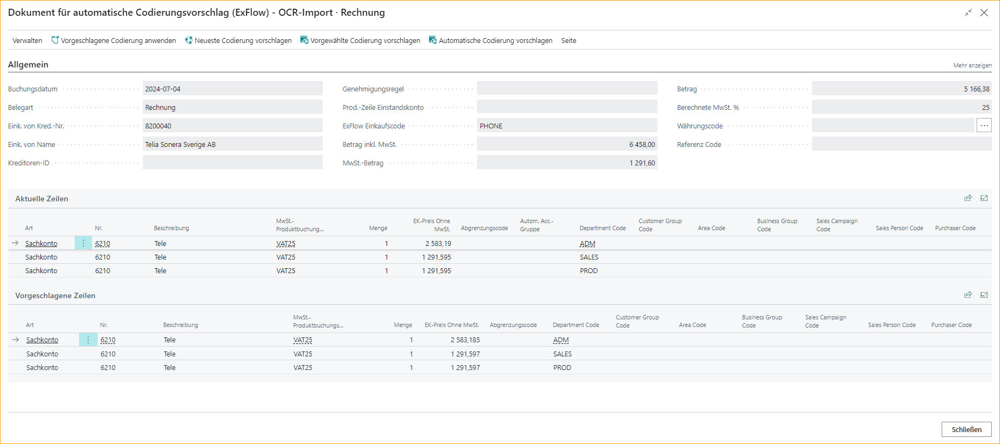

## Automatische Codierungsvorschläge-Einrichtung

Gehen Sie zu: ***ExFlow Setup - Übersicht --> Automatische Codierungsvorschläge-Einrichtung*** oder suchen Sie nach ***ExFlow Automatische Codierungsvorschläge-Einrichtung***

Diese Funktion in ExFlow wurde entwickelt, um automatische Codierungsvorschläge im Importjournal basierend auf historisch gebuchten Dokumenten zu erhalten und funktioniert sowohl für Rechnungen als auch für Gutschriften. Dies kann für Unternehmen nützlich sein, die bereits eine Buchungshistorie in Business Central haben, aber gerade erst mit der Nutzung von ExFlow begonnen haben. 

*Automatische Codierungsvorschläge* können Codierungsvorschläge liefern, wenn keine andere Vorschlagsart angewendet wurde, wie beispielsweise ein ExFlow-Einkaufscode oder ein vordefiniertes Sachkonto. Die automatischen Codierungsvorschläge aktualisieren kontinuierlich die Codierungsvorschläge nach dem Buchen der Dokumente, um stets einen genauen zukünftigen Vorschlag zu geben. 

**Bitte beachten Sie:** Diese Funktion unterstützt nur Sachkonten, keine anderen Zeilentypen. 

Die Schritte für einen ordnungsgemäßen automatischen Codierungsvorschlag wären:  
1. Eine Buchungshistorie von Dokumenten haben  
2. Codierungssatz-IDs erstellen  
3. Vorschläge erstellen 
 

Oder lassen Sie ExFlow die automatischen Codierungsvorschläge über [Periodische Aktivitäten](https://docs.signupsoftware.com/business-central/docs/user-manual/business-functionality/auto-coding-suggestion-setup#periodic-activities) verwalten, wobei die Schritte darin bestehen würden, die Berichte auszuführen, um:
* Codierungssatz-IDs zu erstellen  
* Automatische Codierungsvorschläge zu erstellen 

## Einrichtung 
### Einen neuen automatischen Codierungsvorschlag hinzufügen

Um mit automatischen Codierungsvorschlägen zu beginnen, müssen Quellentyp(en) hinzugefügt werden. Es kann ein Kreditor, eine Geschäftsbuchungsgruppe, eine Kreditorenbuchungsgruppe oder als letzte Option alle davon sein.

Das Hinzufügen eines Quellentyps erstellt auch eine Einrichtungs-ID. Der nächste Schritt nach dem Hinzufügen eines Quellentyps ist, auf ''Vorschlag erstellen'' zu klicken.

Geben Sie ''Vorschläge'' ein, um die neu erstellten Vorschläge zu sehen.

| Automatische Codierungsvorschläge-Einrichtung - Menüband     |	|
|:-|:-|
| **Neu**:    | Einen neuen Codierungsvorschlag hinzufügen
| **Liste bearbeiten**:    | Die Liste der Codierungsvorschläge-Einrichtung bearbeiten
| **Löschen**:    | Einen Codierungsvorschlag löschen
| **Vorschlag erstellen**:    | Diese Schaltfläche durchläuft die Einrichtung und fügt Vorschläge zur Vorschlags-ID hinzu
| **Vorschläge:**          | Zeigt die erstellte Vorschlags-ID für die ausgewählte Einrichtung an
| **Vorschläge löschen:**   | Löscht die Vorschlags-IDs
| **Codierungsdokumentverlauf:**   | Öffnet die Seite ExFlow Automatische Codierungsvorschläge Dokumentenverlauf
| **Dokumente gruppieren nach:**   | Öffnet die ExFlow Automatische Codierungsvorschläge Gruppierungsliste
| **Felder anwenden:**   | Öffnet die Einrichtung für Automatische Codierungsvorschläge Feldübertragung

#### Erweiterte Einrichtung
Aktivieren Sie **''Erweiterte Einrichtung anzeigen''** auf der Seite Automatische Codierungsvorschläge-Einrichtung, um die vollständige Seitenübersicht zu erhalten, wenn eine erweiterte Einrichtung erforderlich ist.

 

| Automatische Codierungsvorschläge-Einrichtung --> Neu/Liste bearbeiten      |	|
|:-|:-|
| **Einrichtungs-ID:**                                          |Gibt die ID der Codierungsvorschläge-Einrichtung an.
| **Quellentyp:**                                          |Geschäftsb.-Buchungsgruppe, Kreditorenbuchungsgruppe, Kreditor oder Alle. Dies definiert die Gruppierung der von ExFlow erstellten Vorschläge
| **Quellennr.:**                                            | Dies definiert, welche Nr. des spezifischen "Quellentyps" für diese Einrichtung verwendet werden soll.  Wenn die Quellennr. für den Quellentyp Kreditor leer gelassen wird, erfolgt die Gruppierung pro Kreditor für alle Kreditoren.  Durch Erstellen einer Einrichtungs-ID mit "Quellentyp" Kreditor und leerer "Quellennr." werden Codierungsvorschläge von jedem Kreditor erstellt, wobei die Vorschläge immer nach Kreditor gefiltert werden
| **Beschreibung:**                                          | Beschreibender Text. (maximal 100 Zeichen)
| **Tage-Multiplikator:**                                      | Dies definiert, wie stark die Anzahl der Tage seit der letzten Rechnung für diese Einrichtung die Priorität für den zu verwendenden Codierungsvorschlag beeinflusst. Je größer die Zahl, desto größer der Multiplikator. Der Multiplikator sollte ein negativer Wert sein. Z.B. hat -10 einen größeren Einfluss als -1
| **Vorkommen-Multiplikator:**                                | Dies definiert, wie stark die Anzahl der Rechnungen in der Vorschlags-ID innerhalb dieser Einrichtung die Priorität für den zu verwendenden Codierungsvorschlag beeinflusst. Je größer die Zahl, desto größer der Multiplikator. Der Multiplikator sollte ein negativer Wert sein. Z.B. hat -10 einen größeren Einfluss als -1
| **Betragsbereich %:**                                       |Dies definiert den Prozentsatz (plus/minus) des Betrags, der für die Vorschlags-ID angewendet wird, in der eine bestimmte Codierung für ein Dokument gespeichert wird
| **Mindestanzahl an Dokumenten für Gültigkeit des Vorschlags:**  | Die Mindestanzahl an Dokumenten, die der Vorschlags-Einrichtungs-ID hinzugefügt werden müssen, damit ein Vorschlag aus dieser Vorschlags-ID automatisch ausgewählt wird
| **Nach Währung gruppieren:**                                   | Dies definiert, ob die Gruppierung mit Währung erfolgen soll.    Dieses Feld ist standardmäßig ausgeblendet, fügen Sie es bei Bedarf über die Seitenpersonalisierung hinzu.
| **Nach Referenz gruppieren**:                                  | Dies definiert, ob die Gruppierung mit ExFlow-Referenzcodes erfolgen soll.    Dieses Feld ist standardmäßig ausgeblendet, fügen Sie es bei Bedarf über die Seitenpersonalisierung hinzu.

 

### Automatische Codierungsvorschläge aktivieren
Gehen Sie zu: **ExFlow Setup --> Automatische Codierungsvorschläge**

Aktivieren Sie diese Funktion in ExFlow Setup, indem Sie diese Funktion für alle Kreditoren oder ausgewählte Kreditoren aktivieren.

Bei Aktivierung von "Ausgewählte Kreditoren" ist es erforderlich, auch "Automatische Codierung für importiertes Dokument vorschlagen" für die Kreditoren in der [***ExFlow Kreditoreneinrichtung***](https://docs.signupsoftware.com/business-central/docs/user-manual/business-functionality/vendor-setup) Karte zu aktivieren, für die diese Funktion aktiviert sein soll. 

| Automatischer Codierungsvorschlag     |	|
|:-|:-|
| **Gruppierung von Dokumenten in Vorschlagszeilen mit Betrag:**    | Gibt an, wie die Dokumente basierend auf dem Betrag des Dokuments gruppiert werden. Folgende Optionen können eingestellt werden: ''Näher zum Durchschnittswert, Näher zum niedrigeren Wert und Näher zum höheren Wert''. 
| **Automatische Codierungsvorschlagsentscheidung basierend auf dem Betrag:**           |Gibt an, wie die Vorschlagszeile basierend auf dem Betrag des Dokuments ausgewählt wird. Folgende Optionen können eingestellt werden: ''Näher zum Durchschnittswert, Näher zum niedrigeren Wert und Näher zum höheren Wert''. 
| **Automatische Codierung für importiertes Dokument vorschlagen:**           | Gibt an, wie der automatische Codierungsvorschlag verwendet wird. Folgende Optionen können eingestellt werden: ''Nie, Immer und Ausgewählte Kreditoren''.
| **Automatische Vorschläge ab Datum berechnen:**                          | Gibt das Startdatum des Dokuments an, das in den automatischen Codierungsvorschlägen verwendet werden soll.
| **Automatischen Codierungsbetrag aus Codierungssatz-ID vorschlagen:**       | Gibt an, ob die Beträge in den erstellten Zeilen aus der Codierungssatz-ID automatisch vorgeschlagen werden. Folgende Optionen können eingestellt werden: ''Nie, Immer und Ausgewählte Kreditoren''.

 

## Periodische Aktivitäten
Gehen Sie zu: **ExFlow Periodische Aktivitäten**

Um den automatischen Codierungsvorschlag anzuwenden, ist es erforderlich, die Funktionen **ExFlow-Codierungssatz-IDs für automatische Codierungsvorschläge** und **ExFlow-Erstellung automatischer Codierungsvorschläge** auszuführen.  

 

Bei der ersten Verwendung des automatischen Codierungsvorschlags müssen beide Jobs (Bericht 12013594 und 12013593) mindestens einmal ausgeführt werden. Danach kann die Wiederholung in den entsprechenden Auftragswarteschlangeneinträgen angepasst werden.

Bericht 12013594 aktualisiert die Gruppierung der Codierungssatz-ID in den ExFlow-Automatische-Codierungsvorschläge-Zeilen. Dann kann Bericht 12013593 (ExFlow-Codierungsvorschläge-Einrichtung - Aktualisieren – Projekt) verwendet werden, um ''ExFlow-Automatische-Codierungsvorschläge-Einrichtung'' zu aktualisieren. Es wird empfohlen, beide Berichte einmal täglich nach Büroschluss zu verwenden.

## Workflow

### Importjournal

#### Zeilen mit automatischem Vorschlag erstellen

Gehen Sie zu: **ExFlow Importjournale** 

Bearbeiten Sie die Journalliste und aktivieren Sie **Zeilen mit automatischem Vorschlag erstellen**, um diese Funktion für ein bestimmtes Importjournal zu aktivieren und ein dediziertes Journal für automatische Codierungsvorschläge zu haben.

 

#### Automatische Codierung für importiertes Dokument vorschlagen

#### Manuell aus dem Importjournal

##### Automatischer Codierungsvorschlag - Manuelle Auswahl
Gehen Sie zu: ***Importjournal --> Start --> Automatischer Codierungsvorschlag - Manuelle Auswahl***

Öffnet die Liste der automatischen Codierungsvorschläge für das ausgewählte Dokument.

Manuelle Auswahl bietet die Möglichkeit, durch verschiedene Codierungssatz-IDs zu navigieren und manuell einen Codierungsvorschlag auszuwählen.

Diese Seite zeigt die beste Übereinstimmung für die Codierung der Rechnung, die vor dem Drücken der Schaltfläche zur manuellen Auswahl des Codierungsvorschlags ausgewählt wurde. In der rechten Ecke ist es möglich, die Codierung aus den ausgewählten Codierungsvorschlagszeilen für diese spezifische Einrichtungs-ID zu sehen.

|Automatischer Codierungsvorschlag - Manuelle Auswahl     | |
|:-|:-|
|Codierungssatz-ID anwenden| Dies wendet die in der rechten Ecke zu sehende Codierung auf die Rechnung an.
|Dokumentzeilen anzeigen| Öffnet die ExFlow-Codierungsvorschlagsdokumentseite. 
|Alle anzeigen|Dies zeigt alle Einrichtungs-IDs an, um die Möglichkeit zu haben, manuell einen vorgeschlagenen Codierungsvorschlag z.B. für einen anderen Kreditor auszuwählen.
|Ursprünglichen Vorschlag anzeigen| Dies kehrt zum ursprünglichen Vorschlag zurück, der beim ersten Öffnen der Seite angezeigt wurde.

###### ExFlow-Codierungsvorschlagsdokument

Auf dieser Seite wird die Codierung detaillierter angezeigt. Es ist auch möglich, die vorgeschlagenen Zeilen mit den aktuellen Zeilen auf der Rechnung zu vergleichen.

|Automatischer Codierungsvorschlag - Automatisch    | |
|:-|:-|
|Vorgeschlagene Codierung anwenden| Dies wendet die vorgeschlagene Codierung auf die Rechnung an.
|Letzte Codierung vorschlagen|Dies wendet die Codierung aus dem zuletzt gebuchten Dokument dieses Kreditors an.
|Vorausgewählte Codierung vorschlagen| Dies schlägt die Codierung vor, die aus der Auswahl im vorherigen Fenster stammt.
|Automatische Codierung vorschlagen| Dies schlägt die automatische Codierung basierend auf der automatischen Vorschlagseinrichtung vor.

#### Automatischer Codierungsvorschlag - Automatisch
Gehen Sie zu: ***Importjournal --> Start --> Automatischer Codierungsvorschlag - Automatisch***

Wendet die vom Vorschlagsalgorithmus gewählte Zeilencodierung an.

Dies gibt eine Codierung basierend auf den Informationen der Rechnung ein. Es wählt die Codierung basierend auf der automatischen Codierungseinrichtung aus.