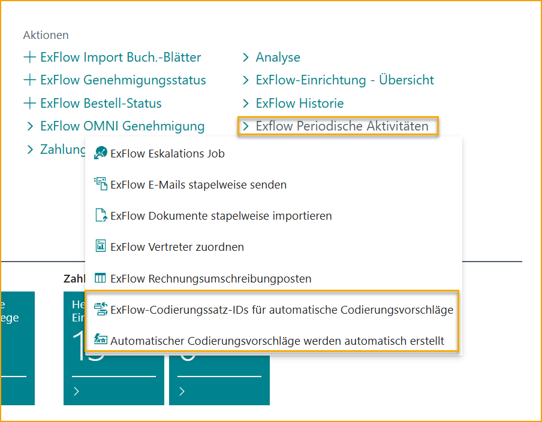
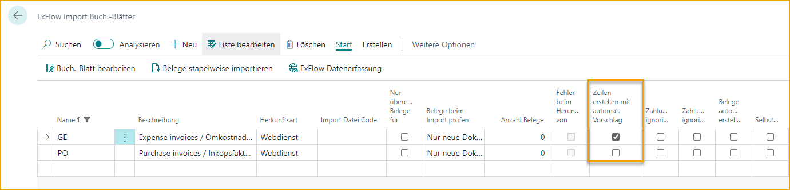
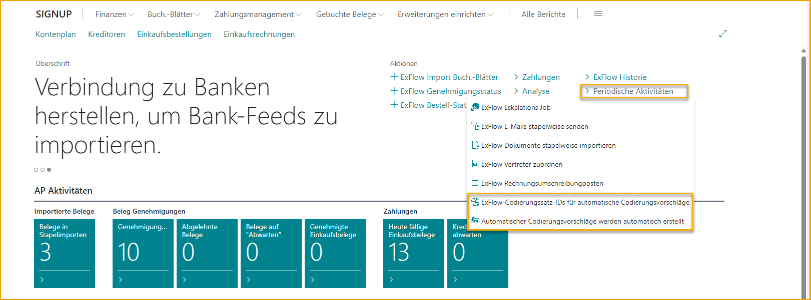

## Einrichtung automatischer Codierungsvorschläge

Gehen Sie zu: ***Setup \--\> ExFlow Einrichtung automatischer Codierungsvorschläge*** 
Für die Einrichtung und Aktivierung dieser Funktion wenden Sie sich an Ihren Business Central Partner oder SignUp Software.

Diese Funktion in ExFlow ermöglicht automatische Codierungsvorschläge im Importjournal basierend auf historisch gebuchten Dokumenten. Diese Funktion funktioniert für Rechnungen und Gutschriften.

Um diese Funktion nutzen zu können, muss sie zuerst an einigen Stellen eingerichtet werden.

### Neuen Codierungsvorschlag hinzufügen

| Codierungsvorschlag-Einrichtung |	|
|:-|:-|
| **Quellentyp:**                                          |Gen. Bus. Posting Group, Vendor Posting Group, Vendor oder All. Dies definiert die Gruppierung der von ExFlow erstellten Vorschläge.
| **Quellennr.:**                                            | Dies definiert, welche Nr. aus dem spezifischen "Quellentyp" für diese Einrichtung verwendet werden soll.  Wenn die Quellennr. für den Quellentyp Vendor leer gelassen wird, erfolgt die Gruppierung pro Vendor für alle Vendors.    Durch Erstellen einer Einrichtungs-ID als "Quellentyp" Vendor und "Quellennr." leer wird automatisch ein Codierungsvorschlag für jeden Vendor erstellt, wobei die Vorschläge immer nach Vendor gefiltert werden.
| **Beschreibung:**                                          | Beschreibender Text (max. 100 Zeichen).
| **Tage-Multiplikator:**                                      | Dies definiert, wie stark die Anzahl der Tage seit der letzten Rechnung für diese Einrichtung die Priorität für die Verwendung der vorgeschlagenen Codierung beeinflusst. Je größer die Zahl, desto größer der Multiplikator. Der Multiplikator sollte einen negativen Wert haben. Z.B. -10 hat einen größeren Einfluss als -1.
| **Häufigkeits-Multiplikator:**                                | Dies definiert, wie stark die Anzahl der Rechnungen in der Vorschlags-ID innerhalb dieser Einrichtung die Priorität für die Verwendung der vorgeschlagenen Codierung beeinflusst. Je größer die Zahl, desto größer der Multiplikator. Der Multiplikator sollte einen negativen Wert haben. Z.B. -10 hat einen größeren Einfluss als -1.
| **Betragsspanne %:**                                       | Dies definiert den Prozentsatz (plus/minus), um den der Betrag für die Vorschlags-ID einer spezifischen Codierung für ein Dokument angewendet wird.
| **Mindestanzahl von Dokumenten für Gültigkeit des Vorschlags:**  | Die Mindestanzahl von Dokumenten, die zur Vorschlags-ID der Einrichtung hinzugefügt werden müssen, damit ein Vorschlag aus dieser Vorschlags-ID automatisch ausgewählt wird.
| **Gruppierung nach Währung:**                                   | Dies definiert, ob die Gruppierung nach Währung erfolgen soll.
| **Gruppierung nach Referenz**:                                  | Dies definiert, ob die Gruppierung spezifisch mit ExFlow-Referenzcodes erfolgen soll.  

Die folgenden Funktionen werden auf dieser Seite ausgeführt:

| Funktionen      |	|
|:-|:-|
| **Vorschlag erstellen**:    | Mit dieser Schaltfläche wird die Einrichtung durchlaufen und Vorschläge zur Vorschlags-ID hinzugefügt.
| **Vorschläge:**          | Hier werden die erstellten Vorschlags-IDs für die ausgewählte Einrichtung angezeigt.
| **Vorschläge löschen:**   | Hier werden die Vorschlags-IDs gelöscht.

### Aktivierung automatischer Codierungsvorschläge

#### ExFlow Einrichtung

Aktivieren Sie diese Funktion in der ExFlow Einrichtung, indem Sie diese Funktion für alle Vendors oder ausgewählte Vendors aktivieren.

Bei Aktivierung von "Ausgewählte Vendors" ist es erforderlich, auch "Automatische Codierungsvorschläge verwenden" für die Vendors (in der ExFlow Vendor Einrichtungskarte) zu aktivieren, die diese Funktion nutzen sollen.

| ExFlow Einrichtung - Automatische Codierungsvorschläge      |	|
|:-|:-|
| **Gruppierung von Dokumenten in Vorschlagszeilen mit Betrag:**    | Definiert, welcher Vorschlags-ID eine Codierung zugeordnet wird.
| **Entscheidung zur Codierungsvorschlag basierend auf dem Betrag:**           | Legt fest, wie die Vorschlagszeile basierend auf dem Betrag des Dokuments ausgewählt wird.
| **Automatische Codierungsvorschlag für importiertes Dokument vorschlagen:**           | Legt fest, wie der automatische Codierungsvorschlag verwendet wird.
| **Vorschläge ab Datum berechnen:**                          | Legt das Startdatum der Dokumente fest, die in die Codierungsvorschläge einbezogen werden sollen.
| **Automatischer Codierungsbetrag aus Codierungssatz-ID vorschlagen:**       | Legt fest, ob die Beträge automatisch in den erstellten Zeilen aus der Codierungssatz-ID vorgeschlagen werden.

#### Importjournal

Aktivieren Sie "Zeilen mit automatischem Vorschlag erstellen", um diese Funktion für ein bestimmtes Importjournal zu aktivieren. (Dieses Feld muss möglicherweise über die Personalisierung zur Seite hinzugefügt werden)

#### Periodische Aktivitäten

Um den automatischen Codierungsvorschlag anzuwenden, müssen die Funktionen "ExFlow Codierungssatz-IDs für Codierungsvorschläge" und "ExFlow Erstellen automatischer Codierungsvorschläge" ausgeführt werden. Bei der erstmaligen Verwendung des automatischen Codierungsvorschlags müssen diese Jobs mindestens einmal ausgeführt werden. Danach kann die Wiederholung in den entsprechenden Job Queue Entries angepasst werden.

