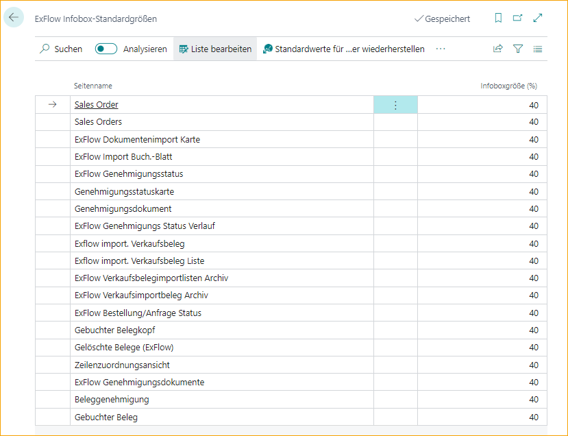
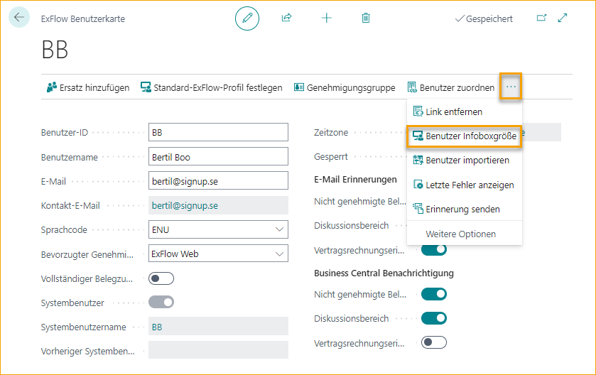

## Größe der Standard-FactBox festlegen

Gehe zu: ***Setup --> ExFlow Manual Setup --> ExFlow FactBox Default Sizes***

Hier kann die Standardgröße der FactBox für alle Benutzer festgelegt oder wiederhergestellt werden.

Für eine bestimmte Benutzer-FactBox-Größe wird dies stattdessen in "ExFlow Users" durchgeführt.

