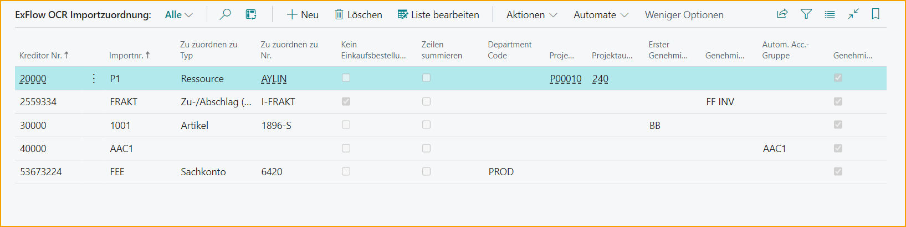
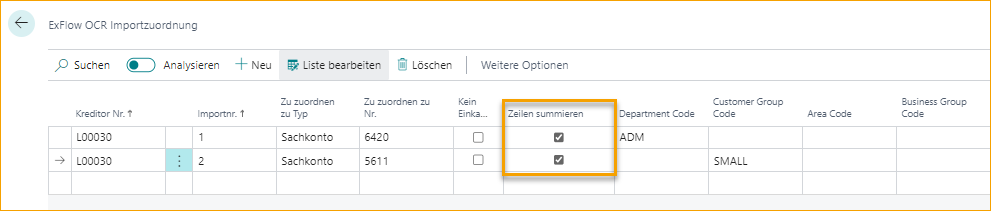
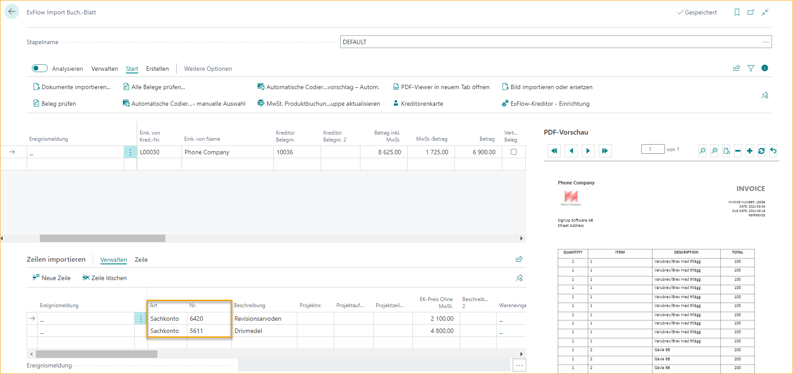
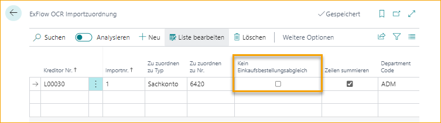
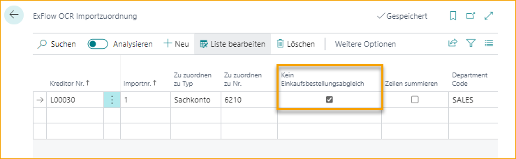
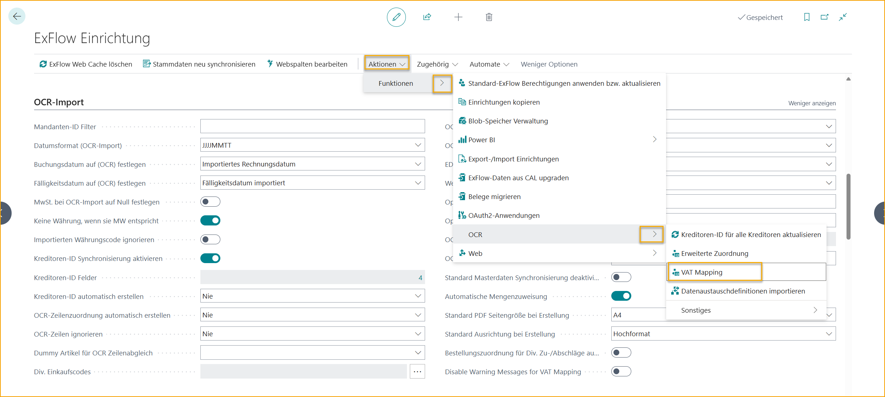
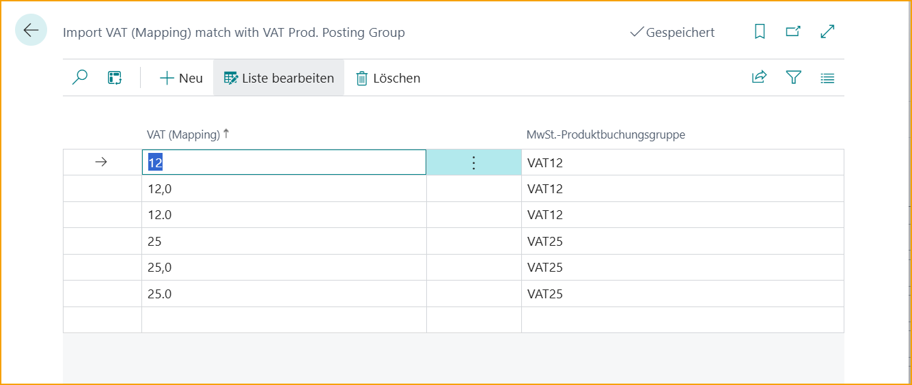

## OCR-Import-Mapping

Gehe zu: ***ExFlow OCR-Import-Mapping***

ExFlow OCR-Import-Mapping wird verwendet, um eine Kodierung von einem spezifischen interpretierten Wert für einen bestimmten Lieferanten festzulegen. Diese Seite enthält die Felder, die die Zeile mit den eingegebenen Werten füllen, wenn die Rechnung in das ExFlow-Import-Journal importiert wird.

Es ist möglich, eine vollständig kodierte Zeile mit einem Sachkonto, Dimensionen, Projekt-Nr. usw. nur durch eine Einrichtung auf der Seite "ExFlow OCR-Import-Mapping" zu erhalten, die für jeden Lieferanten einzigartig sein kann.

| OCR-Import-Mapping     |	|
|:-|:-|
| **Lieferantennummer**    | Wählen Sie die Lieferantennummer.
| **Importnummer**    | Geben Sie den zuzuordnenden importierten Wert an.
| **Zuordnungstyp**    | Wählen Sie eine Zuordnungsoption. Es kann sich um ein Sachkonto, eine Artikelnummer usw. handeln.
| **Keine Bestellabgleichung**    | Wählen Sie, ob die Bestellabgleichung in dieser spezifischen Zuordnungskombination übersprungen werden soll.
| **Zeilen aggregieren**    | Aktivieren Sie diese Einstellung, um alle importierten Zeilen mit den angegebenen Zuordnungskriterien zu einer zusammengefassten Rechnungszeile zu aggregieren.
| **Dimensionscode**     | Wenn ein Dimensionscode als ExFlow-Webspalte existiert, wird der Dimensionscode sichtbar und kann in der OCR-Import-Mapping-Liste verwendet werden.
| **Projekt-Nr.**    | Geben Sie die Projekt-Nr. an.
| **Projektaufgaben-Nr.**    | Geben Sie die Projektaufgaben-Nr. an.
| **Erster Genehmiger**    | Geben Sie den ersten Genehmiger an.
| **Genehmigungsregel**    | Geben Sie die Genehmigungsregel an.
| **Automatische Kontengruppe**    | Geben Sie die automatische Kontengruppe an.
| **Genehmigung**    | Das Genehmigungsfeld ist standardmäßig aktiviert. Deaktivieren Sie es, wenn diese Zuordnung nicht Teil des Genehmigungsprozesses sein soll.

### Zeilen aggregieren

Diese Funktion wird für die Interpretation von Zeilen auf Spesenrechnungen verwendet und nicht für bestellbezogene Rechnungen.

Es ist möglich, einen bestimmten interpretierten Wert einem bestimmten Typ zuzuordnen, wie z.B. einem Sachkonto. Bearbeiten Sie die Liste und geben Sie die gewählte Lieferantennummer an. Fügen Sie den Wert in Import-Nr. ein, der interpretiert wird, und wählen Sie aus, wie ExFlow den interpretierten Wert zuordnen soll, z.B. einem Sachkonto.

Beim Importieren des Dokuments in das Import-Journal wird die Kodierung gemäß der Einrichtung auf der Seite "ExFlow OCR-Import-Mapping" mit dem gewählten "Zuordnungstyp" (d.h. Sachkonto) unter Importzeilen generiert.

Dimensionen werden auf Zeilen, nicht auf Kopfzeilen, hinzugefügt.

Beispiel: Wenn eine Rechnung 1000 Zeilen hat (500 Zeilen mit Wert 1 und 500 Zeilen mit Wert 2) und die Zeilen gemäß dem untenstehenden Bild auf zwei verschiedene Sachkonten zugeordnet werden müssen. Durch das Ankreuzen von "Zeilen aggregieren" werden alle Werte mit 1 in das Sachkonto 6420 und alle Zeilen mit Wert 2 in das Sachkonto 5611 aggregiert, wenn das Dokument in das ExFlow-Import-Journal importiert wird.

### Keine Bestellabgleichung

Wenn "Keine Bestellabgleichung" deaktiviert ist und das interpretierte Dokument eine interpretierte Bestellnummer hat, hat der Bestellabgleich Vorrang und setzt die Zeilen wie in der Bestellung festgelegt. Das bedeutet, dass Dimensionen aus der Bestellung verwendet werden und nicht die eventuell in der OCR-Import-Mapping angegebenen Dimensionen.

Wenn "Keine Bestellabgleichung" aktiviert ist und das interpretierte Dokument eine interpretierte Bestellnummer hat, verwendet das System die in der "ExFlow OCR-Import-Mapping"-Einrichtung angegebenen Werte, einschließlich der Dimensionen. Dimensionen werden nur auf Zeilen, nicht auf Kopfzeilen, gesetzt.

## OCR-Import

Gehe zu: **ExFlow Setup --> OCR-Import** 

### MwSt.-Zuordnung
Lassen Sie ExFlow bei der Zuordnung von importierten MwSt.-Prozentsätzen zu MwSt.-Produktbuchungsgruppen helfen. 

Bei EDI ist es sehr üblich, dass der Prozentsatz der MwSt. auf der Zeile übertragen wird. Dies kann jedoch in Standard Business Central nicht genutzt werden, und ExFlow hat jetzt eine eigene Zuordnung dafür erstellt. 

#### ExFlow Data Capture einrichten
Für Kunden, die andere Dienste wie ExFlow Data Capture nutzen, muss ein benutzerdefiniertes Feld auf Zeilenebene in EDC hinzugefügt werden, wo der MwSt.-Prozentsatz interpretiert werden kann. 

Dieses Feld muss auch auf Zeilenebene in der Datenaustausch-Definition in Business Central zugeordnet werden. 

#### MwSt.-Zuordnungs-Setup
Gehe zu: **ExFlow Setup --> Aktionen--> Funktionen--> OCR --> MwSt.-Zuordnung**

Bearbeiten Sie die Liste und fügen Sie die zu zuordnenden MwSt.-Zuordnungswerte hinzu, und wählen Sie unter ''MwSt.-Prod. Buchungsgruppe'' die MwSt.-Produktbuchungsgruppe aus, zu der zugeordnet werden soll.

#### Warnmeldungen für MwSt.-Zuordnung deaktivieren
Wenn die MwSt. falsch ist, zeigt ExFlow eine Warnmeldung an. Wenn keine Meldungen gewünscht sind, können diese deaktiviert werden.

Gehe zu: **OCR-Import --> Warnmeldungen für MwSt.-Zuordnung deaktivieren** um die Warnmeldungen für die MwSt.-Zuordnung zu deaktivieren. 

Wenn deaktiviert, werden im Import-Journal keine Warnmeldungen für die importierten Werte bezüglich der Zuordnung der MwSt.-Produktbuchungsgruppe angezeigt.