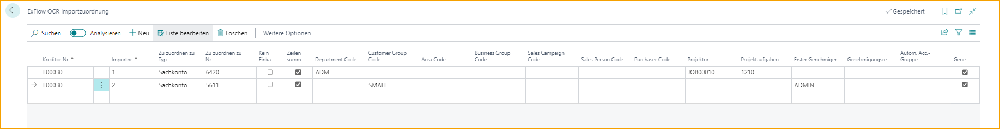

## OCR-Importzuordnung

Gehe zu: ***ExFlow OCR-Importzuordnung***

Die ExFlow OCR-Importzuordnung wird verwendet, um eine Codierung für einen bestimmten interpretierten Wert für einen bestimmten Lieferanten festzulegen. Diese Seite enthält die Felder, die die Zeile mit den eingegebenen Werten füllen, wenn eine Rechnung in das ExFlow Import Journal importiert wird.

Es ist möglich, eine vollständig codierte Zeile mit einem G/L-Konto, Dimensionen, Auftragsnummer usw. nur über eine Einrichtung auf der Seite "ExFlow OCR-Importzuordnung" zu erhalten, die für jeden Lieferanten einzigartig sein kann.

### Aggregierte Zeilen

Diese Funktion wird verwendet, um Zeilen in Ausgabenrechnungen zu interpretieren und nicht für Bestellrechnungen.

Es ist möglich, einem bestimmten interpretierten Wert einen bestimmten Typ zuzuordnen, z. B. einem G/L-Konto. Bearbeiten Sie die Liste und geben Sie die gewählte Lieferantennummer an. Fügen Sie den Wert in Import No hinzu, der interpretiert werden soll, und wählen Sie aus, wie ExFlow den interpretierten Wert zuordnen soll, z. B. einem G/L-Konto.

Beim Importieren des Dokuments in das Import Journal wird die Codierung gemäß der Einrichtung auf der Seite "ExFlow OCR-Importzuordnung" mit der gewählten "Zuordnung zum Typ" (z. B. G/L-Konto) unter Importzeilen generiert.

Beispiel: Wenn eine Rechnung 1000 Zeilen hat (500 Zeilen mit Wert 1 und 500 Zeilen mit Wert 2) und die Zeilen gemäß dem untenstehenden Bild zwei verschiedenen G/L-Konten zugeordnet werden müssen. Durch Aktivieren von "Aggregierte Zeilen" werden alle Werte mit 1 zu G/L-Konto 6420 aggregiert und alle Zeilen mit Wert 2 zu G/L-Konto 5611 aggregiert, wenn das Dokument in das ExFlow Import Journal importiert wird.

Dimensionen werden den Zeilen hinzugefügt, nicht dem Header.

### Keine Bestellabgleichung

Wenn "Keine Bestellabgleichung" deaktiviert ist und das interpretierte Dokument eine interpretierte Bestellnummer hat, hat die Bestellabgleichung Vorrang und setzt die Zeilen entsprechend der Bestellung. Das bedeutet, dass Dimensionen aus der Bestellung verwendet werden und nicht die eventuell in der OCR-Importzuordnung angegebenen Dimensionen.

Wenn "Keine Bestellabgleichung" aktiviert ist und das interpretierte Dokument eine interpretierte Bestellnummer hat, verwendet das System die in der Einrichtung "ExFlow OCR-Importzuordnung" angegebenen Werte, einschließlich der Dimensionen. Dimensionen werden nur den Zeilen, nicht dem Header, zugewiesen.

