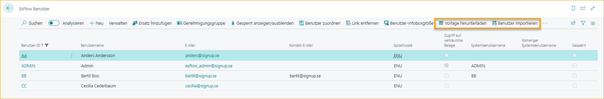
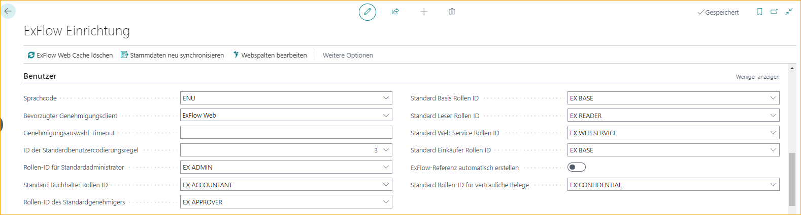
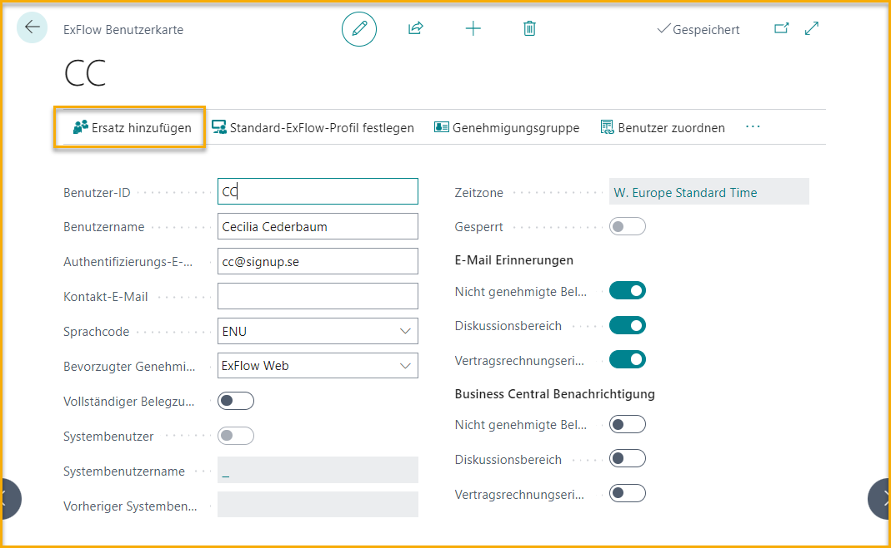
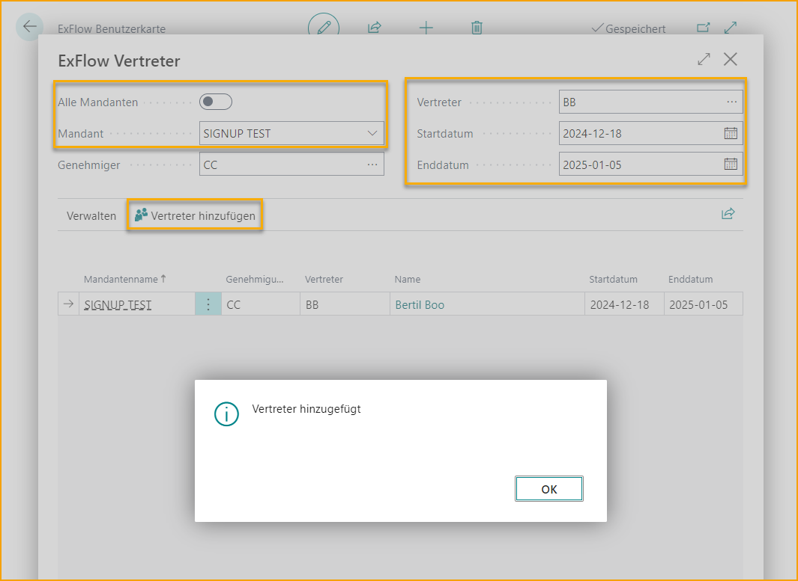
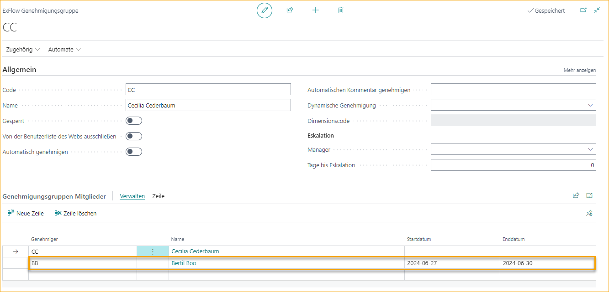
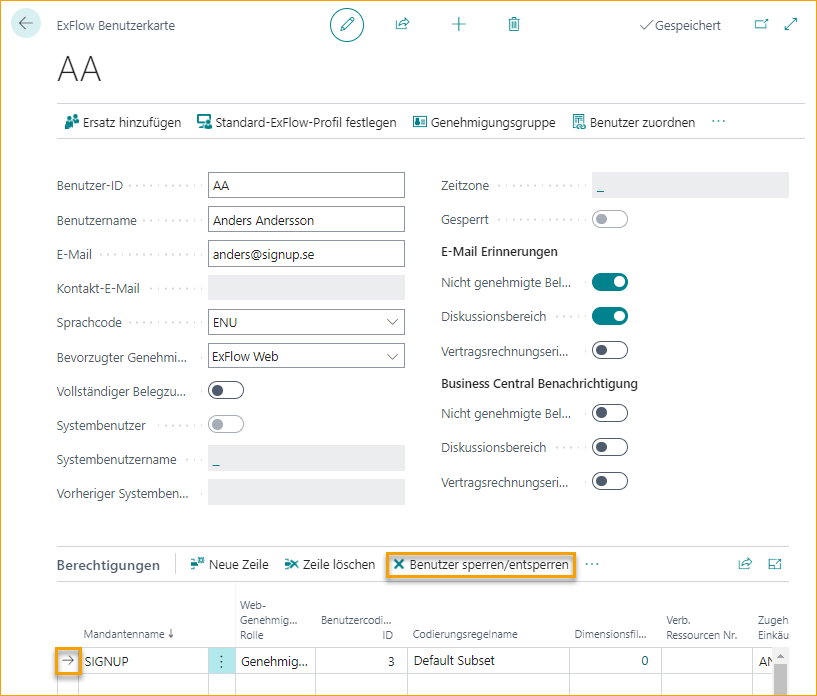
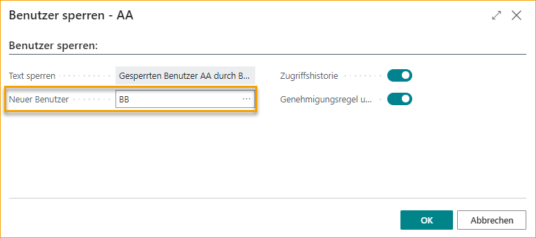
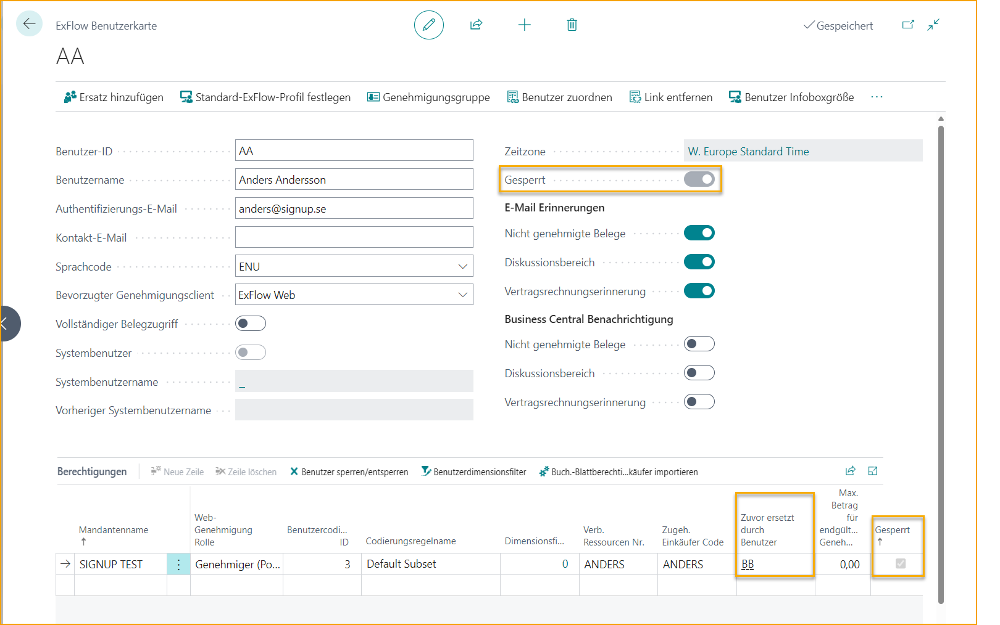
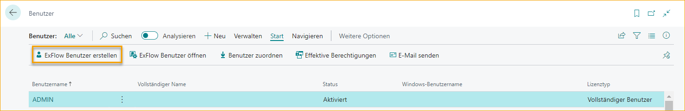
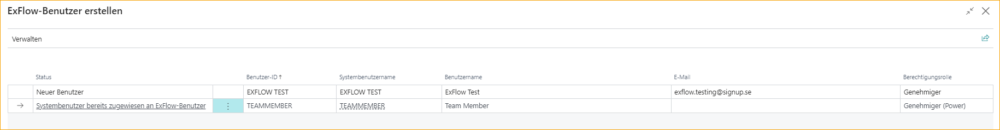

## ExFlow-Benutzer

Gehen Sie zu: **ExFlow-Benutzer**

Um sich bei ExFlow Web anmelden zu können, müssen "ExFlow-Benutzer" erstellt werden. Das Hinzufügen eines neuen ExFlow-Benutzers erstellt automatisch eine Genehmigergruppe mit demselben Namen.

## Neue ExFlow-Benutzer erstellen

ExFlow-Benutzer können über den [Erste-Schritte-Assistenten](https://docs.exflow.cloud/business-central/docs/user-manual/welcome-to-exflow/get-started#get-started-wizard), [Export/Import](https://docs.exflow.cloud/business-central/docs/user-manual/business-functionality/export-import-setup) oder manuell über Excel-Import oder durch Erstellen einer neuen ExFlow-Benutzerkarte erstellt werden.

### ExFlow-Benutzer aus Excel importieren

Gehen Sie zu: ***ExFlow-Setup – Übersicht --> ExFlow-Benutzer***

Beginnen Sie mit einem Klick auf ''Vorlage herunterladen'', um die Excel-Vorlage zu erhalten. 

Geben Sie alle Informationen zu ExFlow-Benutzern und (ExFlow-)Benutzerberechtigungen ein. Speichern Sie die Excel-Datei und importieren Sie sie über die Funktion "Benutzer importieren". 

### Einen neuen Benutzer manuell hinzufügen

Gehen Sie zu: ***ExFlow-Setup – Übersicht --> ExFlow-Benutzer --> New***

Geben Sie alle erforderlichen Informationen über den neuen ExFlow-Benutzer ein, die Pflichtfelder sind mit einem Stern gekennzeichnet:

Der ExFlow-Benutzer wird als ''Gesperrt'' markiert, bis alle mit Stern gekennzeichneten Felder ausgefüllt sind.

#### ExFlow-Benutzerkarte - Menü

| ExFlow-Menü|  |
|:-|:-|
|Replacer hinzufügen| Fügen Sie bei Bedarf einen Replacer zum ExFlow-Benutzer hinzu. Lesen Sie mehr darüber [hier](https://docs.exflow.cloud/business-central/docs/user-manual/business-functionality/exflow-user#add-a-replacer-during-vacation-time)
|Standard-ExFlow-Profil festlegen| Legen Sie ExFlow als Standard-Rollencenter für den zugehörigen Business Central-Benutzer fest.
|Genehmigergruppe| Lesen Sie mehr darüber [hier](https://docs.exflow.cloud/business-central/docs/user-manual/business-functionality/approval-groups)
|Benutzer verknüpfen| Verknüpfen Sie den ExFlow-Benutzer mit einem Systembenutzer. Lesen Sie mehr darüber [hier](https://docs.signupsoftware.com/business-central/docs/user-manual/business-functionality/exflow-user#create-a-system-user)
|Verknüpfung entfernen| Entfernen Sie die zugehörige Verknüpfung zwischen dem ExFlow-Benutzer und dem Systembenutzer.
|Benutzer-FactBox-Größen| Legen Sie die Standardgrößen der FactBox für einen ExFlow-Benutzer fest. Lesen Sie mehr darüber [hier](https://docs.exflow.cloud/business-central/docs/user-manual/business-functionality/set-factbox-default-size)
|Benutzer importieren| Importieren Sie ExFlow-Benutzer. Lesen Sie mehr unter [Neue ExFlow-Benutzer erstellen](https://docs.signupsoftware.com/business-central/docs/user-manual/business-functionality/exflow-user#create-new-exflow-users)
|Letzte Fehler anzeigen| Zeigt an, ob Fehler in den Konfigurationspaketen für das ExFlow-Datenpaket beim Importieren der Excel-Datei ''Import (ExFlow) Users'' vorliegen.
|Erinnerung senden| Senden Sie eine Erinnerung an den spezifischen ExFlow-Benutzer. Lesen Sie mehr darüber [hier](https://docs.signupsoftware.com/business-central/docs/user-manual/business-functionality/exflow-email-setup)
|*Aktionen*|
|ExFlow-Referenz erstellen| Erstellt eine ExFlow-Referenz für den spezifischen ExFlow-Benutzernamen. Lesen Sie mehr über [ExFlow-Referenz](https://docs.signupsoftware.com/business-central/docs/user-manual/business-functionality/reference-codes#reference-codes)
|Aktionen --> Andere (gleiche Schaltflächen wie im ExFlow-Menü)|

#### Allgemeine Felder

| ExFlow-Benutzerkarte |  |
|:-|:-|
| **Benutzer-ID:**                      | Benutzer-ID ohne Domäne hinzufügen
| **Benutzername:**                    | Vollständige Namen der Genehmiger hinzufügen
| **Authentifizierungs-E-Mail**          | Microsoft-Authentifizierungs-E-Mail-Adresse (AAD), die ExFlow für die Anmeldung bei ExFlow Web und für die Kommunikation mit Genehmigern verwendet, z. B. zum Senden von Erinnerungen, wenn der Genehmiger Dokumente genehmigen muss, und ExFlow-Kommentare aus dem Diskussionspanel/Chat.    Diese E-Mail wird beim Erstellen des ExFlow-Benutzers aus dem Business Central-Systembenutzer übernommen (die Kontakt-E-Mail wird ebenfalls mit derselben E-Mail-Adresse ausgefüllt).    Alle ExFlow-Benutzer müssen eine Authentifizierungs-E-Mail haben.
| **Kontakt-E-Mail:**                | Fügen Sie eine Kontakt-E-Mail hinzu, wenn ExFlow-Erinnerungen und -Benachrichtigungen an diese E-Mail anstelle der Authentifizierungs-E-Mail-Adresse gesendet werden sollen.    Kontakt-E-Mail ist ein optionales Feld.
| **Sprachcode:**                | In welcher Sprache E-Mails gesendet werden
| **Bevorzugter Genehmigungsclient:**    | Gibt an, ob der Hyperlink in den E-Mails für Erinnerungen und Nachrichten den Benutzer zu Business Central oder ExFlow Web führt
| **Vollständiger Dokumentenzugriff:**         | Gibt an, ob der Benutzer Zugriff auf ExFlow-Dokumente in allen Unternehmen haben soll
| **Systembenutzer:**                  | Gibt an, ob der ExFlow-Benutzer auch ein gültiger Systembenutzer ist.
| **Systembenutzername:**             | Verbundener Systembenutzer.
| **Vorheriger Systembenutzername:**    | Wenn der verbundene Systembenutzer geändert wird, zeigt dieses Feld den vorherigen Wert an
| **Zeitzone:**    | Zeigt die Zeitzone des Benutzers an, um den Zeitstempel in der lokalen Zeit anzuzeigen
| **Gesperrt:**                      | Dies zeigt an, ob der Genehmiger in allen Unternehmen gesperrt ist  Lesen Sie mehr im Abschnitt [***Genehmiger verlässt das Unternehmen***.](https://docs.signupsoftware.com/business-central/docs/user-manual/business-functionality/exflow-user#approver-leaving-the-company)

#### E-Mail-Erinnerungen

| E-Mail-Erinnerungen |  |
|:-|:-|
| **Ungeprüfte Dokumente:**         | Wählen Sie Ja/Nein, ob ExFlow E-Mails senden soll, wenn der Genehmiger Dokumente genehmigen muss
| **Diskussionspanel:**             | Wählen Sie Ja/Nein, ob ExFlow E-Mails senden soll, wenn der Genehmiger in einem Diskussionspanel/Chat erwähnt wird
| **Vertragseingangsrechnungserinnerung:**    | Wählen Sie Ja/Nein, ob ExFlow E-Mails senden soll, wenn Vertragseingangsrechnungen fehlen

Sowohl ungeprüfte Dokumente als auch ungelesene Kommentare werden weiterhin in ExFlow Web angezeigt.

#### Business Central-Benachrichtigungen

Wenn der ExFlow-Benutzer einem Systembenutzer zugeordnet ist, können Benachrichtigungen in Business Central hinzugefügt werden.

| Business Central-Benachrichtigungen |  |
|:-|:-|
| **Ungeprüfte Dokumente:**         | Wählen Sie Ja/Nein, ob ExFlow Benachrichtigungen für ungeprüfte Dokumente für den Genehmiger (Systembenutzer) auf der Rollencenter-Seite anzeigen soll
| **Diskussionspanel:**             | Wählen Sie Ja/Nein, ob ExFlow Benachrichtigungen für Erwähnungen in einem Diskussionspanel/Chat für den Genehmiger (Systembenutzer) auf der Rollencenter-Seite anzeigen soll
| **Vertragseingangsrechnungserinnerung:**    | Wählen Sie Ja/Nein, ob ExFlow Benachrichtigungen senden soll, wenn Vertragseingangsrechnungen fehlen

Erfahren Sie mehr über Benachrichtigungen im Abschnitt [***Genehmigungsworkflow --> Benachrichtigungen in Business Central.***](https://docs.signupsoftware.com/business-central/docs/user-manual/approval-workflow/notifications-in-business-central#notifications-in-business-central)

### ExFlow-Benutzerkarte - Berechtigungen 

Gehen Sie zu: **ExFlow-Benutzerkarte --> Berechtigungen**

| Berechtigungsmenü |  |
|:-|:-|
|Neue Zeile|Neue Zeile hinzufügen
|Zeile löschen| Zeile löschen (nur anwendbar, wenn keine Datensätze vorhanden sind)
|Benutzer sperren/entsperren| Einen ExFlow-Benutzer sperren oder entsperren. Ein aktiver ExFlow-Benutzer mit Verlauf (Datensätzen) kann nicht gelöscht, sondern nur ersetzt werden. Lesen Sie mehr darüber [hier](https://docs.exflow.cloud/business-central/docs/user-manual/business-functionality/exflow-user#approver-who-left-the-company-returns)
|Benutzerdimensionsfilter| Dimensionen zum ExFlow-Benutzer hinzufügen
|Importieren von Journalberechtigungen für Einkäufer| Geben Sie einem Einkäufer Zugriff auf ein Journal. Lesen Sie mehr darüber [hier](https://docs.exflow.cloud/business-central/docs/user-manual/approval-workflow/purchaser-view#import-journal-permission-for-purchaser)

#### Unternehmenszugriff und Web-Berechtigungsrolle unter Berechtigungen hinzufügen

Geben Sie die ExFlow-Benutzerberechtigung unter ''Berechtigungen'' an.

| Berechtigungen|  |
|:-|:-|
| **Firmenname:**             | Fügen Sie das Unternehmen aus der Liste hinzu, auf das der Benutzer Zugriff haben soll. Um einen Genehmiger markieren zu können, muss der Benutzer Zugriff auf das Unternehmen haben, in dem das Dokument erstellt wurde
| **Web-Berechtigungsrolle:**      | Alle ExFlow-Benutzer benötigen ein Web-Benutzerrecht für ExFlow Web.     Die Berechtigung, die dem ExFlow-Benutzer zugewiesen wird, gilt nur für die Web-Berechtigung.     ExFlow-Benutzer, die Dokumente in ExFlow verwalten sollen, müssen Systembenutzer sein, um ExFlow-Seiten öffnen zu können.       Lesen Sie mehr darüber, wie Sie [***einen Systembenutzer erstellen***](https://docs.signupsoftware.com/business-central/docs/user-manual/business-functionality/exflow-user#create-a-system-user)      **Genehmiger:**  Genehmiger können ein Dokument genehmigen, ablehnen oder in den Status "In Bearbeitung" versetzen       Der Genehmiger hat nur Zugriff auf Dokumente, bei denen er im Genehmigungsfluss enthalten ist. Es sind keine Änderungen erlaubt  **Genehmiger (Power):**  Gleiche Berechtigung wie Genehmiger. Hinzufügen und Weiterleiten an andere Genehmiger. Hinzufügen oder Ändern der Kodierung ist erlaubt, z. B. G/L-Konto oder Dimensionen         **Genehmiger (Super):**  Gleiche Berechtigung wie Power-Benutzer. Alle genehmigten Dokumente in der ExFlow-Historie anzeigen          **Admin:**   Admin-Berechtigung in ExFlow Web. Dieser Benutzer kann Einstellungen vornehmen, die für alle Genehmiger in ExFlow Web gelten.         Lesen Sie mehr darüber im Abschnitt [***Web-Benutzerrechte***](https://docs.signupsoftware.com/business-central/docs/user-manual/business-functionality/web-user-level-permissions)
| **Benutzer-Kodierungsregel-ID:**              | Wenn ein Genehmiger in der Lage sein soll, Änderungen an der Kodierung auf Dokumentzeilen in ExFlow Web vorzunehmen, können ExFlow-Benutzer-Kodierungsregeln verwendet werden, um zu entscheiden/einzuschränken, welche Werte er/sie auswählen kann. Alle Genehmiger benötigen eine Kodierungsregel          Lesen Sie mehr darüber im Abschnitt [***Business-Funktionalität --> Benutzer-Kodierungsregeln***](https://docs.signupsoftware.com/business-central/docs/user-manual/business-functionality/user-coding-rules#user-coding-rules)
| **Zugehörige Ressourcennummer:**             | Es ist möglich, eine Ressource mit einem ExFlow-Benutzer zu verknüpfen, um automatisch einen bestimmten Genehmiger aus "Verantwortliche Person" im Projekt hinzuzufügen  Lesen Sie mehr im Abschnitt [***Business-Funktionalität --> Dynamischer Genehmigungsfluss für Projekte***](https://docs.signupsoftware.com/business-central/docs/user-manual/business-functionality/approval-rules#dynamic-approval-flow-for-projects)
| **Zugehöriger Einkäufercode:**           | Fügen Sie einen Einkäufer hinzu, um eine Erinnerung zu senden, wenn Wareneingänge fehlen. Dies erfordert auch die ExFlow-E-Mail-Einrichtung. Oder um die Genehmigungsregel basierend auf dem Einkäufer zu erstellen
| **Dimensionsfilter:**                 | Erweitert die Berechtigung des Genehmigers, den Verlauf in der Suche auf ExFlow Web anzuzeigen  Der Genehmiger kann alle Dokumente mit diesem Dimensionswert anzeigen
| **Ersetzt durch Benutzer:**                 | Wenn der Genehmiger gesperrt ist. Lesen Sie mehr unter [***Genehmiger verlässt das Unternehmen***](https://docs.signupsoftware.com/business-central/docs/user-manual/business-functionality/exflow-user#approver-leaving-the-company)
| **Maximaler Betrag für endgültige Genehmigung:**    | Gibt den maximalen Genehmigungsbetrag für den ausgewählten Genehmiger an. Gilt nur, wenn der Benutzer der letzte Genehmiger in einem Genehmigungsfluss ist
| **Gesperrt:**                          | Wenn der Genehmiger gesperrt ist. Lesen Sie mehr unter [***Genehmiger verlässt das Unternehmen***.](https://docs.signupsoftware.com/business-central/docs/user-manual/business-functionality/exflow-user#approver-leaving-the-company)
|**Zugriff auf vertrauliche Dokumente**|  Gibt an, ob der Benutzer Zugriff auf vertrauliche Dokumente hat oder nicht. Lesen Sie mehr unter [***Vertrauliche Dokumente***.](https://docs.signupsoftware.com/business-central/docs/user-manual/business-functionality/confidental-documents#confidential-documents)
|**E-Mail-Setup prüfen**| Gibt an, ob im Rollencenter eine Benachrichtigung für den zugehörigen Systembenutzer angezeigt werden soll, wenn das E-Mail-Setup/Konto fehlt.

### Standard-Setup für ExFlow-Benutzer hinzufügen

Gehen Sie zu: ***ExFlow-Setup – Übersicht --> ExFlow Setup --> Users***

Berechtigungssätze werden standardmäßig im Abschnitt ''Benutzer'' in ExFlow Setup hinzugefügt.

Andere Standardeinstellungen für die ExFlow-Benutzer können in ExFlow Setup angegeben werden, wie z. B.: Standard-Sprachcode, Bevorzugter Genehmigungsclient und/oder eine Standard-Benutzer-Kodierungsregel-ID.
 
Fügen Sie eine “Standard-Benutzer-Kodierungsregel-ID” hinzu, um die Einrichtung eines neuen ExFlow-Benutzers zu erleichtern. Durch Festlegen einer “Standard-Benutzer-Kodierungsregel” hier wird sie beim Hinzufügen einer neuen ExFlow-Benutzerberechtigungszeile auf Unternehmensebene auf der ExFlow-Benutzerkarte --> Berechtigungen ausgefüllt.

| ExFlow Setup - Benutzer      |   | 
|:-|:-|
| **Sprachcode:**                            | Sprachcode für E-Mails hinzufügen, die an ExFlow-Genehmiger gesendet werden
| **Bevorzugter Genehmigungsclient:**                | Gibt an, ob der Standard-Hyperlink in den E-Mails für Erinnerungen und Nachrichten den Benutzer zu Business Central oder ExFlow Web führt
|**Genehmigungsauswahl-Timeout**| Gibt das Timeout an, das für die Genehmigungsauswahl verwendet wird
|**Standard-Benutzer-Kodierungsregel-ID**| Gibt die Standard-Sicherheitsrolle an, die beim Erstellen neuer Genehmiger verwendet wird
|**Standard-Admin-Rollen-ID**| Gibt die Standard-Sicherheitsrolle an, die beim Erstellen neuer Genehmiger verwendet wird
|**Standard-Buchhalter-Rollen-ID**| Gibt die Standard-Sicherheitsrolle an, die beim Erstellen neuer Genehmiger verwendet wird
|**Standard-Genehmiger-Rollen-ID**| Gibt die Standard-Sicherheitsrolle an, die beim Erstellen neuer Genehmiger verwendet wird
|**Standard-Basis-Rollen-ID**| Gibt die Standard-Sicherheitsrolle an, die beim Erstellen neuer Genehmiger verwendet wird
|**Standard-Leser-Rollen-ID**| Gibt die Standard-Sicherheitsrolle an, die beim Erstellen neuer Genehmiger verwendet wird
|**Standard-Webdienst-Rollen-ID**| Gibt die Standard-Sicherheitsrolle an, die beim Erstellen neuer Genehmiger verwendet wird
|**Standard-Einkäufer-Rollen-ID**| Gibt die Standard-Sicherheitsrolle an, die beim Erstellen neuer Genehmiger verwendet wird
| **ExFlow-Referenz automatisch erstellen:**    | Wählen Sie, um ExFlow-Referenzen automatisch zu erstellen.   Lesen Sie mehr im Abschnitt [***Referenzcodes***](https://docs.signupsoftware.com/business-central/docs/user-manual/business-functionality/reference-codes)
|**Standard-Vertraulichkeits-Rollen-ID**| Gibt die Standard-Sicherheitsrolle an, die beim Erstellen neuer Genehmiger verwendet wird     Lesen Sie mehr über Berechtigungen im Abschnitt [***Berechtigungen für einen Business Central-Benutzer***](https://docs.signupsoftware.com/business-central/docs/user-manual/business-functionality/exflow-user#permissions-on-a-business-central-user) 

## ExFlow-Benutzerszenarien 

### Einen Replacer während der Urlaubszeit hinzufügen

Gehen Sie zu: ***ExFlow-Setup – Übersicht --> ExFlow-Benutzer (list)*** oder über ***''ExFlow User (card)''***

Wenn ein Benutzer abwesend oder im Urlaub ist, kann ein Replacer zugewiesen werden, der seine/ihre Dokumente bearbeiten kann.

Klicken Sie auf "Replacer hinzufügen".

Ein Benutzer kann in einem einzelnen Unternehmen oder in allen Unternehmen ersetzt werden, jedoch nur, wenn der Replacer Zugriff auf das Unternehmen hat. Das Feld ''Alle Unternehmen'' ist standardmäßig aktiviert, aber wenn der Genehmiger nur in einem bestimmten Unternehmen ersetzt werden soll, wählen Sie dieses Unternehmen im Feld Unternehmen aus. Das Feld ''Alle Unternehmen'' wird dann deaktiviert.

Der nächste Schritt besteht darin, den Replacer für den Genehmiger im Feld ''Replacer'' hinzuzufügen.
 
Denken Sie daran, immer ein Startdatum und ein Enddatum festzulegen.

Klicken Sie auf "Replacer hinzufügen", wenn alle Informationen ausgefüllt sind.

Der Replacer wird nun in die Genehmigergruppe des Genehmigers aufgenommen. Der ersetzte Benutzer kann weiterhin genehmigen, auch wenn ein Replacer vorhanden ist. Beide können genehmigen. Beide erhalten E-Mail-Benachrichtigungen.

 

### Genehmiger verlässt das Unternehmen

Gehen Sie zu: ***ExFlow-Setup – Übersicht --> ExFlow User***

Wählen Sie den Benutzer aus, der das Unternehmen verlässt.

Wählen Sie ein Unternehmen nach dem anderen aus und klicken Sie auf "Benutzer sperren/entsperren".

Beim Sperren des Benutzers fügen Sie im Feld **"Neuer Benutzer"** einen Replacer hinzu. Dies aktualisiert die Dokumente in den Genehmigungsworkflows.

Wählen Sie das Kontrollkästchen **"Verlauf ersetzen"**, um dem neuen Benutzer Zugriff auf die historischen Dokumente des gesperrten Benutzers zu gewähren.  

Wenn das Dokument im Genehmigungsstatus ungeprüft ist, wird der gesperrte Benutzer automatisch unter den *''Doc. Line Approvers''* als ''Genehmigt'' markiert, zusammen mit dem Kommentar *''Genehmigt, weil Benutzer gesperrt war.''*. Der Replacer wird automatisch als aktueller Benutzer anstelle des gesperrten Benutzers hinzugefügt. 

Für genehmigte, aber noch nicht gebuchte Dokumente wird der Replacer in die *''Doc. Line Approvers''* aufgenommen, zusammen mit dem Kommentar ''Hinzugefügt wegen Verlaufsersetzung''.  

Im ExFlow-Genehmigungsstatusverlauf wird der Replacer in die *Gebuchte Dokumentzeilen-Genehmiger* aufgenommen, zusammen mit dem Kommentar ''AA ersetzt durch BB''.  

Wählen Sie **"Genehmigungsregel und Kodierungsregeln ersetzen"**, um den gesperrten Benutzer automatisch in allen vorhandenen Regeln zu ersetzen. Oder erstellen/ändern Sie Genehmigungen und Regeln manuell je nach Situation.

Wenn der ExFlow-Benutzer in allen Unternehmen gesperrt ist, wird die Benutzerkarte automatisch gesperrt und aus der ExFlow-Benutzerliste ausgeblendet.

Administratoren können ausgeblendete gesperrte Benutzer mit der Funktion "Anzeigen/Ausblenden gesperrt" anzeigen.

Um zu sehen, wer den gesperrten Benutzer ersetzt, öffnen Sie die ExFlow-Benutzerkarte.

  

### Ändern der ExFlow-Benutzer-ID

Wenn ein (aktiver) Genehmiger seine ExFlow-Benutzer-ID ändern möchte, muss sein aktueller ExFlow-Benutzer gesperrt und durch einen neuen ExFlow-Benutzer mit der neuen Benutzer-ID ersetzt werden.

Lesen Sie in diesen Fällen mehr und befolgen Sie die Schritte unter [Genehmiger verlässt das Unternehmen](https://docs.exflow.cloud/business-central/docs/user-manual/business-functionality/exflow-user#approver-who-left-the-company-returns)

### Genehmiger, der das Unternehmen verlassen hat, kehrt zurück

Gehen Sie zu: ***ExFlow-Setup – Übersicht --> ExFlow User --> Berechtigungen***

Um einen gesperrten Genehmiger wiederherzustellen, klicken Sie in der ExFlow-Benutzerliste auf "Anzeigen/Ausblenden gesperrt", um alle gesperrten Benutzer anzuzeigen. Wählen Sie Benutzer und klicken Sie auf ''Benutzer sperren/entsperren''.

Es erscheint die Frage: Möchten Sie den Benutzer XXX entsperren? Klicken Sie auf "Ja" bei der Entsperrungsfrage.

Der zurückgekehrte Benutzer muss nun manuell wieder in Genehmigungs- und Kodierungsregeln hinzugefügt werden, wenn "Genehmigungsregel und Kodierungsregeln ersetzen" beim Sperren des Benutzers verwendet wurde.
 

## Einen Systembenutzer erstellen

Gehen Sie zu: ***Business Central Standardbenutzer***

Ein ExFlow-Benutzer kann auch aus einem Business Central-Benutzer erstellt werden, indem die Aktion “ExFlow-Benutzer erstellen” verwendet wird. Diese Aktion kann von der Business Central-Benutzerkarte oder der Hauptseite “Benutzer” aus erreicht werden.

Wählen Sie auf der Seite Benutzer einen oder mehrere Benutzer aus und klicken Sie auf “ExFlow-Benutzer erstellen”. Diese Aktion öffnet eine neue Seite, die eine temporäre Tabelle mit den ausgewählten Benutzern anzeigt und alle Werte präsentiert, die nach Abschluss in die ExFlow-Benutzer übernommen und kopiert werden.

Die Spalte “ExFlow-Benutzer vorhanden” in der Tabelle zeigt an, ob der ExFlow-Benutzer bereits erstellt wurde oder nicht. Alle anderen Werte aller verbleibenden Felder wurden von der Business Central-Benutzerkarte kopiert, können jedoch bei Bedarf geändert werden.

Die Benutzer-Kodierungsregel-ID wird automatisch auf der neu erstellten ExFlow-Benutzerkarte hinzugefügt, abhängig vom Wert, der in der ExFlow-Einrichtung unter “Standard-Benutzer-Kodierungsregel-ID” ausgewählt wurde.

### Verknüpfung mit ExFlow-Benutzer
Gehen Sie zu: **Benutzerkarte --> Verknüpfung mit ExFlow-Benutzer**

Der Business Central-Benutzer wird automatisch als Systembenutzer mit dem ExFlow-Benutzer verknüpft. Wenn ein ExFlow-Benutzer vor dem Systembenutzer erstellt wird, verwenden Sie einfach ''Benutzer verknüpfen'', um den Systembenutzer mit dem ExFlow-Benutzer zu verbinden. Oder verwenden Sie ''Verknüpfung mit ExFlow-Benutzer'' von der Benutzerliste aus.

Es ist auch möglich, den Systembenutzer auf der ExFlow-Benutzerkarte mit dem ExFlow-Benutzer zu verknüpfen.

### Berechtigungen für einen Business Central-Benutzer
Benutzerberechtigungssätze werden automatisch auf der Benutzerkarte für die neu erstellten ExFlow-Benutzer aktualisiert.

Je nachdem, welche Rolle oder Web-Berechtigungsrolle sie angegeben haben, wird der Business Central-Benutzer mit EX ADMIN oder EX GENEHMIGER aktualisiert.

Hier sind alle verfügbaren ExFlow-Berechtigungssätze, die für den Systembenutzer verwendet werden können:

| Berechtigungssatz |  |
|:-|:-|
|**EX BASIS**| Berechtigungssatz, der automatisch beim Installieren von ExFlow gewährt wird. Dies ist erforderlich, um auf Seiten und Karten zuzugreifen, die ExFlow-Funktionalität enthalten (z. B. Bestellung, Angebotsanforderung usw.) 
|**EX ADMIN**| Vollzugriff auf alle Tabellen und Seiten für ExFlow. 
|**EX BUCHHALTER**| Eingeschränkter Zugriff auf Seiten. Kein Zugriff auf Einrichtungseiten (außer Seiten zur Weiterverrechnung). Kann ExFlow-Benutzer verwalten. 
|**EX LESER**| Gleiche Berechtigung wie EX BASIS, jedoch nur mit Leseberechtigung. 
|**EX GENEHMIGER**| Zugriff auf ExFlow-Suche und ExFlow-Genehmigungsdokumente. Wird zum Genehmigen von Rechnungen innerhalb von Business Central verwendet. 
|**EX EINKÄUFER**| Zugriff auf Funktionen im Zusammenhang mit ExFlow auf Bestellungen und Angeboten, z. B. Hinzufügen von Genehmigern, Ändern des Genehmigungsflusses. Auch Zugriff auf ExFlow-Bestell-/Angebotsstatus. 
|**EX WEBSERVICE**| Wird für das Web verwendet und wird automatisch zugewiesen, wenn die Anwendung aus der ExFlow-Einrichtung erstellt wird. Nur für ExFlow Web und das Importieren von Dokumenten über den Webdienst erforderlich.
|**EX VERTRAULICH**| Wird für den Umgang mit vertraulichen Dokumenten verwendet.
 
