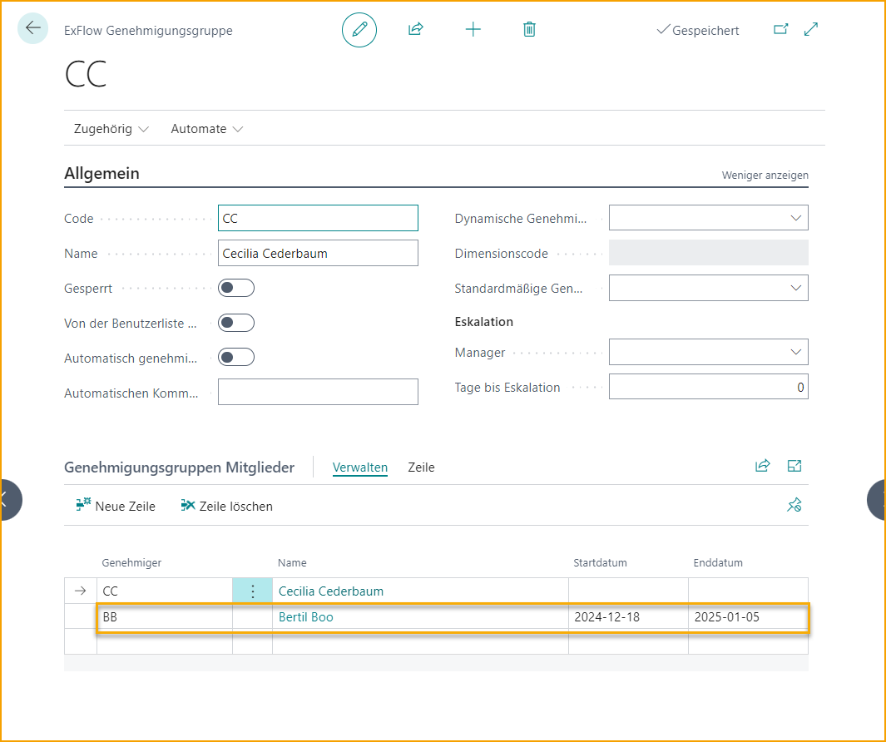

## ExFlow Benutzer

Um sich bei ExFlow Web anzumelden, müssen "ExFlow Benutzer" erstellt werden.

Das Hinzufügen eines neuen Benutzers erstellt automatisch eine Genehmigungsgruppe mit demselben Namen. 

### Standard-Setup für ExFlow Benutzer hinzufügen

Gehe zu: ***Setup --> ExFlow Setup***

Im ExFlow Setup sind auch einige Standardeinstellungen möglich, wie das Hinzufügen eines Standard-Sprachcodes, eines bevorzugten Genehmigungsklienten oder vielleicht einer Standard-Benutzer-Codierungsregel-ID.

Eine der Einstellungen ist „Standard-Benutzer-Codierungsregel-ID“. Es erleichtert die Einrichtung eines neuen ExFlow Benutzers. Legen Sie „Standard-Benutzer-Codierungsregel“ im ExFlow Setup fest, fügen Sie eine neue ExFlow Benutzerberechtigungslinie mit einem bestimmten Unternehmen hinzu, und die zuvor im ExFlow Setup definierte Benutzer-Codierungsregel wird angewendet.

| ExFlow Setup - Benutzer      |   | 
|:-|:-|
| **Sprachcode:**                            | Sprachcode für E-Mails an ExFlow Genehmiger hinzufügen
| **Bevorzugter Genehmigungsklient:**                | Gibt an, ob der Standard-Hyperlink in den E-Mails für Erinnerungen und Nachrichten den Benutzer zu Business Central oder ExFlow Web führt
|**Genehmigungsauswahl-Timeout**| Gibt das Timeout für die Genehmigungsauswahl an
|**Standard-Benutzer-Codierungsregel-ID**| Gibt die Standard-Sicherheitsrolle an, die beim Erstellen neuer Genehmiger verwendet wird
|**Standard-Admin-Rollen-ID**| Gibt die Standard-Sicherheitsrolle an, die beim Erstellen neuer Genehmiger verwendet wird
|**Standard-Buchhalter-Rollen-ID**| Gibt die Standard-Sicherheitsrolle an, die beim Erstellen neuer Genehmiger verwendet wird
|**Standard-Genehmiger-Rollen-ID**| Gibt die Standard-Sicherheitsrolle an, die beim Erstellen neuer Genehmiger verwendet wird
|**Standard-Basis-Rollen-ID**| Gibt die Standard-Sicherheitsrolle an, die beim Erstellen neuer Genehmiger verwendet wird
|**Standard-Leser-Rollen-ID**| Gibt die Standard-Sicherheitsrolle an, die beim Erstellen neuer Genehmiger verwendet wird
|**Standard-Webdienst-Rollen-ID**| Gibt die Standard-Sicherheitsrolle an, die beim Erstellen neuer Genehmiger verwendet wird
|**Standard-Einkäufer-Rollen-ID**| Gibt die Standard-Sicherheitsrolle an, die beim Erstellen neuer Genehmiger verwendet wird
| **ExFlow-Referenz automatisch erstellen:**    | Wählen Sie diese Option, um ExFlow-Referenzen automatisch zu erstellen.   Lesen Sie mehr im Abschnitt [***Referenzcodes***](https://docs.exflow.cloud/business-central/docs/user-manual/business-functionality/reference-codes)
|**Standard-Vertraulichkeits-Rollen-ID**| Gibt die Standard-Sicherheitsrolle an, die beim Erstellen neuer Genehmiger verwendet wird     Lesen Sie mehr über Berechtigungen im Abschnitt [***Berechtigungen für einen Business Central Benutzer***](https://docs.exflow.cloud/business-central/docs/user-manual/business-functionality/) 

### ExFlow Benutzer aus Excel importieren

Neben dem manuellen Hinzufügen neuer Benutzer können Administratoren auch ExFlow Benutzer durch Importieren von Benutzern aus Excel hinzufügen "Benutzer importieren". 

Um aus Excel zu importieren, verwenden Sie die "Vorlage herunterladen" für die Excel-Tabelle.

  

### Einen neuen Benutzer manuell hinzufügen

Gehe zu: ***Setup --> ExFlow Manual Setup --> ExFlow Benutzer***

| ExFlow Benutzer |  |
|:-|:-|
| **Benutzer-ID:**                      | Benutzer-ID ohne Domäne hinzufügen
| **Benutzername:**                    | Vollständige Namen der Genehmiger hinzufügen
| **E-Mail:**                        | Microsoft-Authentifizierungs-E-Mail-Adresse (AAD), die ExFlow für die Kommunikation mit Genehmigern verwendet, d. h. Anmeldung bei ExFlow Web, Erinnerungen, wenn der Genehmiger Dokumente zur Genehmigung hat, und ExFlow-Kommentare aus dem Diskussionspanel/Chat
| **Kontakt-E-Mail:**                | E-Mail-Adresse des verbundenen Systembenutzers in Business Central. Wenn die M365-E-Mail von der Kontakt-E-Mail abweicht, wird die Erinnerungs-E-Mail an die Kontakt-E-Mail-Adresse gesendet. Die Anmeldung bei ExFlow Web erfolgt jedoch weiterhin über die M365/AAD-E-Mail
| **Sprachcode:**                | In welcher Sprache E-Mails gesendet werden
| **Bevorzugter Genehmigungsklient:**    | Gibt an, ob der Hyperlink in den E-Mails für Erinnerungen und Nachrichten den Benutzer zu Business Central oder ExFlow Web führt
| **Vollständiger Dokumentenzugriff:**         | Gibt an, ob der Benutzer Zugriff auf ExFlow-Dokumente in allen Unternehmen haben soll
| **Systembenutzer:**                  | Gibt an, ob der ExFlow Benutzer auch ein gültiger Systembenutzer ist.
| **Systembenutzername:**             | Verbundener Systembenutzer.
| **Vorheriger Systembenutzername:**    | Wenn der verbundene Systembenutzer geändert wird, zeigt dieses Feld den vorherigen Wert an
| **Zeitzone:**    | Zeigt die Zeitzone des Benutzers an, um den Zeitstempel in der lokalen Zeit anzuzeigen
| **Gesperrt:**                      | Dies zeigt an, ob der Genehmiger in allen Unternehmen gesperrt ist  Lesen Sie mehr im Abschnitt [***Genehmiger verlässt das Unternehmen***.](https://docs.exflow.cloud/business-central/docs/user-manual/business-functionality/exflow-user#approver-leaving-the-company)

#### E-Mail-Erinnerungen
| E-Mail-Erinnerungen |  |
|:-|:-|
| **Ungeprüfte Dokumente:**         | Wählen Sie Ja/Nein, ob ExFlow E-Mails senden soll, wenn der Genehmiger Dokumente zur Genehmigung hat
| **Diskussionspanel:**             | Wählen Sie Ja/Nein, ob ExFlow E-Mails senden soll, wenn der Genehmiger im Diskussionspanel/Chat erwähnt wird
| **Vertragsrechnungs-Erinnerung:**    | Wählen Sie Ja/Nein, ob ExFlow E-Mails senden soll, wenn Vertragsrechnungen fehlen

Sowohl ungeprüfte Dokumente als auch ungelesene Kommentare werden weiterhin in ExFlow Web angezeigt.

#### Business Central-Benachrichtigungen
Wenn der ExFlow Benutzer ein Systembenutzer ist, können Benachrichtigungen in Business Central hinzugefügt werden.

| Business Central-Benachrichtigungen |  |
|:-|:-|
| **Ungeprüfte Dokumente:**         | Wählen Sie Ja/Nein, ob ExFlow Benachrichtigungen für ungeprüfte Dokumente für den Genehmiger (Systembenutzer) auf der Rollencenter-Seite anzeigen soll
| **Diskussionspanel:**             | Wählen Sie Ja/Nein, ob ExFlow Benachrichtigungen für Erwähnungen im Diskussionspanel/Chat für den Genehmiger (Systembenutzer) auf der Rollencenter-Seite anzeigen soll
| **Vertragsrechnungs-Erinnerung:**    | Wählen Sie Ja/Nein, ob ExFlow Benachrichtigungen senden soll, wenn Vertragsrechnungen fehlen

Erfahren Sie mehr über Benachrichtigungen im Abschnitt [***Genehmigungsworkflow --> Benachrichtigungen in Business Central.***](https://docs.exflow.cloud/business-central/docs/user-manual/approval-workflow/notifications-in-business-central#notifications-in-business-central)

### Unternehmenszugriff und Webberechtigungsrolle unter Berechtigungen hinzufügen

| Berechtigungen|  |
|:-|:-|
| **Unternehmensname:**             | Unternehmen aus der Liste hinzufügen, auf das der Benutzer Zugriff haben soll. Um einen Genehmiger markieren zu können, muss der Benutzer Zugriff auf das Unternehmen haben, in dem das Dokument erstellt wurde
| **Webberechtigungsrolle:**      | Alle ExFlow Benutzer benötigen ein Webbenutzer-Recht für ExFlow Web     Die Berechtigung, die dem ExFlow Benutzer zugewiesen ist, gilt nur für Webberechtigungen    ExFlow Benutzer, die Dokumente in ExFlow verwalten sollen, müssen Systembenutzer sein, um ExFlow-Seiten öffnen zu können.       Lesen Sie unten mehr darüber, wie Sie [***einen Systembenutzer erstellen***](https://docs.exflow.cloud/business-central/docs/user-manual/business-functionality/exflow-user#create-a-system-user)      **Genehmiger:**  Genehmiger können ein Dokument genehmigen, ablehnen oder in den Status "In Bearbeitung" setzen       Der Genehmiger hat nur Zugriff auf Dokumente, bei denen er im Genehmigungsfluss enthalten ist. Änderungen sind nicht erlaubt  **Genehmiger (Power):**  Gleiche Berechtigung wie Genehmiger. Hinzufügen und Weiterleiten an andere Genehmiger. Hinzufügen oder Ändern der Codierung ist erlaubt, z. B. G/L-Konto oder Dimensionen         **Genehmiger (Super):**  Gleiche Berechtigung wie Power User. Alle genehmigten Dokumente in der ExFlow-Historie anzeigen          **Admin:**  Admin-Berechtigung in ExFlow Web. Dieser Benutzer kann Einstellungen vornehmen, die für alle Genehmiger in ExFlow Web gelten.         Lesen Sie mehr darüber im Abschnitt [***Webbenutzer-Berechtigungen***](https://docs.exflow.cloud/business-central/docs/user-manual/business-functionality/web-user-level-permissions)
| **Benutzer-Codierungsregel-ID:**              | Wenn ein Genehmiger Änderungen an der Codierung der Dokumentzeile in ExFlow Web vornehmen können soll, können ExFlow Benutzer-Codierungsregeln verwendet werden, um zu entscheiden/einzuschränken, welche Werte er/sie auswählen kann. Alle Genehmiger benötigen eine Codierungsregel          Lesen Sie mehr darüber im Abschnitt [***Geschäftsfunktionalität --> Benutzer-Codierungsregeln***](https://docs.exflow.cloud/business-central/docs/user-manual/business-functionality/user-coding-rules#user-coding-rules)
| **Zugehörige Ressourcen-Nr.:**             | Es ist möglich, eine Ressource mit einem ExFlow Benutzer zu verbinden, um automatisch einen bestimmten Genehmiger aus "Verantwortliche Person" im Job hinzuzufügen  Lesen Sie mehr im Abschnitt [***Geschäftsfunktionalität --> Dynamischer Genehmigungsfluss für Jobs***](https://docs.exflow.cloud/business-central/docs/user-manual/business-functionality/approval-rules#dynamic-approval-flow-for-jobs)
| **Zugehöriger Einkäufercode:**           | Einkäufer hinzufügen, um eine Erinnerung zu senden, wenn Einkaufsbelege fehlen. Dies erfordert auch das ExFlow E-Mail-Setup. Oder um die Genehmigungsregel basierend auf dem Einkäufer zu erstellen
| **Dimensionsfilter:**                 | Erweitert die Berechtigung des Genehmigers, um die Historie in der Suche auf ExFlow Web anzuzeigen  Der Genehmiger kann alle Dokumente mit diesem Dimensionswert anzeigen
| **Ersetzt durch Benutzer:**                 | Wenn der Genehmiger gesperrt ist. Lesen Sie mehr unter [***Genehmiger verlässt das Unternehmen***](https://docs.exflow.cloud/business-central/docs/user-manual/business-functionality/exflow-user#approver-leaving-the-company)
| **Maximaler Betrag für endgültige Genehmigung:**    | Gibt den maximalen Genehmigungsbetrag für den ausgewählten Genehmiger an. Gilt nur, wenn der Benutzer der letzte Genehmiger in einem Genehmigungsfluss ist
| **Gesperrt:**                          | Wenn der Genehmiger gesperrt ist. Lesen Sie mehr unter [***Genehmiger verlässt das Unternehmen***.](https://docs.exflow.cloud/business-central/docs/user-manual/business-functionality/exflow-user#approver-leaving-the-company)
|**Zugriff auf vertrauliche Dokumente**|  Gibt an, ob der Benutzer Zugriff auf vertrauliche Dokumente hat oder nicht. Lesen Sie mehr unter [***Vertrauliche Dokumente***.](https://docs.exflow.cloud/business-central/docs/user-manual/business-functionality/confidental-documents#confidential-documents)

 

### Systembenutzer erstellen

Gehen Sie zu: ***Business Central Standard User***

Ein ExFlow-Benutzer kann auch aus einem Business Central-Benutzer erstellt werden, indem die Aktion „Create ExFlow User“ verwendet wird. Diese Aktion kann von der Business Central-Benutzerkarte oder der Hauptseite „Users“ aus erreicht werden.

Wählen Sie auf der Seite „Users“ einen oder mehrere Benutzer aus und klicken Sie auf „Create ExFlow User“. Diese Aktion öffnet eine neue Seite, die eine temporäre Tabelle mit den ausgewählten Benutzern anzeigt und alle Werte präsentiert, die nach Abschluss in die ExFlow-Benutzer übernommen werden.

Die Spalte „ExFlow User Exists“ in der Tabelle zeigt an, ob der ExFlow-Benutzer bereits erstellt wurde oder nicht. Alle anderen Werte der verbleibenden Felder wurden von der Business Central-Benutzerkarte kopiert, können jedoch bei Bedarf geändert werden.

Die Benutzer-Coding-Regel-ID wird automatisch auf der neu erstellten ExFlow-Benutzerkarte hinzugefügt, abhängig vom in der ExFlow-Setup ausgewählten Wert „Default User Coding Rule ID“.

Der Business Central-Benutzer wird automatisch als Systembenutzer mit dem ExFlow-Benutzer verknüpft.

Die Benutzerberechtigungssätze werden automatisch auf der Benutzerkarte für die neu erstellten ExFlow-Benutzer aktualisiert. Abhängig von der angegebenen Rolle oder Webberechtigungsrolle wird der Business Central-Benutzer mit EX ADMIN oder EX APPROVER aktualisiert.

#### **Berechtigungen für einen Business Central-Benutzer**
Dies sind alle verfügbaren Berechtigungssätze, die für einen Systembenutzer verwendet werden können.

| Berechtigungssatz |  |
|:-|:-|
|**EX BASE**| Berechtigungssatz, der automatisch bei der Installation von ExFlow gewährt wird. Dies ist erforderlich, um auf Seiten und Karten zuzugreifen, die ExFlow-Funktionalität enthalten (wie z. B. Bestellanforderung, Angebotsanforderung usw.). 
|**EX ADMIN**| Vollzugriff auf alle Tabellen und Seiten für ExFlow. 
|**EX ACCOUNTANT**| Eingeschränkter Zugriff auf Seiten. Kein Zugriff auf Setup-Seiten (außer Seiten zur Rechnungsstellung). Kann ExFlow-Benutzer verwalten. 
|**EX READER**| Gleich wie EX BASE, jedoch nur mit Leseberechtigung. 
|**EX APPROVER**| Zugriff auf ExFlow-Suche und ExFlow-Genehmigungsdokumente. Wird zum Genehmigen von Rechnungen innerhalb von Business Central verwendet. 
|**EX PURCHASER**| Zugriff auf Funktionen im Zusammenhang mit ExFlow bei Bestellungen und Angeboten, wie das Hinzufügen von Genehmigern und das Ändern des Genehmigungsablaufs. Auch Zugriff auf den ExFlow-Bestell-/Angebotsstatus. 
|**EX WEB SERVICE**| Wird für das Web verwendet und automatisch beim Erstellen der Anwendung aus dem ExFlow-Setup zugewiesen. Nur für ExFlow Web und das Importieren von Dokumenten über den Webdienst erforderlich.
|**EX CONFIDENTIAL**| Wird für den Umgang mit vertraulichen Dokumenten verwendet.
 

### Einen Vertreter während der Urlaubszeit hinzufügen

Gehen Sie zu: ***Setup \--\> ExFlow Manual Setup \--\> ExFlow User***

Wenn ein Benutzer abwesend oder im Urlaub ist, kann ein Vertreter zugewiesen werden, der seine/ihre Dokumente bearbeitet.

Klicken Sie auf „Add Replacer“.

Wählen Sie den Benutzer, der ersetzt werden soll, im Feld „Approver“ aus und fügen Sie dann den Vertreter hinzu. Ein Benutzer kann in einem einzelnen Unternehmen oder in allen Unternehmen ersetzt werden, jedoch nur, wenn der Vertreter Zugriff auf das Unternehmen hat. Denken Sie daran, immer ein Start- und Enddatum festzulegen. Klicken Sie auf „Add Replacer“, wenn alle Informationen ausgefüllt sind.

Der ersetzte Benutzer kann weiterhin genehmigen, auch wenn ein Vertreter vorhanden ist. Beide können genehmigen. Beide erhalten E-Mail-Benachrichtigungen.

  

### Genehmiger verlässt das Unternehmen

Gehen Sie zu: ***Setup \--\> ExFlow Manual Setup \--\> ExFlow User***

Wählen Sie den Benutzer aus, der das Unternehmen verlässt.

Wählen Sie ein Unternehmen nach dem anderen aus und klicken Sie auf „Block/Unblock User“.

Wenn Sie den Benutzer blockieren, fügen Sie im Feld „New User“ einen Vertreter hinzu. Dies aktualisiert die Dokumente in den Genehmigungs-Workflows.

Wählen Sie das Kontrollkästchen „Replace History“, um dem neuen Benutzer Zugriff auf die historischen Dokumente des blockierten Benutzers zu gewähren.

Wählen Sie „Replace Approval Rule and Coding Rules“, um den blockierten Benutzer automatisch in allen bestehenden Regeln zu ersetzen. Oder erstellen/ändern Sie Genehmigungen und Regeln manuell je nach Situation.

Wenn der ExFlow-Benutzer in allen Unternehmen blockiert ist, wird die Benutzerkarte automatisch blockiert und aus der ExFlow-Benutzerliste ausgeblendet.

Administratoren können ausgeblendete blockierte Benutzer mit der Funktion „View / Hide Blocked“ anzeigen.

Um zu sehen, wer den blockierten Benutzer ersetzt, öffnen Sie die ExFlow-Benutzerkarte.

  

### Genehmiger, der das Unternehmen verlassen hat, kehrt zurück

Gehen Sie zu: ***Setup \--\> ExFlow Manual Setup \--\> ExFlow User***

Um einen blockierten Genehmiger wieder einzusetzen, klicken Sie auf „View/Hide Blocked“, um alle blockierten Benutzer anzuzeigen. Wählen Sie den Benutzer aus und klicken Sie auf „Block/Unblock User“.

Klicken Sie auf „Ja“ bei der Frage „Unblock“.

Der zurückgekehrte Benutzer muss nun manuell wieder in die Genehmigungs- und Coding-Regeln aufgenommen werden, wenn „Replace Approval Rule and Coding Rules“ beim Blockieren des Benutzers verwendet wurde.
  

### Genehmiger ändert E-Mail-Adresse

Gehen Sie zu: ***Setup \--\> ExFlow Manual Setup \--\> ExFlow User***

Erstellen Sie einen neuen ExFlow-Benutzer mit der neuen E-Mail-Adresse.
Öffnen Sie den Benutzer mit der vorherigen E-Mail-Adresse und verwenden Sie die Funktion „Block/Unblock User“. Fügen Sie den neuen Benutzer im Feld „New User“ hinzu und aktivieren Sie sowohl „Access History“ als auch „Replace Approval Rule“.
