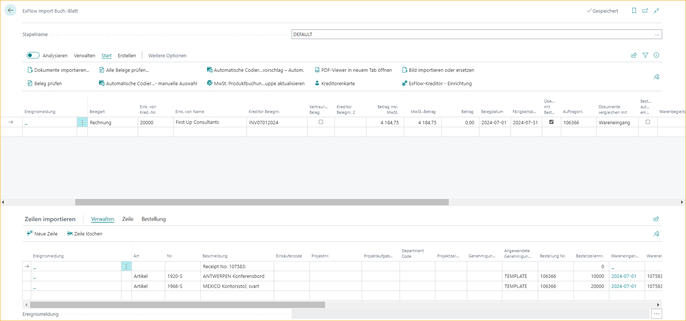

## Anzahlungsrechnungen

Diese Funktion basiert auf der Standardfunktionalität von Business Central.

Um eine Anzahlungsrechnung zu erstellen und zu genehmigen, erstellt ExFlow eine Kopie der Rechnung, die aus der Bestellung gebucht wird.

### Anzahlungs-Einrichtung

Um eine Anzahlungs-Einkaufsrechnung erstellen zu können, ist die Standardkonfiguration in der allgemeinen Buchungseinrichtung erforderlich. Die Mehrwertsteuer wird aus der Einrichtung des in der Einrichtung hinzugefügten Sachkontos berechnet.

Um die Einrichtung für Anzahlungen zu überprüfen, verwenden Sie "Vorschau Anzahlungsrechnungsbuchung" auf der Anzahlungsbestellung.

#### Anzahlungs-Einrichtung in ExFlow

Fügen Sie eine Nummernserie für Anzahlungsrechnungen hinzu, um Anzahlungsrechnungen zu trennen und klarer zu machen. Oder fügen Sie dieselbe Nummernserie wie Rechnungsnummern in der Einkaufs- und Kreditorenbuchungseinrichtung hinzu.

Es gibt auch Einstellungen für Anzahlungen unter Allgemein, die nützlich sein können.

| Einkaufs- und Kreditorenbuchungseinrichtung |  |
|:-|:-|
| **Prüfen Sie die Anzahlung beim Buchen:**       | Verhindert das Buchen von Wareneingängen oder Rechnungen einer Bestellung, die einen unbezahlten Anzahlungsbetrag hat.
| **Automatische Aktualisierungshäufigkeit der Anzahlung:**    | Gibt an, wie oft der Job ausgeführt werden muss, der den Status von Bestellungen, die auf Anzahlung warten, automatisch aktualisiert.

### Anzahlungsbestellung

Eine Einstellung auf der Bestellung ist erforderlich.

Fügen Sie den Anzahlungsprozentsatz auf der Bestellkarte hinzu und verwenden Sie Komprimieren, falls erforderlich.

Deaktivieren Sie "Anzahlung komprimieren", um alle Zeilen auf der Anzahlungsrechnung anzugeben.

### Anzahlungs-Einkaufsrechnung

Das Buchen von Anzahlungsrechnungen erfolgt weiterhin im Hintergrund aus der Anzahlungsbestellung in Business Central Standard. Die ExFlow-Anzahlungsrechnung ist nur ein Spiegelbild einer zukünftigen Buchung.

Daher sind keine Änderungen erlaubt, außer für einige Felder, die die Anzahlungsrechnung beim Buchen aktualisieren:

Belegdatum, Buchungsdatum, Fälligkeitsdatum, Kreditorenrechnungsnummer, Beleg sperren, OCR, Zahlungsbedingungen, Zahlungsmethode und "In Bearbeitung". Und "Warenvermerk", wenn SweBase installiert ist.

Es kann nur eine Anzahlungsrechnung pro Bestellung zur Genehmigung vorliegen.

Um eine zweite Anzahlung erstellen zu können, muss die erste Anzahlungsrechnung gebucht und der Anzahlungsprozentsatz der Bestellung erhöht werden, um den Betrag der zweiten Anzahlungsrechnung zu entsprechen.

**Wenn Aktualisierungen erforderlich sind, müssen diese von der Bestellkarte aus aktualisiert werden.**  
Ändern Sie den Belegtyp zurück auf Rechnung und alle Anzahlungsrechnungszeilen werden gelöscht. Aktualisieren Sie die Bestellung und ändern Sie den Belegtyp auf Anzahlungsrechnung, um neue aktualisierte Zeilen in das Importjournal zu erhalten.

Jede Änderung an der Anzahlungszeile führt zu der Meldung: *"Änderungen an der Anzahlungsrechnung können nur an der Bestellung vorgenommen werden. Um die Rechnungszeile zu aktualisieren, ändern Sie den Belegtyp auf Rechnung und dann zurück auf Anzahlungsrechnung".*

Zur Genehmigung: Erster Genehmiger, Genehmigungsregel und manuell hinzugefügte Genehmiger sind erlaubt.

Für automatisch hinzugefügte Genehmigungsabläufe verwenden Sie dieselben Einstellungen wie für Rechnungen.

Um die endgültige Rechnung erstellen zu können, müssen alle Anzahlungsrechnungen gebucht werden.

### Anzahlungsrechnung im Importjournal

Beim Importieren einer interpretierten Einkaufsrechnung im Importjournal mit fehlenden Empfangszeilen wird eine Fehlermeldung angezeigt: **Bestellnummer 106049 hat keine empfangenen Zeilen.**

Ändern Sie den Belegtyp auf Anzahlungsrechnung und drücken Sie Überprüfen.

In diesem Beispiel haben wir eine Genehmigungsregel basierend auf dem Sachkonto 1480 verwendet, das für Anzahlungen verwendet wird, und Erik als Genehmiger hinzugefügt.

Wenn die Einrichtung korrekt durchgeführt wurde, werden Anzahlungszeilen automatisch hinzugefügt.

In diesem Beispiel haben wir das Sachkonto Nr. 1480 in der Sachkontoeinrichtung hinzugefügt und KEINE MWST (INGEN MOMS) auf der Sachkontokarte 1480.

Da wir "Anzahlung komprimieren" auf der Bestellung nicht verwendet haben, wird die Anzahlungsrechnung alle Zeilen mit Beschreibung aus der Bestellung angeben.

Erstellen Sie, um die Anzahlungsrechnung zur Genehmigung zu senden.

### Anzahlung im Genehmigungsstatus

Im Genehmigungsstatus wird die folgende Nachricht im Diskussionspanel erstellt und auch im Chat auf ExFlow Web angezeigt:

Informationen zur Anzahlungsbestellung sind auch auf der Karte zu sehen. Die Nummer der Anzahlungsbestellung wird auch im Dokumentkopf auf der Seite Genehmigungsstatus angezeigt.

Da die Buchung der Anzahlungsrechnung aus der Bestellung erfolgt, sind keine Änderungen erlaubt, außer für einige Felder, die die Rechnung beim Buchen aktualisieren:

Belegdatum, Buchungsdatum, Fälligkeitsdatum, Kreditorenrechnungsnummer, Beleg sperren, Zahlungsbedingungen, Zahlungsmethode und "In Bearbeitung".

Auch das SweBase-Feld OCR und das Empfängerbankkonto können geändert werden und aktualisieren die Bestellung beim Buchen.

Wenn andere Änderungen erforderlich sind, löschen Sie das Dokument und beginnen Sie von vorne, indem Sie es in das Importjournal importieren.

### Genehmigung der Vorauszahlung auf ExFlow Web

Im Chat auf ExFlow Web können die Genehmigenden folgende Nachricht sehen:

An einem Vorauszahlungsdokument sind keine Änderungen erlaubt. Daher können Genehmigende das Dokument nur genehmigen, ablehnen oder auf "Halten" setzen. Genehmigende können auch aufgrund ihrer Berechtigungen hinzufügen oder weiterleiten.

Wenn der Benutzer versucht, die Kodierung zu ändern, erscheint beim Genehmigen folgende Fehlermeldung:

### Buchung der Vorauszahlungsrechnung

Nachdem die Vorauszahlungsrechnung genehmigt wurde, überprüfen und buchen Sie wie gewohnt.

### Vorauszahlungsverlauf

Gehen Sie zu: ***Bestellauftrag --> Zugehörige --> Dokumente --> Vorauszahlungsrechnungen***

Die gebuchte Vorauszahlungsrechnung kann aus der Bestellauftragskarte nachverfolgt werden.

Die Vorauszahlungsrechnung und der Genehmigungsverlauf können auch im Genehmigungsstatusverlauf nachverfolgt werden.

### Endgültige Vorauszahlungsrechnung im Importjournal

Wenn Forderungen auf den Vorauszahlungsbestellauftrag gebucht werden, muss auch die endgültige Rechnung gebucht werden.

Im obigen Beispiel wird die Vorauszahlungsrechnung mit 100 % und 0 % MwSt. erstellt. Daher wird die endgültige Rechnung nur mit dem Betrag für die MwSt. gebucht, wenn keine weiteren zusätzlichen Gebühren zur Rechnung hinzugefügt werden.

Interpretieren Sie die endgültige Einkaufsrechnung und importieren Sie sie in das Importjournal.

Informationen zu reduzierten Vorauszahlungen sind im Fact Box auf der rechten Seite unter Dokumentdetails zu sehen.

Genehmigungen werden wie gewohnt durch Genehmigungsregeln hinzugefügt.

Wenn die 100 % Vorauszahlungsbestellung bei der Erstellung der endgültigen Rechnung im Importjournal nicht vollständig empfangen wurde, verweist eine Aktionsnachricht auf diese Warnmeldung, die akzeptiert werden muss, bevor sie zur Genehmigung gesendet wird.

### Endgültige Vorauszahlungsrechnung im Genehmigungsstatus

Beim Erstellen der endgültigen Vorauszahlungsrechnung wird folgende Nachricht im Diskussionspanel hinzugefügt:

Der Genehmigende muss immer noch den vollen Bestellbetrag auf den Zeilen genehmigen. Die Reduzierung erfolgt beim Buchen der Bestellung.

### Endgültige Vorauszahlungsrechnung in ExFlow Web

Im Chat kann der Genehmigende folgende Nachricht sehen:

Der Genehmigende muss immer noch den vollen Bestellbetrag genehmigen. Die Reduzierung erfolgt beim Buchen der Bestellung.

### Buchung der endgültigen Vorauszahlungsrechnung

Nachdem die Vorauszahlungsrechnung genehmigt wurde, überprüfen und buchen Sie wie gewohnt.

Vorauszahlungszeilen werden beim Buchen gemäß dem Business Standard reduziert.

### Verlauf der endgültigen Vorauszahlungsrechnung

Gehen Sie zu: ***ExFlow Genehmigungsstatusverlauf***

Die gebuchte endgültige Einkaufsrechnung zeigt nur die genehmigten Zeilen.

Und die Diskussionsnachricht enthält immer noch die automatisch erstellte Nachricht:

Um die Reduzierung für früher gebuchte Vorauszahlungen zu sehen, gehen Sie zur Karte.

