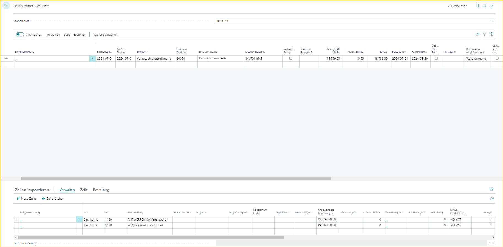
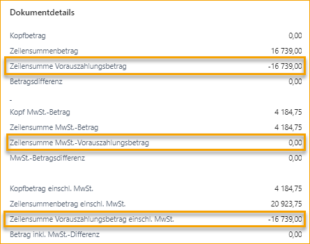

## Vorauszahlungsrechnungen

Diese Funktion basiert auf der Standardfunktionalität von Business Central.

Um eine Vorauszahlungsrechnung zu erstellen und zu genehmigen, erstellt ExFlow eine Kopie der Rechnung, die aus dem Bestellvorgang gebucht wird.

### Vorauszahlungseinrichtung

Um eine Vorauszahlungsrechnung für den Einkauf erstellen zu können, ist die Standardkonfiguration in der allgemeinen Buchungssetup erforderlich. Die Mehrwertsteuer wird gemäß der in der Einrichtung hinzugefügten G/L-Konto-Setup berechnet.

Um die Einrichtung für Vorauszahlungen zu überprüfen, verwenden Sie "Vorschau der Vorauszahlungsrechnungsbuchung" für die Vorauszahlungsbestellung.

#### Vorauszahlung in ExFlow-Einrichtung

Fügen Sie eine Prepmt. Inv. Nos. für Vorauszahlungsrechnungen hinzu, um sie klarer zu trennen. Oder fügen Sie dieselbe Nummernserie wie die Rechnungsnummern in der Einrichtung für Einkäufe und Verbindlichkeiten hinzu.

Es gibt auch Einstellungen für Vorauszahlungen unter "Allgemein", die nützlich sein können.

| Einkäufe & Verbindlichkeiten Einrichtung |  |
|:-|:-|
| **Vorauszahlung beim Buchen überprüfen:**       | Verhindert das Buchen von Zahlungseingängen oder Rechnungen für eine Bestellung, bei der noch ein unbezahlter Vorauszahlungsbetrag aussteht.
| **Vorauszahlung automatische Aktualisierungsfrequenz:**    | Gibt an, wie oft der Job ausgeführt werden muss, der den Status von Bestellungen automatisch aktualisiert, die noch auf eine Vorauszahlung warten.

### Vorauszahlungsbestellung

Es ist eine Einstellung in der Bestellung erforderlich.

Fügen Sie den Vorauszahlungsprozentsatz auf der Bestellkarte hinzu und verwenden Sie bei Bedarf die Option "Komprimieren".

Deaktivieren Sie die Option "Vorauszahlung komprimieren", um alle Positionen auf der Vorauszahlungsrechnung anzugeben.

### Vorauszahlungsrechnung

Die Buchung von Vorauszahlungsrechnungen erfolgt weiterhin aus der Vorauszahlungsbestellung in Business Central Standard im Hintergrund. Die ExFlow-Vorauszahlungsrechnung ist nur ein Spiegelbild einer Buchung.

Daher sind keine Änderungen erlaubt, außer bei einigen Feldern, die die Vorauszahlungsrechnung bei der Buchung aktualisieren:

Dokumentdatum, Buchungsdatum, Fälligkeitsdatum, Lieferantenrechnungsnummer, Dokument sperren, OCR, Zahlungsbedingungen, Zahlungsmethode und Zurückhalten. Und Hinweis auf Waren, wenn SweBase installiert ist.

Es kann nur eine Vorauszahlungsrechnung pro Bestellung zur Genehmigung vorliegen.

Um eine zweite Vorauszahlung erstellen zu können, muss die erste Vorauszahlungsrechnung gebucht und der Vorauszahlungsprozentsatz in der Bestellung erhöht werden, um den Betrag auf der zweiten Vorauszahlungsrechnung anzupassen.

**Wenn Aktualisierungen erforderlich sind, müssen sie von der Bestellkarte aus aktualisiert werden**.  
Ändern Sie den Dokumenttyp zurück in "Rechnung" und alle Vorauszahlungsrechnungspositionen werden gelöscht. Aktualisieren Sie die Bestellung und ändern Sie sie in eine Vorauszahlungsrechnung, um neue aktualisierte Positionen im Importjournal zu erhalten.

Änderungen an der Vorauszahlungsposition können nur über die Bestellung vorgenommen werden. Ändern Sie den Dokumenttyp in "Rechnung" und dann zurück in "Vorauszahlungsrechnung", um die Rechnungsposition zu aktualisieren.

Zur Genehmigung: Erster Genehmiger, Genehmigungsregel und manuell hinzugefügte Genehmiger sind zulässig.

Für automatisch hinzugefügten Genehmigungsfluss verwenden Sie die gleichen Einstellungen wie für Rechnungen.

Um eine endgültige Rechnung erstellen zu können, müssen alle Vorauszahlungsrechnungen gebucht werden.

### Vorauszahlungsrechnung im Importjournal

Beim Importieren einer interpretierten Einkaufsrechnung im Importjournal mit fehlenden Forderungspositionen wird eine Fehlermeldung angezeigt: **Bestellnummer 106049 hat keine empfangenen Positionen**.

Ändern Sie den Dokumenttyp in "Vorauszahlungsrechnung" und klicken Sie auf "Überprüfen".

In diesem Beispiel haben wir eine Genehmigungsregel basierend auf dem G/L-Konto 1480 für Vorauszahlungen hinzugefügt und Erik als Genehmiger festgelegt.

Wenn die Einrichtung korrekt durchgeführt wurde, werden Vorauszahlungspositionen automatisch hinzugefügt.

In diesem Beispiel haben wir das G/L-Konto Nr. 1480 in der Hauptbuchhaltungseinrichtung hinzugefügt und KEINE MwSt. (INGEN MOMS) auf der G/L-Konto-Karte 1480 festgelegt.

Da wir die Option "Vorauszahlung komprimieren" in der Bestellung nicht verwendet haben, gibt die Vorauszahlungsrechnung alle Positionen mit der Beschreibung aus der Bestellung an.

Erstellen Sie die Vorauszahlungsrechnung zur Genehmigung.

### Vorauszahlung im Genehmigungsstatus

Im Genehmigungsstatus wird folgende Nachricht im Diskussionsbereich erstellt und wird auch im Chat auf ExFlow Web angezeigt:

Informationen zur Vorauszahlungsbestellung können auch auf der Karte angezeigt werden. Die Vorauszahlungsbestellnummer wird auch im Dokumentenkopf auf der Seite "Genehmigungsstatus" angezeigt.

Da die Buchung der Vorauszahlungsrechnung aus der Bestellung erfolgt, sind Änderungen außer bei einigen Feldern, die die Rechnung bei der Buchung aktualisieren, nicht zulässig:

Dokumentdatum, Buchungsdatum, Fälligkeitsdatum, Lieferantenrechnungsnummer, Dokument sperren, Zahlungsbedingungen, Zahlungsmethode und Zurückhalten.

Auch das SweBase-Feld OCR und das Empfängerkonto können geändert werden und werden die Bestellung bei der Buchung aktualisieren.

Wenn andere Änderungen erforderlich sind, löschen Sie das Dokument und beginnen Sie von vorne, indem Sie es im Importjournal importieren.

### Vorauszahlungsgenehmigung auf ExFlow Web

Im Chat auf ExFlow Web können die Genehmiger folgende Nachricht sehen:

Es sind keine Änderungen an einem Vorauszahlungsdokument zulässig. Daher können Genehmiger nur genehmigen, ablehnen oder das Dokument zurückhalten. Genehmiger können auch hinzufügen oder weiterleiten, sofern die Berechtigung des Genehmigers dies zulässt.

Wenn der Benutzer versucht, die Buchung zu ändern, tritt folgende Fehlermeldung auf, wenn die Genehmigung erfolgt:

### Buchung der Vorauszahlungsrechnung

Nachdem die Vorauszahlungsrechnung genehmigt wurde, überprüfen und buchen Sie sie wie gewohnt.

### Vorauszahlungsverlauf

Gehen Sie zu: ***Einkaufsbestellung --> Verwandt --> Dokumente --> Vorauszahlungsrechnungen***

Die gebuchte Vorauszahlungsrechnung kann von der Bestellkarte aus verfolgt werden.

Die Vorauszahlungsrechnung und die Genehmigungshistorie können auch im Genehmigungsstatusverlauf verfolgt werden.

### Endgültige Vorauszahlungsrechnung im Importjournal

Wenn Forderungen für die Vorauszahlungsbestellung gebucht werden, muss auch die endgültige Rechnung gebucht werden.

Im obigen Beispiel wird die Vorauszahlungsrechnung mit 100 % und 0 % MwSt. durchgeführt. Daher wird die endgültige Rechnung nur mit dem Betrag für die MwSt. gebucht, wenn keine weiteren Zusatzkosten zur Rechnung hinzugefügt werden.

Interpretieren Sie die endgültige Einkaufsrechnung und importieren Sie sie in das Importjournal.

Informationen zu reduzierten Vorauszahlungen finden Sie in der Faktendetails-Box auf der rechten Seite unter Dokumentdetails.

Genehmigungen werden wie gewohnt durch Genehmigungsregeln hinzugefügt.

Wenn die 100%ige Vorauszahlungsbestellung bei der Erstellung der endgültigen Rechnung im Importjournal nicht vollständig erhalten wird, wird eine Aktionsnachricht auf diese Warnmeldung verweisen, die vor der Genehmigung akzeptiert werden muss.

### Endgültige Vorauszahlungsrechnung im Genehmigungsstatus

Bei der Erstellung der endgültigen Vorauszahlungsrechnung wird folgende Nachricht im Diskussionsbereich hinzugefügt:

Der Genehmiger muss immer noch den vollen Bestellbetrag auf den Positionen genehmigen. Die Reduzierung erfolgt beim Buchen der Bestellung.

### Endgültige Vorauszahlungsrechnung in ExFlow Web

Im Chat kann der Genehmiger folgende Nachricht sehen:

Der Genehmiger muss immer noch den vollen Bestellbetrag genehmigen. Die Reduzierung erfolgt beim Buchen der Bestellung.

### Buchung der endgültigen Vorauszahlungsrechnung

Nachdem die Vorauszahlungsrechnung genehmigt wurde, überprüfen und buchen Sie sie wie gewohnt.

Die Vorauszahlungspositionen werden beim Buchen gemäß dem Business Standard reduziert.

### Verlauf der endgültigen Vorauszahlungsrechnung

Gehen Sie zu: ***ExFlow Genehmigungsstatusverlauf***

Die gebuchte endgültige Einkaufsrechnung zeigt nur die genehmigten Positionen.

Und die Diskussionsnachricht enthält immer noch automatisch erstellte Nachrichten:

Um die Reduzierung für früher gebuchte Vorauszahlungen zu sehen, gehen Sie zur Karte.

