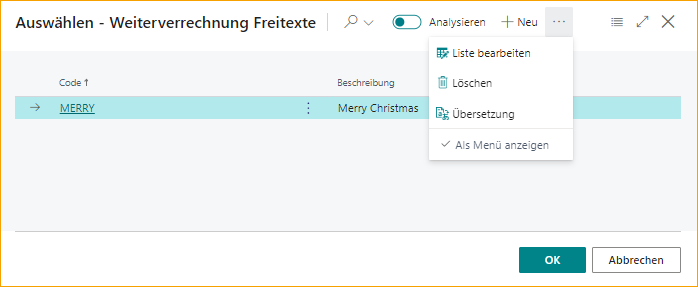
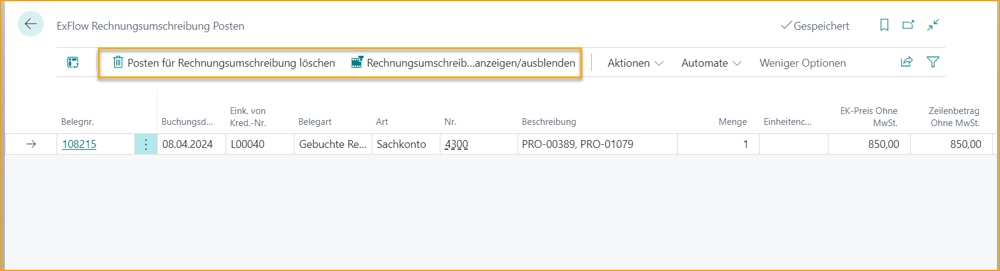
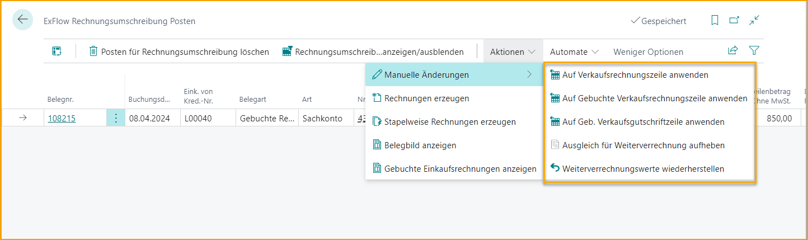

## Re-Invoicing
Re-Invoicing ist nützlich, wenn eine Einkaufsrechnung empfangen wird, die an einen Kunden weiterberechnet werden muss.

Alle Einkaufslinientypen können als Linientyp G/L-Konto an den Kunden weiterberechnet werden. Aufgrund der Einrichtung kann der Artikel unter derselben Artikelnummer an den Kunden fakturiert werden.

Re-Invoicing-Werte können auf Einkaufsangebot, Bestellung, Rechnung und Gutschrift hinzugefügt werden.

Wenn Re-Invoicing bereits aktiviert ist, deaktivieren und erneut aktivieren, um den Assistenten für die erforderliche Mindesteinrichtung zu starten. Dies hilft bei der Einrichtung der erforderlichen Einstellungen in Web Columns. Bitte beachten Sie, dass die Codierungsregellinien, die mit Re-Invoicing-Spalten verbunden sind, erneut erstellt werden müssen.

Die folgenden Re-Invoicing-Spalten können auf ExFlow Web aktiviert werden:
* Re-Invoicing-Kundennummer
* Menge & Einheitspreis oder Re-Invoicing-Betrag
* Re-Invoicing-Zuschlag %
* Re-Invoicing-Code
* Re-Invoicing-Beschreibung

Die Genehmiger können dann je nach ExFlow-Benutzerberechtigung Werte für die Verkaufsrechnung an den Kunden hinzufügen, ändern oder genehmigen.

### ExFlow Re-Invoicing Einrichtung
Gehen Sie zu: ***Setup --> ExFlow Manual Setup --> ExFlow Re-Invoicing Setup*** 
Beginnen Sie mit der Aktivierung von Re-Invoicing in ExFlow Re-Invoicing Setup und folgen Sie dem Assistenten für die erforderliche Mindesteinrichtung.

#### Re-Invoicing Einrichtung - Allgemein
| Allgemein | |
|:-|:-|
| **Aktiv:**				                                            | Gibt an, ob Re-Invoicing aktiviert oder deaktiviert ist. Beim Aktivieren oder Ändern der Einrichtung hilft der ExFlow-Assistent bei der erforderlichen Mindesteinrichtung.
| **Vordefiniertes Verkaufs-G/L-Konto:**		                            | Vordefiniertes G/L-Konto, das auf Verkaufszeilen angewendet wird, wenn kein Re-Invoicing-Code verwendet wird.
| **Betragsfelder verwenden:**			                                    | Fügen Sie Re-Invoicing Menge & Einheitspreis oder Re-Invoicing-Betrag zu ausgewählten Spalten auf ExFlow Web hinzu.    **Menge & Einheitspreis** Die gekaufte Menge wird als Re-Invoicing-Menge hinzugefügt und die Berechnung des Zuschlags % erfolgt dann auf den Re-Invoicing-Einheitspreis.    **Linienbetrag**  Die gekaufte Menge wird als 1 hinzugefügt und die Berechnung des Zuschlags % erfolgt auf den Re-Invoicing-Betrag (gesamt).
| **Artikel für Verkauf:**			                                        | Aktivieren, um Verkaufsrechnungen aus Einkaufsrechnungen mit derselben Artikelnummer zu erstellen. Die Artikelpostennummer aus der Einkaufsrechnung wird, wenn möglich, auf die Verkaufszeile angewendet. Lesen Sie mehr im Abschnitt [***Re-Invoicing für Artikel***](https://docs.exflow.cloud/business-central/docs/user-manual/business-functionality/re-invoicing#re-invoicing-for-items).
| **Immer Verkaufsrechnung erstellen, wenn Artikelpostennummer fehlt:**  | Aktivieren, um immer Verkaufsrechnungen ohne Artikelpostennummer zu erstellen, falls diese fehlt. Kann nur verwendet werden, wenn Artikel für Verkauf aktiviert ist.
| **Einkaufsrechnungs-PDF als Anhang:**	                            | Aktivieren, um das Einkaufsrechnungs-PDF als Anhang zu allen Verkaufsrechnungen hinzuzufügen.
| **Angepasste Beschreibung aktivieren:**		                            | Angepasste Beschreibung aktivieren oder deaktivieren. Lesen Sie mehr im Abschnitt [***Angepasste Beschreibung aktivieren***](https://docs.exflow.cloud/business-central/docs/user-manual/business-functionality/re-invoicing#enable-customized-description) unten.
| **Angepasste Beschreibung:**		                                    | Aktuelle angepasste Beschreibung der Re-Invoicing-Verkaufszeile.
| **Zuschlag %:**			                                            | Gibt an, ob ein Zuschlag % hinzugefügt werden soll, wenn die Re-Invoicing-Funktionalität verwendet wird. Wenn Artikel für Verkauf aktiviert ist, wird kein Zuschlag % für Artikelzeilen hinzugefügt. Das Aktivieren dieser Option öffnet zusätzliche Optionen zum Vordefinieren von Zuschlägen.  Lesen Sie mehr im Abschnitt [***Zuschlag %***](https://docs.exflow.cloud/business-central/docs/user-manual/business-functionality/re-invoicing#surcharge-) unten.
| **Dimensionswert kopieren:**		                                        | Gibt die Dimensionen an, die von der Einkaufsrechnung auf die Verkaufszeile kopiert werden sollen, wenn die Re-Invoicing-Funktionalität verwendet wird. Lesen Sie mehr im Abschnitt [***Dimensionswerte kopieren***](https://docs.exflow.cloud/business-central/docs/user-manual/business-functionality/re-invoicing#copy-dimension-values) unten.
| **Dimension von Einkauf priorisieren:**	                            | Priorisieren Sie die Dimension von der Einkaufszeile, wenn dieselbe Dimension auf der Verkaufszeile vorhanden ist.
| **Priorisieren beim Aufteilen der Zeile im Web:**	                    | Beim Aufteilen der Zeile auf ExFlow Web muss das Dokument gespeichert werden, um die Beträge zu aktualisieren. Wenn nicht, hilft diese Einstellung, die Neuberechnung von Betrag oder Zuschlag % beim Genehmigen zu priorisieren.

 

#### Re-Invoicing Einrichtung - Hintergrundverarbeitung
Um Job-Warteschlangen-Einträge zu aktivieren und automatisch Verkaufsrechnungen zu erstellen, ist die folgende Einstellung erforderlich. Beachten Sie, dass dieser Job nur Verkaufsrechnungen erstellt.

| Hintergrundverarbeitung | |
|:-|:-|
| **Hintergrundverarbeitung:**	    | Aktivieren, um Job-Warteschlangen-Einträge hinzuzufügen, um Verkaufsrechnungen aus Re-Invoicing-Einträgen zu erstellen. Wählen Sie die Häufigkeit und aktivieren Sie.
| **Rechnungserstellungstyp:**	    | Wählen Sie, ob ein Verkaufsrechnungsdokument pro Zeile oder eine Rechnung pro Kunde erstellt werden soll, wenn die Hintergrundverarbeitung verwendet wird.
| **Wechselkursdatum basierend auf:**	| Wählen Sie den Wechselkurs basierend auf dem Verkaufsbuchungsdatum oder dem Einkaufsdatum, wenn die Hintergrundverarbeitung verwendet wird.

 

#### Angepasste Beschreibung aktivieren
Gehen Sie zu: ***ExFlow Re-Invoicing Setup --> Aktionen --> Angepasste Beschreibung*** 
Wenn die angepasste Beschreibung aktiviert ist, ist es möglich, Informationen aus beliebigen Feldern der Einkaufsdokumentzeile zu kopieren. Und aus dem Einkaufsdokumentkopf können die Lieferantenrechnungs-/Gutschriftnummer und der Name des Lieferanten verwendet werden.

Wenn nicht aktiviert, kann die Beschreibung manuell hinzugefügt werden. Wenn keine Re-Invoicing-Beschreibung vorhanden ist, wird die Verkaufsdokumentbeschreibung als Business Central-Standard hinzugefügt.

| Einkaufsrechnungszeilenfelder | |
|:-|:-|
| **Feldname:**	| Wählen Sie Einkaufszeilenfelder aus, aus denen Werte kopiert werden sollen.
| **Sortierung:**		| Wählen Sie die Sortierung, in welcher Reihenfolge die Werte auf der Verkaufszeile angezeigt werden sollen. Der niedrigste Wert wird zuerst hinzugefügt.
 

| Einkaufsrechnungskopffelder | |
|:-|:-|
| **Lieferantenrechnungsnummer:** 		| Wählen Sie die Lieferantenrechnungsnummer und aktualisieren Sie die Sortierung bei Bedarf oben.
| **Name des Lieferanten:**	    | Wählen Sie den Namen des Lieferanten und aktualisieren Sie die Sortierung bei Bedarf oben.
| **Freitext:**		        | „Aus vollständiger Liste auswählen“. Fügen Sie Code und Beschreibung hinzu. Es ist die Beschreibung, die der Verkaufszeile hinzugefügt wird.  Beachten Sie, dass dies übersetzt und mit dem Sprachcode aus der Kundenkarte verwendet werden kann. Es kann nur ein Freitext zur Verkaufszeile hinzugefügt werden. 
| **Texttrennzeichen:**		    | Dies wird verwendet, um Textfelder zu trennen. In diesem Beispiel haben wir „Leerzeichen – Leerzeichen“ verwendet.

 

#### Zuschlag %
Gehen Sie zu: ***ExFlow Re-Invoicing Setup --> Aktionen --> Zuschlag % bearbeiten*** 
Zuschlag % ist nützlich, um automatisch einen Zuschlag zu Re-Invoicing-Zeilen hinzuzufügen.

Es wird kein Zuschlag % automatisch hinzugefügt, wenn Artikel für Verkauf ausgewählt ist. Dann wird der Einheitspreis von Business Central Standard gehandhabt. Sie können jederzeit manuell Zuschläge oder Einheitspreise hinzufügen.

Die Berechnung des Zuschlags % wird je nach Verwendung des Betragsfelds in der Re-Invoicing-Einrichtung unterschiedlich gehandhabt:
* **Linienbetrag:**   
Bei Verwendung des Linienbetrags wird die Berechnung des Zuschlags % vom Gesamtkaufbetrag zur Re-Invoicing-Linienbetrag durchgeführt. 
Einkaufsmenge 2, Direkteinstandspreis 1 000,00, insgesamt **2 000,00**  
Re-Invoicing-Menge 1, Einheitspreis 6 000,00 insgesamt **6 000,00** 
**Der Zuschlag % wird dann als 200% angezeigt** 

* **Menge & Einheitspreis:**   
Bei Verwendung von Menge & Einheitspreis wird die Berechnung des Zuschlags % vom direkten Einstandspreis zum Re-Invoicing-Einheitspreis durchgeführt. 
Wenn die Menge geändert wird, erfolgt keine Aktualisierung des Zuschlags % oder des Einheitspreises.  
Einkaufsmenge 2, Direkteinstandspreis **1 000,00**, insgesamt 2 000,00 
Re-Invoicing-Menge 4, Einheitspreis **1 500,00** insgesamt 6 000,00 
**Der Zuschlag % wird dann als 50% angezeigt** 

Das Aktivieren des Zuschlags % öffnet zusätzliche Optionen zum Vordefinieren von Zuschlägen.

Die Re-Invoicing-Zuschlagsseite fügt weitere Anpassungen zur Handhabung von Zuschlägen für verschiedene Kundentypen hinzu.
Wir können Zuschlagsprozentsätze basierend auf Kundennummer, IC-Partnercode, Kundengruppe und Kundenpreisgruppe definieren.  
Das Feld Kundennummer hat die höchste Priorität und kann nicht mit anderen Feldern kombiniert werden.
Eine Zuschlagszeile ohne Filter wird auf alle anderen Kunden angewendet, die nicht in anderen Filtern enthalten sind.

 

#### Dimensionswerte kopieren
Gehen Sie zu: ***ExFlow Re-Invoicing Setup --> Aktionen --> Dimensionen kopieren*** 
Aktivieren und wählen Sie Dimensionen aus, um Werte von der Einkaufszeile auf die Verkaufszeile zu kopieren.

Wenn dieselbe Dimension mit unterschiedlichen Werten sowohl auf den Verkaufs- als auch auf den Einkaufszeilen vorhanden ist, kann die Einstellung zur Priorisierung der Dimension vom Einkauf verwendet werden. Wenn nicht ausgewählt, werden die Dimensionen von den Verkaufszeilen priorisiert.

 

### ExFlow Rechnungsstellungscodes
Gehe zu: ***ExFlow Re-Invoicing Setup --> Aktionen --> ExFlow Re-Invoicing Codes*** 
Es ist möglich, verschiedene G/L-Konten für eine bestimmte Verkaufsrechnungszeile auszuwählen, indem ein Re-Invoicing-Code verwendet wird. Wenn der Re-Invoicing-Code leer ist, wird das Standard-G/L-Konto aus der Re-Invoicing-Einrichtung vorausgewählt.  
Wenn ''Artikel für Verkauf'' aktiviert ist, kann das Feld ''Re-Invoicing-Code'' nicht für Artikelzeilen verwendet werden.

### ExFlow Purchase Codes
Gehe zu: ***Setup --> ExFlow Manual Setup --> ExFlow Purchase Codes*** 
Re-Invoicing-Felder wurden nun zum ExFlow Purchase Code hinzugefügt. Re-Invoicing muss jedoch aktiviert sein, damit die Felder angezeigt werden.

### ExFlow Denying Coding Rule -- Re-Invoicing
Gehe zu: ***Setup --> ExFlow Manual Setup --> ExFlow Denying Coding Rules*** 
Wenn eine Re-Invoicing-Kundennummer hinzugefügt wird, ist es möglich, eine ExFlow Denying Coding Rule hinzuzufügen, um Genehmiger zu zwingen, weitere Informationen hinzuzufügen.

In diesem Beispiel muss der Genehmiger den Re-Invoicing-Betrag hinzufügen, wenn eine Re-Invoicing-Kundennummer in der Dokumentzeile mit dem Zeilentyp G/L-Konto in ExFlow Web hinzugefügt wurde.

Wenn der Re-Invoicing-Betrag fehlt, fügt ExFlow den Aufschlag % (falls aktiviert) und den Einkaufsbetrag zur Verkaufsrechnung hinzu.

### Re-Invoicing im ExFlow Import Journal
Beim Arbeiten mit Re-Invoicing im Import Journal kann die Kodierung über den ExFlow Purchase Code hinzugefügt oder manuell hinzugefügt werden.

| Re-Invoicing im Import Journal | |
|:-|:-|
| **Re-Invoicing Pflichtfeld:**	    | Erzwingt, dass der letzte Genehmiger die Re-Invoicing-Kundennummer in ExFlow Web hinzufügt, um die Rechnung genehmigen zu können
| **Re-Invoicing Kundennummer:**	    | Aktiviert Re-Invoicing im Import Journal durch Hinzufügen der Re-Invoicing-Kundennummer in der Importzeile. Der Gesamtzeilenbetrag exkl. MwSt. / Menge & Einheitspreis wird automatisch im Re-Invoicing-Betrag mit Aufschlag % hinzugefügt. Ändern Sie den Re-Invoicing-Betrag bei Bedarf manuell
| **Re-Invoicing Code:**		        | Geben Sie "Re-Invoicing-Code" ein, um ein G/L-Konto auszuwählen, das in der Verkaufsrechnungszeile hinzugefügt wird. Wenn kein Re-Invoicing-Code ausgewählt wird, wird das vordefinierte Verkaufs-G/L-Konto automatisch aus der ExFlow Re-Invoicing-Einrichtung ausgewählt
| **Re-Invoicing Beschreibung:**	        | Angepasste Beschreibung wird standardmäßig hinzugefügt, wenn sie aktiviert ist. Kann bei Bedarf auch manuell geändert oder hinzugefügt werden. Wenn nichts eingegeben wird, wird die Beschreibung in der Verkaufsrechnungszeile standardmäßig von Business Central ausgewählt
| **Re-Invoicing Menge:**		            | Wenn Menge & Einheitspreis für die Verwendung von Betragsfeldern in der Re-Invoicing-Einrichtung ausgewählt sind, wird die zu rechnende Menge aus der Einkaufsmenge kopiert. Kann manuell aktualisiert werden. Für Artikelzeilen, wenn Artikel für Verkauf aktiviert ist, kann die Re-Invoicing-Menge nicht größer als die Einkaufsmenge sein.
| **Re-Invoicing Aufschlag %:**	        | Aufschlag % wird aus der Re-Invoicing-Einrichtung hinzugefügt, wenn aktiviert. Manuell hinzufügen oder aktualisieren, um den Zeilenbetrag/Einheitspreis zu berechnen
| **Re-Invoicing Betrag/Einheitspreis:**	| Aufgrund der Einrichtung für die Verwendung von Betragsfeldern wird der Betrag oder der Einheitspreis aus den direkten Stückkosten und dem Aufschlag % berechnet. Kann manuell angepasst werden, um den neuen Aufschlag % zu berechnen

#### Re-Invoicing Vertrauliche Dokumente
Die Funktion Vertrauliche Dokumente kann nicht zusammen mit Re-Invoicing verwendet werden. Folgende Aktionsnachricht wird in den Import Journal-Zeilen angezeigt, wenn dies der Fall ist: ''Re-Invoicing-Funktionalität kann nicht zusammen mit Vertraulichen Dokumenten verwendet werden''

### Re-Invoicing im ExFlow Web
Gehe zu: ***Re-Invoicing Setup --> Aktionen --> Web-Spalten bearbeiten / Web-Spalten*** 
Spalten müssen in ExFlow Web hinzugefügt werden, um Informationen zur "Re-Invoicing"-Kodierung zu genehmigen, abzulehnen oder zu ändern.

Der ExFlow-Benutzer kann Werte in ExFlow Web mit der gegebenen Web-Berechtigungsrolle in der Zeile hinzufügen oder ändern. 
Lesen Sie mehr über Web-Berechtigungsrollen im Abschnitt [***ExFlow User***](https://docs.exflow.cloud/business-central/docs/user-manual/business-functionality/exflow-user#add-company-access-and-web-permission-role-under-permissions)

Wenn "Re-Invoice Pflichtfeld" im Import Journal hinzugefügt wurde und die "Re-Invoicing Kundennummer" fehlt, wird die folgende Fehlermeldung beim letzten Genehmiger im Genehmigungsfluss angezeigt.

Wenn die oben genannte ExFlow Denying Coding Rule verwendet wird, erhält der Genehmiger die folgende Fehlermeldung, wenn er das Dokument genehmigt und die Re-Invoicing-Kundennummer und der Betrag fehlen.

In diesem Fall fügen Sie den "Re-Invoicing-Betrag" hinzu und genehmigen Sie.

### ExFlow Genehmigungsstatus
Der Genehmigungsstatus wird jetzt aktualisiert, aber das Dokument muss überprüft und gebucht werden, bevor Re-Invoicing-Einträge hinzugefügt und bereit sind, ein Verkaufsdokument zu erstellen.

### ExFlow Re-Invoicing Einträge
Gehe zu: ***Periodische Aktivitäten --> ExFlow Re-Invoicing Einträge*** 
Informationen zu Re-Invoicing-Einträgen finden Sie in den ExFlow Re-Invoicing Einträgen. Diese Einträge werden sichtbar, nachdem eine Einkaufsrechnung genehmigt, überprüft und gebucht wurde.

Änderungen in den Re-Invoicing-Einträgen oder aus Verkaufsrechnungen können vor dem Buchen vorgenommen werden.

Verwenden Sie die Funktion „Erstellen“ oder „Batch-Rechnungen erstellen“, wenn mehr als eine Rechnung erstellt werden soll. Es werden nur ausgewählte Zeilen erstellt.

| Re-Invoicing Funktionen | |
|:-|:-|
| **Re-Invoicing Einträge löschen:**	    | Wenn eine Re-Invoicing-Zeile versehentlich erstellt wurde, verwenden Sie "Re-Invoicing Einträge löschen". Die Zeile wird als gelöscht markiert, kann jedoch weiterhin in der Historie gefunden werden (Re-Invoiced Einträge anzeigen/ausblenden)
| **Re-Invoiced Einträge anzeigen/ausblenden:**	| Verwenden Sie die Funktion "Re-Invoiced Einträge anzeigen/ausblenden", um die Historie aller Einkaufs-Re-Invoicing-Zeilen anzuzeigen. Dies dient dazu, Verkaufsrechnungs-/Gutschriftzeilen anzuzeigen, die erstellt, gebucht oder wenn der Eintrag gelöscht wurde

 

| Aktionen – Manuelle Änderungen| |
|:-|:-|
| **Verkaufszeile anwenden:**			            | Wenden Sie einen Re-Invoicing-Eintrag auf eine bereits erstellte, aber nicht gebuchte Verkaufsdokumentzeile an
| **Gebuchte Verkaufsrechnungszeile anwenden:**		| Wenden Sie einen Re-Invoicing-Eintrag auf eine gebuchte Verkaufsrechnungszeile an
| **Gebuchte Verkaufs-Gutschriftzeile anwenden:**	| Wenden Sie einen Re-Invoicing-Eintrag auf eine gebuchte Verkaufs-Gutschriftzeile an
| **Re-Invoiced rückgängig machen:**		            | Wählen Sie einen oder mehrere Einträge aus, um sie rückgängig zu machen, damit sie erneut angewendet oder ein Verkaufsdokument erneut erstellt werden kann
| **Re-Invoicing-Werte wiederherstellen:**		    | Stellt Re-Invoicing-Werte wieder her, wenn nach dem Buchen des Einkaufsdokuments Änderungen vorgenommen wurden

 

| Aktionen | |
|:-|:-|
| **Rechnungen erstellen:**		        | Erstellen Sie ein Verkaufsdokument nur für ausgewählte Einträge
| **Batch-Rechnungen erstellen:**	    | Batch-Erstellung aller Verkaufsrechnungen oder ausgewählter
| **Dokumentbild anzeigen:**	        | Zeigen Sie die Einkaufsrechnungs-PDF an (Strg+I) Wählen und laden Sie mehrere Einkaufsdokumente herunter
| **Gebuchte Einkaufsrechnung anzeigen:**	| Zeigen Sie die gebuchte Einkaufsrechnung für den ausgewählten Eintrag an

 

#### Rechnungen erstellen
Gehen Sie zu: ***Re-Invoicing Entries --> Actions --> Create Invoices (F9)***  
Um Verkaufsrechnungen zu erstellen, verwenden Sie die Funktion im Menü unter Aktionen oder die Tastenkombination F9. Verkaufsrechnungen werden für alle ausgewählten Einträge erstellt.

Verkaufsrechnungen werden auf dem G/L-Konto im Feld Re-Invoicing No. erstellt. Und wenn der Artikel für den Verkauf in der Re-Invoicing-Einrichtung aktiviert ist, derselbe Artikel wie gekauft.  
Lesen Sie mehr im Abschnitt [***Re-Invoicing Item for Sale***](https://docs.exflow.cloud/business-central/docs/user-manual/business-functionality/re-invoicing#re-invoicing-item-for-sale) 

Pflichtfelder, um Verkaufsdokumente erstellen zu können, sind Re-Invoicing Customer No., Re-Invoicing No. und Re-Invoicing Amount oder Unit Price.

| Rechnungen erstellen | |
|:-|:-|
| **Buchungsdatum:**		|Wählen Sie ein Buchungsdatum, wenn es nicht das heutige Datum ist
| **Rechnungserstellungstyp:**	| Wählen Sie, ob Verkaufsrechnungen Ein Dokument pro Zeile oder Ein Dokument pro Kunde erstellt werden sollen
| **Wechselkursdatum basierend auf:**	| Wählen Sie das Wechselkursdatum basierend auf dem Verkaufsbuchungsdatum oder dem Einkaufsbuchungsdatum

 

#### Stapelrechnungen erstellen
Gehen Sie zu: *** Re-Invoicing Entries --> Actions --> Batch Create Invoices*** 
Der einzige Unterschied zur Erstellung von Rechnungen besteht darin, dass der Stapel Verkaufsrechnungen für alle Einträge erstellt, wenn keine Zeile ausgewählt ist.
 

#### Re-Invoicing-Verkaufsrechnungen manuell erstellen
Gehen Sie zu: ***Sales Invoices*** in Business Central Standard und erstellen Sie eine neue Verkaufsrechnung.

Wählen Sie aus, welcher Kunde in Rechnung gestellt werden soll. In diesem Beispiel Kunde Nr. 10000. Fügen Sie Informationen in den Verkaufsdokumentenkopf ein und verwenden Sie die Funktion "Get Re-Invoicing Lines", die unter ***Related --> ExFlow*** hinzugefügt wurde.

Alle ausgewählten Zeilen werden für diesen Kunden importiert.

In diesem Fall wurde das G/L-Konto 3081 aus dem Re-Invoicing-Code ausgewählt. Der Nettopreis ohne MwSt. einschließlich Zuschlagsprozentsatz und angepasster Beschreibung wurde aus dem Re-Invoicing-Eintrag hinzugefügt.

 

#### Dokumentenbild aus Verkaufsrechnungszeile anzeigen
Gehen Sie zu: ***Lines --> Line --> Related Information --> ExFlow --> Show Document Image*** 
Klicken Sie auf "Show Document Image", um die PDF-Einkaufsrechnung für die ausgewählte Zeile anzuzeigen.

### ExFlow Genehmigungsverlauf
Informationen zur "Re-Invoice to Customer" werden im ExFlow-Genehmigungsverlauf gespeichert.
Die Spalten „Re-Invoicing Entries“ und „Re-Invoicing Entries on all lines“ helfen dem Benutzer im ExFlow-Genehmigungsverlauf, auf Kopfebene zu sehen und zu filtern, ob gebuchte Einkaufsrechnungen gebuchte Re-Invoicing-Dokumente haben.

### ExFlow Buchhalter
Bei Verwendung der Rolle „ExFlow Accountant“ wird eine Kachel hinzugefügt, um Re-Invoicing-Einträge zu bearbeiten.

### Re-Invoicing-Artikel zum Verkauf
Wenn der Artikel für den Verkauf aktiviert ist, müssen die Betragsfelder in der Re-Invoicing-Einrichtung auf „Menge & Stückpreis“ eingestellt sein.

Verkaufsrechnungen werden mit derselben Artikelnummer wie gekauft erstellt. Daher kann der Re-Invoicing-Code nicht verwendet werden.

Es wird kein Zuschlagsprozentsatz automatisch hinzugefügt und der Re-Invoicing-Stückpreis beträgt 0,00. Beim Erstellen des Verkaufsdokuments wird der Stückpreis von Business Central standardmäßig behandelt. Aus der Artikelkarte oder der Kundenpreisliste.

Die Re-Invoicing-Menge wird aus der Einkaufsmenge kopiert, kann jedoch auf weniger, aber niemals mehr als die gekaufte Menge geändert werden.

Wenn die Verkaufszeile erstellt wird, wird Apply-to Item Entry verwendet, um den Einkaufsartikel-Eintrag nach Möglichkeit mit der Verkaufszeile zu verbinden. Die Standardkostenmethode von Business Central auf der Artikelkarte wird dann nicht verwendet.

Wenn die Re-Invoicing-Menge nicht mehr auf Lager ist, wird eine Frage gestellt, ob ohne Apply-to Item Entry fortgefahren und die Standardkostenmethode von Business Central verwendet werden soll.

Wenn die Job-Warteschlange über ***ExFlow Re-Invoicing Setup --> Background Posting*** erstellt wird, werden nur Rechnungen ohne Fehler oder Fragen erstellt.  
Gehen Sie zu: ***Re-Invoicing Entries*** und erstellen Sie sie manuell, korrigieren Sie die Fehlermeldungen oder beantworten Sie die Frage, um ohne Apply-to Item Entry zu erstellen.

Hier kann die Einstellung „Always Create Sales Invoice when Apply-to Item Entry is missing“ in der Re-Invoicing-Einrichtung verwendet werden, um Rechnungen ohne Apply-to Item Entry zu erstellen.

Der Standort wird nach Möglichkeit über Apply-to Item Entry hinzugefügt. Der Variantencode und der Bin-Code werden aus der Einkaufszeile kopiert. Wenn es nicht möglich ist, Apply-to Item Entry hinzuzufügen, müssen Standortcode, Bin-Code und Variante manuell in der Verkaufsrechnungszeile behandelt werden.

### Re-Invoicing-Artikel zum G/L-Konto
Gehen Sie zu: ***Setup --> ExFlow Manual Setup --> Re-Invoicing Setup*** 
Um Verkaufsrechnungen auf das G/L-Konto aus der Einkaufsrechnungsartikelzeile zu erstellen, stellen Sie sicher, dass der Artikel für den Verkauf in der Re-Invoicing-Einrichtung deaktiviert ist.

Der Zuschlagsprozentsatz wird automatisch hinzugefügt, wenn eine Kundennummer aktiviert ist.

Wenn Menge & Stückpreis in der Re-Invoicing-Einrichtung für die Verwendung von Betragsfeldern ausgewählt ist, kann jede Re-Invoicing-Menge hinzugefügt werden, aber die gekaufte Menge wird vorgeschlagen.

Wählen Sie das G/L-Konto über den Re-Invoicing-Code. Wenn leer, wird das vordefinierte Verkaufs-G/L-Konto ausgewählt.
