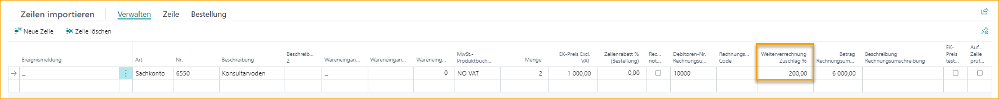
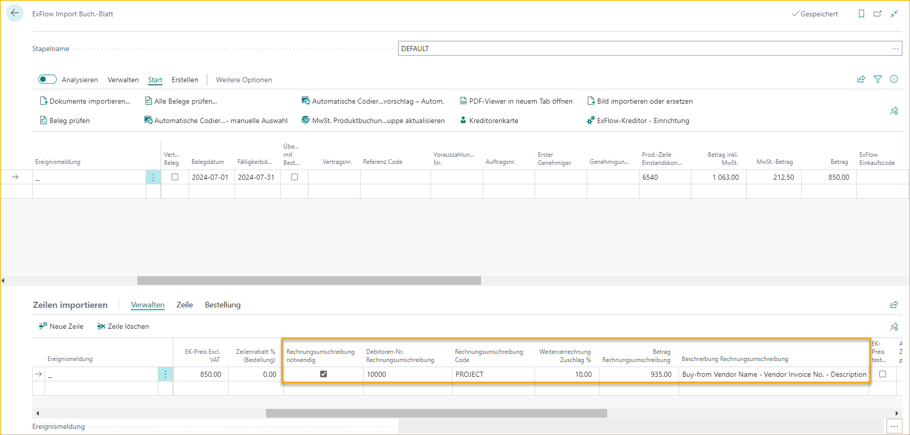

## Rechnungsstellung
Die Rechnungsstellung ist nützlich, wenn eine Eingangsrechnung vorliegt, die an einen Kunden weiterberechnet werden muss.

Alle Arten von Einkaufspositionen können als G/L-Konto an den Kunden weiterberechnet werden. Aufgrund der Konfiguration kann der Artikel unter derselben Artikelnummer an den Kunden in Rechnung gestellt werden.

Rechnungswerte können auf Angebots-, Bestell-, Rechnungs- und Gutschriftspositionen hinzugefügt werden.

Wenn die Rechnungsstellung bereits aktiviert ist, deaktivieren Sie sie und aktivieren Sie sie erneut, um den Assistenten für die erforderliche Minimaleinrichtung zu starten. Dadurch können die erforderlichen Einstellungen in den Web-Spalten eingerichtet werden. Beachten Sie, dass Codierungsregelzeilen, die mit Rechnungsstellungsspalten verbunden sind, erneut erstellt werden müssen.

Folgende Rechnungsstellungsspalten können im ExFlow Web aktiviert werden:
* Kundennummer für Rechnungsstellung
* Menge & Einzelpreis oder Rechnungsbetrag für Rechnungsstellung
* Aufschlag % für Rechnungsstellung
* Rechnungsstellungscode
* Rechnungsstellungsbeschreibung

Die Genehmiger können dann je nach ExFlow-Benutzerberechtigung den Wert für die Verkaufsrechnung an den Kunden hinzufügen, ändern oder genehmigen.

### ExFlow Rechnungsstellung Einrichtung
Gehe zu: ***Setup --> ExFlow manuelle Einrichtung --> ExFlow Rechnungsstellung Einrichtung*** 
Beginnen Sie mit der Aktivierung der Rechnungsstellung in der ExFlow Rechnungsstellung Einrichtung und folgen Sie dem Assistenten für die erforderliche Minimaleinrichtung.

#### Rechnungsstellung Einrichtung - Allgemein
| Allgemein | |
|:-|:-|
| **Aktiv:**				                                            | Gibt an, ob die Rechnungsstellung aktiviert oder deaktiviert ist. Beim Aktivieren oder Ändern der Einrichtung unterstützt der ExFlow-Assistent bei der erforderlichen Minimaleinrichtung
| **Vordefiniertes Verkaufsgeschäftskonto:**		                            | Vordefiniertes G/L-Konto, das auf Verkaufspositionen angewendet wird, wenn kein Rechnungsstellungscode verwendet wird
| **Verwendung von Betragsfeldern:**			                                    | Fügen Sie Menge & Einzelpreis oder Rechnungsbetrag für die Auswahlspalten im ExFlow Web hinzu    **Menge & Einzelpreis** Die gekaufte Menge wird als umgerechnete Menge hinzugefügt und die Aufschlag % Berechnung erfolgt dann auf dem umgerechneten Einzelpreis für die Rechnungsstellung    **Zeilenbetrag**  Die gekaufte Menge wird als 1 hinzugefügt und die Aufschlag % Berechnung erfolgt auf dem Rechnungsbetrag (gesamt)
| **Artikel zum Verkauf:**			                                        | Aktivieren Sie dies, um Verkaufsrechnungen aus Einkaufsrechnungen mit derselben Artikelnummer zu erstellen. Wenn möglich, wird der Artikelbuchungssatz aus der Einkaufsrechnung auf die Verkaufsposition angewendet. Lesen Sie mehr im Abschnitt [***Rechnungsstellung für Artikel***](https://docs.exflow.cloud/business-central/docs/user-manual/business-functionality/re-invoicing#re-invoicing-for-items)
| **Immer Verkaufsrechnung erstellen, wenn der Verknüpfungseintrag fehlt:**  | Aktivieren Sie dies, um immer Verkaufsrechnungen ohne Verknüpfungseintrag zu erstellen, wenn dieser fehlt. Kann nur verwendet werden, wenn "Artikel zum Verkauf" aktiviert ist.
| **Einkaufsrechnung PDF als Anhang:**	                            | Aktivieren Sie dies, um der Verkaufsrechnung alle Einkaufsrechnungen als Anhang hinzuzufügen
| **Benutzerdefinierte Beschreibung aktivieren:**		                            | Aktivieren oder deaktivieren Sie die benutzerdefinierte Beschreibung. Lesen Sie mehr im Abschnitt [***Benutzerdefinierte Beschreibung aktivieren***](https://docs.exflow.cloud/business-central/docs/user-manual/business-functionality/re-invoicing#enable-customized-description) unten
| **Benutzerdefinierte Beschreibung:**		                                    | Aktuelle benutzerdefinierte Beschreibung der Verkaufsrechnungsposition
| **Aufschlag %:**			                                            | Gibt an, ob ein Aufschlag % hinzugefügt werden soll, wenn die Rechnungsstellungsfunktion verwendet wird. Wenn "Artikel zum Verkauf" aktiviert ist, wird kein Aufschlag % für Artikelpositionen hinzugefügt. Durch Aktivieren dieser Option werden zusätzliche Optionen zur Vordefinition von Aufschlägen geöffnet.  Lesen Sie mehr im Abschnitt [***Aufschlag %***](https://docs.exflow.cloud/business-central/docs/user-manual/business-functionality/re-invoicing#surcharge-) unten
| **Dimensionenwert kopieren:**		                                        | Gibt an, welche Dimensionen von der Einkaufsrechnung in die Verkaufsrechnungsposition kopiert werden sollen. Lesen Sie mehr im Abschnitt [***Dimensionenwerte kopieren***](https://docs.exflow.cloud/business-central/docs/user-manual/business-functionality/re-invoicing#copy-dimension-values) unten
| **Dimension aus Einkauf priorisieren:**	                            | Bevorzugen Sie die Dimension aus der Einkaufsposition, wenn dieselbe Dimension auf der Verkaufsposition vorhanden ist
| **Priorisierung beim Aufteilen der Position im Web:**	                    | Beim Aufteilen der Position im ExFlow Web muss das Dokument gespeichert werden, um die Beträge zu aktualisieren. Andernfalls hilft diese Einstellung, die Neuberechnung vom Betrag oder Aufschlag % bei der Genehmigung zu priorisieren

  

#### Rechnungsstellung Einrichtung - Hintergrundverarbeitung
Um Jobwarteschlangeneinträge zu aktivieren und automatisch Verkaufsrechnungen zu erstellen, ist die folgende Einstellung erforderlich. Beachten Sie, dass dieser Job nur Verkaufsrechnungen erstellt.

| Hintergrundverarbeitung | |
|:-|:-|
| **Hintergrundverarbeitung:**	    | Aktivieren Sie dies, um Jobwarteschlangeneinträge hinzuzufügen, um Verkaufsrechnungen aus Rechnungsstellungseinträgen zu erstellen. Wählen Sie die Häufigkeit aus und aktivieren Sie sie
| **Rechnungserstellungstyp:**	    | Wählen Sie aus, ob pro Zeile ein Verkaufsrechnungsdokument oder eine Rechnung pro Kunde erstellt werden soll, wenn die Hintergrundverarbeitung verwendet wird
| **Wechselkursdatum basierend auf:**	| Wählen Sie den Wechselkurs basierend auf dem Buchungsdatum oder dem Kaufdatum aus, wenn die Hintergrundverarbeitung verwendet wird

  

#### Benutzerdefinierte Beschreibung aktivieren
Gehe zu: ***ExFlow Rechnungsstellung Einrichtung --> Aktionen --> Benutzerdefinierte Beschreibung*** 
Wenn die benutzerdefinierte Beschreibung aktiviert ist, können Informationen aus beliebigen Feldern in der Einkaufsdokumentzeile kopiert werden. Und aus der Kopfzeile des Einkaufsdokuments können die Lieferantenrechnungs-/Gutschriftsnummer und der Lieferantennamen verwendet werden.

Wenn dies nicht aktiviert ist, kann die Beschreibung manuell hinzugefügt werden. Wenn keine Rechnungsstellungsbeschreibung vorhanden ist, wird die Beschreibung des Verkaufsdokuments als Business Central Standard hinzugefügt.

| Felder der Einkaufsrechnungszeile | |
|:-|:-|
| **Feldname:**	| Wählen Sie Felder der Einkaufsrechnungszeile aus, aus denen Werte kopiert werden sollen
| **Sortierung:**		| Wählen Sie die Reihenfolge aus, in der die Werte auf der Verkaufsrechnungsposition angezeigt werden sollen. Der niedrigste Wert wird zuerst hinzugefügt
  

| Felder der Einkaufsrechnungskopfzeile | |
|:-|:-|
| **Lieferantenrechnungsnummer:** 		| Wählen Sie die Lieferantenrechnungsnummer aus und aktualisieren Sie die Sortierung oben, falls erforderlich
| **Lieferantenname:**	    | Wählen Sie den Lieferantennamen aus und aktualisieren Sie die Sortierung oben, falls erforderlich
| **Freitext:**		        | "Aus vollständiger Liste auswählen". Code und Beschreibung hinzufügen. Es ist die Beschreibung, die zur Verkaufsrechnungsposition hinzugefügt wird.  Beachten Sie, dass dies übersetzt und mit dem Sprachcode von der Kundekarte verwendet werden kann. Es kann nur ein Freitext zur Verkaufsrechnungsposition hinzugefügt werden 
| **Texttrennzeichen:**		    | Dies wird für die Trennung von Textfeldern verwendet. In diesem Beispiel haben wir "Leerzeichen - Leerzeichen" verwendet

  

#### Aufschlag %
Gehe zu: ***ExFlow Rechnungsstellung Einrichtung --> Aktionen --> Aufschlag % bearbeiten*** 
Der Aufschlag % ist nützlich, um automatisch Aufschläge auf Rechnungsstellungspositionen hinzuzufügen.

Es wird automatisch kein Aufschlag % hinzugefügt, wenn "Artikel zum Verkauf" ausgewählt ist. Dann wird der Einzelpreis von Business Central standardmäßig behandelt. Sie können jederzeit Aufschläge oder Einzelpreise manuell hinzufügen.

Die Berechnung des Aufschlag % erfolgt je nach Verwendung des Betragsfelds in der Rechnungsstellungseinrichtung unterschiedlich:
* **Zeilenbetrag:**   
Bei Verwendung des Zeilenbetrags wird die Aufschlag % Berechnung vom Gesamtbetrag der Einkaufsposition auf den Rechnungsstellungszeilenbetrag durchgeführt. 
Einkaufsmenge 2, Direkter Einheitspreis 1.000,00, Gesamt von **2.000,00**  
Rechnungsstellungs-Menge 1, Einzelpreis 6.000,00, Gesamt von **6.000,00** 
**Der Aufschlag % wird dann als 200% angezeigt** 

* **Menge & Einzelpreis:**   
Bei Verwendung von Menge & Einzelpreis wird die Aufschlag % Berechnung vom direkten Einheitspreis des Einkaufs auf den Einzelpreis der Rechnungsstellung durchgeführt. 
Wenn die Menge geändert wird, erfolgt keine Aktualisierung des Aufschlag % oder des Einzelpreises.  
Einkaufsmenge 2, Direkter Einheitspreis **1.000,00**, Gesamt von 2.000,00 
Rechnungsstellungs-Menge 4, Einzelpreis **1.500,00**, Gesamt von 6.000,00 
**Der Aufschlag % wird dann als 50% angezeigt** 

Die Aktivierung des Aufschlag % öffnet zusätzliche Optionen zur Vordefinition von Aufschlägen.

Die Rechnungsstellungs-Aufschlagseite bietet weitere Anpassungsmöglichkeiten für die Behandlung von Aufschlägen für verschiedene Kundentypen.
Wir können Aufschlagprozentsätze basierend auf der Kundennummer, dem IC-Partnercode, der Kundengruppe und der Kundentarifgruppe definieren.  
Das Feld "Kundennummer" hat die höchste Priorität und kann nicht mit anderen Feldern kombiniert werden.
Eine Aufschlagzeile ohne Filter wird auf alle anderen Kunden angewendet, die nicht in anderen Filtern enthalten sind.

  

#### Dimensionenwerte kopieren
Gehe zu: ***ExFlow Rechnungsstellung Einrichtung --> Aktionen --> Dimensionen kopieren*** 
Aktivieren Sie dies und wählen Sie Dimensionen aus, um Werte von der Einkaufsrechnungsposition in die Verkaufsrechnungsposition zu kopieren.

Wenn dieselbe Dimension mit unterschiedlichen Werten sowohl auf Verkaufs- als auch auf Einkaufspositionen vorhanden ist, kann die Einstellung zur Priorisierung der Dimension aus dem Einkauf verwendet werden. Wenn nicht ausgewählt, werden Dimensionen von Verkaufspositionen priorisiert.

### ExFlow Weiterverrechnungscodes
Gehe zu: ***ExFlow Re-Invoicing Setup --> Aktionen --> ExFlow Re-Invoicing Codes*** 
Es ist möglich, verschiedene G/L-Konten für eine bestimmte Verkaufsrechnungsposition durch Verwendung des Re-Invoicing-Codes auszuwählen. Wenn der Re-Invoicing-Code leer ist, wird das Standard-G/L-Konto aus der Re-Invoicing-Einrichtung vorausgewählt.  
Wenn ''Artikel für Verkauf'' aktiviert ist, kann das Feld ''Re-Invoicing-Code'' nicht für Artikelpositionen verwendet werden.

### ExFlow Purchase Codes
Gehe zu: ***Setup --> ExFlow Manual Setup --> ExFlow Purchase Codes*** 
Re-Invoicing-Felder wurden zu ExFlow Purchase Code hinzugefügt. Re-Invoicing muss jedoch aktiviert sein, damit die Felder angezeigt werden.

### ExFlow Denying Coding Rule -- Re-Invoicing
Gehe zu: ***Setup --> ExFlow Manual Setup --> ExFlow Denying Coding Rules*** 
Wenn eine Re-Invoicing-Kundennummer hinzugefügt wird, ist es möglich, eine ExFlow Denying Coding Rule hinzuzufügen, um die Genehmigenden zur Eingabe weiterer Informationen zu zwingen.

In diesem Beispiel muss der Genehmigende den Re-Invoicing-Betrag hinzufügen, wenn auf der Dokumentposition eine Re-Invoicing-Kundennummer mit dem Kontotyp G/L-Konto in ExFlow Web hinzugefügt wurde.

Wenn der Re-Invoicing-Betrag fehlt, fügt ExFlow den Aufschlag % (falls aktiviert) und den Einkaufsbetrag zur Verkaufsrechnung hinzu.

### Re-Invoicing in ExFlow Import Journal
Bei der Arbeit mit Re-Invoicing im Import Journal kann die Codierung über ExFlow Purchase Code oder manuell hinzugefügt werden.

| Re-Invoicing im Import Journal | |
|:-|:-|
| **Re-Invoicing zwingend erforderlich:**	    | Letzten Genehmigenden zwingen, die Re-Invoicing-Kundennummer in ExFlow Web hinzuzufügen, um die Rechnung genehmigen zu können
| **Re-Invoicing-Kundennummer:**	    | Aktivieren Sie Re-Invoicing im Import Journal, indem Sie die Re-Invoicing-Kundennummer in der Importzeile hinzufügen. Der Gesamtbetrag der Zeile ohne MwSt. / Menge & Einzelpreis wird automatisch mit dem Aufschlag % als Re-Invoicing-Betrag berechnet. Passen Sie den Re-Invoicing-Betrag bei Bedarf manuell an.
| **Re-Invoicing-Code:**		        | Geben Sie "Re-Invoicing-Code" ein, um ein G/L-Konto auszuwählen, das zur Verkaufsrechnungsposition hinzugefügt wird. Wenn kein Re-Invoicing-Code ausgewählt ist, wird das vordefinierte Verkaufs-G/L-Konto automatisch aus der ExFlow Re-Invoicing-Einrichtung ausgewählt.
| **Re-Invoicing-Beschreibung:**	        | Eine benutzerdefinierte Beschreibung wird standardmäßig hinzugefügt, wenn sie aktiviert ist. Sie kann bei Bedarf auch geändert oder manuell hinzugefügt werden. Wenn nichts eingegeben wird, wird die Beschreibung auf der Verkaufsrechnungsposition standardmäßig von Business Central ausgewählt.
| **Re-Invoicing-Menge:**		            | Wenn Menge & Einzelpreis für die Verwendung von Betragsfeldern in der Re-Invoicing-Einrichtung ausgewählt sind, wird die Menge für die Re-Invoicing-Kopie aus der Einkaufsmenge kopiert. Kann manuell aktualisiert werden. Bei Artikelpositionen, wenn "Artikel für Verkauf" aktiviert ist, darf die Re-Invoicing-Menge nicht größer als die gekaufte Menge sein.
| **Re-Invoicing-Aufschlag %:**	        | Der Aufschlag % wird aus der Re-Invoicing-Einrichtung hinzugefügt, wenn er aktiviert ist. Fügen Sie ihn manuell hinzu oder aktualisieren Sie ihn, um den Zeilenbetrag/Einzelpreis zu berechnen.
| **Re-Invoicing-Betrag/Einzelpreis:**	| Aufgrund der Einstellung für die Verwendung von Betragsfeldern wird der Betrag oder der Einzelpreis aus dem direkten Einheitskosten und dem Aufschlag % berechnet. Kann manuell angepasst werden, um den neuen Aufschlag % zu berechnen.

Bitte beachten Sie, dass die Funktion "Vertrauliche Dokumente" nicht zusammen mit Re-Invoicing verwendet werden kann.

### Re-Invoicing in ExFlow Web
Gehe zu: ***Re-Invoicing Setup --> Aktionen --> Spalten bearbeiten / Web-Spalten*** 
Spalten müssen in ExFlow Web hinzugefügt werden, um Informationen zur Genehmigung, Ablehnung oder Änderung von Codierungsinformationen bezüglich "Re-Invoicing" anzuzeigen.

Der ExFlow-Benutzer kann Werte in der Zeile in ExFlow Web mit der zugewiesenen Web-Berechtigungsrolle hinzufügen oder ändern. 
Lesen Sie mehr über Web-Berechtigungsrollen im Abschnitt [***ExFlow-Benutzer***](https://docs.exflow.cloud/business-central/docs/user-manual/business-functionality/exflow-user#add-company-access-and-web-permission-role-under-permissions)

Wenn "Re-Invoice Mandatory" im Import Journal hinzugefügt wurde und "Re-Invoicing-Kundennummer" fehlt, wird die folgende Fehlermeldung beim letzten Genehmigenden im Genehmigungsfluss angezeigt.

Wenn die oben genannte ExFlow Denying Coding Rule verwendet wird und die Re-Invoicing-Kundennummer des Dokuments fehlt, erhält der Genehmigende folgende Fehlermeldung beim Genehmigen des Dokuments.

In diesem Fall fügen Sie "Re-Invoicing-Betrag" hinzu und genehmigen Sie.

### ExFlow Genehmigungsstatus
Der Genehmigungsstatus wird jetzt aktualisiert, aber das Dokument muss verifiziert und gebucht werden, bevor Re-Invoicing-Buchungen hinzugefügt und Verkaufsdokumente erstellt werden können.

### ExFlow Re-Invoicing-Buchungen
Gehe zu: ***Periodische Aktivitäten --> ExFlow Re-Invoicing-Buchungen*** 
Informationen zu Re-Invoicing-Buchungen finden Sie in den ExFlow Re-Invoicing-Buchungen. Diese Buchungen werden sichtbar, nachdem eine Einkaufsrechnung genehmigt, verifiziert und gebucht wurde.

Änderungen an Re-Invoicing-Buchungen oder von Verkaufsrechnungen können vor der Buchung vorgenommen werden.

Verwenden Sie die Funktion "Erstellen" oder "Stapelweise Rechnungen erstellen", wenn mehr als eine Rechnung erstellt werden soll. Es werden nur ausgewählte Zeilen erstellt.

| Re-Invoicing-Funktionen | |
|:-|:-|
| **Re-Invoicing-Buchungen löschen:**	    | Wenn eine Re-Invoicing-Zeile versehentlich erstellt wurde, verwenden Sie "Re-Invoicing-Buchungen löschen". Die Zeile wird als gelöscht markiert, kann jedoch weiterhin im Verlauf gefunden werden (Re-Invoiced Entries anzeigen/ausblenden) 
| **Re-Invoiced Entries anzeigen/ausblenden:**	| Verwenden Sie die Funktion "Re-Invoiced Entries anzeigen/ausblenden", um den Verlauf aller Purchase Re-Invoicing-Zeilen anzuzeigen. Hier können Verkaufsrechnungs-/Gutschriftzeilen angezeigt werden, die erstellt, gebucht oder gelöscht wurden 

 

| Aktionen – Manuelle Änderungen| |
|:-|:-|
| **Verkaufszeile anwenden:**			            | Eine Re-Invoicing-Buchung auf eine bereits erstellte, aber noch nicht gebuchte Verkaufszeilen anwenden
| **Gebuchte Verkaufsrechnungszeile anwenden:**		| Eine Re-Invoicing-Buchung auf eine gebuchte Verkaufsrechnungszeile anwenden
| **Gebuchte Gutschriftsrechnungszeile anwenden:**	| Eine Re-Invoicing-Buchung auf eine gebuchte Gutschriftsrechnungszeile anwenden
| **Re-Invoicing rückgängig machen:**		            | Eine oder mehrere Buchungen auswählen, um sie rückgängig zu machen, damit sie erneut angewendet oder das Verkaufsdokument erneut erstellt werden können
| **Re-Invoicing-Werte wiederherstellen:**		    | Stellt Re-Invoicing-Werte wieder her, wenn nach der Buchung des Einkaufsdokuments Änderungen vorgenommen wurden

 

| Aktionen | |
|:-|:-|
| **Rechnungen erstellen:**		        | Erstellt Verkaufsdokument nur für ausgewählte Einträge
| **Stapelweise Rechnungen erstellen:**	    | Stapelweise Erstellt alle Verkaufsrechnungen oder ausgewählte
| **Dokumentbild anzeigen:**	        | Zeigt PDF der Einkaufsrechnung an (Strg+I) Wählen Sie mehrere Einkaufsdokumente aus und laden Sie sie herunter
| **Gebuchte Einkaufsrechnung anzeigen:**	| Zeigt gebuchte Einkaufsrechnung für ausgewählten Eintrag an

 

#### Rechnungen erstellen
Gehe zu: ***Re-Invoicing Entries --> Aktionen --> Rechnungen erstellen (F9)***  
Um Verkaufsrechnungen zu erstellen, verwenden Sie die Funktion im Menü unter Aktionen oder die Tastenkombination F9. Verkaufsrechnungen werden für alle ausgewählten Einträge erstellt.

Verkaufsrechnungen werden auf dem G/L-Konto im Feld Re-Invoicing No. erstellt. Wenn "Artikel zum Verkauf" in der Re-Invoicing-Konfiguration aktiviert ist, wird derselbe Artikel wie beim Einkauf verwendet.  
Lesen Sie mehr im Abschnitt [***Re-Invoicing Item for Sale***](https://docs.exflow.cloud/business-central/docs/user-manual/business-functionality/re-invoicing#re-invoicing-item-for-sale) 

Pflichtfelder, um Verkaufsdokumente erstellen zu können, sind Re-Invoicing Customer No., Re-Invoicing No. und Re-Invoicing Amount oder Unit Price.

| Rechnungen erstellen | |
|:-|:-|
| **Buchungsdatum:**		| Wählen Sie ein Buchungsdatum, wenn es vom heutigen Datum abweicht
| **Rechnungserstellungstyp:**	| Wählen Sie aus, ob Verkaufsrechnungen pro Zeile oder pro Kunde erstellt werden sollen
| **Wechselkursdatum basierend auf:**	| Wählen Sie das Wechselkursdatum basierend auf dem Verkaufsdatum oder dem Einkaufsdatum

 

#### Stapelweise Rechnungen erstellen
Gehe zu: ***Re-Invoicing Entries --> Aktionen --> Stapelweise Rechnungen erstellen*** 
Der einzige Unterschied zu "Rechnungen erstellen" besteht darin, dass Stapelweise Verkaufsrechnungen für alle Einträge erstellt werden, wenn keine Zeile ausgewählt ist.
 

#### Manuelle Erstellung von Re-Invoicing Verkaufsrechnungen
Gehe zu: ***Verkaufsrechnungen*** in Business Central Standard und erstelle eine neue Verkaufsrechnung.

Wählen Sie den Kunden aus, der in Rechnung gestellt werden soll. In diesem Beispiel Kundennummer 10000. Fügen Sie Informationen im Verkaufsdokumentkopf hinzu und verwenden Sie die Funktion "Re-Invoicing Lines abrufen", die unter ***Verwandt --> ExFlow*** hinzugefügt wurde.

Alle ausgewählten Zeilen werden für diesen Kunden importiert.

In diesem Fall wurde das G/L-Konto 3081 aus dem Re-Invoicing-Code ausgewählt. Der Einheitspreis ohne MwSt. einschließlich Aufschlag % und individuelle Beschreibung wurden aus dem Re-Invoicing-Eintrag hinzugefügt.

 

#### Dokumentbild aus Verkaufsrechnungszeile anzeigen
Gehe zu: ***Zeilen --> Zeile --> Verwandte Informationen --> ExFlow --> Dokumentbild anzeigen*** 
Klicken Sie auf "Dokumentbild anzeigen", um die PDF-Einkaufsrechnung zur ausgewählten Zeile anzuzeigen.

### ExFlow Genehmigungsverlauf
Informationen zur "Re-Invoice to Customer" werden im ExFlow Genehmigungsverlauf gespeichert.
Die Spalten "Re-Invoicing Entries" und "Re-Invoicing Entries on all lines" unterstützen den Benutzer im ExFlow Genehmigungsverlauf dabei, re-invoicing Dokumente auf Kopfebene anzuzeigen und zu filtern, wenn gebuchte Einkaufsrechnungen re-invoicing Dokumente erstellt haben.

### ExFlow Buchhalter
Bei Verwendung der Rolle "ExFlow Buchhalter" wird eine Kachel hinzugefügt, um Re-Invoicing Entries zu bearbeiten.

### Re-Invoicing Artikel zum Verkauf
Bei Aktivierung von "Artikel zum Verkauf" muss "Menge & Einheitspreis" in der Re-Invoicing-Konfiguration ausgewählt sein.

Verkaufsrechnungen werden mit derselben Artikelnummer wie beim Einkauf erstellt. Daher kann der Re-Invoicing-Code nicht verwendet werden.

Es wird automatisch kein Aufschlag % hinzugefügt und der Re-Invoicing-Einheitspreis beträgt 0,00. Beim Erstellen des Verkaufsdokuments wird der Einheitspreis standardmäßig von Business Central behandelt. Aus dem Artikelstamm oder der Kundenpreisliste.

Die Re-Invoicing-Menge wird aus der Einkaufsmenge kopiert, kann aber auf weniger, aber niemals auf mehr als die gekaufte Menge geändert werden.

Wenn die Verkaufszeile erstellt wird, wird "Apply-to Item Entry" verwendet, um den Einkaufsartikeleintrag mit der Verkaufszeile zu verbinden, falls möglich. Die Standardkostenmethode von Business Central auf dem Artikelstamm wird dann nicht verwendet.

Wenn die Re-Invoicing-Menge nicht mehr auf Lager ist, wird die Frage gestellt, ob ohne "Apply-to Item Entry" fortgefahren und stattdessen die Standardkostenmethode von Business Central verwendet werden soll.

Wenn über ***ExFlow Re-Invoicing Setup --> Hintergrundbuchung*** eine Jobwarteschlange erstellt wird, werden nur Rechnungen ohne Fehler oder Fragen erstellt.  
Gehe zu: ***Re-Invoicing Entries*** und erstelle sie manuell, korrigiere die Fehlermeldungen oder beantworte die Frage, um ohne "Apply-to Item Entry" zu erstellen.

Hier kann die Einstellung "Immer Verkaufsrechnung erstellen, wenn Apply-to Item Entry fehlt" in der Re-Invoicing-Konfiguration verwendet werden, um Rechnungen ohne "Apply-to Item Entry" zu erstellen.

Der Standort wird über "Apply-to Item Entry" hinzugefügt, falls möglich. Variantencode und Behältercode werden von der Einkaufszeile kopiert. Wenn es nicht möglich ist, "Apply-to Item Entry" hinzuzufügen, müssen Standortcode, Behältercode und Variante manuell in der Verkaufsrechnungszeile behandelt werden.

### Re-Invoicing Artikel auf G/L-Konto
Gehe zu: ***Setup --> ExFlow Manual Setup --> Re-Invoicing Setup*** 
Um Verkaufsrechnungen auf ein G/L-Konto aus der Artikelzeile der Einkaufsrechnung zu erstellen, stellen Sie sicher, dass "Artikel zum Verkauf" in der Re-Invoicing-Konfiguration deaktiviert ist.

Wenn aktiviert, wird automatisch ein Aufschlag % hinzugefügt, wenn eine Kundennummer hinzugefügt wird.

Wenn "Menge & Einheitspreis" in der Re-Invoicing-Konfiguration für "Use Amount Fields" ausgewählt ist, kann eine beliebige Re-Invoicing-Menge hinzugefügt werden, aber die gekaufte Menge wird vorgeschlagen.

Wählen Sie das G/L-Konto über den Re-Invoicing-Code aus. Wenn leer, wird das vordefinierte Verkaufs-G/L-Konto ausgewählt.
