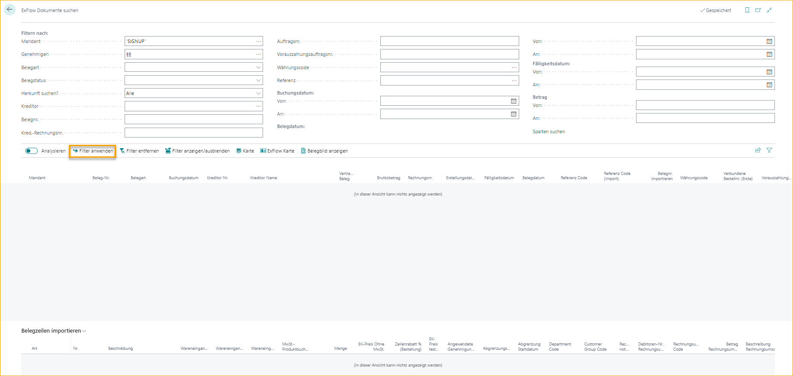
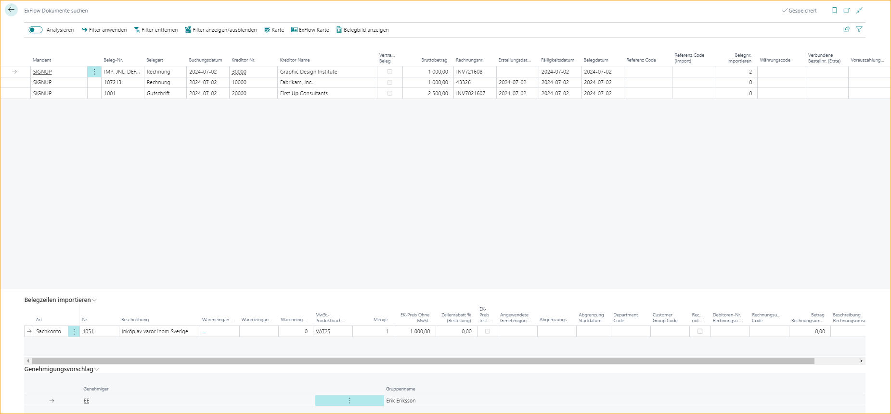
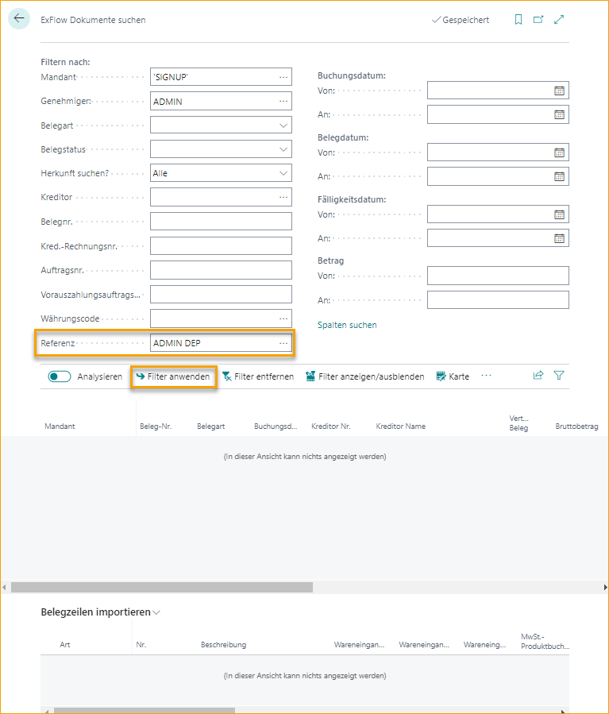
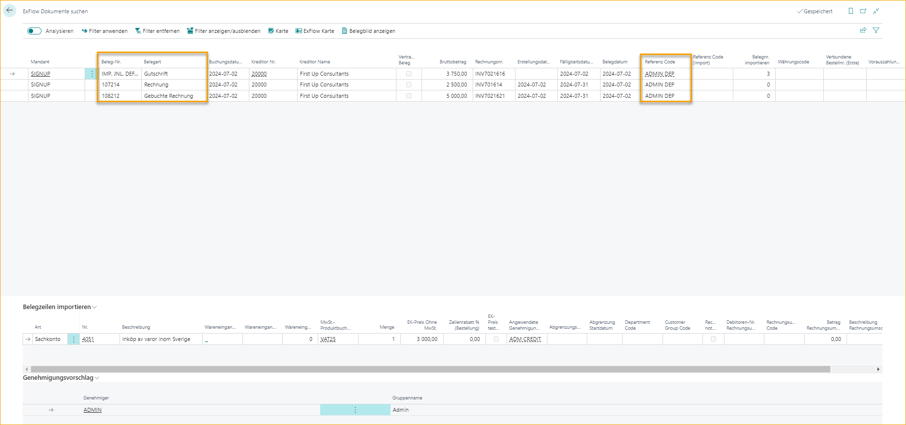
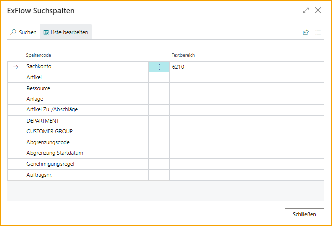
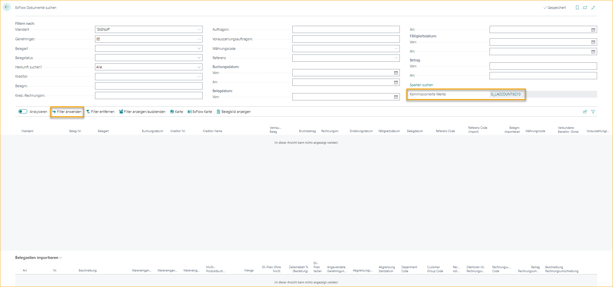
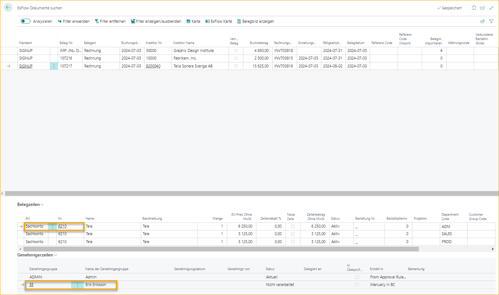
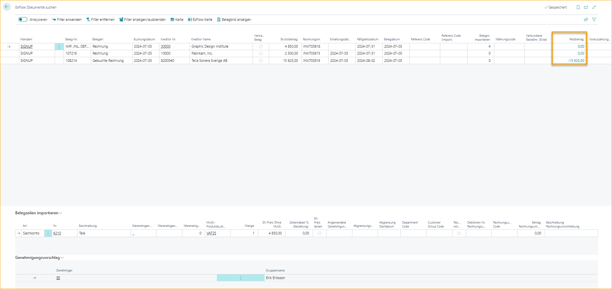

## Dokumente suchen

Gehe zu: ***ExFlow History --> ExFlow Dokumente suchen***

ExFlow Search kann verwendet werden, um Dokumente nach verschiedenen Kriterien zu durchsuchen. Durch die Auswahl verschiedener Filter können sowohl gebuchte als auch aktive Dokumente gefunden werden. Das Standardunternehmen wird das aktuelle "Unternehmen" sein. Es ist auch möglich, Filter für mehrere Unternehmen festzulegen.

Um suchen zu können, wenden Sie mindestens zwei Filter an. Wenn der erforderliche Filter eingegeben ist, drücken Sie "Filter anwenden", um das Ergebnis anzuzeigen.

Das Ergebnis zeigt alle Dokumente mit dem Genehmiger EE:

Verwenden Sie "Filter entfernen", um die Seite zu löschen, oder "Filter ein-/ausblenden", um einen anderen Filter anzuwenden.

Öffnen Sie die Karte oder die ExFlow-Karte, um weitere Details zum Dokument zu sehen. Klicken Sie auf "Dokumentbild anzeigen", um das Dokumentbild anzuzeigen.

Es besteht auch die Möglichkeit, nach einem ExFlow-Referenzcode in ExFlow Search Documents zu suchen. Geben Sie den Referenzcode in das Feld "Referenz" ein und klicken Sie dann auf "Filter anwenden", um das Suchergebnis anzuzeigen.

Die Ergebnisliste zeigt alle Dokumente mit der verbundenen Referenz an allen Stellen wie Import Journal, Genehmigungsstatus und gebuchte Dokumente im Genehmigungsstatusverlauf.

Lesen Sie mehr im Abschnitt [***Referenzcodes***](https://docs.signupsoftware.com/business-central/docs/user-manual/business-functionality/reference-codes#reference-codes), um mehr darüber zu erfahren, wie Sie ExFlow-Referenzen erstellen und verwenden.

### Option "Suchspalten"

Drücken Sie Suchspalten, um weitere Suchwerte für Dokumentzeilen hinzuzufügen.

Der ausgewählte Filter ist auf G/L-Konto 6210 und Genehmiger EE gesetzt:

Das Ergebnis zeigt alle Dokumente mit dieser Kombination im gewählten Unternehmen.

### Verbleibenden Betrag in ExFlow Search Documents anzeigen

Wenn die Suchergebnisse gefiltert sind, ist es auch möglich zu sehen, ob die gebuchten Dokumente bezahlt sind oder nicht. Dies kann durch Hinzufügen der Spalte "Verbleibender Betrag" über "Personalisieren" zu den herausgefilterten Ergebnissen erfolgen.  
Lesen Sie mehr darüber im Abschnitt [***ExFlow Genehmigungsstatusverlauf***](https://docs.signupsoftware.com/business-central/docs/user-manual/approval-workflow/document-history#approval-status-history)

