## Vorläufige Buchung

Verwenden Sie ExFlow Vorläufige Buchung, um Kosten und Mehrwertsteuer beim Empfang und Erstellen von Dokumenten zu buchen. Buchen Sie Ihre Kosten und Mehrwertsteuer direkt, um Finanz- und Steuerberichte mit minimalem Aufwand zu erstellen.

Gebuchte Kreditorenposten werden je nach Einrichtung auf einem regulären oder separaten Bilanzkonto erstellt und in den Cashflow einbezogen.

Wählen Sie das Sachkonto pro Zeilentyp und Buchungsgruppen oder ein Zwischenkonto. Jobposten und Abgrenzungen sind ebenfalls enthalten.

Sobald das Dokument vollständig genehmigt und gebucht ist, wird die vorläufige Buchung automatisch storniert.

Die vorläufige Buchung ist nur für Rechnungen und Gutschriften verfügbar, die für die ExFlow-Genehmigung aktiviert sind.

### ExFlow Einrichtung
Um vorläufige Buchungen durchführen zu können, müssen folgende Journale eingerichtet und die Eingangsregistrierung (SweBase) deaktiviert werden.

| ExFlow Einrichtung - Vorläufige Buchung  |	|
|:-|:-|
| **Vorläufige Buchung:**          | Wenn die untenstehende Einrichtung abgeschlossen ist, aktivieren Sie die vorläufige Buchung
|**Quellcode:**                   | Verwenden Sie einen bestehenden oder erstellen Sie einen neuen, um die Nachverfolgung zu erleichtern
| **Allgemeines Journalvorlage:**     | Verwenden Sie eine bestehende oder erstellen Sie eine neue
| **Allgemeines Journalbatch:**        | Verwenden Sie einen bestehenden oder erstellen Sie einen neuen
| **In Wartestellung:**                      | 1-3 Buchstaben, die in Kreditorenposten hinzugefügt werden, um Zahlungen auf vorläufig gebuchte Dokumente zu vermeiden, die noch nicht genehmigt sind. Der Standardwert beim Ausführen des ExFlow-Assistenten ist **EXF**, kann jedoch bei Bedarf geändert werden.
| **Rechnungsrundung:**             | Wenn SweBase (für schwedische Kunden) installiert ist, ist die Rechnungsrundung sichtbar und wird nur für die vorläufige Buchung verwendet.  Wenn SweBase nicht installiert ist, wird es unter Dokumentenbuchungsprüfungen sichtbar und sowohl für die vorläufige Buchung als auch für die Buchung verwendet. Die Rechnungsrundung ist nicht erforderlich.   Weitere Informationen finden Sie im Abschnitt [***Rechnungsrundung unten***](https://docs.exflow.cloud/business-central/docs/user-manual/approval-workflow/exflow-approval-status#invoice-rounding)
| **Buchungsbeschreibung:**          | Beschreibung bei der Buchung   Der Standardwert beim Ausführen des ExFlow-Assistenten ist **Vorläufig gebucht**, kann jedoch bei Bedarf geändert werden
| **Stornobeschreibung:**          | Beschreibung bei der Stornierung.    Der Standardwert beim Ausführen des ExFlow-Assistenten ist **Vorläufig storniert**, kann jedoch bei Bedarf geändert werden
| **Mehrwertsteuer-Produktbuchungsgruppe 0%:**   | Fügen Sie eine Mehrwertsteuer-Produktbuchungsgruppe mit 0% hinzu, um ohne Mehrwertsteuer vorläufig zu buchen, anstatt die Mehrwertsteuer-Produktbuchungsgruppe, die in der Dokumentenzeile hinzugefügt wurde. Diese Buchung wird storniert und die Mehrwertsteuerbuchung wird nur bei der endgültigen Buchung mit der zur Rechnung hinzugefügten Mehrwertsteuer-Produktbuchungsgruppe gebucht.

### Vorläufige Buchungseinrichtung
Gehen Sie zu: ***ExFlow Einrichtung --> Verwandt --> Erweitert --> Vorläufige Buchungseinrichtung***  
Diese Seite wird automatisch geöffnet, wenn die vorläufige Buchung aktiviert wird.

#### Wählen Sie die Buchungsoption pro Zeilentyp

| ExFlow Vorläufige Buchungseinrichtung   |	|
|:-|:-|
| **Zwischenkonto:**      | Die Buchung erfolgt gemäß den Buchungsgruppen in der allgemeinen Buchungseinrichtung und dem *ExFlow Vorläufige Buchung Zwischenkonto*
| **Einkaufskonto:**     | Dokumentenzeilen mit dem Zeilentyp Sachkonto werden auf dem aktuellen Sachkonto der Dokumentenzeile gebucht.  Für Artikel, Ressourcen, Anlagegüter und Kosten (Artikel) erfolgt die Buchung gemäß den Buchungsgruppen in der allgemeinen Buchungseinrichtung. *Einkaufskonto* für Rechnungen und *Einkaufsgutschriftkonto* für Gutschriften

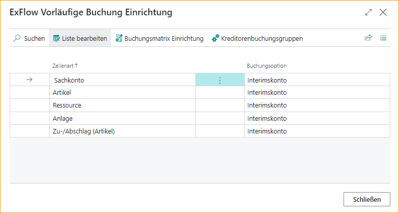

Alle für die vorläufige Buchung erforderlichen Einrichtungen, allgemeine Buchungseinrichtung und Kreditorenbuchungseinrichtung können von der ExFlow Vorläufige Buchungseinrichtung aus erreicht werden. Lesen Sie unten mehr.

Nach dem Schließen der Seite Vorläufige Buchung erhalten Sie eine Frage, ob es Rechnungen oder Gutschriften im Genehmigungsstatus gibt.

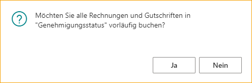

Wenn Sie sich entscheiden, alle Dokumente im Genehmigungsstatus vorläufig zu buchen, können Fehlermeldungen auftreten. Gehen Sie zum Genehmigungsstatus und korrigieren Sie den Fehler und buchen Sie das Dokument manuell vorläufig.

Lesen Sie mehr im Abschnitt [***Genehmigungsstatus***](https://docs.exflow.cloud/business-central/docs/user-manual/business-functionality/preliminary-posting#approval-status)

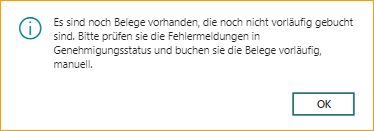

#### Allgemeine Buchungseinrichtung

Es gibt eine Verknüpfung von der vorläufigen Einrichtung.

Sachkonten, die für Artikel, Ressourcen, Anlagegüter und Kostenartikel verwendet werden, wenn **Einkaufskonto** in der Buchungsoption ausgewählt ist.

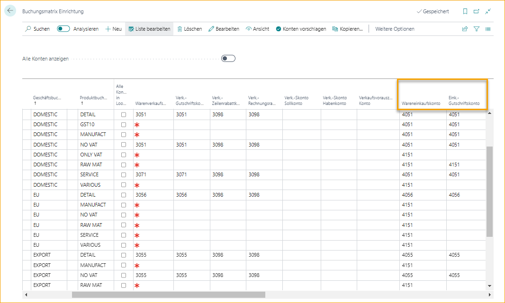

Sachkonten, die verwendet werden, wenn **Zwischenkonto** in der Buchungsoption ausgewählt ist.

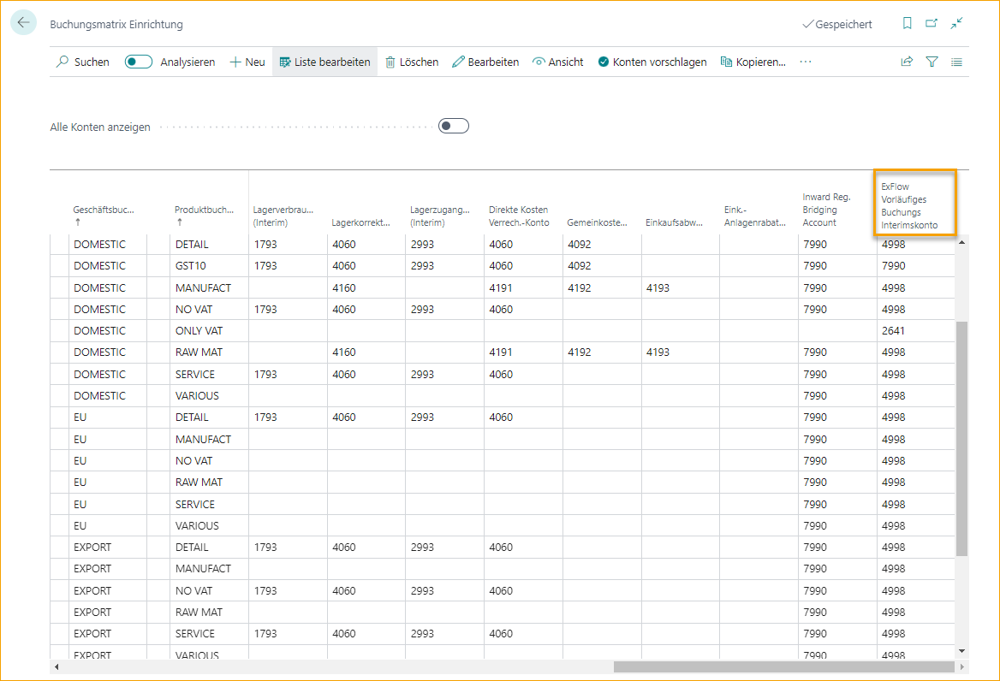

#### Kreditorenbuchungsgruppen

Es gibt eine Verknüpfung von der vorläufigen Einrichtung.

Es ist möglich, vorläufig auf ein separates Verbindlichkeitskonto zu buchen.

Fügen Sie eine neue Kreditorenbuchungsgruppe hinzu, eine oder mehrere, und fügen Sie sie in das Feld ExFlow Vorläufige Kreditorenbuchungsgruppe in bestehenden Gruppen ein.  
Wenn die Kreditorenbuchungsgruppe als ExFlow Vorläufige Buchungsgruppe verwendet wird, kann sie nicht anderswo verwendet werden.

Um die Standardeinstellung zu verwenden, lassen Sie das Feld ExFlow Vorläufige Kreditorenbuchungsgruppe leer.

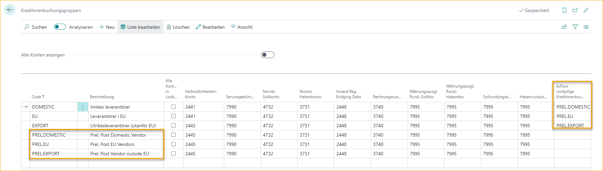

### Funktionen, die in der vorläufigen Buchung enthalten sind

#### Sachkonten

Die vorläufige Buchung erfolgt gemäß der Einrichtung in der vorläufigen Buchungseinrichtung.

#### Buchungsdaten

Dokumentenbuchungsdatum und Mehrwertsteuerdatum bei der Erstellung des Dokuments.

#### Nummernserie

Buchungsnummern entsprechen den Buchungsrechnungsnummern oder Buchungsgutschriftnummern auf dem Dokument.

#### Buchungsprüfungen

Es gibt eine Kontrolle für Dokumentenerstellungsprüfungen und Verschiebung der Abgrenzung.

Aber auch folgende Kontrolle aus den Dokumentenbuchungsprüfungen in der ExFlow Einrichtung:

ExFlow Einrichtung - Dokumentenbuchungsprüfungen:

- Vordefiniertes Konto nicht buchen  
- Bruttobetrag prüfen  
- Max. Differenz für Bruttobetrag (LCY)

#### Buchungseinträge, die in der vorläufigen Buchung enthalten sind

Einträge, die in der vorläufigen Buchung enthalten sind:

- Sachkonto Eintrag  
- Mehrwertsteuer Eintrag  
- Kreditorenposten  
- Detail Kreditorenposten  
- Jobposten  
- Sachkonto Register

#### Buchungseinträge, die nicht enthalten sind

Einträge, die in der vorläufigen Buchung nicht enthalten sind:

- Gebuchte Einkaufsrechnung/Gutschrift 
- Artikelposten  
- Wertposten (Artikel)  
- Ressourcenposten  
- Anlagegüterposten

### Funktionen beim Rückgängigmachen der vorläufigen Buchung

Das Rückgängigmachen erfolgt, wenn das Dokument genehmigt, überprüft und endgültig gebucht oder gelöscht wurde. Das Rückgängigmachen wird wie oben beschrieben gebucht, jedoch mit folgenden Unterschieden:

#### Buchungsdatum und Mehrwertsteuerdatum des Dokuments

Das Rückgängigmachen wird zu den aktuellen Buchungsdaten des Dokuments gebucht. Daher kann das Rückgängigmachen auch nach dem Schließen des Zeitraums erfolgen.

#### Abgrenzungen

Wenn das zulässige Abgrenzungsbuchungsdatum geschlossen ist, wird das Rückgängigmachen der Abgrenzungen am ersten zulässigen Abgrenzungsbuchungsdatum gebucht. Daher kann das Rückgängigmachen der Abgrenzungen auch nach dem Schließen des Zeitraums erfolgen.

### Vorläufiger Buchungsworkflow

#### Importjournal

Vor der Erstellung des Dokuments kann die vorläufige Buchung in der Vorschau angezeigt werden.

Erstellen Sie das Dokument aus dem Importjournal zur vorläufigen Buchung.

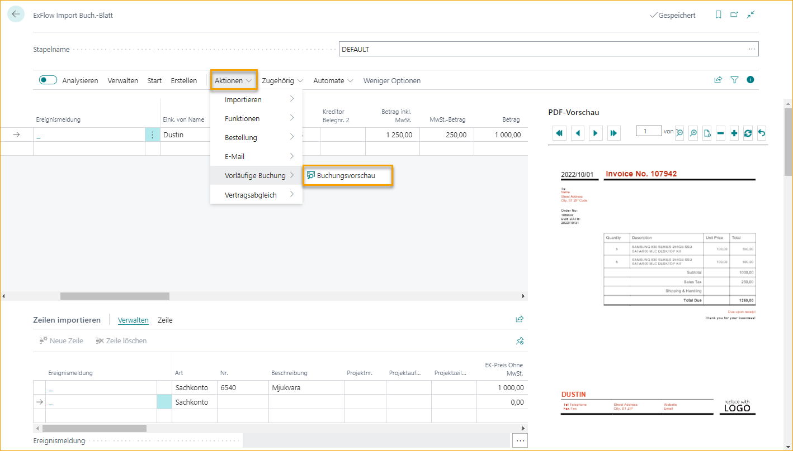

#### Genehmigungsstatus

Im Genehmigungsstatus ist ersichtlich, ob das Dokument vorläufig gebucht wurde oder nicht.

Um die Funktionen zu erreichen  
Gehen Sie zu: ***ExFlow Genehmigungsstatus --> Aktionen --> Vorläufige Buchung***

| Genehmigungsstatus - Vorläufige Buchung     |	|
|:-|:-|
| **Buchen:**             | Buchung kann nur einmal erfolgen
| **Buchungsvorschau:**  | Vorschau der Buchung vor dem Buchen
| **Rückgängig machen:**  | Um die Buchung zu korrigieren, rückgängig machen, das Dokument korrigieren und erneut buchen
| **Einträge finden:**     | Einträge für vorläufig gebuchte Dokumente finden

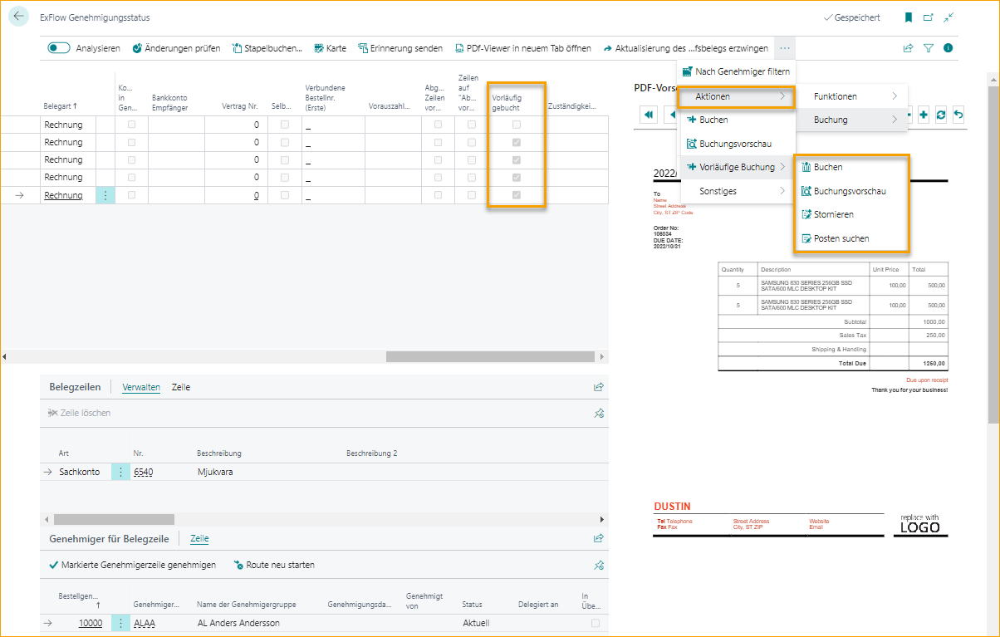

#### Rechnungs- und Gutschriftenkarte

Um ein Dokument vorläufig buchen zu können, muss es für die ExFlow-Genehmigung aktiviert sein.

Wenn die ExFlow-Genehmigung deaktiviert ist, wird die vorläufige Buchung rückgängig gemacht. Und wenn sie aktiviert wird, wird die Rechnung/Gutschrift gebucht.

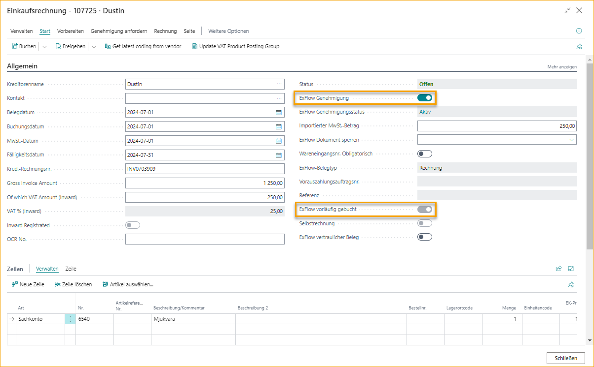

Alle Funktionen im Genehmigungsstatus sind auch von der Karte aus verfügbar.  
Gehen Sie zu: ***Aktionen --> Vorläufige Buchung***

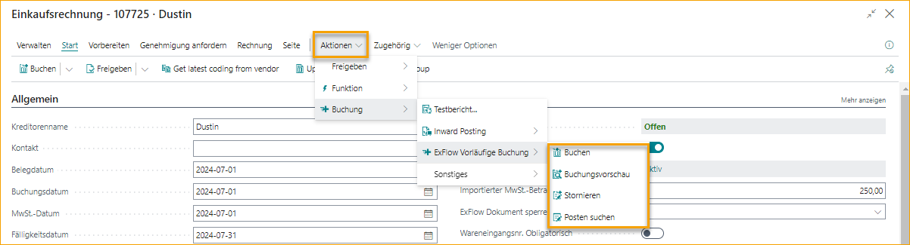

#### Korrekturen

Wenn die Buchung korrigiert werden muss, rückgängig machen, das Dokument korrigieren und eine neue vorläufige Buchung durchführen. Alle Buchungen und Rückgängigmachungen verwenden das aktuelle Buchungsdatum und Mehrwertsteuerdatum.

#### Genehmigungsverlauf

Alle Buchungen finden Sie unter Einträge finden. Löschen Sie den Filter auf Datum, um alle anzuzeigen.

#### Dokument löschen

Beim Löschen eines vorläufig gebuchten Dokuments wird die Rückgängigmachung zum aktuellen Buchungsdatum und Mehrwertsteuerdatum durchgeführt.

#### ExFlow gelöschte Dokumente

Beim Löschen eines Dokuments oder Deaktivieren für die ExFlow-Genehmigung wird eine Kopie des Dokuments in den ExFlow gelöschten Dokumenten gespeichert.

Um vorläufig gebuchte Einträge zu finden  
Gehen Sie zu: ***Verwandt --> Vorläufige Buchung --> Einträge finden***

Löschen Sie den Filter auf Datum, um alle anzuzeigen.

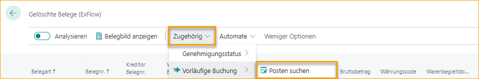

#### Kreditorenposten

Beim Buchen oder Rückgängigmachen einer vorläufigen Buchung wird ein Kreditorenposten gebucht und auch im Cashflow berücksichtigt.

Die Buchungsbeschreibung wird aus der ExFlow-Einrichtung hinzugefügt.

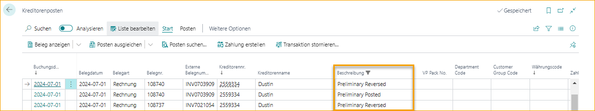

ExFlow vorläufig gebucht wird angekreuzt und On Hold wird aus der ExFlow-Einrichtung hinzugefügt und kann nach der Buchung nicht mehr geändert werden.

Vorläufig gebuchte Kreditorenposten können nicht verwendet werden, um Einträge aus Kreditorenposten oder Zahlungstagebüchern anzuwenden.

Es gibt einen Schnellfilter, um vorläufig gebuchte Einträge zu sortieren oder auszuschließen. 
Gehen Sie zu: ***Verwandt --> ExFlow vorläufiger Buchungsfilter***

Vorläufige Buchungsfilter:
- **Nur vorläufig gebuchte/rückgängig gemachte anzeigen**  
- **Vorläufig gebuchte/rückgängig gemachte ausschließen**  
- **Alle anzeigen**  

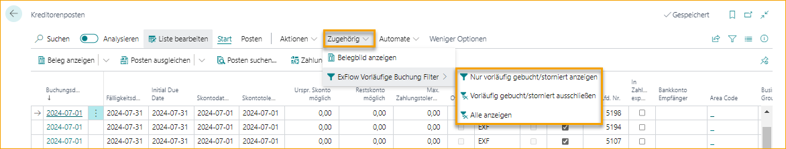

#### Endgültige Buchung

Nachdem das Dokument genehmigt und überprüft wurde, buchen Sie das Dokument wie gewohnt und die vorläufige Buchung wird zum aktuellen Buchungsdatum des Dokuments rückgängig gemacht.

Der Kreditorenposten für die Rückgängigmachung wird auf das vorläufig gebuchte Dokument angewendet und der verbleibende Betrag auf null gesetzt.

#### Genehmigungsstatusbericht

Der Genehmigungsstatusbericht kann weiterhin beim monatlichen Abschluss verwendet werden.

Für die vorläufige Buchung verwenden Sie die Buchungsoption, Interimskonto, in der vorläufigen Buchungseinrichtung und dasselbe Sachkonto für alle Buchungen in der allgemeinen Buchungseinrichtung in ExFlow vorläufige Buchung Interim.

Beim Erstellen des Berichts und der Sachposten wird die vorläufige Buchung durch Verwendung desselben Sachkontos für das Ausgleichskonto rückgängig gemacht.

Zeilen aus ExFlow-Dokumentzeilen abrufen und alle Dokumente werden mit der neuesten Kodierung gebucht, auch wenn sie nicht vollständig genehmigt sind.

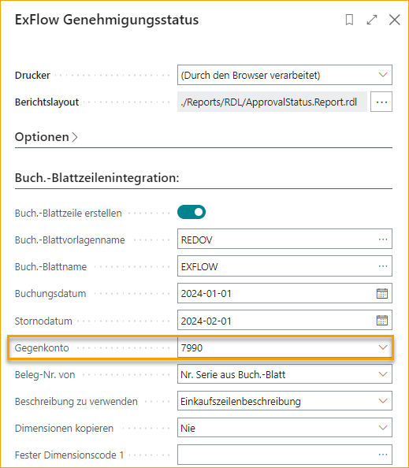

Weitere Informationen zum Genehmigungsstatusbericht finden Sie in den Abschnitten **Berichte** und **Genehmigungsstatusbericht**.

#### ExFlow vorläufige Verbindlichkeiten

Dieser Bericht basiert auf dem Standardbericht von Business Central mit der Option, nach vorläufig gebuchten ExFlow-Dokumenten zu filtern.

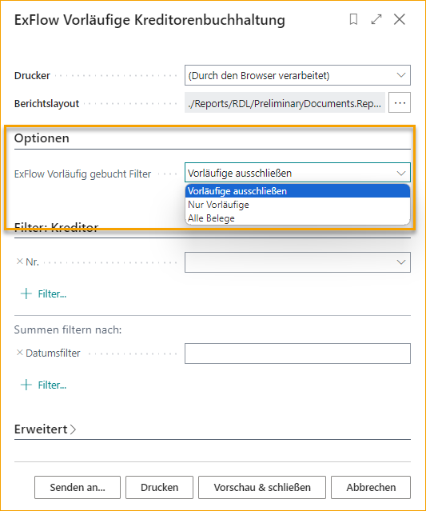

#### ExFlow überfällige Verbindlichkeiten

Dieser Bericht basiert auf dem Standardbericht von Business Central mit der Option, nach vorläufig gebuchten ExFlow-Dokumenten zu filtern.

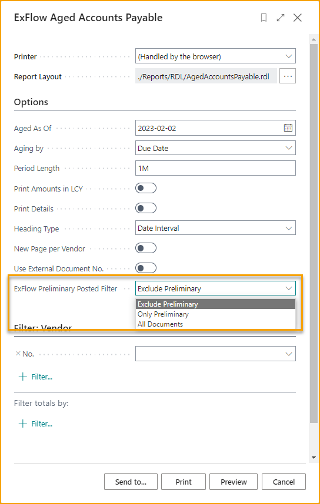

