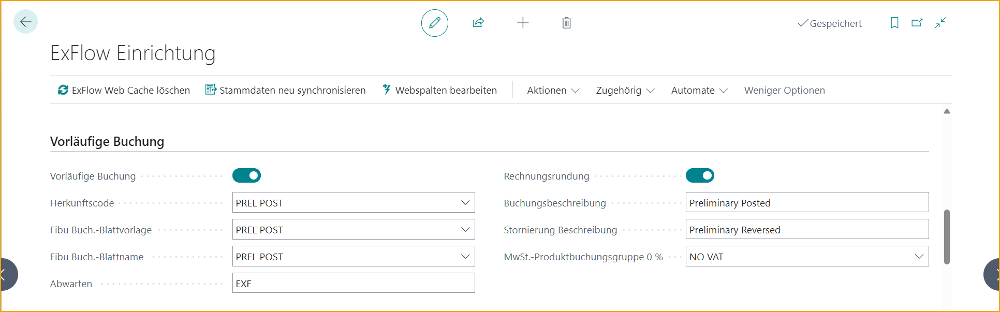
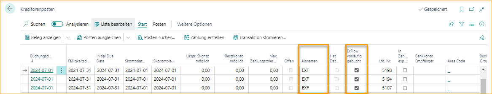

## Vorläufige Buchung

Verwenden Sie ExFlow Vorläufige Buchung, um Kosten und Mehrwertsteuer bei Empfang und Erstellung von Dokumenten zu buchen. Buchen Sie Ihre Kosten und Mehrwertsteuer direkt, um Finanz- und Steuerberichte mit minimalem Aufwand zu erstellen.

Gebuchte Lieferantenkonten werden auf einem regulären Ausgleichskonto oder einem separaten Ausgleichskonto gemäß Ihrer Konfiguration erstellt und in den Cashflow einbezogen.

Wählen Sie ein G/L-Konto pro Zeilentyp und Buchungsgruppen oder ein Zwischenkonto aus. Job Ledger Entries und Deferrals sind ebenfalls enthalten.

Sobald das Dokument vollständig genehmigt und gebucht ist, wird die vorläufige Buchung automatisch storniert.

Vorläufige Buchung ist nur für Rechnungen und Gutschriften verfügbar, die für die ExFlow-Genehmigung aktiviert sind.

### ExFlow-Konfiguration
Um vorläufige Buchungen durchführen zu können, benötigt ExFlow folgende Journale, und die Eingangsregistrierung (Swebase) muss deaktiviert sein.

| ExFlow-Konfiguration - Vorläufige Buchung  |	|
|:-|:-|
|**Quellcode:**                   | Verwenden Sie vorhandenen oder erstellen Sie einen neuen, um die Verfolgung zu erleichtern
| **Allgemeine Journalvorlage:**     | Verwenden Sie vorhandene oder erstellen Sie eine neue
| **Allgemeine Journalbatch:**        | Verwenden Sie vorhandene oder erstellen Sie eine neue
| **In Bearbeitung:**                      | 1-3 Buchstaben, die den Lieferantenkonten hinzugefügt werden, um Zahlungen für vorläufig gebuchte Dokumente zu vermeiden, die noch nicht genehmigt wurden. Standardwert beim Ausführen des ExFlow-Assistenten ist **EXF**, kann aber bei Bedarf geändert werden.
| **Rechnungsrundung:**             | Wenn Swebase (für schwedische Kunden) installiert ist, ist die Rechnungsrundung sichtbar und wird nur für vorläufige Buchungen verwendet.  Wenn Swebase nicht installiert ist, ist sie unter Dokumentbuchungsprüfungen sichtbar und wird sowohl für vorläufige Buchungen als auch für Buchungen verwendet. Die Rechnungsrundung ist nicht erforderlich.   Weitere Informationen finden Sie im Abschnitt [***Rechnungsrundung unten***](https://docs.exflow.cloud/business-central/docs/user-manual/approval-workflow/exflow-approval-status#invoice-rounding)
| **Buchungsbeschreibung:**          | Beschreibung bei Buchung   Standardwert beim Ausführen des ExFlow-Assistenten ist **Vorläufig gebucht**, kann aber bei Bedarf geändert werden
| **Stornobeschreibung:**          | Beschreibung bei Stornierung.    Standardwert beim Ausführen des ExFlow-Assistenten ist **Vorläufig storniert**, kann aber bei Bedarf geändert werden
| **Vorläufige Buchung:**          | Wenn die oben genannte Konfiguration abgeschlossen ist, aktivieren Sie die vorläufige Buchung

### Vorläufige Buchungskonfiguration
Gehe zu: ***ExFlow-Konfiguration --> Verwandt --> Erweitert --> Vorläufige Buchungskonfiguration***  
Diese Seite wird automatisch geöffnet, wenn die vorläufige Buchung aktiviert wird.

#### Wählen Sie die Buchungsoption pro Zeilentyp aus

| ExFlow Vorläufige Buchungskonfiguration   |	|
|:-|:-|
| **Zwischenkonto:**      | Die Buchung erfolgt gemäß den Buchungsgruppen in der allgemeinen Buchungskonfiguration und dem *ExFlow Vorläufige Buchung Zwischenkonto*
| **Kaufkonto:**     | Dokumentzeilen mit Zeilentyp G/L-Konto, die Buchung erfolgt auf dem aktuellen G/L-Konto in der Dokumentzeile    Für Artikel, Ressourcen, Sachanlagen und Gebühren (Artikel) erfolgt die Buchung gemäß den Buchungsgruppen in der allgemeinen Buchungskonfiguration. *Kaufkonto* für Rechnungen und *Kaufgutschriftskonto* für Gutschriften

Alle für die vorläufige Buchung erforderlichen Konfigurationen, die allgemeine Buchungskonfiguration und die Lieferantenbuchungskonfiguration, können über die vorläufige Buchungskonfiguration von ExFlow erreicht werden. Lesen Sie unten mehr.

Nach dem Schließen der Seite Vorläufige Buchung erhalten Sie eine Frage, ob sich Rechnungen oder Gutschriften im Genehmigungsstatus befinden.

Wenn Sie sich dafür entscheiden, alle Dokumente im Genehmigungsstatus vorläufig zu buchen, können Fehlermeldungen auftreten. Gehen Sie zum Genehmigungsstatus und korrigieren Sie den Fehler und buchen Sie vorläufig manuell pro Dokument.

Lesen Sie mehr im Abschnitt [***Genehmigungsstatus***](https://docs.exflow.cloud/business-central/docs/user-manual/business-functionality/preliminary-posting#approval-status)

#### Allgemeine Buchungskonfiguration

Es gibt eine Verknüpfung von der vorläufigen Konfiguration aus.

G/L-Konten, die verwendet werden, wenn **Kaufkonto** in der Buchungsoption ausgewählt ist, für Artikel, Ressourcen, Sachanlagen und Gebührenartikel.

G/L-Konten, die verwendet werden, wenn **Zwischenkonto** in der Buchungsoption ausgewählt ist.

#### Lieferantenbuchungsgruppen

Es gibt eine Verknüpfung von der vorläufigen Konfiguration aus.

Es ist möglich, vorläufig auf ein separates Verbindlichkeitskonto zu buchen.

Fügen Sie eine neue Lieferantenbuchungsgruppe hinzu, eine oder mehrere, und fügen Sie sie in vorhandene Gruppen im Feld ExFlow Vorläufige Lieferantenbuchungsgruppe hinzu.  
Wenn die Lieferantenbuchungsgruppe als ExFlow Vorläufige Buchungsgruppe verwendet wird, kann sie an keiner anderen Stelle verwendet werden.

Um die Standardkonfiguration zu verwenden, lassen Sie das Feld ExFlow Vorläufige Lieferantenbuchungsgruppe leer.

### Funktionen in der vorläufigen Buchung enthalten

#### G/L-Konten

Die vorläufige Buchung erfolgt gemäß der Konfiguration in der vorläufigen Buchungskonfiguration.

#### Buchungsdaten

Buchungsdatum des Dokuments und Mehrwertsteuerdatum bei Erstellung des Dokuments.

#### Nummernserie

Buchungsnummern, die den Buchungsrechnungsnummern oder Buchungsgutschriftsnummern auf dem Dokument entsprechen.

#### Buchungsprüfungen

Es wird eine Kontrolle für Dokumenterstellung und Deferral Forward durchgeführt.

Aber auch folgende Kontrolle aus den Dokumentbuchungsprüfungen in der ExFlow-Konfiguration:

ExFlow-Konfiguration - Dokumentbuchungsprüfungen:

- Nicht vordefiniertes Konto buchen  
- Bruttobetrag überprüfen  
- Max. Differenz für Bruttobetrag (LCY) 

#### Buchungseinträge in der vorläufigen Buchung enthalten

Einträge in der vorläufigen Buchung enthalten:
- G/L Eintrag  
- USt-Eintrag  
- Lieferantenkontenbuchung  
- Detail-Lieferantenkontenbuchung  
- Jobkontenbuchung  
- G/L Register 

#### Buchungssätze nicht enthalten

Nicht enthaltene Buchungssätze bei vorläufiger Buchung:

- Gebuchte Eingangsrechnung/Gutschrift 
- Artikelkontenbuchungen  
- Wertbuchung (Artikel)  
- Ressourcenkontenbuchung  
- Anlagenbuchhaltungskontenbuchung

### Funktionen bei der Umkehrung der vorläufigen Buchung

Die Umkehrung erfolgt, wenn das Dokument genehmigt, überprüft und endgültig gebucht oder gelöscht wurde. Die Umkehrung wird wie folgt gebucht, jedoch mit folgenden Unterschieden:

#### Buchungsdatum und USt-Datum des Dokuments

Die Umkehrung wird zu den aktuellen Buchungsdaten des Dokuments gebucht. Daher kann die Umkehrung auch nach dem Abschlusszeitraum durchgeführt werden.

#### Abgrenzungen

Wenn das Buchungsdatum für Abgrenzungen geschlossen ist, wird die Umkehrung der Abgrenzungen zum ersten zulässigen Buchungsdatum für Abgrenzungen gebucht. Daher kann die Umkehrung der Abgrenzungen auch nach dem Abschlusszeitraum durchgeführt werden.

### Ablauf der vorläufigen Buchung

#### Importjournal

Vor Erstellung des Dokuments kann die vorläufige Buchung angezeigt werden.

Erstellen Sie das Dokument aus dem Importjournal zur vorläufigen Buchung.

#### Genehmigungsstatus

Im Genehmigungsstatus kann überprüft werden, ob das Dokument vorläufig gebucht wurde oder nicht.

Um zu den Funktionen zu gelangen  
Gehe zu: ***ExFlow Genehmigungsstatus --> Aktionen --> Vorläufige Buchung***

| Genehmigungsstatus - Vorläufige Buchung     |	|
|:-|:-|
| **Buchen:**             | Die Buchung kann nur einmal durchgeführt werden
| **Buchungsvorschau:**  | Buchung vor der Buchungsvorschau anzeigen
| **Umkehren:**          | Zur Korrektur der Buchung umkehren, das Dokument korrigieren und erneut buchen
| **Bucheinträge suchen:**     | Buchungseinträge für vorläufig gebuchte Dokumente suchen

#### Rechnungs- und Gutschriftkarten

Um ein Dokument vorläufig zu buchen, muss es für die ExFlow-Genehmigung aktiviert sein.

Wenn die ExFlow-Genehmigung deaktiviert ist, wird die vorläufige Buchung umgekehrt. Bei Aktivierung wird die Rechnungs-/Gutschriftkarte gebucht.

Alle Funktionen im Genehmigungsstatus sind auch von der Karte aus verfügbar.  
Gehe zu: ***Aktionen --> Vorläufige Buchung***

#### Korrekturen

Wenn die Buchung korrigiert werden muss, umkehren, das Dokument korrigieren und eine neue vorläufige Buchung durchführen. Alle Buchungen und Umkehrungen verwenden das aktuelle Buchungsdatum und USt-Datum.

#### Genehmigungsverlauf

Alle Buchungen können unter "Bucheinträge suchen" gefunden werden. Filter auf Datum löschen, um alle anzuzeigen.

#### Dokument löschen

Beim Löschen eines vorläufig gebuchten Dokuments wird die Umkehrung zum aktuellen Buchungsdatum und USt-Datum durchgeführt.

#### ExFlow gelöschte Dokumente

Beim Löschen eines Dokuments oder bei Deaktivierung für die ExFlow-Genehmigung wird eine Kopie des Dokuments in den ExFlow gelöschte Dokumente gespeichert.

Um vorläufig gebuchte Einträge zu finden  
Gehe zu: ***Verwandt --> Vorläufige Buchung --> Buchungseinträge suchen***

Filter auf Datum löschen, um alle anzuzeigen.

#### Lieferantenkontenbuchungen

Bei Buchung oder Umkehrung einer vorläufigen Buchung wird eine Lieferantenkontenbuchung gebucht und auch in den Cashflow einbezogen.

Die Buchungsbeschreibung wird aus der ExFlow-Konfiguration hinzugefügt.

ExFlow vorläufig gebucht wird angekreuzt und "On Hold" wird aus der ExFlow-Konfiguration hinzugefügt und kann nach der Buchung nicht geändert werden.

Vorläufig gebuchte Lieferantenkontenbuchungen können nicht verwendet werden, um Einträge aus Lieferantenkontenbuchungen oder Zahlungsjournalen anzuwenden.

Es wurde ein Schnellfilter hinzugefügt, um nach vorläufig gebuchten Einträgen zu sortieren oder sie auszuschließen. 
Gehe zu: ***Verwandt --> ExFlow Vorläufige Buchung Filter***

Vorläufige Buchungsfilter:
- **Nur vorläufig gebuchte/umgekehrte anzeigen**  
- **Vorläufig gebuchte/umgekehrte ausschließen**  
- **Alle anzeigen**  

#### Endgültige Buchung

Nachdem das Dokument genehmigt und überprüft wurde, buchen Sie das Dokument wie gewohnt und die vorläufige Buchung wird am aktuellen Buchungsdatum des Dokuments umgekehrt.

Die Lieferantenkontenbuchung für die Umkehrung wird auf das vorläufig gebuchte Dokument angewendet und der verbleibende Betrag auf null gesetzt.

#### Genehmigungsstatusbericht

Der Genehmigungsstatusbericht zum monatlichen Abschluss kann weiterhin verwendet werden.

Für die vorläufige Buchung verwenden Sie die Buchungsoption "Zwischenkonto" in der vorläufigen Buchungskonfiguration und dasselbe G/L-Konto für alle Buchungen in der allgemeinen Buchungskonfiguration in ExFlow Vorläufige Buchung Zwischenkonto.

Beim Erstellen des Berichts und der G/L-Einträge wird die vorläufige Buchung durch Verwendung desselben G/L-Kontos für das Ausgleichskonto umgekehrt.

Rufen Sie Zeilen aus ExFlow-Dokumentzeilen ab und alle Dokumente werden in der neuesten Codierung gebucht, auch wenn sie nicht vollständig genehmigt sind.

Für weitere Informationen zum Genehmigungsstatusbericht lesen Sie mehr unter den Abschnitten **Berichte** und **Genehmigungsstatusbericht**.

#### ExFlow Vorläufige Verbindlichkeiten

Dieser Bericht basiert auf dem Standardbericht von Business Central mit der Option, nach ExFlow vorläufig gebuchten Dokumenten zu filtern.

#### ExFlow Fällige Verbindlichkeiten

Dieser Bericht basiert auf dem Standardbericht von Business Central mit der Option, nach ExFlow vorläufig gebuchten Dokumenten zu filtern.

