## G/L Budget Control

Beim Arbeiten mit dem Hauptbuchbudget in Business Central gibt es standardmäßig nur Werkzeuge, um gebuchte Buchungseinträge mit dem Budget zu vergleichen. Keine vor dem Buchen. 

Mit ExFlow G/L Budget Control können Benutzer das Budget für Einkaufsrechnungen und Gutschriften vor dem Buchen verfolgen. Auch beim Genehmigen auf ExFlow Web.

### ExFlow Budget Control Wizard
So starten Sie Schritt für Schritt mit ExFlow G/L Budget Control. 

Gehen Sie zu: ***Setup --> ExFlow Wizards --> ExFlow Budget Control Wizard***  

#### Berechnung der G/L Budget Control

Wählen Sie die bevorzugte Option zur Berechnung der G/L Budget Control:

1.	**Monatlich** 
Berechnen und vergleichen Sie Buchungen mit dem Budget pro Monat

2.	**Bis zum Buchungsmonat** 
Berechnen und vergleichen Sie G/L-Buchungen mit dem Budget vom Budgetstart bis zum Ende des Dokumentbuchungsmonats

3.	**Gesamt** 
Berechnen und vergleichen Sie G/L-Buchungen mit dem Budget vom Startdatum bis zum Enddatum im Budgetzeitraum

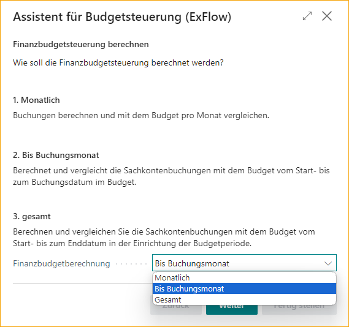  

#### Globale Dimensionen
Wählen Sie globale Dimensionen für die Hauptbuchbudgetkontrolle. Es ist möglich, Dimensionen zu ignorieren oder eine oder beide auszuwählen.

  

#### G/L Budgetperioden
G/L Budgetperioden sind erforderlich, um ExFlow mitzuteilen, mit welchem Budget die Buchungen verglichen werden sollen.
Klicken Sie auf „Budgetperioden hinzufügen“, um den Zeitraum und das Budget auszuwählen.
Fügen Sie Startdatum, Enddatum und Budget hinzu, mit dem verglichen werden soll.

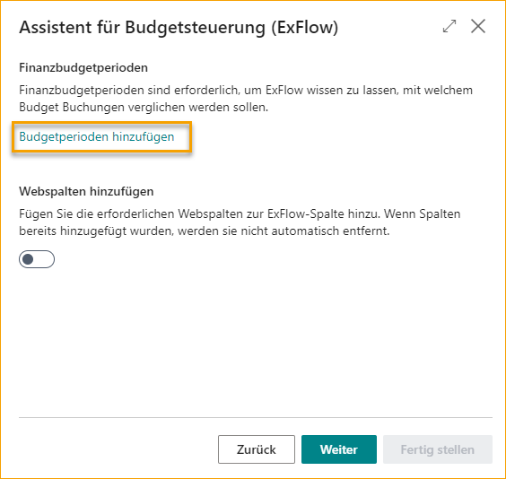

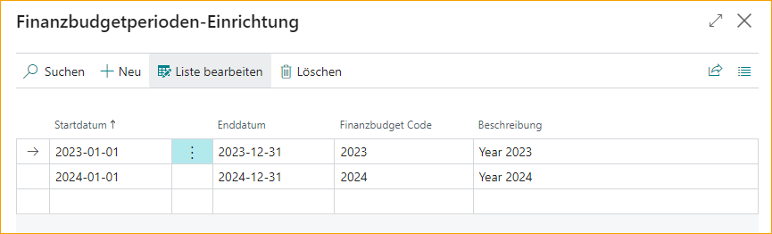  

#### Webspalten hinzufügen
Fügt notwendige Webspalten zu ExFlow Column hinzu. Wenn Spalten hinzugefügt werden, können sie nicht aus dem Budget Control Wizard entfernt werden. 
Um Spalten zu entfernen, gehen Sie zu: ***ExFlow Setup --> Related --> Advanced --> Columns***

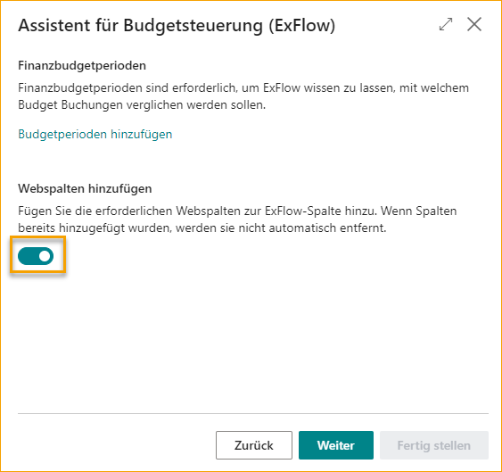  

#### Warnungen
Die Benachrichtigung bei % wird verwendet, um Genehmiger zu warnen, wenn sie kurz davor sind, das Budget zu erreichen. Wenn der Linienbetrag über dem Benachrichtigungsprozentsatz liegt, wird der verwendete Budgetprozentsatz und der verbleibende Budgetbetrag in fettem Text in Business Central angezeigt.

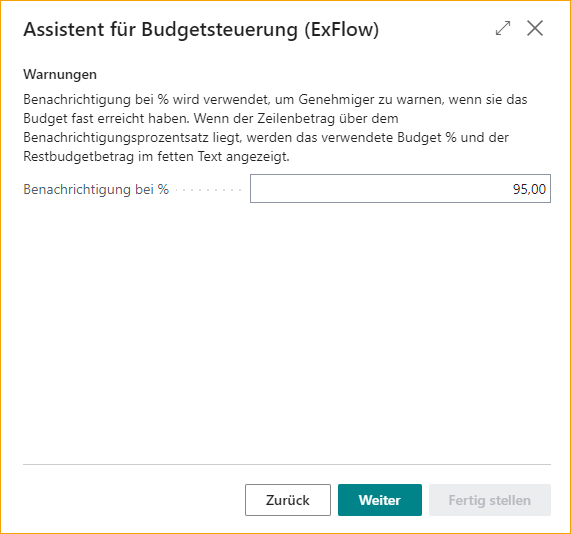  

#### Warnungen im Importjournal
Aktivieren Sie Warnungen im Importjournal, sowohl für die Benachrichtigung bei % als auch für den Betrag über dem Budget. Diese Warnungen können im Importjournal akzeptiert werden, um das Dokument zur Genehmigung zu senden.

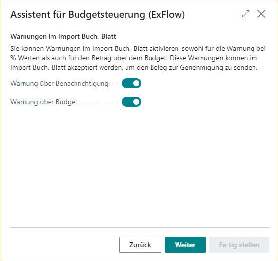  

#### Budgetverantwortlicher
Fügen Sie eine Genehmigungsgruppe für den Budgetverantwortlichen hinzu, um zu genehmigen, wenn das Hauptbuchbudget überschritten wird (über 100%). Der Budgetverantwortliche wird als letzter Genehmiger zum Genehmigungsfluss hinzugefügt. Wenn leer, werden keine Budgetgenehmiger zum Genehmigungsfluss hinzugefügt.  

#### Genehmigungstoleranz
Die Genehmigungstoleranz wird pro Dokumentzeile überprüft.
Halten Sie sowohl den Betrag als auch den Prozentsatz so niedrig wie möglich. Dies liegt daran, dass Betrag und Prozentsatz pro G/L-Konto und Dimensionskombination gelten.

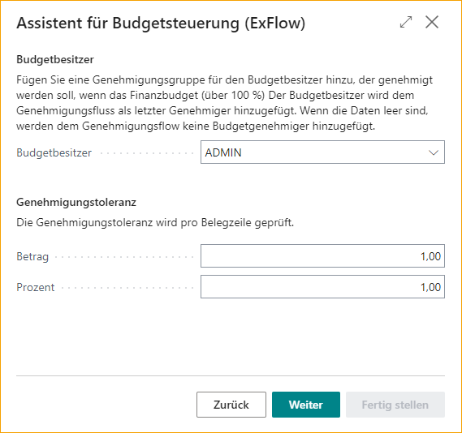  

#### Hintergrundverarbeitung
Aktualisieren Sie ExFlow G/L Budget Totals aus Hauptbucheinträgen, wenn Sie aus dem Genehmigungsstatus buchen oder eine Jobwarteschlange einrichten.

**Mit Jobwarteschlange:** Aktualisieren Sie, indem Sie eine geplante Jobwarteschlange hinzufügen.

**Beim Buchen aus dem Genehmigungsstatus:** Aktualisieren Sie beim Buchen aus dem Genehmigungsstatus.

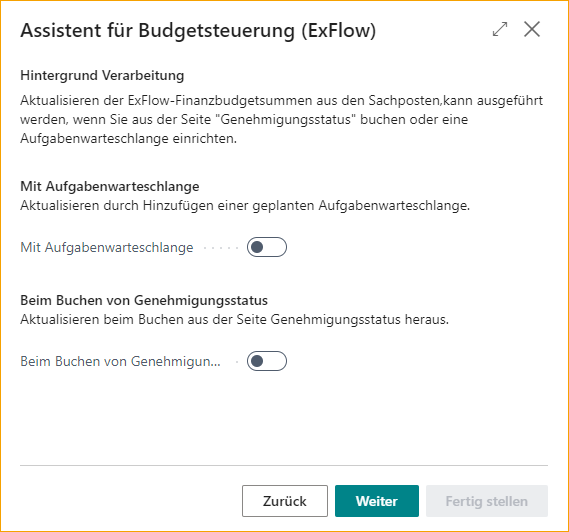  

#### Abschluss und Aktualisierung der Einrichtung
Klicken Sie auf „Fertig stellen“, um den ExFlow Budget Control Wizard zu schließen und die Einstellungen anzuwenden.

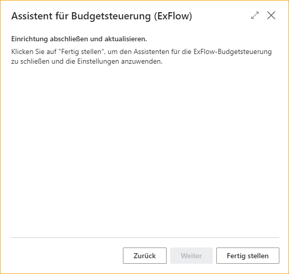

### ExFlow G/L Budget Control Setup
Für die manuelle Einrichtung, Überprüfung oder Aktualisierung der Einrichtung, gehen Sie zu ExFlow G/L Budget Control Setup. 
Gehen Sie zu: ***Setup --> ExFlow Manual Setup --> ExFlow Budget Control Setup***  

#### Allgemein

| Allgemein | |
|:-|:-|
| **Aktiv:**                   | Um ExFlow G/L Budget Control zu aktivieren oder zu deaktivieren.   Um ExFlow-Spalten zu deaktivieren, gehen Sie zu: ***ExFlow Setup --> Related --> Advanced --> Columns***
| **G/L Budgetberechnung:**   | Wählen Sie die bevorzugte Option zur Berechnung der G/L Budget Control:    1.	**Monatlich**  Berechnen und vergleichen Sie Buchungen mit dem Budget pro Monat.    2. **Bis zum Buchungsmonat**  Berechnen und vergleichen Sie G/L-Buchungen mit dem Budget vom Budgetstart bis zum Ende des Dokumentbuchungsmonats.    3. **Gesamt**  Berechnen und vergleichen Sie G/L-Buchungen mit dem Budget vom Startdatum bis zum Enddatum im Budgetzeitraum.  
|**Globale Dimension 1:**        | Wählen Sie globale Dimensionen für die Hauptbuchbudgetkontrolle. Ignorieren Sie Dimensionen oder wählen Sie eine oder beide aus.
| **Globale Dimension 2:**       | Wählen Sie globale Dimensionen für die Hauptbuchbudgetkontrolle. Ignorieren Sie Dimensionen oder wählen Sie eine oder beide aus.

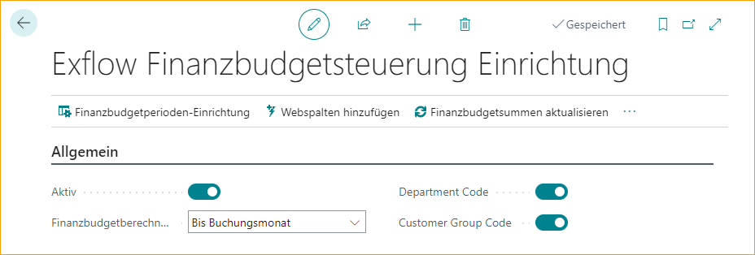  

#### Warnungen
| Warnungen | |
|:-|:-|
| **Benachrichtigung bei %:**            | Um Genehmiger zu warnen, wenn sie kurz davor sind, das Budget zu erreichen. Wenn der Linienbetrag über dem Benachrichtigungsprozentsatz liegt, wird der verwendete Budgetprozentsatz und der verbleibende Budgetbetrag in fettem Text in Business Central angezeigt
| **Warnung über Benachrichtigung:**    | Aktivieren Sie Warnungen im Importjournal für die Benachrichtigung bei %. Warnungen können im Importjournal akzeptiert werden, um das Dokument zur Genehmigung zu senden
| **Warnung über Budget:**          | Aktivieren Sie Warnungen im Importjournal, wenn die Codierung über dem Budget liegt. Warnungen können im Importjournal akzeptiert werden, um das Dokument zur Genehmigung zu senden

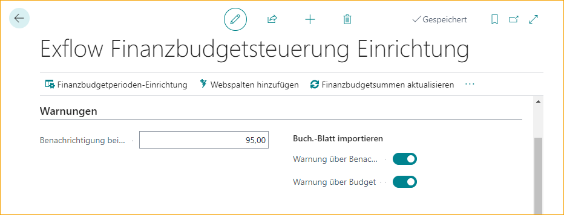  

#### Genehmigung
| Genehmigung | |
|:-|:-|
| **Budgetverantwortlicher:**         | Fügen Sie eine Genehmigungsgruppe für den Budgetverantwortlichen hinzu, um zu genehmigen, wenn das Hauptbuchbudget überschritten wird (über 100%). Der Budgetverantwortliche wird als letzter Genehmiger zum Genehmigungsfluss hinzugefügt. Wenn leer, werden keine Budgetgenehmiger zum Genehmigungsfluss hinzugefügt
| **Genehmigungstoleranz:**   | Die Genehmigungstoleranz wird pro Dokumentzeile überprüft. Halten Sie sowohl den Betrag als auch den Prozentsatz so niedrig wie möglich. Dies liegt daran, dass Betrag und Prozentsatz pro G/L-Konto und Dimensionskombination gelten

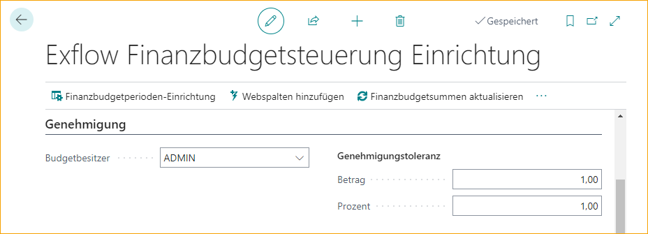  

#### Hintergrundverarbeitung
Aktualisieren Sie die ExFlow G/L Budget Totals aus den General Ledger Entries, indem Sie beim Buchen den Genehmigungsstatus verwenden oder eine Job-Warteschlange einrichten. Die Summen werden verwendet, um alle G/L-Einträge pro Jahr, Monat und globale Dimensionskombination zusammenzufassen.

| Hintergrundverarbeitung | |
|:-|:-|
| **Mit Job-Warteschlange:**                | Aktualisieren durch Hinzufügen einer geplanten Job-Warteschlange
| **Beim Buchen vom Genehmigungsstatus:**   | Aktualisieren beim Buchen vom Genehmigungsstatus

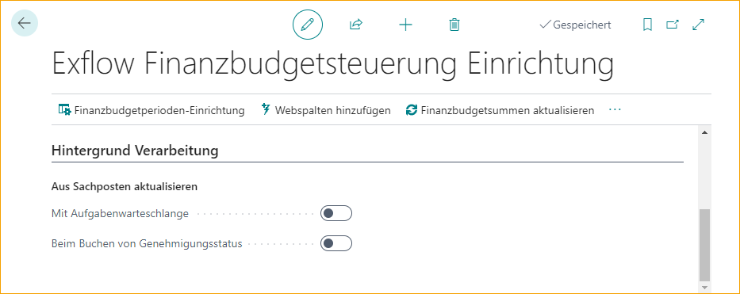  

#### Funktion – G/L Budget Control Setup
G/L Budget Perioden werden benötigt, damit ExFlow weiß, mit welchem Budget die Buchung verglichen werden soll.

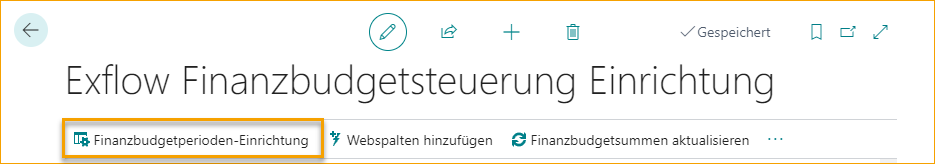

Klicken Sie auf „Neu“ und wählen Sie das Startdatum, Enddatum und den G/L Budget Code aus.

  

#### Funktion - Web-Spalten hinzufügen
Fügt notwendige Web-Spalten zu ExFlow Column hinzu. 
Um ExFlow-Spalten zu deaktivieren, gehen Sie zu: ***ExFlow Setup --> Verwandt --> Erweitert --> Spalten.***

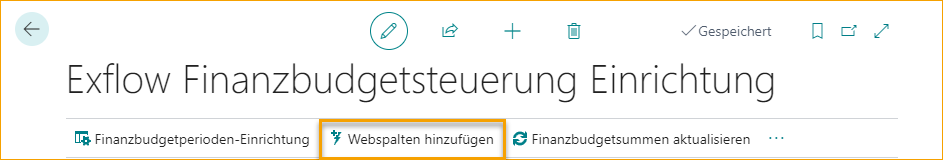

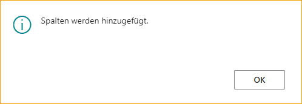  

#### Funktion - G/L Budget Totals aktualisieren
Beim ersten Start mit ExFlow G/L Budget Control oder bei Änderungen der Einrichtung kann es hilfreich sein, die Berechnung für Budget Control zu beschleunigen.

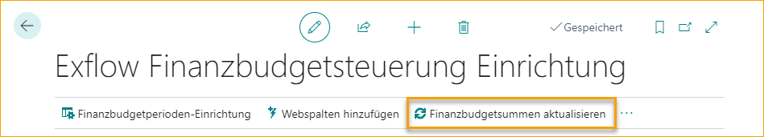

Dies kann durch sofortiges Ausführen des Updates oder zu einem ausgewählten Zeitpunkt und Datum erfolgen.

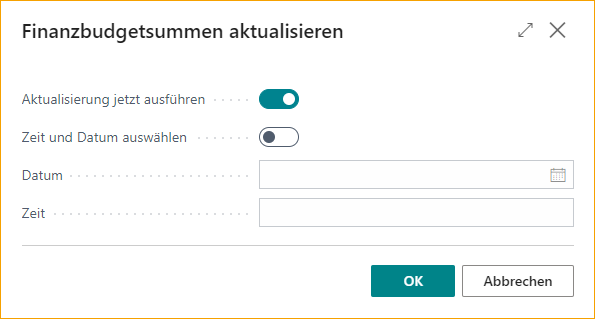

### ExFlow G/L Budget Control Workflow
#### Beginnen Sie mit der Einrichtung
ExFlow G/L Budget Control Setup muss wie oben aktiviert werden.  

#### Berechnungen
Die Berechnung verwendet das Buchungsdatum auf dem Dokument, das im Budget Period Setup für Rechnungen und Gutschriften hinzugefügt wurde.

Dokumente werden aus dem Import Journal, dem Genehmigungsstatus und manuell in Business Central (außerhalb des ExFlow Genehmigungsflusses) erstellt.

Es wird pro Gewinn- und Verlustrechnung G/L-Konto und globale Dimensionskombination im G/L Budget Control Setup durchgeführt. 
Es gibt keine Budgetberechnung für Bilanz G/L-Konten.

Für Artikel, Anlagevermögen, Ressourcen und Gebühren (Artikel) erfolgt die Berechnung aus dem Einkaufs-Konto oder dem Einkaufs-Gutschrift-Konto im General Posting Setup.  

#### Spalten in Zeilen
| Spalten in Zeilen | |
|:-|:-|
| **Verbleibender Betrag:** | Zeigt den verbleibenden Budgetbetrag, der wie oben berechnet wurde
| **Verwendetes Budget %:** | Zeigt den Prozentsatz des verwendeten Budgets, der wie oben berechnet wurde

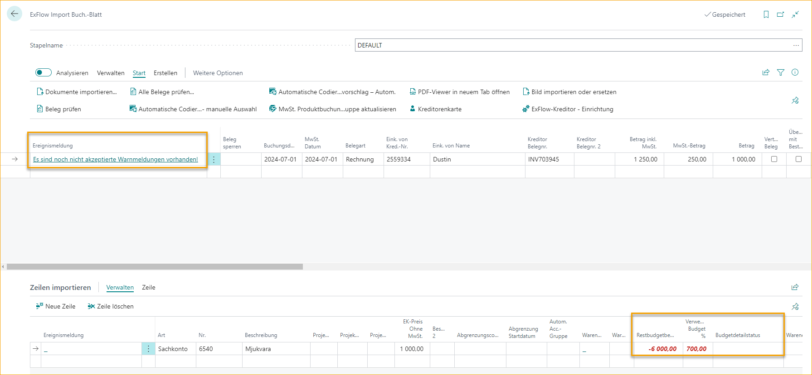

**Budget Detail Status:** Bei Verwendung von Abgrenzungen oder automatischen Kontengruppen auf einer Dokumentzeile können mehrere Perioden und G/L-Konten vorhanden sein. Der Budget Detail Status zeigt den Status an:
- **Innerhalb des Budgets**
- **Warnung**
- **Innerhalb der Toleranz**
- **Über Budget**
- **Budget fehlt**

Der Status zeigt das höchste Warnniveau aus den detaillierten Zeilen an. Klicken Sie auf den Budgetstatus, um die detaillierten Budgetzeilen und den verbleibenden Betrag zusammen mit dem verwendeten Budget % anzuzeigen.

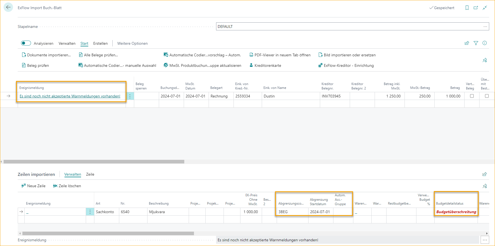

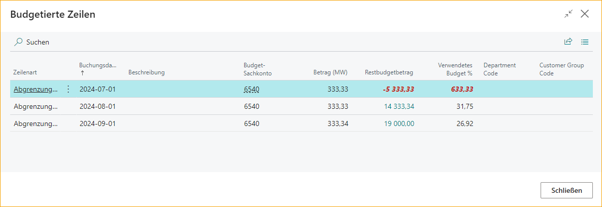  

#### Funktion - Budget anzeigen
Um zu zeigen, wie ExFlow den verbleibenden Budgetbetrag und das verwendete Budget % berechnet hat, klicken Sie auf Budget anzeigen. 
Gehen Sie zu: ***Zeile --> Budget anzeigen***

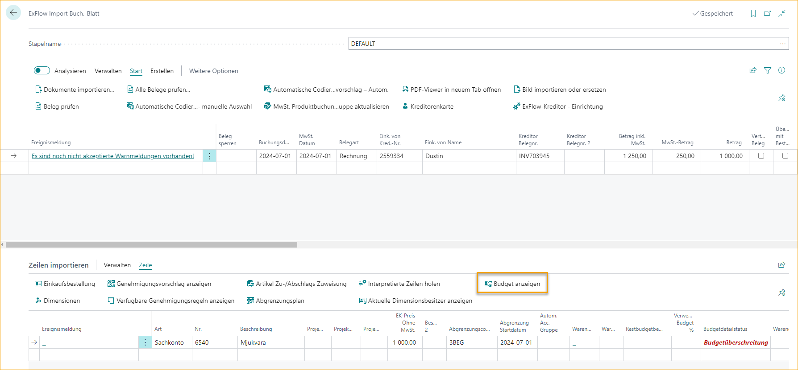

Die ExFlow Budgetübersicht fasst zusammen, wie und woher das Budget berechnet wird.
Klicken Sie auf **Betrag** für jede Zeile, um detailliertere Informationen auf Transaktionsebene zu erhalten.

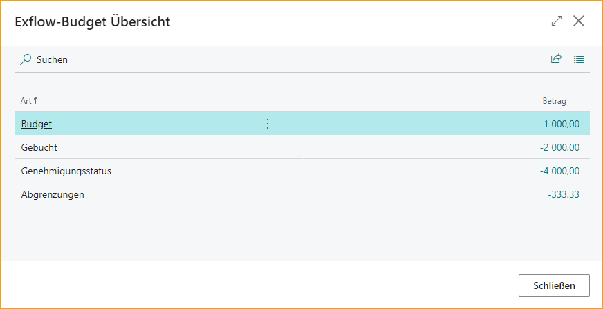  

#### Import Journal
Wenn Warnungen im ExFlow G/L Budget Control Setup aktiviert sind, erscheinen sie im Import Journal FactBox für Warnmeldungen. Abhängig von der Einrichtung können sowohl Überbenachrichtigungen als auch Überbudget für eine oder mehrere Zeilen angezeigt werden.

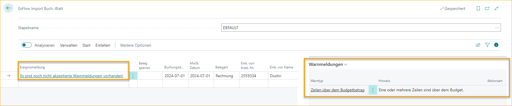

Alle Warnmeldungen können akzeptiert werden, um das Dokument zur Genehmigung zu senden.

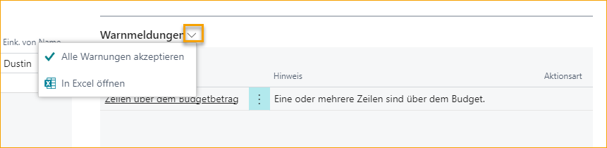  

#### ExFlow Web
Auf ExFlow Web werden alle drei Spalten aktiviert. Verbleibender Betrag, verwendetes Budget % und Budget Detail Status.
Die Genehmiger können jedoch keine Berechnung oder Budget Detail Status sehen.
Beim Ändern der Kodierung oder Aufteilen der Zeile klicken Sie auf Speichern und öffnen Sie das Dokument erneut, um die aktualisierten Budgetwerte anzuzeigen.

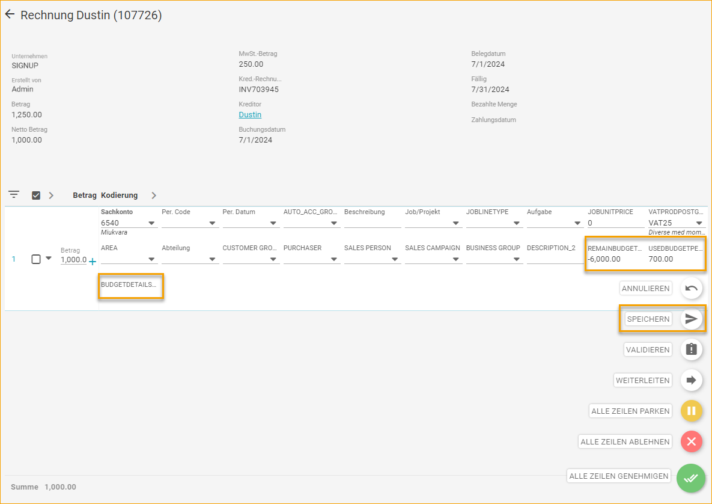  

#### Genehmigungsstatus
Wenn die Zeile über dem Budget liegt und der Budgetverantwortliche im ExFlow G/L Budget Control Setup hinzugefügt wurde, wird diese Genehmigungsgruppe als letzter Genehmiger hinzugefügt. Dies geschieht jedoch erst, nachdem der letzte Genehmiger im Genehmigungsfluss genehmigt hat.
Dies liegt daran, dass die Kodierung auf der Zeile während des Genehmigungsflusses geändert werden kann und die Zeile möglicherweise nicht mehr über dem Budget liegt.
Wenn der Budgetverantwortliche als Genehmiger im Genehmigungsfluss hinzugefügt wird, wird dies als „Erstellt in“ Budget Control markiert.

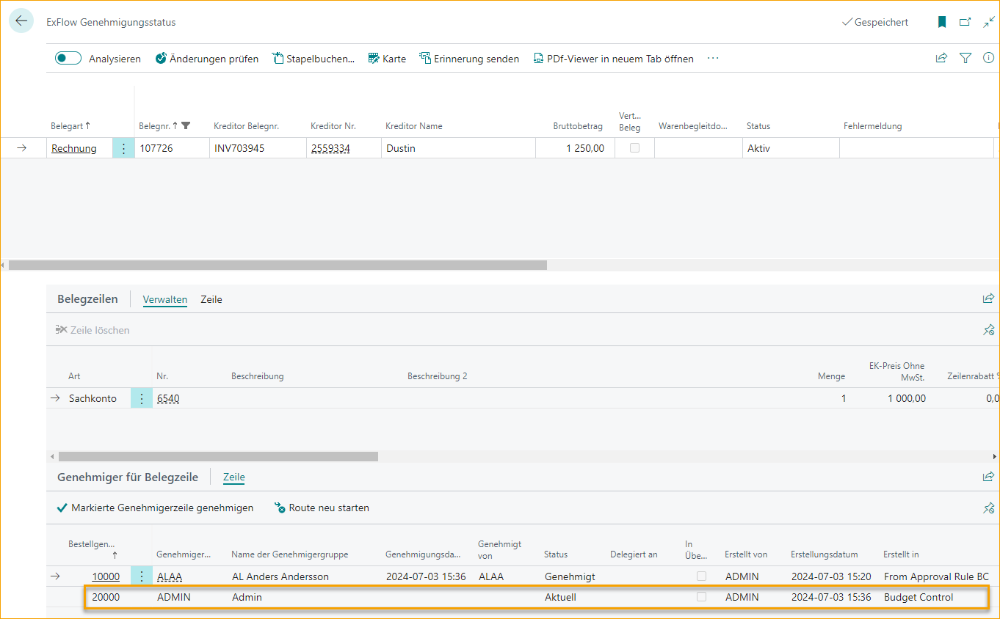
