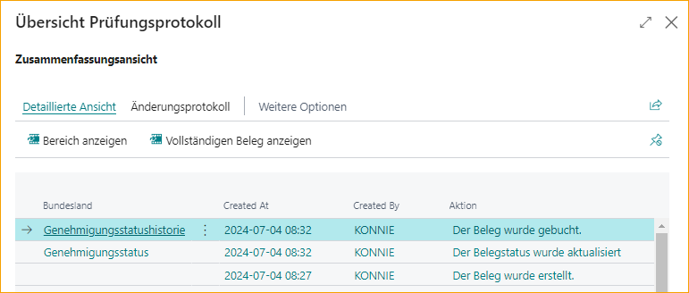

## Audit-Protokoll
Das ExFlow Audit-Protokoll basiert auf dem standardmäßigen Business Central Änderungsprotokoll und bietet ein verbessertes, benutzerfreundliches Protokoll für Änderungen an Dokumenten in ExFlow. Wenn aktiviert, verfolgt das Audit-Protokoll alle Änderungen an einem Dokument von der Importierung bis zur Buchung. Sie können Dokumentenänderungen entweder in einem zusammenfassenden Format basierend auf Rechnungsstatus und Aktionen anzeigen oder Änderungen in einem detaillierten Format verfolgen, das Änderungen auf Feldebene erfasst.

### Aktivieren des Audit-Protokolls
Um das Audit-Protokoll zu aktivieren, suchen Sie nach und gehen Sie zu **ExFlow Audit-Protokoll Einrichtung**.

Auf der Seite ExFlow Audit-Protokoll Einrichtung:

* Wählen Sie eine Audit-Protokoll Vorlage aus (weitere Informationen zu Audit-Protokoll Vorlagen finden Sie unten)
* Klicken Sie in der Symbolleiste auf "Änderungsprotokoll Einrichtung"  
     

* Auf der Seite Änderungsprotokoll Einrichtung, schalten Sie "Änderungsprotokoll aktiviert" ein 

    

Die Konfiguration in der ausgewählten Audit-Protokoll Vorlage wird auf das standardmäßige Business Central Änderungsprotokoll angewendet. Um die angewendete Änderungsprotokoll-Konfiguration anzuzeigen, klicken Sie auf der Seite Änderungsprotokoll Einrichtung zunächst auf "Weitere Optionen" und wählen Sie dann ***Aktionen --> Einrichtung --> Andere --> Tabellen***.

### Audit-Protokoll Vorlagen
Eine Audit-Protokoll Vorlage definiert die Tabellen und Felder, die im ExFlow Audit-Protokoll verfolgt werden sollen. Eine Standardvorlage "BASE" steht zur Verfügung, aber es können auch zusätzliche benutzerdefinierte Vorlagen erstellt werden. Öffnen Sie die BASE-Vorlage, um enthaltene Tabellen und Felder anzuzeigen:
* Suchen Sie nach und gehen Sie zu "ExFlow Audit-Protokoll Vorlagen".
* Klicken Sie in der Liste der ExFlow Audit-Protokoll Vorlagen auf den Code, um die Vorlage zu öffnen.

  

Die "BASE"-Vorlage kann nicht geändert werden, aber sie kann kopiert werden, um eine benutzerdefinierte Vorlage zu erstellen.

#### Erstellen einer benutzerdefinierten Vorlage
Um eine benutzerdefinierte Vorlage zu erstellen, muss die Basisvorlage zuerst kopiert werden, und dann können Änderungen an der neu erstellten Vorlage vorgenommen werden.
* Öffnen Sie die "Base"-Vorlage
* Wählen Sie in der Symbolleiste "Vorlage kopieren".  
    

* Geben Sie einen neuen Vorlagennamen und eine Beschreibung ein.  
    

* Öffnen Sie die neu erstellte Vorlage.   
**Um Änderungen** an allen Feldern in einer aufgelisteten Tabelle zu protokollieren, schalten Sie die Option "Alle Felder protokollieren" ein. 

  
**Um bestimmte Felder** zu protokollieren: 
Wählen Sie die gewünschte Tabelle aus und stellen Sie sicher, dass die Option "Alle Felder protokollieren" nicht aktiviert ist. Aktualisieren Sie dann den Abschnitt "Felder" (unterer Teil des Bildschirms) nach Bedarf:  
**Um ein Feld hinzuzufügen**, klicken Sie auf "Neue Zeile" und wählen Sie das gewünschte Feld in der neu erstellten Zeile aus.  
**Um ein Feld zu entfernen**, wählen Sie das gewünschte Feld aus und klicken Sie auf "Zeile löschen".

### Anzeigen des Audit-Protokolls für ein ExFlow-Dokument 

Gehen Sie zu: **ExFlow Genehmigungsstatusverlauf --> Verwandt --> Audit-Protokoll** 

Nachdem ein Dokument gebucht wurde, ist das Audit-Protokoll über den Genehmigungsstatusverlauf zugänglich. Zu diesem Zeitpunkt sind alle Aktionen von der Importierung bis zur Buchung im Zusammenfassungsansicht sichtbar, und alle Änderungen auf Feldebene können im Detailansicht angezeigt werden.

Das Audit-Protokoll wird in der **Zusammenfassungsansicht** geöffnet, in der Sie eine Liste der Dokumentenaktionen sehen, die seit der Importierung des Dokuments stattgefunden haben (Importiert, Überprüft, mit Beleg abgeglichen usw.) mit einem Datum und einer Uhrzeit, die anzeigen, wann die Aktion stattgefunden hat. Der Bereich gibt an, wo sich das Dokument im ExFlow-Prozess befand, als die Aktion stattfand. 

Die Informationen in dieser Ansicht können durch Auswahl der Aktion "In Excel exportieren" in der Symbolleiste in Excel exportiert werden. 

Um alle Standard Business Central Änderungsprotokolleinträge für eine einzelne Aktionszeile anzuzeigen, klicken Sie auf die Zeile, indem Sie auf einen beliebigen Feldwert in der Zeile klicken. Wenn für die Aktion keine Änderungen erfasst wurden, erhalten Sie die Meldung "Keine Änderungen gefunden".

Um alle Änderungen an dem Dokument anzuzeigen, klicken Sie auf der Zusammenfassungsansichtsseite auf **Detailansicht --> Vollständiges Dokument anzeigen.** 

Die **Detailansicht --> Bereich anzeigen** listet alle Felder in Abschnitte unterteilt auf:
* Kopfzeile
* Zeilen
* Genehmiger

Jedes Feld wird als separate Zeile dargestellt, wobei in den Spalten alle Änderungen an dem Feld neben der Aktion, zu der die Änderung gehört, angezeigt werden. Die neuesten Änderungen werden in den linken Spalten angezeigt. Um frühere Änderungen anzuzeigen, scrollen Sie nach rechts, um zusätzliche Spalten anzuzeigen. Wenn es eine große Anzahl von Änderungen gibt, klicken Sie auf "Nächster Satz", um weitere Änderungen anzuzeigen.

Im unten gezeigten Beispiel können wir sehen, dass die neueste Änderung (um 10:34:53 Uhr am 29.06.23) von Benutzer KONNIE vorgenommen wurde:
* Der Genehmiger wurde von SAM auf MARK geändert (siehe "Genehmiger"-Zeile im Screenshot unten)
* Der ursprüngliche Genehmiger (SAM) wurde von der Genehmigungsregel MARKETING zugewiesen (siehe "Hinzugefügt von Genehmigungsregel"-Zeile im Screenshot unten)
* Der neue Genehmiger (MARK) wurde manuell von Benutzer KONNIE zugewiesen (siehe "Erstellt in"-Zeile im Screenshot unten)

**Hinweis:** Der ursprüngliche Wert wird links vom Pfeil angezeigt und der neue Wert wird rechts angezeigt.

### Löschen abgelaufener Einträge  

Gehen Sie zu: **ExFlow Audit-Protokoll Einrichtung --> Abgelaufene Einträge löschen**

Ähnlich wie bei der Standardfunktionalität ist es möglich, in der Audit-Protokoll Einrichtung eine Perioden-Datumsformel einzugeben, die beim Löschen alter Audit-Protokolleinträge verwendet wird.

In diesem Beispiel wird sieben Jahre hinzugefügt, und ExFlow Audit-Protokolleinträge, die älter als sieben Jahre sind, werden beim Verwenden dieser Funktion gelöscht. 

