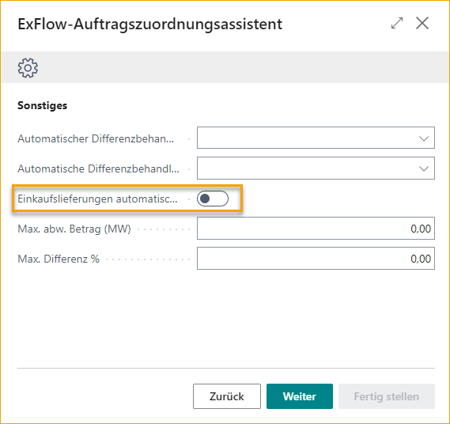
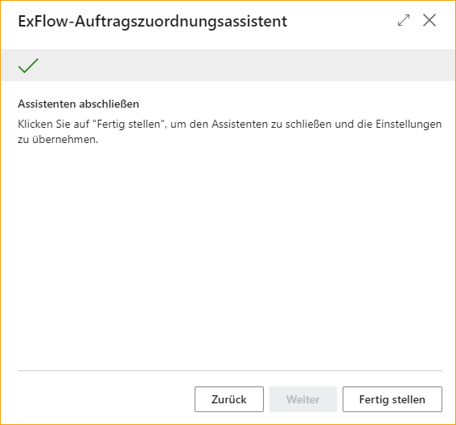

## Auftragsabgleich-Assistent

Dieses Benutzerhandbuch ist Ihr Leitfaden zur Einrichtung von ExFlow, um Rechnungen automatisch mit Bestellungen abzugleichen. Der Auftragsabgleich-Assistent wurde mit Einfachheit im Hinterkopf entwickelt und macht den Prozess unkompliziert und benutzerfreundlich.

Suchen Sie nach dem ExFlow Auftragsabgleich-Assistenten.

### Kopf- oder Positionsabgleich
Der erste Schritt bei der Einrichtung des Auftragsabgleich-Assistenten besteht darin, zu bestimmen, ob der Abgleich von Rechnungen mit Bestellungen auf Kopfebene oder Positionsebene durchgeführt werden soll.

**Kopfebene-Abgleich:** 
Wenn Sie den Kopfebene-Abgleich wählen, vergleicht der Auftragsabgleich-Assistent den Gesamtbetrag der Rechnung mit dem verfügbaren Gesamtwert der Bestellung.

Diese Methode eignet sich, wenn die Details einzelner Artikel oder Dienstleistungen auf der Rechnung nicht mit bestimmten Positionen auf der Bestellung abgeglichen werden müssen oder wenn die Informationen zu den Rechnungspositionen zu ungenau für einen genauen Abgleich sind.

**Positionsebene-Abgleich:** 
Wenn Sie den Positionsebene-Abgleich wählen, vergleicht der Auftragsabgleich-Assistent jede interpretierte Rechnungsposition mit den entsprechenden Positionen auf der Bestellung.

Dieser Ansatz stellt sicher, dass jeder einzelne Artikel oder jede Dienstleistung auf der Rechnung genau der entsprechenden Position auf der Bestellung zugeordnet wird.

Der Positionsabgleich verwendet interpretierte Informationen wie Rechnungsmenge, Einzelpreis, Positions-Gesamtbetrag und mehr, um einen genauen Abgleich mit der entsprechenden Bestellposition herzustellen und Abweichungen zu identifizieren.

### Dokumente abgleichen mit
Der nächste Schritt besteht darin, festzulegen, wie Rechnungen in Bezug auf Wareneingänge mit Bestellungen abgeglichen werden sollen. Es gibt drei Optionen:

**Wareneingang:** 
Wählen Sie diese Option aus, wenn Sie möchten, dass Rechnungen nur mit Bestellungen abgeglichen werden, die einen zugehörigen Wareneingang haben.

Damit wird sichergestellt, dass die Artikel im Lager empfangen und erfasst wurden und mit der Rechnung übereinstimmen, bevor die Rechnung zum Genehmigen und Buchen gesendet wird.

**Bestellung:** 
Wählen Sie diese Option aus, wenn Sie möchten, dass Rechnungen mit Bestellungen abgeglichen werden, unabhängig davon, ob ein zugehöriger Wareneingang vorhanden ist.

Dies ermöglicht den Abgleich von Rechnungen, auch wenn der Wareneingang von Waren oder Dienstleistungen noch nicht bestätigt wurde, und bietet Flexibilität im Abgleichsprozess.

Nützlich in Szenarien wie Dropshipment oder wenn Wareneingänge nicht verfügbar sind oder nicht erforderlich sind, um die Rechnung vollständig abzugleichen und zur Genehmigung und Buchung zu senden.

**Bestellung und Wareneingang:** 
Wenn Sie eine Kombination der beiden vorherigen Optionen bevorzugen, wählen Sie diese Option aus.

In diesem Fall können Rechnungen mit oder ohne zugehörige Wareneingänge mit Bestellungen abgeglichen werden, was maximale Flexibilität in den Abgleichsszenarien ermöglicht.

Es ist möglich, Rechnungspositionen mit Bestellungen abzugleichen, die sowohl empfangene Artikelpositionen als auch nicht empfangene Artikelpositionen enthalten. Es ist auch möglich, Rechnungspositionen mit teilweise empfangenen Artikelpositionen auf der Bestellung abzugleichen und sie zur Genehmigung und Buchung zu senden.

### Automatische Genehmigung abgeglichener Rechnungen
**Nie:** 
Wählen Sie diese Option aus, wenn Sie möchten, dass alle abgeglichenen Rechnungen einen manuellen Genehmigungsprozess durchlaufen. In diesem Fall werden keine Rechnungen automatisch genehmigt, unabhängig von Abweichungen oder Schwellenwerten.

**Wenn die Abweichung innerhalb der Toleranz liegt:** 
Wählen Sie diese Option aus, wenn Sie möchten, dass abgeglichene Rechnungen automatisch genehmigt werden, nur wenn die Abweichung zwischen Rechnung und Bestellung innerhalb der angegebenen erlaubten Toleranz oder Schwelle für die automatische Genehmigung liegt.

Diese Option ermöglicht eine effiziente Verarbeitung von Rechnungen mit geringfügigen Abweichungen und stellt sicher, dass nur signifikante Unterschiede eine manuelle Genehmigung erfordern.

**Wenn die abgeglichene Bestellung genehmigt ist:** 
Diese Option fügt eine zusätzliche Genehmigungsebene hinzu, indem verlangt wird, dass die abgeglichene Bestellung durch ExFlow überprüft und genehmigt wurde. Dadurch werden Rechnungen automatisch genehmigt, nur wenn die erforderliche Autorisierung vorhanden ist.

### Maximaler Betrag für automatische Genehmigung
Wenn Sie die automatische Genehmigung von abgeglichenen Rechnungen zugelassen haben, können Sie hier den maximalen Betrag für die automatische Genehmigung festlegen. Dieser Parameter definiert die Schwelle, über der Rechnungen unabhängig von den Abgleichsergebnissen manuell genehmigt werden müssen.

### Warnung bei Toleranzüberschreitung
Aktivieren Sie diese Einstellung, wenn Sie möchten, dass die Buchhalter während des Imports von abgeglichenen Rechnungen eine Warnung erhalten, wenn Abweichungen über Ihrer erlaubten Toleranz für die automatische Genehmigung liegen. 
Unabhängig davon, ob diese Einstellung aktiviert ist oder nicht, erfordern Abweichungen, die über Ihrer erlaubten Toleranz liegen, immer eine manuelle Genehmigung der Rechnungsposition.

### Abweichung Direkter Einheitskosten (%) und Abweichung Direkter Einheitskosten (Betrag LCY)
Legen Sie die Abweichungsschwellen für die direkten Einheitskosten von Rechnungspositionen im Vergleich zu den abgeglichenen Bestellpositionen fest. Diese Schwellenwerte bestimmen die zulässigen Unterschiede zwischen Rechnung und Bestellung für die automatische Genehmigung.

### Automatische Behandlung von Differenzen
Die Funktion zur automatischen Behandlung von Differenzen ermöglicht es ExFlow, automatisch eine Differenzposition vorzuschlagen, wenn zusätzliche oder unerwartete Kosten wie Fracht oder andere Gebühren während des Auftragsabgleichs identifiziert werden. 
Sie können wählen, ob ExFlow eine Rechnungsposition vom Typ "Artikelgebühr" oder "G/L-Konto" vorschlagen soll.
Geben Sie dann an, welches G/L-Konto oder welche Artikelgebühr für die vorgeschlagene Position verwendet werden soll.

### Maximaler Differenzbetrag (Betrag LCY) und Maximaler Differenzprozentsatz
Hier können Sie eine zulässige Toleranz für die automatisch vorgeschlagene Differenzposition für die automatische Genehmigung festlegen.

### Automatisches Buchen von Wareneingängen
Die Funktion "Automatisches Buchen von Wareneingängen" ermöglicht das automatische Buchen von Wareneingängen im Abgleichsprozess. Bitte beachten Sie jedoch, dass diese Funktion nur verwendet werden kann, wenn Rechnungen mit **"Bestellung"** oder **"Bestellung und Wareneingang"** abgeglichen werden.

Der Abgleich von Rechnungen mit der Logik **"Bestellung"** oder **"Bestellung und Wareneingang"** ermöglicht es ExFlow, eine Rechnung vollständig abzugleichen und zur Genehmigung und Buchung zu senden. Business Central erfordert jedoch immer, dass Wareneingänge gebucht werden, bevor die abgeglichene Rechnung gebucht werden kann und die Bestellung abgerechnet wird.

Diese Einstellung ermöglicht es ExFlow, die genehmigte Menge der abgeglichenen Rechnungspositionen automatisch zu buchen und abzurechnen. Dies erfolgt, sobald die Rechnung den Status "Bereit zur Buchung" im Genehmigungsstatus erreicht hat.
Wenn diese Einstellung deaktiviert ist, müssen Sie die Wareneingänge manuell buchen.

### Assistent abschließen
Klicken Sie auf "Fertigstellen", um den Assistenten zu schließen und die Einstellungen anzuwenden.

### ExFlow-Einrichtung
Die von der Auftragsabgleich-Assistent betroffenen Felder in der ExFlow-Einrichtung sind im folgenden Bild ausgewählt:

