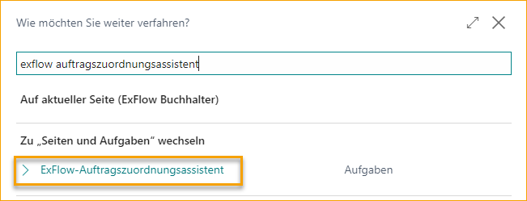
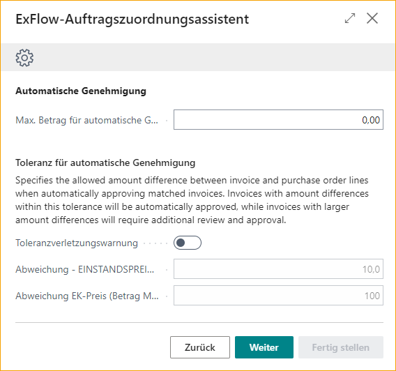

## Bestellabgleich-Assistent

Dieses Benutzerhandbuch ist Ihr Leitfaden für die Einrichtung von ExFlow, um Rechnungen mühelos mit Bestellungen abzugleichen. Der Bestellabgleich-Assistent wurde mit Einfachheit im Sinn entwickelt und macht den Prozess unkompliziert und benutzerfreundlich.

Suchen Sie nach ExFlow Bestellabgleich-Assistent.

### Kopf- oder Zeilenabgleich
Der erste Schritt bei der Einrichtung des Bestellabgleich-Assistenten besteht darin, zu bestimmen, ob der Abgleich von Rechnungen mit Bestellungen auf Kopf- oder Zeilenebene erfolgen soll.

**Kopfebenenabgleich:** 
Wenn Sie den Kopfebenenabgleich wählen, vergleicht der Bestellabgleich den Gesamtrechnungsbetrag mit dem verfügbaren Gesamtwert der Bestellung.

Diese Methode ist geeignet, wenn die Details einzelner Artikel oder Dienstleistungen auf der Rechnung nicht mit spezifischen Artikeln auf der Bestellung abgeglichen werden müssen oder wenn die Rechnungszeileninformationen zu ungenau für einen genauen Abgleich sind.

**Zeilenebenenabgleich:** 
Wenn Sie den Zeilenebenenabgleich wählen, vergleicht der Bestellabgleich jede interpretierte Rechnungszeile mit den entsprechenden Positionen auf der Bestellung.

Dieser Ansatz stellt sicher, dass jeder einzelne Artikel oder jede Dienstleistung auf der Rechnung genau mit dem entsprechenden Artikel auf der Bestellung abgeglichen wird.

Der Zeilenabgleich nutzt interpretierte Informationen wie Rechnungsmenge, Stückpreis, Zeilensumme und mehr, um eine genaue Übereinstimmung mit der entsprechenden Bestellposition zu erzielen und etwaige Abweichungen zu identifizieren.

### Dokumente abgleichen mit
Der nächste Schritt besteht darin, zu bestimmen, wie Rechnungen in Bezug auf Wareneingänge mit Bestellungen abgeglichen werden sollen.
Es gibt drei Optionen zur Auswahl:

**Wareneingang:** 
Wählen Sie diese Option, wenn Sie möchten, dass Rechnungen nur mit Bestellungen abgeglichen werden, die zugehörige Wareneingänge haben.

Dies stellt sicher, dass die Artikel empfangen und im Lager erfasst wurden und mit der Rechnung übereinstimmen, bevor die Rechnung zum Genehmigen und endgültigen Buchen weitergeleitet wird.

**Bestellung:** 
Wählen Sie diese Option aus, wenn Sie möchten, dass Rechnungen mit Bestellungen abgeglichen werden, unabhängig davon, ob ein zugeordneter Wareneingang vorhanden ist.

Auf diese Weise können Rechnungen auch dann abgeglichen werden, wenn der Erhalt von Waren oder Dienstleistungen nicht bestätigt wurde, was Flexibilität in Ihrem Abgleichsprozess bietet.

Nützlich in Szenarien wie Streckengeschäft oder wenn Kaufbelege nicht verfügbar sind oder erforderlich sind, um die Rechnung vollständig abzugleichen und zur Genehmigung und Buchung zu senden.

**Bestellung und Wareneingang:** 
Wenn Sie eine Kombination der beiden vorherigen Optionen bevorzugen, wählen Sie diese Option.

In diesem Fall können Rechnungen mit Bestellungen mit oder ohne zugehörige Wareneingänge abgeglichen werden, was maximale Flexibilität in Abgleichsszenarien bietet.

Es ist möglich, Rechnungszeilen mit Bestellungen mit und ohne empfangene Artikelzeilen abzugleichen. Außerdem können Rechnungszeilen mit teilweise empfangenen Artikelzeilen auf der Bestellung abgeglichen und zur Genehmigung und Buchung weitergeleitet werden.

### Automatische Genehmigung abgeglichener Rechnungen
**Nie:** 
Wählen Sie diese Option, wenn Sie möchten, dass alle abgeglichenen Rechnungen einen manuellen Genehmigungsprozess durchlaufen. In diesem Fall werden keine Rechnungen automatisch genehmigt, unabhängig von Unterschieden oder Schwellenwerten.

**Wenn die Differenz innerhalb der Toleranz liegt:** 
Wählen Sie diese Option, wenn Sie möchten, dass abgeglichene Rechnungen nur dann automatisch genehmigt werden, wenn die Differenz zwischen der Rechnung und der Bestellung innerhalb des festgelegten erlaubten Schwellenwerts oder der Toleranz für die automatische Genehmigung liegt.

Diese Option ermöglicht eine effiziente Verarbeitung von Rechnungen mit geringfügigen Abweichungen und stellt sicher, dass nur erhebliche Unterschiede eine manuelle Genehmigung erfordern.

**Wenn die abgeglichene Bestellung genehmigt ist:** 
Diese Option fügt eine zusätzliche Genehmigungsebene hinzu, indem sie erfordert, dass die abgeglichene Bestellung durch ExFlow überprüft und genehmigt wurde, sodass Rechnungen nur dann automatisch genehmigt werden, wenn die erforderliche Autorisierung vorliegt.

### Maximalbetrag für automatische Genehmigung
Wenn Sie die automatische Genehmigung abgeglichener Rechnungen zugelassen haben, können Sie hier den Höchstbetrag für die automatische Genehmigung festlegen. Dieser Parameter definiert die Schwelle, über der Rechnungen unabhängig von den Abgleichsergebnissen eine manuelle Genehmigung erfordern.

### Warnung bei Toleranzverletzung
Aktivieren Sie diese Einstellung, wenn Sie möchten, dass die Buchhalter während des Imports von abgeglichenen Rechnungen eine Warnung erhalten, wenn es Abweichungen über Ihrer erlaubten Toleranz für die automatische Genehmigung gibt.
Unabhängig davon, ob diese Einstellung aktiviert ist oder nicht, erfordern Abweichungen, die höher als Ihre erlaubte Toleranz sind, immer eine manuelle Genehmigung der Rechnungszeile.

### Abweichung Direkte Stückkosten (%) und Abweichung Direkte Stückkosten (Betrag LCY)
Definieren Sie die Abweichungsschwellenwerte für die direkten Stückkosten von Rechnungszeilen im Vergleich zu den abgeglichenen Bestellzeilen. Diese Schwellenwerte bestimmen die zulässigen Unterschiede zwischen der Rechnung und der Bestellung für die automatische Genehmigung.

### Automatische Differenzbehandlung
Die Funktion zur automatischen Differenzbehandlung ermöglicht es ExFlow, automatisch eine Differenzzeile vorzuschlagen, wenn während des Bestellabgleichs zusätzliche oder unerwartete Kosten wie Fracht oder andere Gebühren identifiziert werden.
Sie können wählen, ob ExFlow eine Rechnungszeile des Typs Artikelgebühr oder Sachkonto vorschlagen soll.
Geben Sie dann an, welches Sachkonto oder welche Artikelgebühr für die vorgeschlagene Zeile verwendet werden soll.

### Max. Differenzbetrag (LCY) und Max. Differenz % 
Hier können Sie eine zulässige Toleranz für die automatisch vorgeschlagene Differenzzeile für die automatische Genehmigung festlegen.

### Automatisches Buchen von Wareneingängen
Die Funktion "Automatisches Buchen von Wareneingängen" ermöglicht das automatische Buchen von Wareneingängen im Abgleichsprozess. Bitte beachten Sie jedoch, dass diese Funktion nur genutzt werden kann, wenn Rechnungen mit **„Bestellung“** oder **„Bestellung und Wareneingang“** abgeglichen werden.

Das Abgleichen von Rechnungen mit der Logik **„Bestellung“** oder **„Bestellung und Wareneingang“** ermöglicht es ExFlow, eine Rechnung vollständig abzugleichen und zur Genehmigung und Buchung weiterzuleiten. Business Central erfordert jedoch immer, dass Wareneingänge gebucht werden, bevor die abgeglichene Rechnung gebucht und die Bestellung fakturiert werden kann.

Diese Einstellung ermöglicht es ExFlow, die genehmigte Menge der abgeglichenen Rechnungszeilen automatisch zu buchen und zu fakturieren. Sie wird ausgeführt, sobald die Rechnung den Status „Bereit zur Buchung“ im Genehmigungsstatus hat.
Wenn diese Einstellung deaktiviert ist, müssen Sie die Wareneingänge manuell buchen.

### Assistent abschließen
Klicken Sie auf "Fertig stellen", um den Assistenten zu schließen und die Einstellungen anzuwenden.

### ExFlow-Einrichtung
Felder in der ExFlow-Einrichtung, die vom Bestellabgleich-Assistenten betroffen sind, sind im folgenden Bild ausgewählt:

