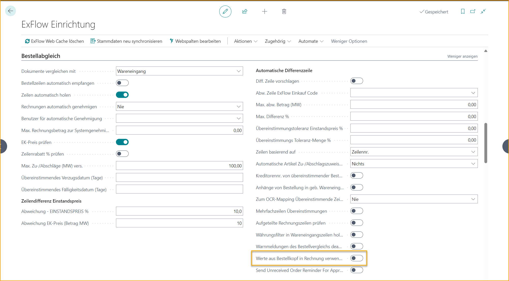
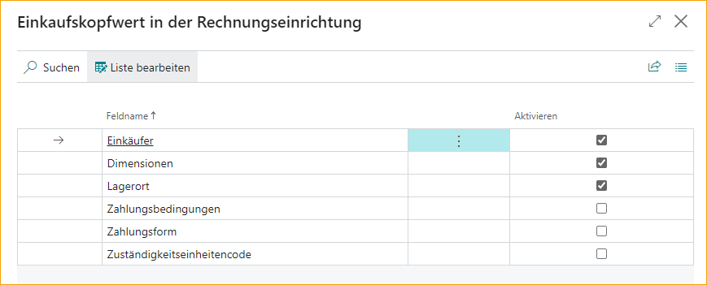
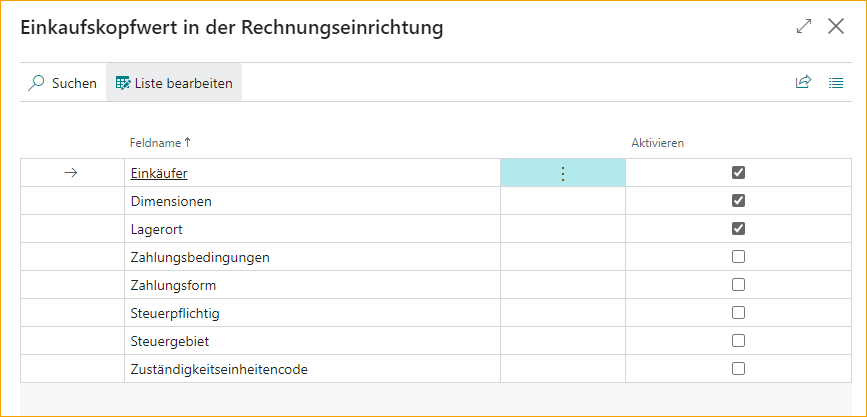
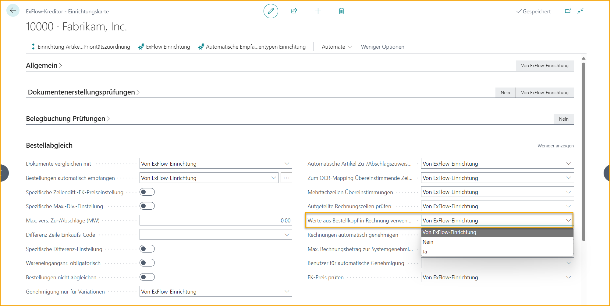

## Kopieren von Bestellkopfwerten

Für Kunden, die eine Übereinstimmung auf Kopfebene interpretieren und bestellen, können einige Werte der Bestellung nun vom Bestellkopf auf den Rechnungskopf kopiert werden. 

Beginnen Sie mit der Aktivierung von "PO-Kopfwerte auf Rechnung verwenden" in der ExFlow-Einrichtung. 

Gehen Sie zu: ***ExFlow-Einrichtung – PO-Abgleich --> PO-Kopfwerte auf Rechnung verwenden***

Wählen Sie die Felder aus, die in der „Einrichtung der PO-Kopfwerte auf Rechnung“ kopiert werden sollen. 

Gehen Sie zu: ***ExFlow-Einrichtung – Verwandt --> Erweitert --> PO-Kopfwerte auf Rechnung Einrichtung***

Für die US- und CA-Lokalisierung können auch Steuerpflichtig und Steuergebiet von der Bestellung auf die Rechnung kopiert werden.

Die Verwendung von PO-Kopfwerten auf Rechnung kann pro Lieferant aus der ExFlow-Lieferanteneinrichtung ausgewählt werden. 

Gehen Sie zu: ***ExFlow-Lieferanteneinrichtung --> ExFlow-Lieferanteneinrichtungskarte*** --> Drücken Sie „Mehr anzeigen“ auf der PO-Abgleich-Schnellregisterkarte.

Die zu kopierenden Felder verwenden immer die Einstellungen aus der ExFlow-Einrichtung.

