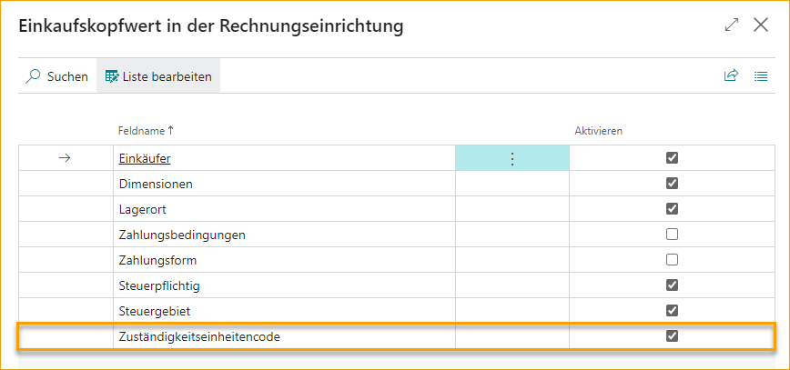

## Verantwortungszentrum

Verantwortungszentren werden sowohl für Kosten- als auch für PO-abgestimmte Dokumente unterstützt. Weitere Informationen finden Sie unten.

### Verwendung von Verantwortungszentren mit Kosten-/Aufwandsrechnungen
Bei Kosten-/Aufwandsrechnungen kann das Verantwortungszentrum vom Lieferanten übernommen oder manuell im Importjournal-Header eingetragen werden. Wenn das Verantwortungszentrum eingetragen ist, werden der Rechnungsheader und die -zeilen mit allen zugehörigen Informationen aktualisiert. Abhängig von den Einstellungen in BC kann dies Dimensionen, Standortcode, Steuergebietscode usw. umfassen.

Wenn das Verantwortungszentrum im Rechnungsheader auf einen neuen Wert aktualisiert wird, werden die Dokumentzeilen entsprechend aktualisiert.

#### Dimensionspriorität - Header
Wenn ein Verantwortungszentrum im Dokumentenheader festgelegt ist, ahmt die Dimensionspriorität die Standard-Dimensionspriorität von BC nach, mit einer Ausnahme:

- Standarddimensionen, die auf einer ExFlow-Referenz festgelegt sind, haben Vorrang vor Standarddimensionen, die auf dem Verantwortungszentrum festgelegt sind. Das Dokument übernimmt Standarddimensionen von beiden, aber bei einem Konflikt haben die auf der Referenz festgelegten Standarddimensionen Vorrang vor den auf dem Verantwortungszentrum festgelegten Standarddimensionen.

#### Dimensionspriorität - Zeilen

Dokumentzeilen übernehmen Dimensionen vom Header mit folgender Ausnahme:

- Wenn ein Einkaufscode verwendet wird, um Rechnungszeilen zu erstellen, haben die im Einkaufscode festgelegten Dimensionen Vorrang vor den im Header festgelegten Dimensionen.

### Verwendung von Verantwortungszentren mit PO-abgestimmten Rechnungen

#### Einrichtung

Wenn die folgende Einstellung aktiviert ist, übernehmen Rechnungen mit Bestellabgleich die Verantwortungseinheit von der entsprechenden Bestellung:

Öffnen Sie im ExFlow-Setup den Schnellreiter „Bestellabgleich“ und aktivieren Sie die Option „Kopfwerte in Rechnungs-/Gutschriftseinstellungen kopieren“, um die Einrichtungsseite zu öffnen.

Aktivieren Sie die Verantwortungseinheit, indem Sie das Kontrollkästchen im Feld „Aktivieren“ aktivieren. Klicken Sie auf „OK“, um die Aktivierung abzuschließen und die Seite zu schließen.

Mit der obigen Einrichtung tritt Folgendes ein, wenn eine Rechnung mit einer PO abgeglichen wird:
* Eine Rechnung, die mit einer einzelnen PO abgeglichen wird, übernimmt das Verantwortungszentrum vom PO-Header.
    - Rechnungszeilen übernehmen Dimensionen, Standortcode, Steuergebiet und Steuerpflicht von den abgeglichenen PO-Zeilen.
* Eine Rechnung, die mit mehreren POs mit demselben Verantwortungszentrum abgeglichen wird, wird wie oben behandelt.
* Wenn eine einzelne Rechnung mit mehreren POs mit unterschiedlichen Verantwortungszentren abgeglichen wird, übernimmt jede Zeile den Standortcode, das Steuergebiet und die Steuerpflicht-Einstellung von der PO-Zeile, mit der sie abgeglichen wird. Das Verantwortungszentrum bleibt im Rechnungsheader leer.

### Einschränkung
Ein Standard-Verantwortungszentrum, das einem Benutzer zugewiesen ist, wird nicht auf Dokumente übernommen, die im Importjournal importiert/erstellt werden. Das Verantwortungszentrum kann vom Lieferanten, der Bestellung übernommen oder manuell im Importjournal-Header eingetragen werden.
