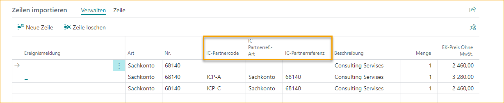
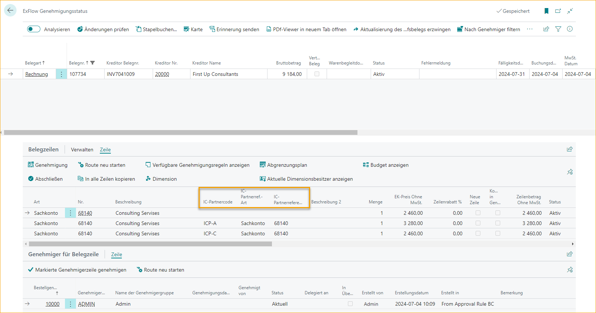
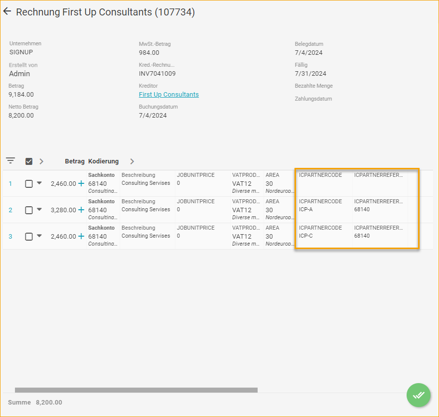
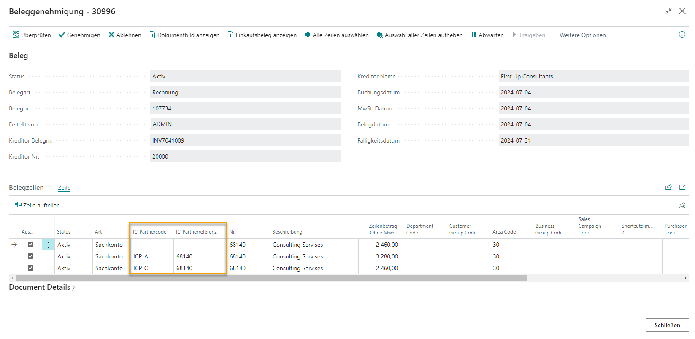
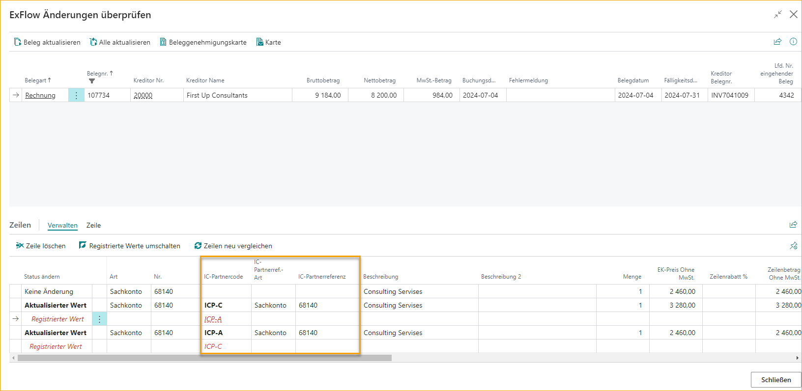
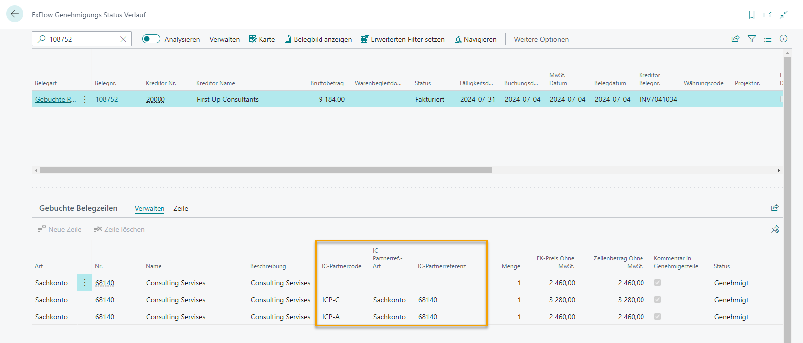

## Intercompany

ExFlow unterstützt jetzt die Standard-Intercompany-Funktionalität von Business Central. Die folgenden Intercompany-Felder sind jetzt im gesamten ExFlow-Prozess verfügbar.  
•	IC-Partnercode 
•	IC-Partner-Ref.-Typ 
•	IC-Partner-Referenz 

#### Intercompany im Importjournal
Die IC-Felder sind jetzt im Importjournal verfügbar und können über die Benutzerpersonalisierung zur Ansicht hinzugefügt werden. Werte in den IC-Feldern fließen in die Rechnung in Business Central, wenn diese erstellt wird.

Beim Verarbeiten von Nicht-PO-(Kosten-)Rechnungen können die Intercompany-Felder manuell ausgefüllt werden, um einen Teil der Kosten auf verbundene Unternehmen zu verteilen, die in BC als Intercompany-Partner eingerichtet wurden.

Für PO-abgestimmte Rechnungen, wenn die IC-Felder in der Bestellung ausgefüllt sind, fließen die Werte von der Bestellung in die Rechnungszeile.

#### Intercompany im Genehmigungsstatus
Im Genehmigungsstatus hat der Benutzer Sicht auf die IC-Felder und zugehörigen Werte. Die IC-Felder können über die Benutzerpersonalisierung zur Ansicht hinzugefügt werden.

#### Intercompany im ExFlow Web
Die IC-Partnercode- und IC-Partner-Referenzfelder können als Spalten in ExFlow Web hinzugefügt werden. Die IC-Werte sind für den Genehmiger sichtbar und Genehmiger, die Berechtigungen zum Ändern der Kodierung haben, können die IC-Felder bei Bedarf aktualisieren.

#### Intercompany in ExFlow Genehmigungsdokumenten
Für Genehmiger, die in Business Central genehmigen, sind die IC-Felder jetzt in ExFlow Genehmigungsdokumenten sichtbar und bearbeitbar (mit den erforderlichen Berechtigungen).

 

Wenn ein Benutzer die Funktion 'Änderungen überprüfen' ausführt, werden die IC-Felder sowie alle vorgenommenen Änderungen angezeigt.

 

#### Intercompany in ExFlow Genehmigungsstatus-Historie
Nachdem ein Dokument gebucht wurde, sind die IC-Partnercode- und IC-Partner-Referenzfelder in der ExFlow Genehmigungsstatus-Historie sichtbar.

