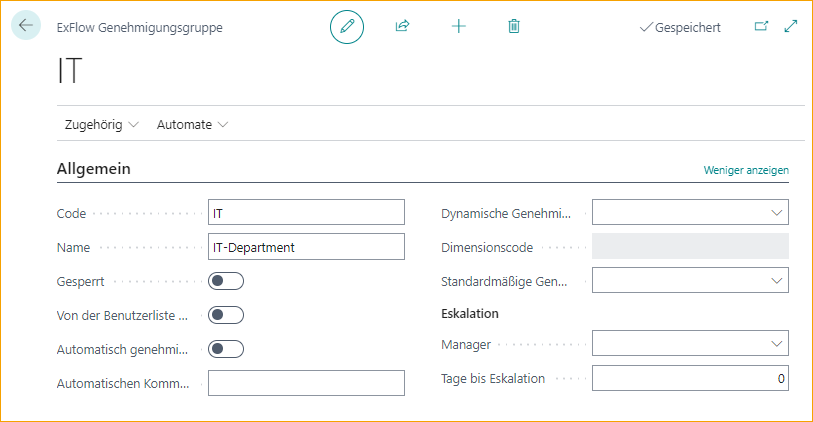
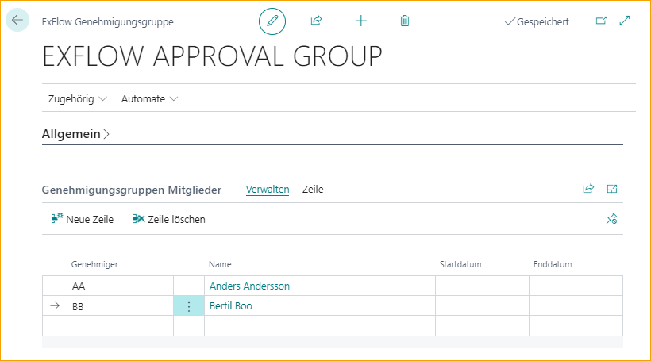
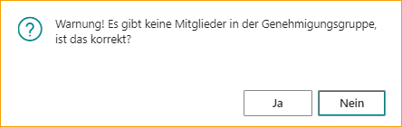

## Genehmigungsgruppen

Gehe zu: ***Setup \--\> ExFlow Manual Setup \--\> ExFlow Approval Groups***

Wie im Abschnitt Neuer Benutzer erwähnt, werden Genehmigungsgruppen automatisch erstellt, wenn ein neuer Benutzer angelegt wird. Persönliche Gruppen sollten nicht geändert werden (außer zum Hinzufügen von Vertretern).

### Eine neue Genehmigungsgruppe erstellen

Zusätzlich ist es möglich, logische Gruppen wie Einkaufsabteilung oder IT-Abteilung Genehmigungsgruppen mit einem oder mehreren Benutzern einzurichten.

Nur ein Benutzer in dieser Gruppe kann genehmigen, aber alle Benutzer erhalten das Dokument und können es im Ordner "Aktuell" auf ExFlow Web finden.

| Allgemein   |   |
|:-|:-|
|**Code:**                                  | Fügen Sie einen Code hinzu, der die Genehmigungsgruppe beschreibt. Wenn nicht ausgeschlossen, ist dieser Code auf ExFlow Web sichtbar, wenn Sie weiterleiten und Genehmiger hinzufügen
| **Name:**                                 | Fügen Sie einen Namen hinzu, der den Code beschreibt
| **Gesperrt:**                             | Wenn die Genehmigungsgruppe nicht mehr verwendet werden soll.
| **Von der Benutzerliste im Web ausschließen:** | Um diese Genehmigungsgruppe in der Benutzerliste auszuschließen, wenn Sie auf ExFlow Web weiterleiten und Genehmiger hinzufügen. Eine Genehmigungsgruppe mit dynamischem Genehmigungstyp kann nicht manuell in den Genehmigungsfluss auf ExFlow Web hinzugefügt werden. "Von der Benutzerliste im Web ausschließen" wird daher automatisch aktiviert, wenn ein dynamischer Genehmigungstyp ausgewählt wird
| **Automatische Genehmigung:**             | Fügen Sie eine automatische Genehmigungsgruppe hinzu, wenn Sie die automatische Genehmigung in der Bestellabstimmung oder bei der Abstimmung gegen den Vertrag verwenden. Wenn Genehmigungsgruppenmitglieder hinzugefügt werden, wird das Dokument als genehmigt im Ordner "Aktuell" auf ExFlow Web angezeigt
| **Kommentar zur automatischen Genehmigung:** | Fügen Sie einen Kommentar hinzu, der in den Kommentar im Dokumentzeilen-Genehmiger kopiert wird.

### Genehmigungsgruppe mit dynamischem Genehmigungstyp

Es ist möglich, Genehmiger automatisch abhängig von verschiedenen Codierungen in der Dokumentzeile hinzuzufügen.

| Dynamischer Genehmigungstyp   |   |
|:-|:-|
| **Dynamischer Genehmigungstyp:**          | Dieses Feld enthält mehrere Optionen, die für verschiedene dynamische Genehmigungsflüsse verwendet werden können. Alle Optionen erfordern eine einzigartige Einrichtung und wenn ausgewählt, ist es nicht möglich, Genehmigungsgruppenmitglieder hinzuzufügen     Lesen Sie mehr über die Einrichtung und die Optionen für dynamische Genehmigungsflüsse für Dimensionen, Projekte und Einkäufer im Abschnitt [***Genehmigungsregeln --> Dynamischer Genehmigungsfluss für Dimensionseigentümer,***](https://docs.exflow.cloud/business-central/docs/user-manual/business-functionality/approval-rules#dynamic-approval-flow-for-dimension-owners) [***Projekte,***](https://docs.exflow.cloud/business-central/docs/user-manual/business-functionality/approval-rules#dynamic-approval-flow-for-projects) oder [***Einkäufer***](https://docs.exflow.cloud/business-central/docs/user-manual/business-functionality/approval-rules#dynamic-approval-flows-purchasers)
| **Von der Benutzerliste im Web ausschließen:** | Wird automatisch ausgewählt, da diese Genehmigungsgruppe nicht manuell von ExFlow Web hinzugefügt werden sollte
| **Genehmigungsgruppenmitglieder:**         | Es sollten keine ExFlow-Benutzer zu Genehmigungsgruppenmitgliedern hinzugefügt werden

### Eskalation

Wenn ein Genehmiger Dokumente nicht rechtzeitig genehmigt, gibt es eine Funktion, um Dokumente an den Manager zu eskalieren.

Der Manager kann für alle Genehmiger in der ExFlow-Einrichtung oder pro Genehmigungsgruppe hinzugefügt werden und den Job manuell oder automatisch mit der Job-Warteschlange ausführen.

Lesen Sie mehr über die Einrichtung und wie Sie die Job-Warteschlange einrichten im Abschnitt [***Genehmigungsworkflow --> Periodische Aktivitäten --> Eskalationsjob***](https://docs.exflow.cloud/business-central/docs/user-manual/approval-workflow/periodic-activities#escalation-job)

| Eskalation   |   |
|:-|:-|
| **Manager:**                  | Fügen Sie den Manager für diese spezifische Genehmigungsgruppe hinzu
| **Tage vor Eskalation:**      | Fügen Sie die Anzahl der Tage vor der Eskalation hinzu

### Genehmigungsgruppenmitglieder

Es ist möglich, mehrere Genehmiger in einer Genehmigungsgruppe hinzuzufügen. Nur ein Benutzer in dieser Gruppe kann genehmigen, aber alle Benutzer erhalten das Dokument und können es im Ordner "Aktuell" auf ExFlow Web finden.

| Genehmigungsgruppenmitglieder   |   |
|:-|:-|
| **Start- und Enddatum:**        | Wird verwendet, wenn ein Genehmiger vorübergehend einen anderen Genehmiger ersetzt. Verwenden Sie die Funktion, um Vertreter von ExFlow Web, Vertreter zuweisen oder von der ExFlow-Benutzerkarte hinzuzufügen              Lesen Sie mehr im Abschnitt [***Business Functionality --> ExFlow Benutzer --> Einen Vertreter während der Urlaubszeit hinzufügen***](https://docs.exflow.cloud/business-central/docs/user-manual/business-functionality/exflow-user#add-a-replacer-during-vacation-time) und [***Genehmigungsworkflow --> Periodische Aktivitäten --> Vertreter zuweisen***](https://docs.exflow.cloud/business-central/docs/user-manual/approval-workflow/periodic-activities#assign-replacers)

Eine Genehmigungsgruppe erfordert mindestens einen Benutzer.

