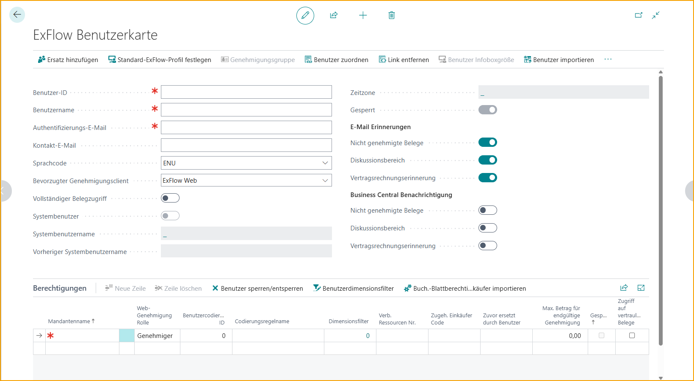
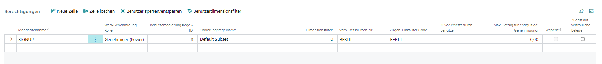
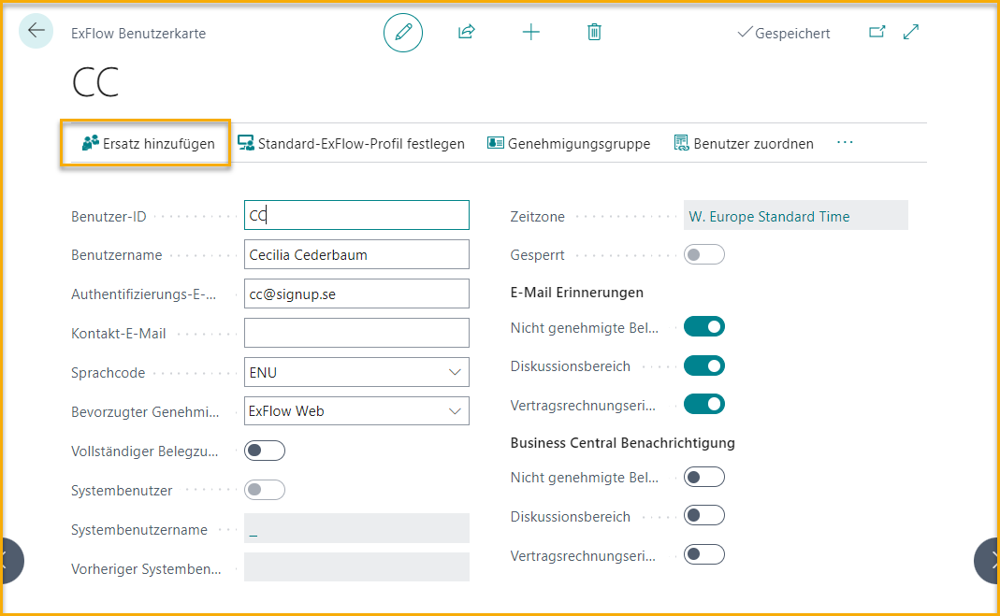
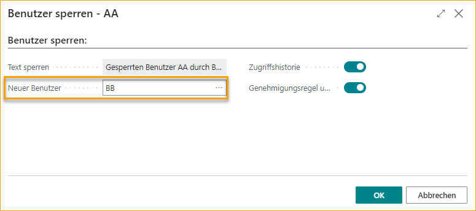

## ExFlow Benutzer

Um sich bei ExFlow Web anzumelden, müssen "ExFlow Benutzer" erstellt werden.

Das Hinzufügen eines neuen Benutzers erstellt automatisch eine Genehmigungsgruppe mit demselben Namen. 

### Standardkonfiguration für ExFlow Benutzer hinzufügen

Gehe zu: ***Setup --> ExFlow Setup***

Es sind auch einige Standardkonfigurationen in ExFlow Setup möglich, wie das Hinzufügen eines Standard-Sprachcodes, eines bevorzugten Genehmigungsclients oder vielleicht einer Standard-Benutzer-Codierungsregel-ID.

Eine der Einstellungen ist "Standard-Benutzer-Codierungsregel-ID". Dadurch wird die Einrichtung eines neuen ExFlow Benutzers erleichtert. Setzen Sie "Standard-Benutzer-Codierungsregel" in ExFlow Setup, fügen Sie eine neue ExFlow Benutzerberechtigungslinie mit einem bestimmten Unternehmen hinzu und die zuvor in ExFlow Setup definierte Benutzer-Codierungsregel wird angewendet.

| ExFlow Setup - Benutzer      |   | 
|:-|:-|
| **Sprachcode:**                            | Fügen Sie den Sprachcode für E-Mails hinzu, die an ExFlow-Genehmiger gesendet werden
| **Bevorzugter Genehmigungsclient:**                | Gibt an, ob der Standard-Hyperlink in den E-Mails für Erinnerungen und Nachrichten den Benutzer zu Business Central oder ExFlow Web führt
|**Genehmigungsauswahl-Timeout**| Gibt den Timeout an, der für die Genehmigungsauswahl verwendet wird
|**Standard-Benutzer-Codierungsregel-ID**| Gibt die Standard-Sicherheitsrolle an, die beim Erstellen neuer Genehmiger verwendet wird
|**Standard-Admin-Rollen-ID**| Gibt die Standard-Sicherheitsrolle an, die beim Erstellen neuer Genehmiger verwendet wird
|**Standard-Buchhalter-Rollen-ID**| Gibt die Standard-Sicherheitsrolle an, die beim Erstellen neuer Genehmiger verwendet wird
|**Standard-Genehmiger-Rollen-ID**| Gibt die Standard-Sicherheitsrolle an, die beim Erstellen neuer Genehmiger verwendet wird
|**Standard-Basis-Rollen-ID**| Gibt die Standard-Sicherheitsrolle an, die beim Erstellen neuer Genehmiger verwendet wird
|**Standard-Leser-Rollen-ID**| Gibt die Standard-Sicherheitsrolle an, die beim Erstellen neuer Genehmiger verwendet wird
|**Standard-Webdienst-Rollen-ID**| Gibt die Standard-Sicherheitsrolle an, die beim Erstellen neuer Genehmiger verwendet wird
|**Standard-Einkäufer-Rollen-ID**| Gibt die Standard-Sicherheitsrolle an, die beim Erstellen neuer Genehmiger verwendet wird
| **ExFlow-Referenz automatisch erstellen:**    | Wählen Sie diese Option aus, um automatisch ExFlow-Referenzen zu erstellen.   Weitere Informationen finden Sie im Abschnitt [***Referenzcodes***](https://docs.exflow.cloud/business-central/docs/user-manual/business-functionality/reference-codes)
|**Standard-Vertraulichkeits-Rollen-ID**| Gibt die Standard-Sicherheitsrolle an, die beim Erstellen neuer Genehmiger verwendet wird  
 

### ExFlow Benutzer aus Excel importieren

Neben dem manuellen Hinzufügen neuer Benutzer ist es Administratoren möglich, ExFlow Benutzer durch den Import von Benutzern aus Excel hinzuzufügen. "Benutzer importieren".

Um aus Excel zu importieren, verwenden Sie die "Vorlage herunterladen" für die Excel-Tabelle.

  

### Manuell einen neuen Benutzer hinzufügen

Gehe zu: ***Setup --> ExFlow Manuelle Einrichtung --> ExFlow Benutzer***

| ExFlow Benutzer |  |
|:-|:-|
| **Benutzer-ID:**                      | Benutzer-ID ohne Domäne hinzufügen
| **Benutzername:**                    | Vollen Namen der Genehmiger hinzufügen
| **E-Mail:**                        | Microsoft-Authentifizierung (AAD) E-Mail-Adresse, die ExFlow für die Kommunikation mit den Genehmigern verwendet, z.B. Anmeldung bei ExFlow Web, Erinnerungen, wenn der Genehmiger Dokumente zur Genehmigung hat, und ExFlow Kommentare aus dem Diskussionspanel/Chat
| **Kontakt-E-Mail:**                | E-Mail-Adresse des verbundenen Systembenutzers in Business Central. Wenn die M365-E-Mail von der Kontakt-E-Mail abweicht, wird die Erinnerung an das Postfach an die Kontakt-E-Mail-Adresse gesendet. Die Anmeldung bei ExFlow Web erfolgt jedoch weiterhin über die M365/AAD-E-Mail
| **Sprachcode:**                | In welcher Sprache E-Mails gesendet werden sollen
| **Bevorzugter Genehmigungsclient:**    | Gibt an, ob der Hyperlink in den E-Mails für Erinnerungen und Nachrichten den Benutzer zu Business Central oder ExFlow Web führt
| **Voller Dokumentenzugriff:**         | Gibt an, ob der Benutzer Zugriff auf ExFlow-Dokumente in allen Unternehmen haben soll
| **Systembenutzer:**                  | Gibt an, ob der ExFlow-Benutzer auch ein gültiger Systembenutzer ist.
| **Systembenutzername:**             | Verbundener Systembenutzer.
| **Vorheriger Systembenutzername:**    | Wenn der verbundene Systembenutzer geändert wird, wird in diesem Feld der vorherige Wert angezeigt
| **Zeitzone:**    | Zeigt die Zeitzone des Benutzers an, um den Zeitstempel in der lokalen Zeit darzustellen
| **Blockiert:**                      | Hier wird angezeigt, ob der Genehmiger in allen Unternehmen blockiert ist  Lesen Sie mehr im Abschnitt [***Genehmiger verlässt das Unternehmen***.](https://docs.exflow.cloud/business-central/docs/user-manual/business-functionality/exflow-user#approver-leaving-the-company)

#### E-Mail-Erinnerungen
| E-Mail-Erinnerungen |  |
|:-|:-|
| **Nicht genehmigte Dokumente:**         | Wählen Sie Ja/Nein aus, ob ExFlow E-Mails senden soll, wenn der Genehmiger Dokumente zur Genehmigung hat
| **Diskussionspanel:**             | Wählen Sie Ja/Nein aus, ob ExFlow E-Mails senden soll, wenn der Genehmiger im Diskussionspanel/Chat erwähnt wird
| **Vertragsrechnungserinnerung:**    | Wählen Sie Ja/Nein aus, ob ExFlow E-Mails senden soll, wenn Vertragsrechnungen fehlen

Sowohl nicht genehmigte Dokumente als auch ungelesene Kommentare werden weiterhin in ExFlow Web angezeigt.

#### Business Central-Benachrichtigungen
Wenn der ExFlow-Benutzer ein Systembenutzer ist, können Benachrichtigungen in Business Central hinzugefügt werden.

| Business Central-Benachrichtigungen |  |
|:-|:-|
| **Nicht genehmigte Dokumente:**         | Wählen Sie Ja/Nein aus, ob ExFlow Benachrichtigungen für nicht genehmigte Dokumente für den Genehmiger (Systembenutzer) auf der Rollencenter-Seite anzeigen soll
| **Diskussionspanel:**             | Wählen Sie Ja/Nein aus, ob ExFlow Benachrichtigungen für Erwähnungen im Diskussionspanel/Chat für den Genehmiger (Systembenutzer) auf der Rollencenter-Seite anzeigen soll
| **Vertragsrechnungserinnerung:**    | Wählen Sie Ja/Nein aus, ob ExFlow Benachrichtigungen senden soll, wenn Vertragsrechnungen fehlen

Erfahren Sie mehr über Benachrichtigungen im Abschnitt [***Genehmigungsworkflow --> Benachrichtigungen in Business Central***](https://docs.exflow.cloud/business-central/docs/user-manual/approval-workflow/notifications-in-business-central#notifications-in-business-central).

### Hinzufügen von Unternehmenszugriff und Web-Berechtigungsrolle unter Berechtigungen

| Berechtigungen |  |
|:-|:-|
| **Unternehmensname:**             | Fügen Sie das Unternehmen aus der Liste hinzu, auf das der Benutzer zugreifen soll. Um einen Genehmiger zu markieren, muss der Benutzer Zugriff auf das Unternehmen haben, in dem das Dokument erstellt wurde.
| **Web-Berechtigungsrolle:**      | Alle ExFlow-Benutzer benötigen eine Web-Benutzerrechtsstufe für ExFlow Web. Die Berechtigungssetzung für den ExFlow-Benutzer gilt nur für die Web-Berechtigung. Ein ExFlow-Benutzer, der Dokumente in ExFlow verwalten soll, muss ein Systembenutzer sein, um ExFlow-Seiten öffnen zu können. Lesen Sie unten, wie Sie [***einen Systembenutzer erstellen***](https://docs.exflow.cloud/business-central/docs/user-manual/business-functionality/exflow-user#create-a-system-user).   **Genehmiger:**  Der Genehmiger kann ein Dokument genehmigen, ablehnen oder auf "On Hold" setzen. Der Genehmiger hat nur Zugriff auf Dokumente, in denen der Genehmiger im Genehmigungsworkflow enthalten ist. Es sind keine Änderungen erlaubt.  **Genehmiger (Power):**  Gleiche Berechtigung wie der Genehmiger. Hinzufügen und Weiterleiten an andere Genehmiger. Das Hinzufügen oder Ändern von Codierungen wie G/L-Konto oder Dimensionen ist erlaubt.  **Genehmiger (Super):**  Gleiche Berechtigung wie Power User. Alle genehmigten Dokumente in der ExFlow-Historie anzeigen.   **Admin:**  Admin-Berechtigung in ExFlow Web. Dieser Benutzer kann Einstellungen vornehmen, die für alle Genehmiger in ExFlow Web gelten. Lesen Sie mehr dazu im Abschnitt [***Web-Benutzerebenenberechtigungen***](https://docs.exflow.cloud/business-central/docs/user-manual/business-functionality/web-user-level-permissions).
| **Benutzer-Codierungsregel-ID:**              | Wenn ein Genehmiger Änderungen in der Codierung auf der Dokumentzeile in ExFlow Web vornehmen soll, können ExFlow-Benutzer-Codierungsregeln verwendet werden, um zu entscheiden/einzuschränken, welche Werte er/sie auswählen kann. Alle Genehmiger benötigen eine Codierungsregel. Lesen Sie mehr dazu im Abschnitt [***Business-Funktionalität --> Benutzer-Codierungsregeln***](https://docs.exflow.cloud/business-central/docs/user-manual/business-functionality/user-coding-rules#user-coding-rules).
| **Zugehörige Ressourcennummer:**             | Es ist möglich, eine Ressource mit einem ExFlow-Benutzer zu verbinden, um automatisch einen bestimmten Genehmiger aus "Verantwortliche Person" auf einem Job hinzuzufügen. Lesen Sie mehr dazu im Abschnitt [***Business-Funktionalität --> Dynamischer Genehmigungsworkflow für Jobs***](https://docs.exflow.cloud/business-central/docs/user-manual/business-functionality/approval-rules#dynamic-approval-flow-for-jobs).
| **Zugehöriger Einkäufercode:**           | Fügen Sie einen Einkäufer hinzu, um eine Erinnerung zu senden, wenn Eingangsbelege fehlen. Dies erfordert auch die ExFlow-E-Mail-Einrichtung. Oder um die Genehmigungsregel basierend auf dem Einkäufer aufzubauen.
| **Dimensionenfilter:**                 | Erweitert die Berechtigung des Genehmigers, die Historie in der Suche auf ExFlow Web zu sehen. Der Genehmiger kann alle Dokumente mit diesem Dimensionenwert sehen.
| **Ersetzt durch Benutzer:**                 | Wenn der Genehmiger blockiert ist. Lesen Sie mehr dazu unter [***Genehmiger verlässt das Unternehmen***](https://docs.exflow.cloud/business-central/docs/user-manual/business-functionality/exflow-user#approver-leaving-the-company).
| **Maximaler Betrag für endgültige Genehmigung:**    | Gibt den maximalen Genehmigungsbetrag für den ausgewählten Genehmiger an. Nur anwendbar, wenn der Benutzer der letzte Genehmiger in einem Genehmigungsworkflow ist.
| **Blockiert:**                          | Wenn der Genehmiger blockiert ist. Lesen Sie mehr dazu unter [***Genehmiger verlässt das Unternehmen***](https://docs.exflow.cloud/business-central/docs/user-manual/business-functionality/exflow-user#approver-leaving-the-company).
|**Zugriff auf vertrauliche Dokumente**|  Gibt an, ob der Benutzer Zugriff auf vertrauliche Dokumente hat oder nicht. Lesen Sie mehr dazu unter [***Vertrauliche Dokumente***](https://docs.exflow.cloud/business-central/docs/user-manual/business-functionality/confidental-documents#confidential-documents).

 

### Erstellen eines Systembenutzers

Gehe zu: ***Business Central Standardbenutzer***

ExFlow-Benutzer können auch aus dem Business Central-Benutzer erstellt werden, indem Sie "ExFlow-Benutzer erstellen" verwenden. Die Aktion kann von der Business Central-Benutzerkarte oder der Hauptseite "Benutzer" aus erreicht werden.

Wählen Sie auf der Benutzerseite einen oder mehrere Benutzer aus und klicken Sie auf "ExFlow-Benutzer erstellen". Diese Aktion öffnet eine neue Seite, auf der eine temporäre Tabelle mit den ausgewählten Benutzern angezeigt wird, die alle Werte enthält, die nach Abschluss in die ExFlow-Benutzer übernommen werden.

Die Spalte "ExFlow-Benutzer vorhanden" in der Tabelle zeigt an, ob der ExFlow-Benutzer bereits erstellt wurde oder nicht. Alle anderen Werte aller anderen verbleibenden Felder wurden von der Business Central-Benutzerkarte kopiert, können aber bei Bedarf geändert werden.

Die Benutzer-Codierungsregel-ID wird automatisch auf der neu erstellten ExFlow-Benutzerkarte hinzugefügt, abhängig von dem auf "Standard-Benutzer-Codierungsregel-ID" in der ExFlow-Einrichtung ausgewählten Wert.

Der Business Central-Benutzer wird automatisch als Systembenutzer mit dem ExFlow-Benutzer verknüpft.

Die Berechtigungssätze des Benutzers werden automatisch auf der Benutzerkarte für die neu erstellten ExFlow-Benutzer aktualisiert. Abhängig von der angegebenen Rolle oder Web-Berechtigungsrollen wird der Business Central-Benutzer mit EX ADMIN oder EX APPROVER aktualisiert.

#### **Berechtigungen für einen Business Central-Benutzer**
Dies sind alle verfügbaren Berechtigungen, die für einen Systembenutzer verwendet werden können.

| Berechtigungssatz |  |
|:-|:-|
|**EX BASE**| Berechtigungssatz, der automatisch bei der Installation von ExFlow gewährt wird. Dies ist erforderlich, um auf Seiten und Karten zugreifen zu können, die ExFlow-Funktionalitäten enthalten (wie Bestellung, Angebotsanfrage usw.). 
|**EX ADMIN**| Vollzugriff auf alle Tabellen und Seiten für ExFlow. 
|**EX ACCOUNTANT**| Eingeschränkter Zugriff auf Seiten. Kein Zugriff auf Einrichtungsseiten (außer Rechnungsstellung). Kann ExFlow-Benutzer verwalten. 
|**EX READER**| Gleich wie EX BASE, jedoch nur mit Leseberechtigung. 
|**EX APPROVER**| Zugriff auf ExFlow-Suche und ExFlow-Genehmigungsdokumente. Wird verwendet, um Rechnungen in Business Central zu genehmigen. 
|**EX PURCHASER**| Zugriff auf Funktionen im Zusammenhang mit ExFlow für Bestellungen und Angebotsanfragen, wie das Hinzufügen von Genehmigern und das Ändern des Genehmigungsworkflows. Auch Zugriff auf ExFlow-Bestell-/Angebotsstatus. 
|**EX WEB SERVICE**| Wird für die Webanwendung verwendet und wird automatisch zugewiesen, wenn die Anwendung aus der ExFlow-Einrichtung erstellt wird. Nur für ExFlow Web und den Import von Dokumenten über den Webdienst erforderlich.
|**EX CONFIDENTIAL**| Wird für den Umgang mit vertraulichen Dokumenten verwendet.
 

### Hinzufügen eines Vertreters während der Urlaubszeit

Gehe zu: ***Setup \--\> ExFlow Manuelle Einrichtung \--\> ExFlow Benutzer***

Wenn ein Benutzer abwesend oder im Urlaub ist, kann ein Vertreter zugewiesen werden, der seine Dokumente bearbeiten kann.

Klicke auf "Vertreter hinzufügen".

Wähle den Benutzer aus, der ersetzt werden soll, im Feld "Genehmiger" und füge dann den Vertreter hinzu. Ein Benutzer kann in einem einzelnen Unternehmen oder in allen Unternehmen ersetzt werden, jedoch nur, wenn der Vertreter Zugriff auf das Unternehmen hat. Denke daran, immer ein Start- und Enddatum festzulegen. Klicke auf "Vertreter hinzufügen", wenn alle Informationen ausgefüllt sind.

Der ersetzte Benutzer kann immer noch genehmigen, auch wenn ein Vertreter eingesetzt ist. Beide erhalten E-Mail-Benachrichtigungen.

  

### Genehmiger verlässt das Unternehmen

Gehe zu: ***Setup \--\> ExFlow Manuelle Einrichtung \--\> ExFlow Benutzer***

Wähle den Benutzer aus, der das Unternehmen verlässt.

Wähle ein Unternehmen nach dem anderen aus und klicke auf "Benutzer blockieren/entsperren".

Beim Blockieren des Benutzers füge einen Vertreter im Feld "Neuer Benutzer" hinzu. Dadurch werden die Dokumente in den Genehmigungsworkflows aktualisiert.

Wähle das Kontrollkästchen "Historie ersetzen" aus, um dem neuen Benutzer Zugriff auf die historischen Dokumente des blockierten Benutzers zu geben.

Wähle "Genehmigungsregel und Codierungsregeln ersetzen" aus, um den blockierten Benutzer automatisch in allen bestehenden Regeln zu ersetzen. Oder erstelle/ändere Genehmigungen und Regeln manuell entsprechend der Situation.

Wenn der ExFlow Benutzer in allen Unternehmen blockiert ist, wird die Benutzerkarte automatisch blockiert und aus der ExFlow Benutzerliste ausgeblendet.

Administratoren können ausgeblendete blockierte Benutzer mit der Funktion "Anzeigen/Ausblenden blockiert" anzeigen.

Um zu sehen, wer den blockierten Benutzer ersetzt, öffne die ExFlow Benutzerkarte.

  

### Genehmiger, der das Unternehmen verlassen hat, kehrt zurück

Gehe zu: ***Setup \--\> ExFlow Manuelle Einrichtung \--\> ExFlow Benutzer***

Um einen blockierten Genehmiger wiederherzustellen, klicken Sie auf "Anzeigen/Ausblenden blockiert", um alle blockierten Benutzer anzuzeigen. Wählen Sie den Benutzer aus und klicken Sie auf "Benutzer blockieren/entsperren".

Klicken Sie auf "Ja", um die Frage "Benutzer entsperren?" zu bestätigen.

Der zurückgekehrte Benutzer muss nun manuell in Genehmigungs- und Codierungsregeln hinzugefügt werden, falls bei der Blockierung des Benutzers die Option "Genehmigungsregel und Codierungsregeln ersetzen" verwendet wurde.
  

### Genehmiger ändert E-Mail-Adresse

Gehe zu: ***Setup \--\> ExFlow Manuelle Einrichtung \--\> ExFlow Benutzer***

Erstellen Sie einen neuen ExFlow-Benutzer mit der neuen E-Mail-Adresse.
Öffnen Sie den Benutzer mit der vorherigen E-Mail-Adresse und verwenden Sie die Funktion "Benutzer blockieren/entsperren". Fügen Sie den neuen Benutzer im Feld "Neuer Benutzer" hinzu und aktivieren Sie sowohl "Zugriff auf die Historie" als auch "Genehmigungsregel ersetzen".

  

### Genehmiger, der das Unternehmen verlassen hat, kehrt zurück

Gehe zu: ***Setup \--\> ExFlow Manuelle Einrichtung \--\> ExFlow Benutzer***

Um einen blockierten Genehmiger wiederherzustellen, klicken Sie auf "Anzeigen/Ausblenden blockiert", um alle blockierten Benutzer anzuzeigen. Wählen Sie den Benutzer aus und klicken Sie auf "Benutzer blockieren/entsperren".

Klicken Sie auf "Ja", um die Frage "Benutzer entsperren?" zu bestätigen.

Der zurückgekehrte Benutzer muss nun manuell in Genehmigungs- und Codierungsregeln hinzugefügt werden, falls bei der Blockierung des Benutzers die Option "Genehmigungsregel und Codierungsregeln ersetzen" verwendet wurde.
  

### Genehmiger ändert E-Mail-Adresse

Gehe zu: ***Setup \--\> ExFlow Manuelle Einrichtung \--\> ExFlow Benutzer***

Erstellen Sie einen neuen ExFlow-Benutzer mit der neuen E-Mail-Adresse.
Öffnen Sie den Benutzer mit der vorherigen E-Mail-Adresse und verwenden Sie die Funktion "Benutzer blockieren/entsperren". Fügen Sie den neuen Benutzer im Feld "Neuer Benutzer" hinzu und aktivieren Sie sowohl "Zugriff auf die Historie" als auch "Genehmigungsregel ersetzen".
